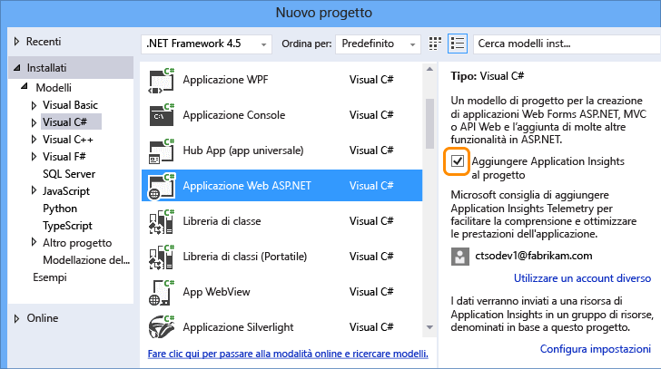
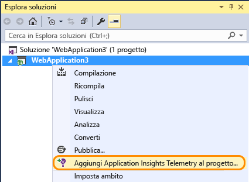
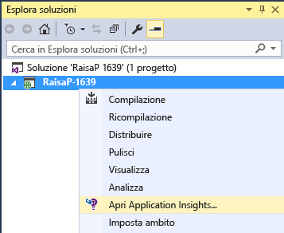
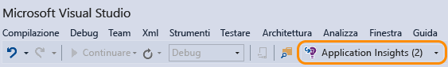

<properties 
	pageTitle="Monitorare l'integrità e l'utilizzo di un'app con Application Insights" 
	description="Analizzare l'uso, la disponibilità e le prestazioni dell'applicazione locale o Web di Microsoft Azure con Application Insights." 
	services="application-insights" 
    documentationCenter=""
	authors="alancameronwills" 
	manager="ronmart"/>

<tags 
	ms.service="application-insights" 
	ms.workload="tbd" 
	ms.tgt_pltfrm="ibiza" 
	ms.devlang="na" 
	ms.topic="article" 
	ms.date="04/26/2015" 
	ms.author="awills"/>

# Monitorare l'integrità e l'utilizzo di un'app con Application Insights

*Application Insights è disponibile in anteprima*

Visual Studio Application Insights consente di monitorare un'applicazione live per [rilevare e diagnosticare i problemi di prestazioni e le eccezioni][detect] e [individuare la modalità di uso dell'app][knowUsers]. Può essere usato con un'ampia gamma di tipi di applicazioni: app Web ASP.NET e Java, app iOS, Android, Windows e altre app per dispositivi, app HTML + JavaScript.

In questo articolo verranno esaminati in particolare i tipi di app sviluppati in Visual Studio. Sono inoltre disponibili estensioni Application Insights per altri IDE.

Saranno necessari [Visual Studio 2013 Update 3](http://go.microsoft.com/fwlink/?linkid=397827&clcid=0x409) o versione successiva e un account in [Microsoft Azure](http://azure.com).

##  Aggiungere Application Insights al progetto

#### Se è un nuovo progetto...

Quando si crea un nuovo progetto in Visual Studio, assicuarsi che Application Insights sia selezionato.

Visual Studio crea una risorsa in Application Insights, aggiunge l'SDK al progetto e posiziona la chiave nel file `.config`.

Se il progetto contiene pagine Web, aggiunge anche [SDK JavaScript][client] alla pagina master Web.

#### o se è un progetto esistente

Fare clic con il pulsante destro del mouse in Esplora soluzioni e scegliere Aggiungi Application Insights.

Visual Studio crea una risorsa in Application Insights, aggiunge l'SDK al progetto e posiziona la chiave nel file `.config`.

In questo caso, non aggiunge l'[SDK JavaScript][client] alle pagine Web; si consiglia di farlo come passaggio successivo.

#### Opzioni di configurazione

Se si tratta del primo utilizzo, verrà richiesto di accedere o di iscriversi all'anteprima di Microsoft Azure. Questo account è diverso dall'account Visual Studio Online.

Se l'app fa parte di un'applicazione di maggiori dimensioni, potrebbe essere utile usare le impostazioni di configurazione per inserirla nello stesso gruppo di risorse degli altri componenti.

*Se non è disponibile alcuna opzione di Application Insights, per alcuni tipi di progetto è possibile usare Application Insights [aggiungendo l'SDK manualmente][windows].*

#### Aprire Application Insights dal progetto.

##  3. Eseguire il progetto

Eseguire l'applicazione con F5 e provarla aprendo pagine diverse per generare alcuni dati di telemetria.

In Visual Studio verrà visualizzato il conteggio degli eventi che sono stati inviati.

##  4. Visualizzare i dati di telemetria

Tornare al [portale di Azure][portal] e passare alla risorsa di Application Insights.

Cercare i dati nei grafici Panoramica. All'inizio si vedranno solo uno o due punti. ad esempio:

Fare clic su qualsiasi grafico per visualizzare metriche più dettagliate. [Altre informazioni sulle metriche.][perf]

Ora distribuire l'applicazione e osservare l'accumulo dei dati.

Quando si esegue la modalità debug, la telemetria viene velocizzata nella pipeline, quindi i dati vengono visualizzati in pochi secondi. Quando si distribuisce l'app, i dati si accumulano più lentamente.

#### Dati non visualizzati

* Aprire il riquadro [Ricerca diagnostica][diagnostic] per visualizzare i singoli eventi.
* Usare l'applicazione, aprendo pagine diverse in modo da generare alcuni dati di telemetria.
* Attendere alcuni secondi e fare clic su Aggiorna.
* Vedere [Risoluzione dei problemi][qna].

## Passaggi successivi

Ora che è in corso l'invio di dati dal lato server dell'app, verranno fornite alcune informazioni sui passaggi necessari per ottenere una vista più a 360°.

* [Configurare i test Web][availability] in modo da assicurarsi che l'applicazione sia disponibile e reattiva.
* [Aggiungere l'SDK per JavaScript alle pagine Web][client] per ottenere dati di telemetria basati su browser quali i conteggi delle visualizzazioni delle pagine, i tempi di caricamento delle pagina e le eccezioni di script e per consentire la scrittura dei dati di telemetria negli script delle pagine.
* Aggiungere il rilevamento delle dipendenze per diagnosticare i problemi causati da database o da altri componenti usati dall'app 
 * [Aggiungere il rilevamento delle dipendenze al server IIS][redfield]
 * [Aggiungere il rilevamento delle dipendenze all'app Web di Azure][azure]
* [Acquisire le tracce dei log][netlogs] dal framework di registrazione preferito
* [Tenere traccia di eventi personalizzati e metriche][api] nei client, nel server o in entrambi per altre informazioni sulle modalità di uso dell'applicazione.

<!--Link references-->

[api]: app-insights-api-custom-events-metrics.md
[availability]: app-insights-monitor-web-app-availability.md
[azure]: ../insights-perf-analytics.md
[client]: app-insights-javascript.md
[detect]: app-insights-detect-triage-diagnose.md
[diagnostic]: app-insights-diagnostic-search.md
[knowUsers]: app-insights-overview-usage.md
[netlogs]: app-insights-asp-net-trace-logs.md
[perf]: app-insights-web-monitor-performance.md
[portal]: http://portal.azure.com/
[qna]: app-insights-troubleshoot-faq.md
[redfield]: app-insights-monitor-performance-live-website-now.md
[windows]: app-insights-windows-get-started.md

 

<!---HONumber=July15_HO4-->