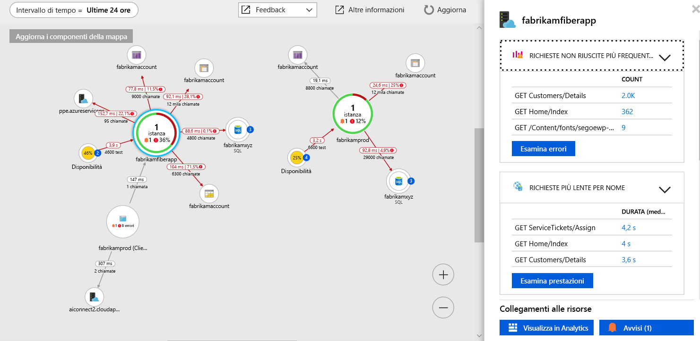

# <a name="collect-distributed-traces-from-python-preview"></a>Raccogliere tracce distribuite da Python (anteprima)

Application Insights supporta ora la traccia distribuita di applicazioni Python tramite l'integrazione con [OpenCensus](https://opencensus.io) e il nuovo [agente di inoltro locale](./opencensus-local-forwarder.md). Questo articolo descrive in modo dettagliato il processo di configurazione di OpenCensus per Python e il recupero di dati di traccia in Application Insights.

## <a name="prerequisites"></a>Prerequisiti

- È necessaria una sottoscrizione di Azure.
- Deve essere installato Python. Questo articolo usa [Python 3.7.0](https://www.python.org/downloads/), ma apportando modifiche minime funzioneranno anche le versioni precedenti.
- Seguire le istruzioni per installare l'[agente di inoltro locale come servizio di Windows](./opencensus-local-forwarder.md#windows-service)

Se non si ha una sottoscrizione di Azure, creare un account [gratuito](https://azure.microsoft.com/free/) prima di iniziare.

## <a name="sign-in-to-the-azure-portal"></a>Accedere al portale di Azure

Accedere al [portale di Azure](https://portal.azure.com/).

## <a name="create-application-insights-resource"></a>Creare una risorsa di Application Insights

Prima di tutto, è necessario creare una risorsa di Application Insights, che genererà una chiave di strumentazione (iKey). La chiave di strumentazione viene quindi usata per configurare l'agente d'inoltro locale per inviare tracce distribuite dall'applicazione OpenCensus instrumentata ad Application Insights.   

1. Selezionare **Crea una risorsa** > **Strumenti di sviluppo** > **Application Insights**.

   

   Verrà visualizzata una casella di configurazione. Usare la tabella seguente per completare i campi di input.

    | Impostazioni        | Valore           | DESCRIZIONE  |
   | ------------- |:-------------|:-----|
   | **Nome**      | Valore globalmente univoco | Nome che identifica l'app da monitorare |
   | **Tipo di applicazione** | Generale | Tipo di app da monitorare |
   | **Gruppo di risorse**     | myResourceGroup      | Nome del nuovo gruppo di risorse per l'hosting dei dati di Application Insights |
   | **Posizione** | Stati Uniti orientali | Scegliere una località nelle vicinanze o vicina a quella in cui è ospitata l'app |

2. Fare clic su **Create**(Crea).

## <a name="configure-local-forwarder"></a>Configurare l'agente di inoltro locale

1. Selezionare **Panoramica** > **Informazioni di base** > copiare la **chiave di strumentazione** dell'applicazione.

   

2. Modificare il file `LocalForwarder.config` e aggiungere la chiave di strumentazione. Se sono state seguite le istruzioni fornite nella sezione dei [prerequisiti](./opencensus-local-forwarder.md#windows-service), il file si trova in `C:\LF-WindowsServiceHost`

    ```xml
      <OpenCensusToApplicationInsights>
        <!--
          Instrumentation key to track telemetry to.
          -->
        <InstrumentationKey>{enter-instrumentation-key}</InstrumentationKey>
      </OpenCensusToApplicationInsights>
    
      <!-- Describes aspects of processing Application Insights telemetry-->
      <ApplicationInsights>
        <LiveMetricsStreamInstrumentationKey>{enter-instrumentation-key}</LiveMetricsStreamInstrumentationKey>
      </ApplicationInsights>
    </LocalForwarderConfiguration>
    ```

3. Riavviare il **servizio di inoltro locale** dell'applicazione.

## <a name="opencensus-python-package"></a>Aprire il pacchetto OpenCensus Python

1. Installare il pacchetto OpenCensus per Python con pip o pipenv dalla riga di comando:

    ```python
    python -m pip install opencensus
    # pip env install opencensus
    ```

    > [!NOTE]
    > `python -m pip install opencensus` presuppone la presenza di una variabile di ambiente PATH impostata per l'installazione di Python. Se questa non è stata configurata, sarà necessario specificare il percorso completo della directory in cui si trova l'eseguibile di Python, che può restituire un comando simile a questo: `C:\Users\Administrator\AppData\Local\Programs\Python\Python37-32\python.exe -m pip install opencensus`.

2. Prima di tutto, è necessario generare alcuni dati di traccia in locale. In Python IDLE o nell'editor preferito immettere il codice seguente:

    ```python
    from opencensus.trace.tracer import Tracer
    
    def main():
        while True:
            valuePrompt()
    
    def valuePrompt():
        tracer = Tracer()
        with tracer.span(name="test") as span:
            line = input("Enter a value: ")
            print(line)
    
    if __name__ == "__main__":
        main()
    
    ```

3. L'esecuzione del codice genera una richiesta ripetuta di immissione di un valore. Con ogni voce, il valore verrà stampato nella shell e un elemento corrispondente di **SpanData** verrà generato dal modulo OpenCensus Python. Il progetto OpenCensus definisce una [ _traccia sotto forma di albero di intervalli_](https://opencensus.io/core-concepts/tracing/).
    
    ```python
    Enter a value: 4
    4
    [SpanData(name='test', context=SpanContext(trace_id=1f07f062ac394c50925f2ae61e635e14, span_id=None, trace_options=TraceOptions(enabled=True), tracestate=None), span_id='5c17a4ad6ba14299', parent_span_id=None, attributes={}, start_time='2018-09-15T20:42:15.847292Z', end_time='2018-09-15T20:42:17.615664Z', child_span_count=0, stack_trace=None, time_events=[], links=[], status=None, same_process_as_parent_span=None, span_kind=0)]
    Enter a value: 25
    25
    [SpanData(name='test', context=SpanContext(trace_id=c71b4e88a22a495da61df52ce3eee3e1, span_id=None, trace_options=TraceOptions(enabled=True), tracestate=None), span_id='51547c0af5f046eb', parent_span_id=None, attributes={}, start_time='2018-09-15T20:42:17.615664Z', end_time='2018-09-15T20:48:11.160314Z', child_span_count=0, stack_trace=None, time_events=[], links=[], status=None, same_process_as_parent_span=None, span_kind=0)]
    Enter a value: 100
    100
    [SpanData(name='test', context=SpanContext(trace_id=b4cdcc9e6df44a8fbb6e8ddeccc1351c, span_id=None, trace_options=TraceOptions(enabled=True), tracestate=None), span_id='f2caacf7892744d1', parent_span_id=None, attributes={}, start_time='2018-09-15T20:48:11.175931Z', end_time='2018-09-15T20:48:12.629178Z', child_span_count=0, stack_trace=None, time_events=[], links=[], status=None, same_process_as_parent_span=None, span_kind=0)]
    ```

4. Anche se è utile a scopo dimostrativo, in definitiva si desidera generare SpanData in modo che possa essere recuperato dall'**agente di inoltro locale** e inviato ad Application Insights. Modificare il codice del passaggio precedente in questo modo:

    ```python
    from opencensus.trace.tracer import Tracer
    from opencensus.trace import config_integration
    from opencensus.trace.exporters.ocagent import trace_exporter
    from opencensus.trace import tracer as tracer_module
    
    import os
    
    def main():        
        while True:
            valuePrompt()
    
    def valuePrompt():
        export_LocalForwarder = trace_exporter.TraceExporter(
        service_name=os.getenv('SERVICE_NAME', 'python-service'),
        endpoint=os.getenv('OCAGENT_TRACE_EXPORTER_ENDPOINT'))
        
        tracer = Tracer(exporter=export_LocalForwarder)
        with tracer.span(name="test") as span:
            line = input("Enter a value: ")
            print(line)
    
    if __name__ == "__main__":
        main()
    ```

5. Se si salva e si prova a eseguire il modulo precedente, è possibile che venga visualizzato un errore `ModuleNotFoundError` per `grpc`. In questo caso, eseguire il comando seguente per installare il [pacchetto grpcio](https://pypi.org/project/grpcio/) con:

    ```
    python -m pip install grpcio
    ```

6. A questo punto, quando si esegue lo script di Python precedente, verrà ancora richiesto di immettere valori, ma ora verrà stampato nella shell solo il valore.

7. Per verificare che l'**agente di inoltro locale** recuperi le tracce, controllare il file `LocalForwarder.config`. Se è stata seguita la procedura descritta nella sezione dei [prerequisiti](https://docs.microsoft.com/azure/application-insights/local-forwarder#windows-service), si troverà in `C:\LF-WindowsServiceHost`.

    Nell'immagine seguente del file di log è possibile osservare che prima dell'esecuzione del secondo script in cui è stata aggiunta un'utilità di esportazione, `OpenCensus input BatchesReceived` era impostato su 0. Dopo aver iniziato a eseguire lo script aggiornato, `BatchesReceived` è stato incrementato in base al numero di valori immessi:
    
    

## <a name="start-monitoring-in-the-azure-portal"></a>Avviare il monitoraggio nel portale di Azure

1. È ora possibile riaprire la pagina **Panoramica** di Application Insights nel portale di Azure per visualizzare i dettagli relativi all'applicazione attualmente in esecuzione. Selezionare **Flusso metriche attive**.

   

2. Se si esegue il secondo script di Python e si inizia a immettere i valori, i dati di traccia verranno visualizzati in tempo reale appena arrivano in Application Insights dal servizio di inoltro locale.

   

3. Tornare alla pagina **Panoramica** e selezionare **Mappa delle applicazioni** per ottenere un layout visivo delle relazioni di dipendenza e dei tempi di chiamata tra i componenti dell'applicazione.

    

    Poiché è stata tracciata solo una chiamata a un metodo, la mappa delle applicazioni non è così interessante. Tuttavia, la mappa delle applicazioni può essere ridimensionata in modo da visualizzare applicazioni molto più distribuite:

   

4. Selezionare **Esamina prestazioni** per eseguire un'analisi dettagliata delle prestazioni e determinare la causa principale del rallentamento delle prestazioni.

    

5. Selezionando **Esempi** e quindi facendo clic su uno degli esempi visualizzati nel riquadro a destra, viene avviata l'esperienza dettagliata delle transazioni end-to-end. Mentre l'app di esempio mostrerà un solo evento, un'applicazione più complessa permetterebbe di esplorare le transazioni end-to-end fino al livello dello stack di chiamate di ogni singolo evento.

     

## <a name="opencensus-trace-for-python"></a>Traccia OpenCensus per Python

Sono state presentate solo le informazioni di base sull'attivazione di OpenCensus per Python con l'agente di inoltro locale e Application Insights. Le linee guida ufficiali sull'utilizzo includono argomenti più avanzati, tra cui:

* [Campionatori](https://opencensus.io/api/python/trace/usage.html#samplers)
* [Integrazione di Flask](https://opencensus.io/api/python/trace/usage.html#flask)
* [Integrazione di Django](https://opencensus.io/api/python/trace/usage.html#django)
* [Integrazione di MySQL](https://opencensus.io/api/python/trace/usage.html#service-integration)
* [PostgreSQL](https://opencensus.io/api/python/trace/usage.html#postgresql)
  
## <a name="next-steps"></a>Passaggi successivi

* [Guida all'utilizzo di OpenCensus Python](https://opencensus.io/api/python/trace/usage.html)
* [Mappa delle applicazioni](./app-insights-app-map.md)
* [Monitoraggio delle prestazioni end-to-end](./app-insights-tutorial-performance.md)