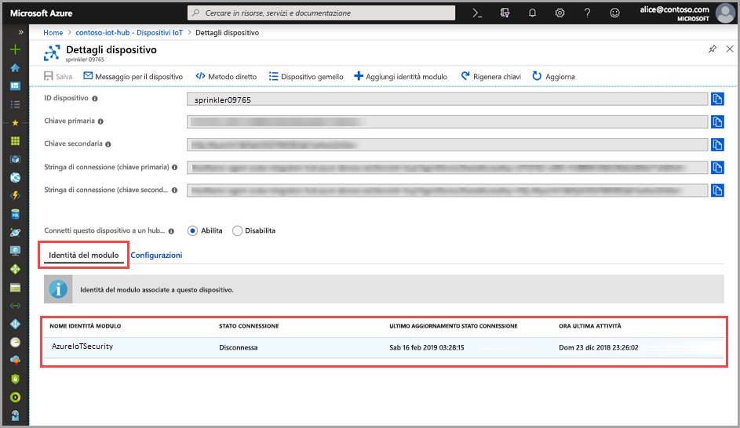

# Guida introduttiva: Creare un modulo gemello del Centro sicurezza di Azure per IoT

> [!IMPORTANT]
> Il Centro sicurezza di Azure per IoT è attualmente in anteprima pubblica. Questa versione di anteprima viene messa a disposizione senza contratto di servizio e non è consigliata per i carichi di lavoro di produzione. Alcune funzionalità potrebbero non essere supportate o potrebbero presentare funzionalità limitate. Per altre informazioni, vedere [Condizioni supplementari per l'utilizzo delle anteprime di Microsoft Azure](https://azure.microsoft.com/support/legal/preview-supplemental-terms/).

Questo argomento di avvio rapido spiega come creare singoli moduli gemelli del Centro sicurezza di Azure per IoT per i nuovi dispositivi o effettuare la creazione batch di moduli gemelli per tutti i dispositivi in un hub IoT.  

## Informazioni sui moduli gemelli del Centro di sicurezza di Azure per IoT 

Per le soluzioni IoT integrate in Azure, i dispositivi gemelli svolgono un ruolo fondamentale sia nella gestione dei dispositivi che nell'automazione dei processi. 

Il Centro sicurezza di Azure per IoT offre l'integrazione completa con la piattaforma di gestione di dispositivi IoT esistente, consentendo di gestire lo stato di sicurezza dei dispositivi, nonché di fare uso delle funzionalità di controllo dispositivo esistenti. L'integrazione del Centro sicurezza di Azure per IoT si ottiene usando il meccanismo del dispositivo gemello dell'hub IoT.  

Per informazioni sul concetto generale dei moduli gemelli nell'hub IoT di Azure, vedere [Moduli gemelli nell'hub IoT](https://docs.microsoft.com/azure/iot-hub/iot-hub-devguide-module-twins). 
 
Il Centro sicurezza di Azure per IoT usa il meccanismo del modulo gemello, mantenendo un modulo gemello di sicurezza per ognuno dei dispositivi. Il modulo gemello di sicurezza contiene tutte le informazioni pertinenti alla sicurezza del dispositivo per ognuno dei dispositivi. 
 
Per avvalersi di tutte le funzionalità del Centro sicurezza di Azure per IoT, è necessario creare, configurare e usare questi moduli gemelli di sicurezza per ogni dispositivo nel servizio.  

## Creare un modulo gemello del Centro sicurezza di Azure per IoT 

È possibile effettuare la creazione in batch dei moduli gemelli del Centro sicurezza di Azure per IoT usando la configurazione predefinita oppure singolarmente con configurazioni specifiche per ogni dispositivo. Per creare in batch per i nuovi dispositivi o i dispositivi privi di modulo gemello, usare lo [script batch del modulo](https://aka.ms/iot-security-github-create-module). 

>[!NOTE] 
> L'uso del metodo batch non sovrascrive i moduli gemelli esistenti. L'uso del metodo batch crea SOLO nuovi moduli gemelli per i dispositivi che non hanno già un modulo gemello. 

Per informazioni su come modificare o cambiare la configurazione di un modulo gemello esistente, vedere [Modificare un modulo gemello di sicurezza](how-to-modify-security-module-twin.md). 

Per creare un nuovo modulo gemello del Centro sicurezza di Azure per IoT per un dispositivo, seguire queste istruzioni: 

1. Nell'hub IoT, trovare e selezionare il dispositivo per cui si vuole creare un modulo gemello di sicurezza. 
1. Nel campo **Microsoft Identity Name** (Nome identità Microsoft) immettere **ascforiotsecurity**.
1. Fare clic su **Save**. 

## Verificare la creazione di un modulo gemello

Per verificare se è presente un modulo gemello di sicurezza per un dispositivo specifico:

1. Nell'hub IoT di Azure, selezionare **Dispositivi IoT** dal menu **Strumenti di esplorazione**.    
1. Immettere l'ID del dispositivo o selezionare un'opzione nel **campo Esegui query sui dispositivi** e fare clic su **Esegui query sui dispositivi**. 
    
1. Selezionare il dispositivo oppure fare doppio clic per aprire la pagina Dettagli dispositivo. 
1. Selezionare il menu **Identità del modulo** e verificare l'esistenza del modulo **ascforiotsecurity** e lo **Stato connessione** **Connesso** nell'elenco delle identità del modulo associate al dispositivo. 
    

Per altre informazioni sulla personalizzazione delle proprietà dei moduli gemelli del Centro sicurezza di Azure per IoT, vedere [Configurazione dell'agente](concept-agent-configuration.md).

## Passaggi successivi

Per informazioni su come configurare gli avvisi personalizzati, passare all'articolo successivo...

> [!div class="nextstepaction"]
> [Configurare avvisi personalizzati](quickstart-create-custom-alerts.md)
