<properties
	pageTitle="Introduzione all'automazione di Azure"
	description="Informazioni sull'importazione e sull'esecuzione di un processo di automazione in Azure."
	services="automation"
	documentationCenter=""
	authors="bwren"
	manager="stevenka"
	editor=""/>

<tags
	ms.service="automation"
	ms.workload="tbd"
	ms.tgt_pltfrm="na"
	ms.devlang="na"
	ms.topic="get-started-article" 
	ms.date="05/19/2015"
	ms.author="bwren"/>

# Introduzione all'automazione di Azure

## Informazioni su Automazione di Azure

Automazione di Microsoft Azure offre agli utenti la possibilità di automatizzare le attività manuali, a esecuzione prolungata, soggette a errori e ripetute di frequente comunemente eseguite negli ambienti cloud. È possibile creare, monitorare, gestire e distribuire risorse nell'ambiente Azure tramite Runbook, che sono basati su flussi di lavoro di Windows PowerShell. In questa guida verrà illustrata un'esercitazione per eseguire un semplice Runbook di esempio. Sono inoltre incluse le risorse per esplorare funzionalità più avanzate del servizio.

## Esercitazione
In questa esercitazione vengono illustrati i passaggi per creare un account di automazione, nonché importare un Runbook "Hello World" di esempio in Automazione di Azure, eseguirlo e quindi visualizzarne l'output.

Per completare l'esercitazione, sarà necessaria una sottoscrizione di Azure. Se non si dispone ancora di un account, è possibile <a href="/pricing/member-offers/msdn-benefits-details/" target="_blank">attivare i benefici della sottoscrizione MSDN</a> oppure <a href="/pricing/free-trial/" target="_blank">iscriversi per ottenere una versione di valutazione gratuita</a>.

[AZURE.INCLUDE [automation-note-authentication](../../includes/automation-note-authentication.md)]

## Creare un account di automazione

Un account di automazione è un contenitore per le risorse di Automazione di Azure e consente di separare gli ambienti o di organizzare ulteriormente i flussi di lavoro. Per altre informazioni, vedere [Account di automazione](http://aka.ms/runbookauthor/azure/automationaccounts) nella sezione Automazione di MSDN Library. Se è già stato creato un account di automazione, è possibile ignorare questo passaggio.

1.	Accedere al [portale di gestione di Azure](http://manage.windowsazure.com).

2.	Nel portale di gestione fare clic su **Crea un account di automazione**.

	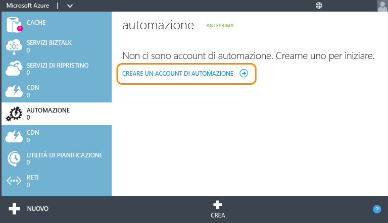

3.	Nella pagina **Aggiungi un nuovo account di automazione** immettere un nome e selezionare un'area per l'account. L'area indica la località in cui verranno archiviate le risorse di automazione incluse nell'account. Questa operazione non influisce sulla funzionalità dell'account, ma consente di eseguire più velocemente i Runbook se l'area dell'account è vicina a quella in cui sono archiviate altre risorse di Azure. Al termine, fare clic sul segno di spunta.

	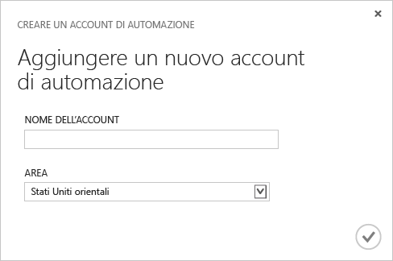

## Importare il Runbook dalla raccolta di Runbook

La [raccolta di Runbook](http://aka.ms/runbookgallery) include Runbook di esempio che è possibile importare direttamente in un account di automazione di Azure, per sfruttare quanto già fatto da altri utenti di Automazione di Azure e PowerShell. In questo passaggio la raccolta verrà usata per importare il Runbook di esempio "Hello World".

4.	Nella pagina **Automazione** fare clic sul nuovo account appena creato.

	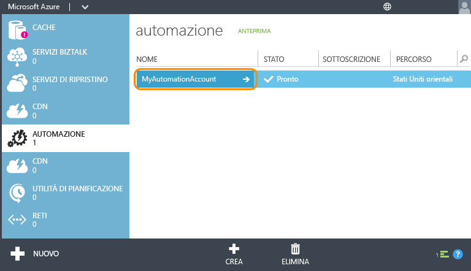

5.	Fare clic su **RUNBOOK**.

	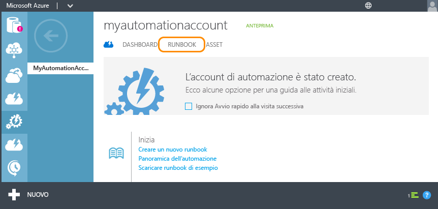

6.	Fare clic su **Nuovo** > **Runbook** > **Da raccolta**.

	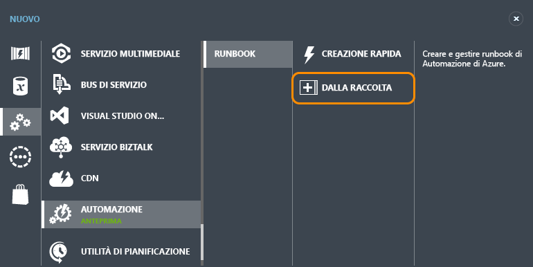

7.  Selezionare la categoria **Esercitazione** e quindi **Hello World per Automazione di Azure**. Fare clic sul pulsante con la freccia destra.

	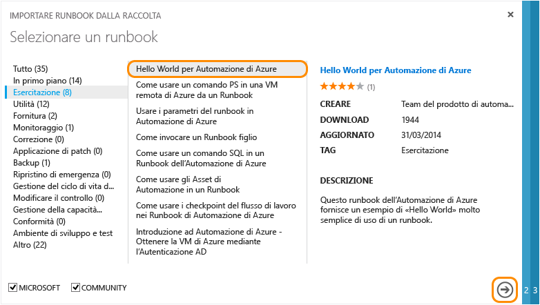

8.  Verificare i contenuti del Runbook, quindi fare clic sul pulsante con la freccia destra.

	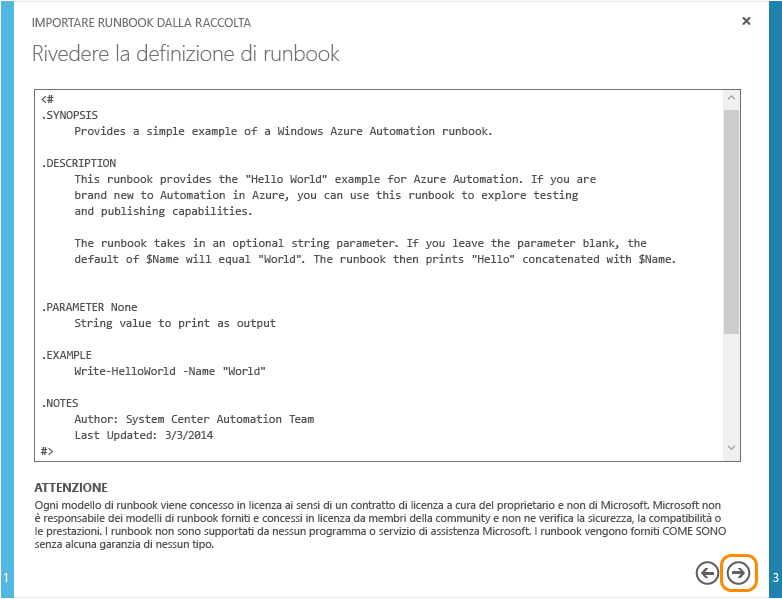

8.	Verificare i dettagli del Runbook, quindi fare clic sul pulsante con il segno di spunta.

	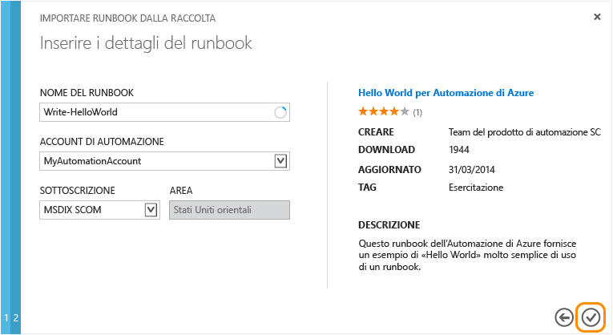

## Pubblicare il Runbook

Il Runbook viene inizialmente importato in modalità bozza. Questo significa che è possibile continuare a lavorarvi esso prima di autorizzarlo come nuova versione eseguibile. Dal momento che questo Runbook di esempio non richiede alcuna configurazione aggiuntiva, verrà pubblicato così com'è. Per altre informazioni, vedere [Pubblicazione di un Runbook](http://aka.ms/runbookauthor/azure/publishrunbook).

9.	Al termine dell'importazione del Runbook fare clic su **Write-HelloWorld**.

	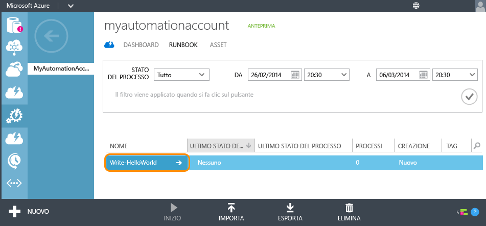

9.	Fare clic su **CREA** e quindi su **BOZZA**.

	È possibile modificare il contenuto di un Runbook in modalità Bozza. Per questo Runbook, non è necessario apportare alcuna modifica.

	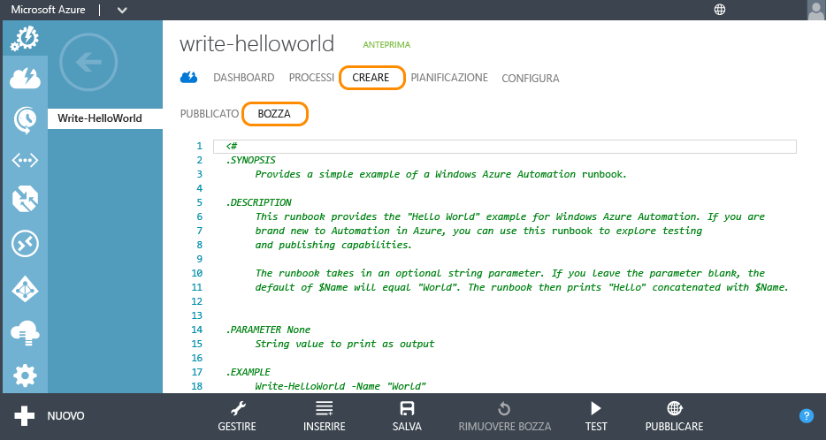

10.	Fare clic su **PUBBLICA** per alzare di livello il Runbook in modo che sia pronto per l'uso in produzione.

	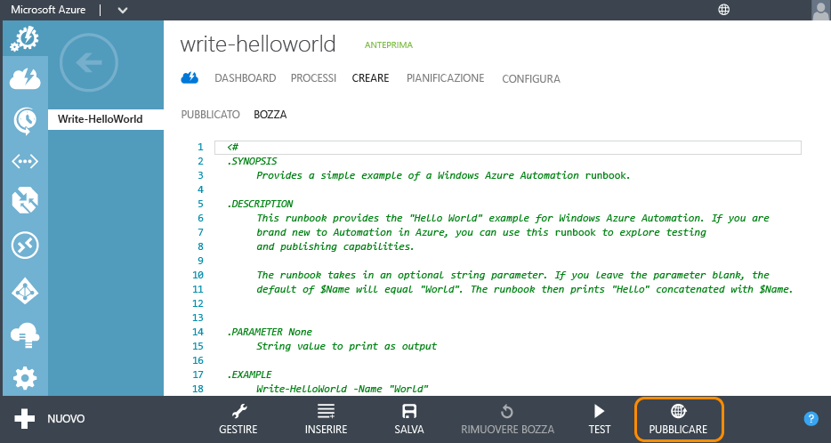

11.	Alla richiesta di conferma fare clic su **Sì**.

	

## Avviare il Runbook

Dopo aver importato e pubblicato il Runbook, è possibile eseguirlo ed esaminare l'output. Per altre informazioni, vedere [Avvio di un Runbook](http://aka.ms/runbookauthor/azure/startrunbook) e [Output e messaggi del Runbook](http://aka.ms/runbookauthor/azure/runbookoutput).

12.	Con il Runbook **Write-HelloWorld** aperto, fare clic su **AVVIO**.

	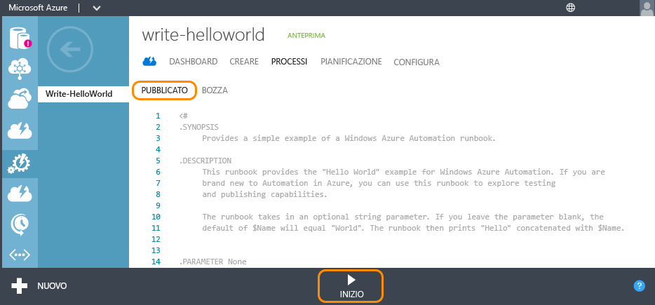

13.	Nella pagina **Specificare i valori di parametro del Runbook** immettere un valore per **Nome**, che verrà usato come parametro di input per lo script Write-HelloWorld.ps1, quindi fare clic sul segno di spunta.

	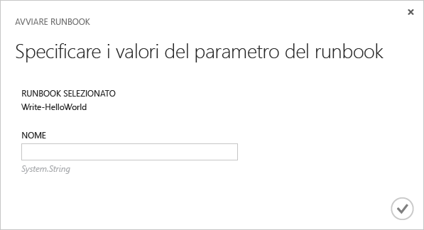

14.	Fare clic su **PROCESSI** per controllare lo stato del Runbook appena avviato e quindi sul timestamp nella colonna **AVVIO PROCESSO** per visualizzare il riepilogo del processo.

	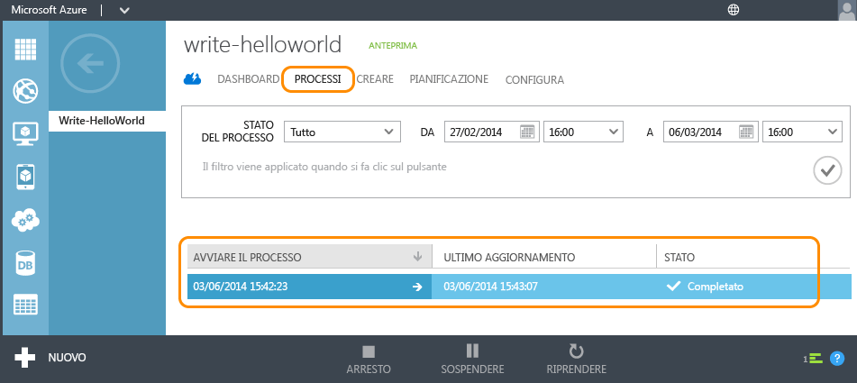

15.	Nella pagina **RIEPILOGO** è possibile visualizzare il riepilogo, i parametri di input e l'output del processo.

	

Congratulazioni. L'esercitazione è stata completata.

## Passaggi successivi
1. Il semplice Runbook in questa esercitazione **non gestisce i servizi di Azure**. Nella maggior parte dei Runbook a tale scopo vengono usati i [cmdlet di Azure](http://msdn.microsoft.com/library/jj156055.aspx), che richiedono l'autenticazione alla sottoscrizione di Azure. Seguire le istruzioni illustrate in [Configurazione di Azure per la gestione basata su Runbook](http://aka.ms/azureautomationauthentication) per configurare la sottoscrizione di Azure per l'uso di questi cmdlet.  
2. Per altre informazioni sulle funzionalità di Automazione di Azure, fare riferimento alla sezione [Risorse](#resources) di seguito.
3. Effettuare la sottoscrizione al [blog di Automazione di Azure](http://azure.microsoft.com/blog/tag/azure-automation) per essere aggiornati sulle ultime novità del team di Automazione di Azure.

## Risorse

Sono disponibili numerose risorse per approfondire la conoscenza di Automazione di Azure e creare Runbook personalizzati.

- La sezione dedicata ad [Automazione di Azure di MSDN Library](http://go.microsoft.com/fwlink/p/?LinkId=392860) include la documentazione completa sulla configurazione e l'amministrazione di Automazione di Azure e sulla creazione di Runbook personalizzati.
- In [Cmdlet di Azure PowerShell](http://msdn.microsoft.com/library/jj156055.aspx) vengono fornite informazioni sulle operazioni di automazione di Azure con Windows PowerShell. Questi cmdlet vengono usati nei Runbook per lavorare con le risorse di Azure.
- Nel [blog su Automazione di Azure](http://azure.microsoft.com/blog/tag/azure-automation) vengono fornite informazioni aggiornate su Automazione di Azure rilasciate da Microsoft.
- Il [forum su Automazione](http://go.microsoft.com/fwlink/p/?LinkId=390561) consente di pubblicare domande su Automazione di Azure a cui verrà data risposta da Microsoft e dalla community di Automazione.

## Esempi e Runbook di utilità

Microsoft e la community di Automazione di Azure mettono a disposizione Runbook di esempio, utili per iniziare a creare soluzioni personalizzate, nonché Runbook di utilità, utili come componenti di base per attività di automazione più estese. È possibile scaricare questi Runbook da [Script Center](http://go.microsoft.com/fwlink/p/?LinkId=393029) o importarli direttamente in Automazione di Azure tramite la [raccolta di Runbook](http://aka.ms/runbookgallery).

## Commenti e suggerimenti

<strong>Gli utenti sono invitati a fornire commenti e suggerimenti.</strong> Se si è in cerca di una soluzione Runbook o di un modulo di integrazione di Automazione di Azure, inviare una richiesta di script in Script Center. In caso di commenti o suggerimenti oppure di richieste di funzionalità per Automazione di Azure, è possibile pubblicarle nell'apposito [forum](http://feedback.windowsazure.com/forums/34192--general-feedback). Grazie.
 

<!---HONumber=July15_HO4-->