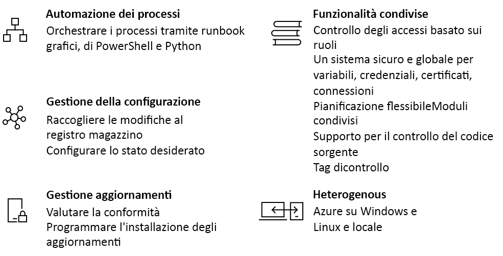

# Introduzione ad Automazione di Azure

Automazione di Azure offre un servizio di automazione e configurazione basato sul cloud che consente la gestione coerente di ambienti Azure e non Azure. Fornisce funzionalità di automazione dei processi, gestione degli aggiornamenti e configurazione. Automazione di Azure fornisce il controllo completo durante la distribuzione, l'attività e la rimozione delle autorizzazioni di carichi di lavoro e risorse.
Questo articolo fornisce una breve panoramica di Automazione di Azure e risposte ad alcune domande comuni. Per altre informazioni sulle diverse funzionalità, visitare i collegamenti indicati in questa panoramica.

## Funzionalità di Automazione di Azure

### Automazione dei processi

Automazione di Azure consente di automatizzare tutte le attività di gestione cloud frequenti, dispendiose in termini di tempo e soggette a errori. È così possibile concentrarsi sulle attività che apportano valore aggiunto. Grazie alla riduzione degli errori e all'incremento dell'efficienza, Automazione di Azure favorisce anche la riduzione dei costi operativi. È possibile integrare i servizi di Azure e altri sistemi pubblici richiesti nella distribuzione, configurazione e gestione di processi end-to-end. Il servizio consente di [creare runbook](automation-runbook-types.md) in forma grafica, in PowerShell o Python. Usando un ruolo di lavoro per runbook ibrido è possibile unificare la gestione con l'orchestrazione degli ambienti locali. I [webhook](automation-webhooks.md) consentono di soddisfare le richieste e assicurare la continuità del recapito e delle operazioni attivando l'automazione da ITSM, DevOps e sistemi di monitoraggio.

### Gestione della configurazione

La [configurazione dello stato desiderato](automation-dsc-overview.md) di Automazione di Azure è una soluzione basata sul cloud per PowerShell DSC che fornisce i servizi necessari per gli ambienti aziendali. È possibile gestire le risorse DSC in Automazione di Azure e applicare le configurazioni alle macchine virtuali o fisiche da un server di Pull DSC nel cloud di Azure. Automazione di Azure fornisce report avanzati che informano di eventi importanti, ad esempio quando i nodi presentano deviazioni rispetto alla configurazione assegnata. È possibile monitorare e aggiornare automaticamente la configurazione tra computer fisici e macchine virtuali, Windows o Linux, nel cloud o in locale.

È possibile recuperare l'inventario delle risorse nel guest per ottenere la visibilità delle applicazioni installate e di altri elementi di configurazione. Sono disponibili funzionalità avanzate di ricerca e creazione report per trovare rapidamente informazioni dettagliate che consentono di comprendere quali elementi sono configurati nel sistema operativo. È possibile rilevare le modifiche in servizi, daemon, software, Registro di sistema e file per identificare rapidamente la causa di eventuali problemi. DSC consente di eseguire attività di diagnostica e generare avvisi se vengono apportate modifiche indesiderate nell'ambiente.

### Gestione degli aggiornamenti

Aggiornare i sistemi Windows e Linux in ambienti ibridi con Automazione di Azure. È possibile ottenere la visibilità della conformità degli aggiornamenti in Azure, nell'ambiente locale e in altri ambienti cloud. È possibile creare distribuzioni pianificate per orchestrare l'installazione degli aggiornamenti all'interno di una finestra di manutenzione definita. Se un aggiornamento non deve essere installato in un computer, è possibile escluderlo da una distribuzione.

### Risorse condivise

Automazione di Azure è costituito da un set di risorse condivise che semplificano l'automazione e la configurazione degli ambienti su larga scala.

* **[Pianificazioni](automation-schedules.md)**: usate nel servizio per attivare l'automazione in momenti prestabiliti.
* **[Moduli](automation-integration-modules.md)**: i moduli vengono usati per gestire Azure e altri sistemi. Importare i moduli nell'account di Automazione per cmdlet e risorse DSC Microsoft, di terze parti, della community o personalizzati.
* **[Raccolta di moduli](automation-runbook-gallery.md)**: integrazione nativa con PowerShell Gallery per visualizzare i runbook e importarli nell'account di Automazione.
* **[Pacchetti Python 2](python-packages.md)**: consente di aggiungere pacchetti Python 2 all'account di Automazione per usarli nei runbook Python.
* **[Credenziali](automation-credentials.md)**: consentono di proteggere le informazioni riservate che possono essere usate da runbook e configurazioni in fase di esecuzione.
* **[Connessioni](automation-connections.md)**: archiviare coppie di nomi/valori contenenti informazioni comuni per la connessione ai sistemi nelle risorse di connessione. Le connessioni vengono definite dall'autore del modulo per essere usate in fase di esecuzione nei runbook e nelle configurazioni.
* **[Certificati](automation-certificates.md)**: archiviare e rendere disponibili i certificati in fase di esecuzione perché possano essere usati per l'autenticazione e la protezione delle risorse distribuite.
* **[Variabili](automation-variables.md)**: consentono di inserire contenuti che possono essere usati nei runbook e nelle configurazioni. È possibile modificare i valori senza dover modificare i runbook e le configurazioni che vi fanno riferimento.

### Integrazione del controllo del codice sorgente

Automazione di Azure può [integrarsi con il controllo del codice sorgente](source-control-integration.md) favorendo la configurazione come codice in cui è possibile archiviare runbook o configurazioni in un sistema di controllo del codice sorgente.

### Controllo degli accessi in base al ruolo

Automazione di Azure supporta il controllo degli accessi in base al ruolo per controllare l'accesso all'account di Automazione e alle relative risorse. Per altre informazioni sulla configurazione del controllo degli accessi in base al ruolo nell'account di Automazione, in runbook e processi, vedere [Controllo degli accessi in base al ruolo per Automazione di Azure](automation-role-based-access-control.md).

### Windows e Linux

Automazione di Azure è progettato per funzionare nell'ambiente cloud ibrido e anche in Windows e Linux. Offre un modo coerente per automatizzare e configurare i carichi di lavoro distribuiti e il sistema operativo sul quale vengono eseguiti.

### Raccolta della community

Cercare runbook e moduli nella [raccolta di Automazione](automation-runbook-gallery.md) per avviare rapidamente l'integrazione e la creazione dei processi da PowerShell Gallery e Microsoft Script Center.

## Scenari di Automazione comuni

Automazione di Azure gestisce il ciclo di vita dell'infrastruttura e delle applicazioni. È possibile trasferire nel sistema informazioni sul modo in cui l'organizzazione distribuisce e gestisce i carichi di lavoro. Eseguire attività di creazione in linguaggi comuni come PowerShell, configurazione dello stato desiderato, Python e runbook grafici. Ottenere un inventario completo delle risorse distribuite per targeting, creazione di report e conformità. Identificare le modifiche che possono causare errori di configurazione e migliorare la conformità operativa.

* **Compilare/distribuire risorse**: distribuire VM in un ambiente ibrido usando i runbook e i modelli di Azure Resource Manager. Eseguire l'integrazione negli strumenti di sviluppo come Jenkins e Azure DevOps.
* **Configurare le macchine virtuali**: valutare e configurare macchine Windows e Linux con la configurazione desiderata per l'infrastruttura e l'applicazione.
* **Monitorare**: identificare le modifiche che causano problemi e correggere o inoltrare il problema ai sistemi di gestione.
* **Proteggere**: mettere la VM in quarantena se viene generato un avviso di sicurezza. Definire i requisiti nel guest.
* **Controllare**: definire il controllo degli accessi in base al ruolo per i team. Recuperare le risorse inutilizzate.

## Prezzo di Automazione

Il prezzo di Automazione di Azure è disponibile nella pagina dei [prezzi](https://azure.microsoft.com/pricing/details/automation/).

## Passaggi successivi

> [!div class="nextstepaction"]
> [Creare un account di Automazione](automation-quickstart-create-account.md)
