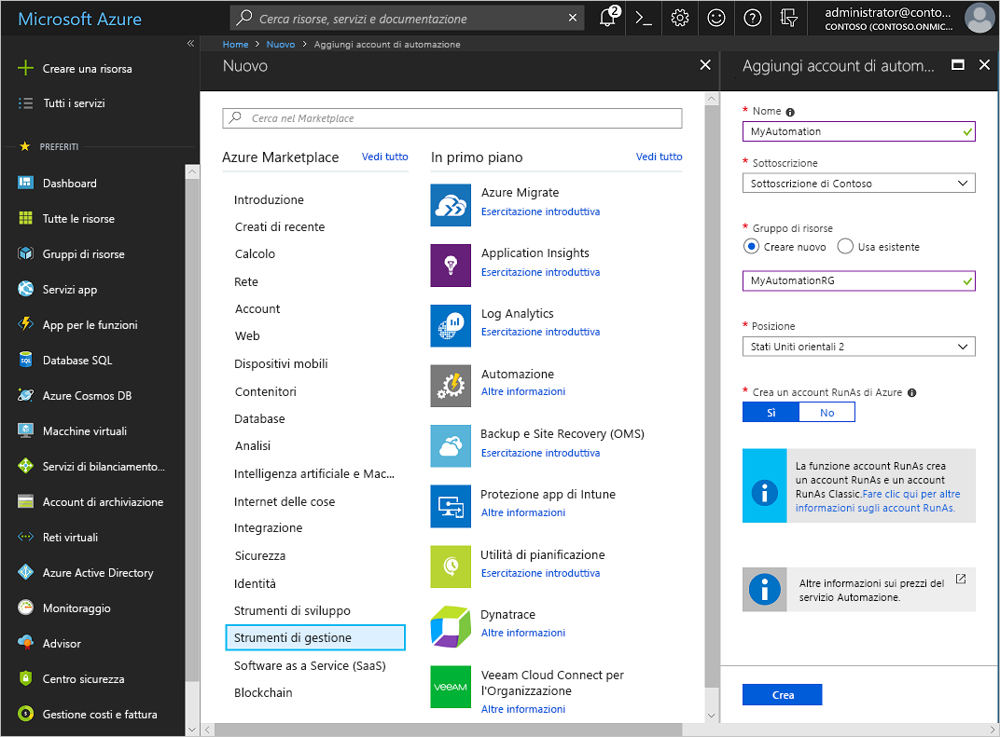
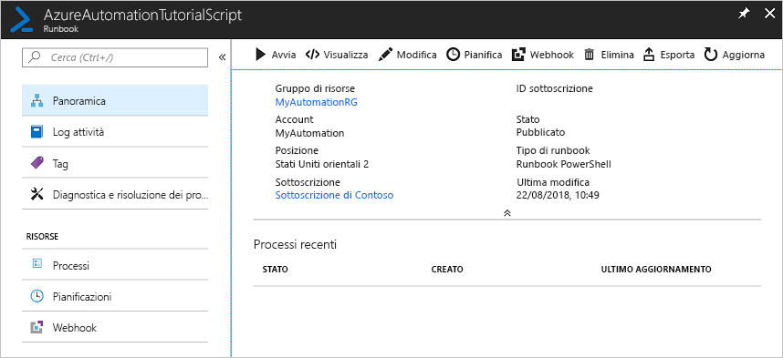
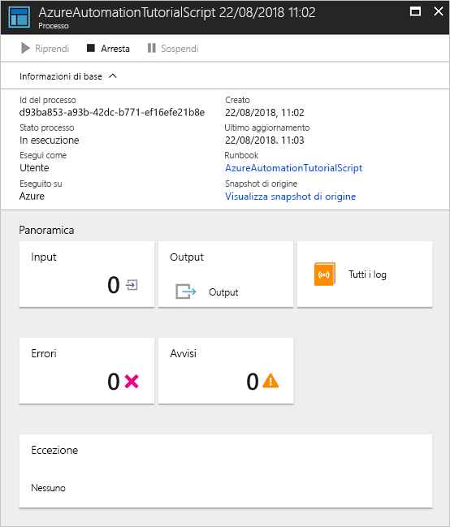

# Creare un account di Automazione di Azure

È possibile creare account di Automazione di Azure tramite Azure. Questo metodo fornisce un'interfaccia utente basata sul browser per la creazione e la configurazione degli account di Automazione e delle risorse correlate. Questa guida introduttiva illustra la creazione di un account di Automazione e l'esecuzione di un runbook nell'account.

Se non si ha una sottoscrizione di Azure, creare un [account Azure gratuito](https://azure.microsoft.com/free/?WT.mc_id=A261C142F) prima di iniziare.

## Accedere ad Azure

Accedere ad Azure all'indirizzo https://portal.azure.com

## Creare l'account di Automazione

1. Fare clic sul pulsante **Nuovo** nell'angolo superiore sinistro di Azure.

1. Selezionare **Monitoraggio e gestione** e quindi selezionare **Automazione**.

1. Immettere le informazioni account. Per **Crea un account RunAs di Azure** scegliere **Sì** per abilitare automaticamente gli elementi che consentono di semplificare l'autenticazione in Azure. Al termine fare clic su **Crea**, per avviare la distribuzione dell'account di Automazione.

      

1. L'account di Automazione viene aggiunto al dashboard di Azure. Al termine della distribuzione, si apre automaticamente la panoramica dell'account di Automazione.

    

## Eseguire un runbook

Eseguire uno dei runbook di esercitazione.

1. Fare clic su **Runbook** in **AUTOMAZIONE PROCESSI**. Viene visualizzato l'elenco di runbook. Per impostazione predefinita, sono abilitati più runbook di esercitazione nell'account.

    

1. Selezionare il runbook **AzureAutomationTutorialScript**. Questa azione apre la pagina di panoramica del runbook.

    

1. Fare clic su **Avvia** e nella pagina **Avvia runbook** fare clic su **OK** per avviare il runbook.

    

1. Quando **Stato processo** viene impostato su **In esecuzione**, fare clic su **Output** o su **Tutti i log** per visualizzare l'output del processo del runbook. Per questo runbook di esercitazione, l'output è un elenco delle risorse di Azure.

## Pulire le risorse

Quando non servono più, eliminare il gruppo di risorse, l'account di Automazione e tutte le risorse correlate. A tale scopo selezionare il gruppo di risorse per l'account di Automazione e fare clic su **Elimina**.

## Passaggi successivi

In questa guida introduttiva è stato distribuito un account di Automazione, è stato avviato il processo di un runbook e sono stati visualizzati i risultati del processo. Per altre informazioni su Automazione di Azure, passare alla guida introduttiva sulla creazione del primo runbook.

> [!div class="nextstepaction"]
> [Guida introduttiva di Automazione - Creare un runbook](./automation-quickstart-create-runbook.md)
