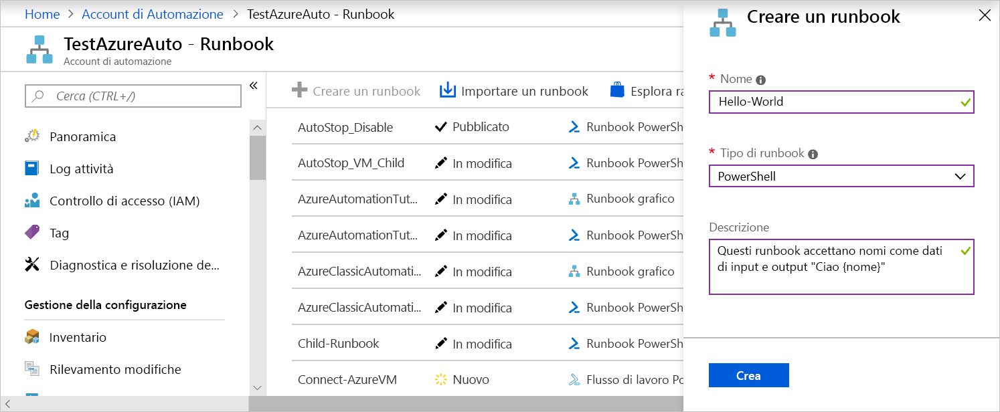
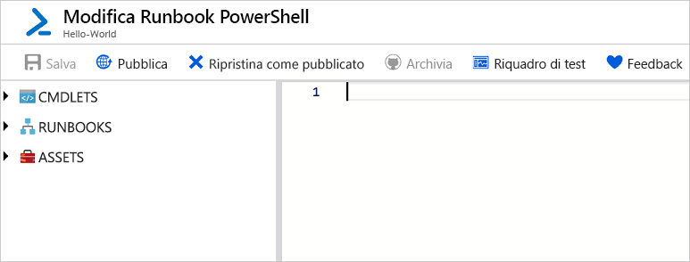
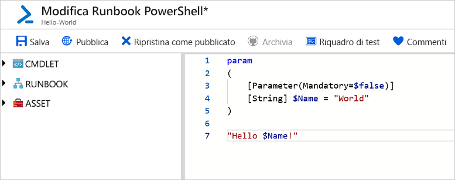
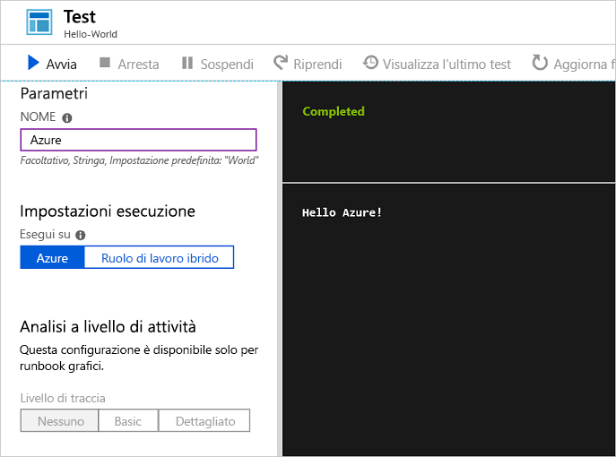
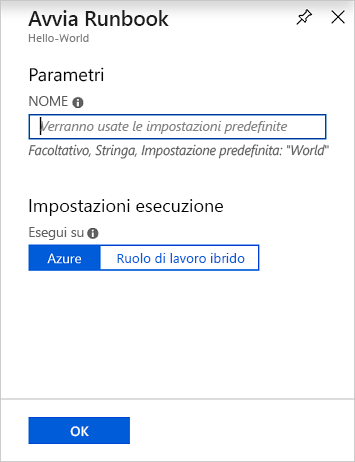
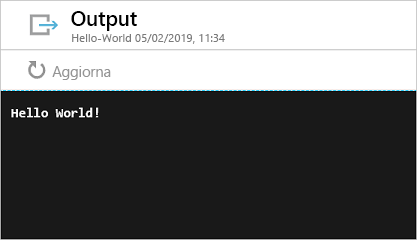

# <a name="create-an-azure-automation-runbook"></a>Creare un runbook di Automazione di Azure

È possibile creare runbook di Automazione di Azure tramite Azure. Questo metodo offre un'interfaccia utente basata sul browser per la creazione di runbook di Automazione. Questa guida introduttiva illustra la creazione, la modifica, il test e la pubblicazione di un runbook PowerShell di Automazione.

Se non si ha una sottoscrizione di Azure, creare un [account Azure gratuito](https://azure.microsoft.com/free/?WT.mc_id=A261C142F) prima di iniziare.

## <a name="log-in-to-azure"></a>Accedere ad Azure

Accedere ad Azure all'indirizzo https://portal.azure.com

## <a name="create-runbook"></a>Creare un runbook

Creare prima di tutto un runbook. Per impostazione predefinita, il runbook di esempio creato in questa guida ha come output `Hello World`.

1. Aprire l'account di Automazione.

1. Fare clic su **Runbook** in **AUTOMAZIONE PROCESSI**. Viene visualizzato l'elenco di runbook.

1. Fare clic sul pulsante **Aggiungi runbook** all'inizio dell'elenco. Nella pagina **Aggiungi runbook** selezionare **Creazione rapida**.

1. Immettere "Hello-World" per il **nome** del runbook e selezionare **PowerShell** per **Tipo di runbook**. Fare clic su **Crea**.

   

1. Viene creato il runbook e si apre la pagina **Modifica runbook di PowerShell**.

    

1. Digitare o copiare e incollare nel riquadro di modifica il codice seguente, che crea un parametro di input facoltativo denominato "Name" con il valore predefinito "World" e genera come output una stringa che usa questo valore di input:
   
   ```powershell-interactive
   param
   (
       [Parameter(Mandatory=$false)]
       [String] $Name = "World"
   )

   "Hello $Name!"
   ```

1. Fare clic su **Salva** per salvare una bozza del runbook.

    

## <a name="test-the-runbook"></a>Testare il runbook

Dopo avere creato il runbook, lo si testa per convalidarne il funzionamento.

1. Fare clic su **Riquadro di test** per aprire la pagina **Test**.

1. Immettere un valore per **Nome** e fare clic su **Avvia**. Il processo di test viene avviato e vengono visualizzati lo stato e l'output del processo.

    

1. Chiudere la pagina **Test** facendo clic sulla **X** nell'angolo superiore destro. Fare clic su **OK** nel popup visualizzato.

1. Nella pagina **Modifica runbook di PowerShell** fare clic su **Pubblica** per pubblicare il runbook come versione ufficiale del runbook nell'account.

   

## <a name="run-the-runbook"></a>Eseguire il runbook

Dopo la pubblicazione del runbook, viene visualizzata la pagina di panoramica.

1. Nella pagina di panoramica del runbook fare clic su **Avvia** per aprire la pagina di configurazione **Avvia runbook** di questo runbook.

   

1. Lasciare vuoto **Nome** in modo che venga usato il valore predefinito e fare clic su **OK**. Viene inviato il processo del runbook e viene visualizzata la pagina del processo.

   

1. Quando **Stato processo** viene impostato su **In esecuzione** o su **Completato**, fare clic su **Output** per aprire il riquadro **Output** e visualizzare l'output del runbook.

    

## <a name="clean-up-resources"></a>Pulire le risorse

Quando non è più necessario, eliminare il runbook. A questo scopo, selezionare il runbook nell'elenco di runbook e fare clic su **Elimina**.

## <a name="next-steps"></a>Passaggi successivi

In questa guida introduttiva è stato creato, modificato e pubblicato un runbook ed è stato avviato un processo del runbook. Per altre informazioni sui runbook di Automazione, passare all'articolo sui diversi tipi di runbook che è possibile creare e usare in Automazione.

> [!div class="nextstepaction"]
> [Procedure di Automazione - Tipi di runbook](./automation-runbook-types.md)
