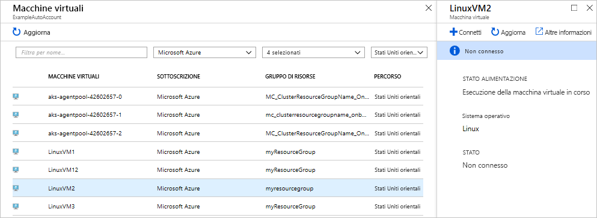
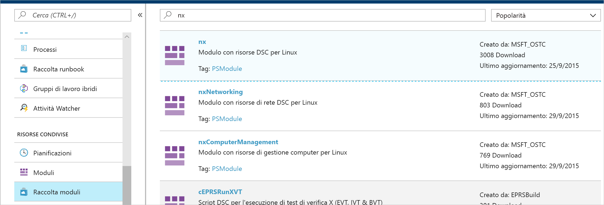
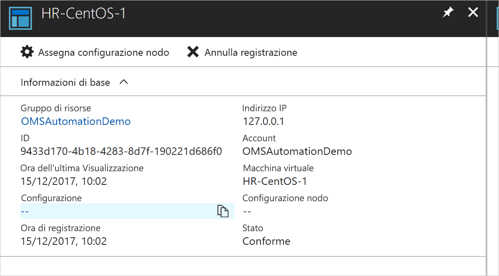
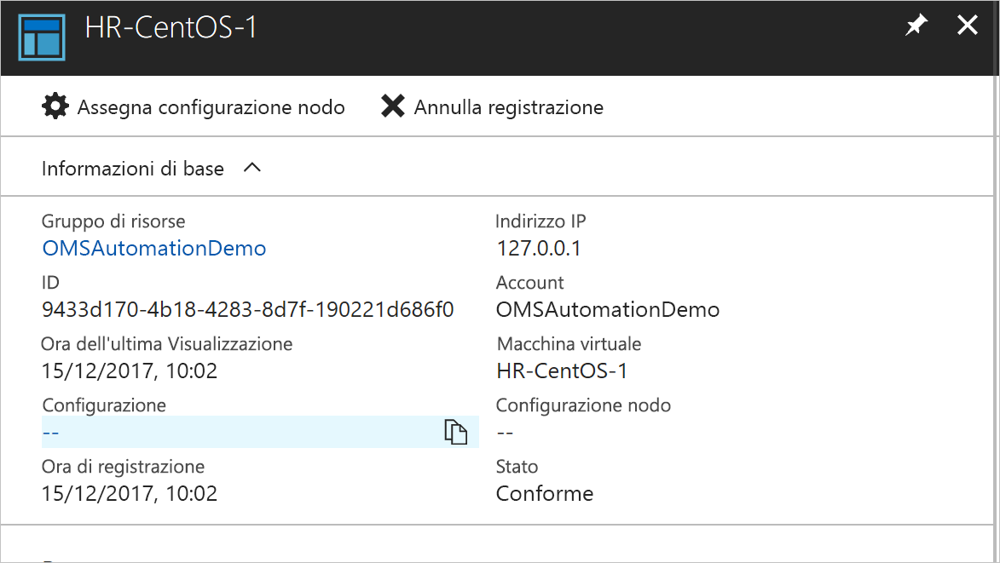
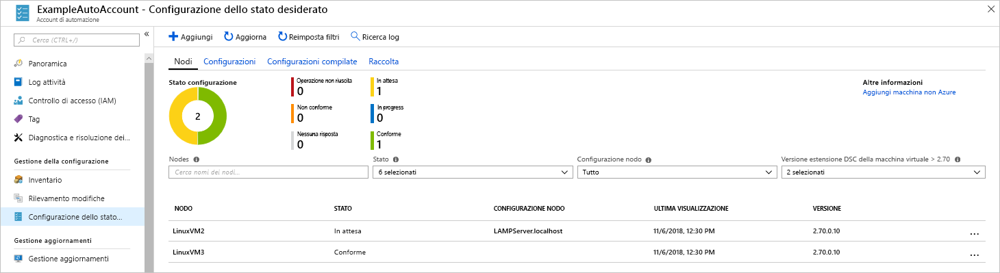

# <a name="configure-a-linux-virtual-machine-with-desired-state-configuration"></a>Configurare una macchina virtuale Linux con Desired State Configuration

Abilitando DSC (Desired State Configuration), è possibile gestire e monitorare le configurazioni dei server Windows e Linux. Si possono identificare o correggere automaticamente le configurazioni che deviano dalla configurazione desiderata. Questa guida introduttiva illustra l'onboarding di una VM Linux e la distribuzione di uno stack LAMP con DSC.

## <a name="prerequisites"></a>prerequisiti

Per completare l'esercitazione introduttiva, sono necessari gli elementi seguenti:

* Una sottoscrizione di Azure. Se non si ha una sottoscrizione di Azure, [creare un account gratuito](https://azure.microsoft.com/free/).
* Un account di automazione di Azure. Per istruzioni sulla creazione di un account RunAs di Automazione di Azure, vedere [Autenticare runbook con account RunAs di Azure](automation-sec-configure-azure-runas-account.md).
* Una VM di Azure Resource Manager (non classica) che esegue Red Hat Enterprise Linux, CentOS o Oracle Linux. Per istruzioni sulla creazione di una VM, vedere [Creare la prima macchina virtuale Linux nel portale di Azure](../virtual-machines/linux/quick-create-portal.md)

## <a name="log-in-to-azure"></a>Accedere ad Azure
Accedere ad Azure all'indirizzo https://portal.azure.com

## <a name="onboard-a-virtual-machine"></a>Caricare una macchina virtuale
Ci sono molti metodi diversi per caricare un computer e abilitare Desired State Configuration. Questa guida introduttiva illustra l'onboarding tramite un account di Automazione. Per altre informazioni sui diversi metodi per caricare i computer in Desired State Configuration, vedere l'articolo sull'[onboarding](https://docs.microsoft.com/azure/automation/automation-dsc-onboarding).

1. Nel riquadro sinistro del portale di Azure selezionare **Account di Automazione**. Se non è visibile nel riquadro sinistro, fare clic su **Tutti i servizi** e cercarlo nella visualizzazione risultante.
1. Nell'elenco selezionare un account di Automazione.
1. Nel riquadro sinistro dell'account di Automazione selezionare **Nodi DSC**.
1. Fare clic sull'opzione di menu **Aggiungi macchina virtuale di Azure**
1. Trovare la macchina virtuale per che si vuole abilitare DSC. È possibile usare il campo di ricerca e le opzioni di filtro per trovare una macchina virtuale specifica.
1. Fare clic sulla macchina virtuale e quindi selezionare **Connetti**
1. Selezionare le impostazioni DSC appropriate per la macchina virtuale. Se è già stata preparata una configurazione, è possibile specificarla come *Nome della configurazione del nodo*. È possibile impostare la [modalità di configurazione](https://docs.microsoft.com/powershell/dsc/metaconfig) per controllare il comportamento della configurazione per il computer.
1. Fare clic su **OK**.



Durante la distribuzione dell'estensione Desired State Configuration nella macchina virtuale, viene visualizzato *Connessione*.

## <a name="import-modules"></a>Importare i moduli

I moduli contengono le risorse DSC e molti sono disponibili in [PowerShell Gallery](https://www.powershellgallery.com). Le risorse usate nelle configurazioni devono essere importate nell'account di Automazione prima della compilazione. Per questa esercitazione, è necessario il modulo denominato **nx**.

1. Nel riquadro sinistro dell'account di Automazione selezionare **Raccolta di moduli** (in Risorse condivise).
1. Cercare il modulo che si vuole importare digitando parte del nome: *nx*
1. Fare clic sul modulo che si vuole importare
1. Fare clic su **Importa**.



## <a name="import-the-configuration"></a>Importare la configurazione

Questa guida introduttiva usa una configurazione DSC che configura il server HTTP Apache, MySQL e PHP nel computer.

Per informazioni sulle configurazioni DSC, vedere [Configurazioni DSC](https://docs.microsoft.com/powershell/dsc/configurations).

In un editor di testo digitare quanto segue e salvarlo in locale con il nome `LAMPServer.ps1`.

```powershell-interactive
configuration LAMPServer {
   Import-DSCResource -module "nx"

   Node localhost {

        $requiredPackages = @("httpd","mod_ssl","php","php-mysql","mariadb","mariadb-server")
        $enabledServices = @("httpd","mariadb")

        #Ensure packages are installed
        ForEach ($package in $requiredPackages){
            nxPackage $Package{
                Ensure = "Present"
                Name = $Package
                PackageManager = "yum"
            }
        }

        #Ensure daemons are enabled
        ForEach ($service in $enabledServices){
            nxService $service{
                Enabled = $true
                Name = $service
                Controller = "SystemD"
                State = "running"
            }
        }
   }
}
```

Per importare la configurazione:

1. Nel riquadro sinistro dell'account di Automazione selezionare **Configurazioni DSC**.
1. Fare clic sull'opzione di menu **Aggiungi una configurazione**
1. Selezionare il *file di configurazione* salvato nel passaggio precedente
1. Fare clic su **OK**.

## <a name="compile-a-configuration"></a>Compilare una configurazione

Le configurazioni DSC devono essere compilate in una configurazione nodo (documento MOF) prima di essere assegnate a un nodo. La compilazione convalida la configurazione e consente l'input dei valori dei parametri. Per altre informazioni sulla compilazione di una configurazione, vedere [Compilazione di configurazioni in Automation DSC per Azure](https://docs.microsoft.com/azure/automation/automation-dsc-compile)

Per compilare la configurazione:

1. Nel riquadro sinistro dell'account di Automazione selezionare **Configurazioni DSC**.
1. Selezionare la configurazione importata in un passaggio precedente, "LAMPServer"
1. Nelle opzioni di menu fare clic su **Compila** e quindi su **Sì**
1. Nella visualizzazione Configurazione è visibile un nuovo *processo di compilazione* accodato. Dopo che il processo è stato completato, si è pronti per continuare con il passaggio successivo. Se sono presenti errori, è possibile fare clic sul processo di compilazione per i dettagli.



## <a name="assign-a-node-configuration"></a>Assegnare una configurazione del nodo

Si può assegnare una *configurazione del nodo* compilata ai nodi DSC. L'assegnazione applica la configurazione al computer e monitora (o corregge automaticamente) eventuali deviazioni da tale configurazione.

1. Nel riquadro sinistro dell'account di Automazione selezionare **Nodi DSC**
1. Selezionare il nodo a cui si vuole assegnare una configurazione
1. Fare clic su **Assegna configurazione nodo**
1. Selezionare la *configurazione del nodo* - **LAMPServer.localhost**, da assegnare e fare clic su **OK**
1. La configurazione compilata è ora assegnata al nodo e lo stato del nodo viene impostato su *In sospeso*. Durante il successivo controllo periodico, il nodo recupera la configurazione, la applica e segnala lo stato. A seconda delle impostazioni, il nodo può impiegare fino a 30 minuti per recuperare la configurazione. Per forzare un controllo immediato, è possibile eseguire il comando seguente in locale sulla macchina virtuale Linux: `sudo /opt/microsoft/dsc/Scripts/PerformRequiredConfigurationChecks.py`



## <a name="viewing-node-status"></a>Visualizzazione dello stato del nodo

Lo stato di tutti i nodi gestiti si trova nella visualizzazione **Nodi DSC** dell'account di Automazione. È possibile filtrare la visualizzazione per stato, configurazione del nodo o ricerca del nome. 



## <a name="next-steps"></a>Passaggi successivi

In questa guida introduttiva è stata caricata una VM Linux in DSC ed è stata creata una configurazione per uno stack LAMP che è stata quindi distribuita nella VM. Per informazioni su come usare Automation DSC per abilitare la distribuzione continua, passare all'articolo:

> [!div class="nextstepaction"]
> [Distribuzione continua in una VM tramite DSC e Chocolatey](./automation-dsc-cd-chocolatey.md)

* Per altre informazioni su PowerShell Desired State Configuration, vedere [Panoramica di PowerShell Desired State Configuration](https://docs.microsoft.com/powershell/dsc/overview).
* Per altre informazioni sulla gestione di Automation DSC da PowerShell, vedere [Azure PowerShell](https://docs.microsoft.com/powershell/module/azurerm.automation/?view=azurermps-5.0.0)
* Per informazioni su come inoltrare i report DSC a Log Analytics per la creazione di report e avvisi, vedere [Inoltro dei report DSC a Log Analytics](https://docs.microsoft.com/azure/automation/automation-dsc-diagnostics) 
