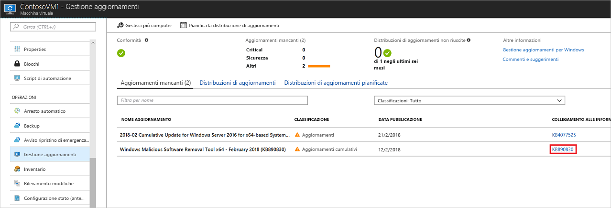
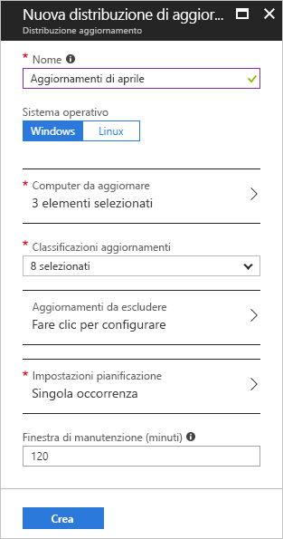
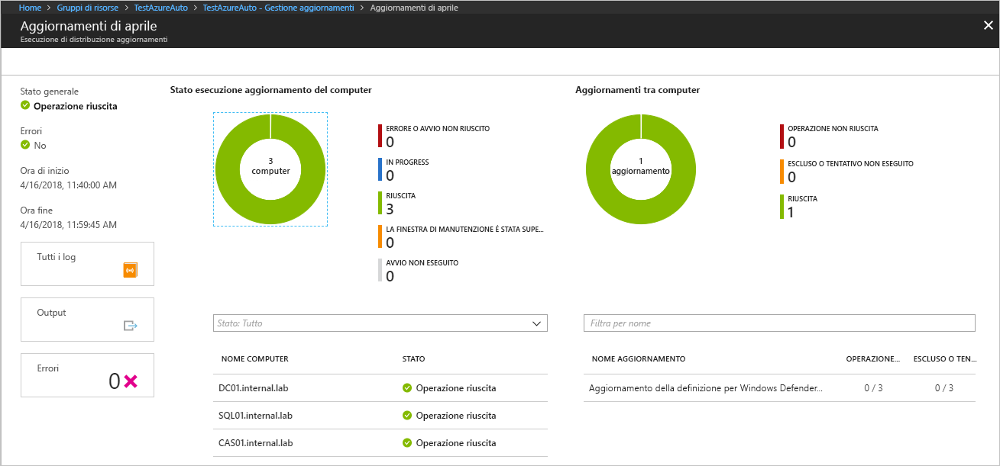

# Gestire gli aggiornamenti di Windows con Automazione di Azure

Gestione aggiornamenti consente di gestire gli aggiornamenti e le patch per le macchine virtuali.
In questa esercitazione viene illustrato come valutare in modo rapido lo stato degli aggiornamenti disponibili, pianificare l'installazione degli aggiornamenti richiesti ed esaminare i risultati della distribuzione per verificare che gli aggiornamenti vangano applicati correttamente.

Per informazioni sui prezzi, vedere [Prezzi di Automazione per la gestione degli aggiornamenti](https://azure.microsoft.com/pricing/details/automation/)

In questa esercitazione si apprenderà come:

> [!div class="checklist"]
> * Caricare una VM per Gestione aggiornamenti
> * Visualizzare una valutazione degli aggiornamenti
> * Pianificare la distribuzione degli aggiornamenti
> * Visualizzare i risultati di una distribuzione

## Prerequisiti

Per completare questa esercitazione, sono necessari:

* Una sottoscrizione di Azure. Se non si ha ancora una sottoscrizione, è possibile [attivare i vantaggi dell'abbonamento MSDN](https://azure.microsoft.com/pricing/member-offers/msdn-benefits-details/) oppure iscriversi per ottenere un [account gratuito](https://azure.microsoft.com/free/?WT.mc_id=A261C142F).
* Un [account di automazione](automation-offering-get-started.md) per contenere i runbook watcher e azione e l'attività watcher.
* Una [macchina virtuale](../virtual-machines/windows/quick-create-portal.md) da caricare.

## Accedere ad Azure

Accedere al portale di Azure all'indirizzo http://portal.azure.com.

## Abilitare Gestione aggiornamenti

Prima di tutto è necessario abilitare Gestione aggiornamenti per la macchina virtuale per questa esercitazione. Se è già stata abilitata un'altra soluzione di automazione per una VM, questo passaggio non è necessario.

1. Nel menu a sinistra selezionare **Macchine virtuali** e selezionare una macchina virtuale dall'elenco
2. Nel menu a sinistra, nella sezione **Operazioni** fare clic su **Gestione aggiornamenti**. Viene visualizzata la pagina **Abilita Gestione aggiornamenti**.

Viene eseguita una convalida per determinare se Gestione aggiornamenti è abilitata per la macchina virtuale.
La convalida include controlli per un'area di lavoro di Log Analytics e un account di Automazione collegato e verifica se la soluzione è presente nell'area di lavoro.

L'area di lavoro di [Log Analytics](../log-analytics/log-analytics-overview.md?toc=%2fazure%2fautomation%2ftoc.json) consente di raccogliere i dati generati da funzionalità e servizi, ad esempio Gestione aggiornamenti.
L'area di lavoro offre un'unica posizione per esaminare e analizzare i dati di più origini.
Per eseguire altre azioni nelle macchine virtuali che richiedono gli aggiornamenti, Automazione di Azure consente di eseguire runbook nelle macchine virtuali, ad esempio il download e l'applicazione degli aggiornamenti.

Il processo di convalida controlla anche se nella macchina virtuale è presente Microsoft Monitoring Agent (MMA) e un ruolo di lavoro ibrido.
L'agente consente di comunicare con la macchina virtuale e ottenere informazioni sullo stato dell'aggiornamento.
Il processo di convalida controlla anche se nella macchina virtuale è presente Microsoft Monitoring Agent (MMA) e un ruolo di lavoro ibrido per runbook di Automazione.

Se non vengono soddisfatti questi prerequisiti, viene visualizzato un banner che offre l'opzione per abilitare la soluzione.

Per abilitare la soluzione, fare clic sul banner.
Se risultano mancanti dopo la convalida, i prerequisiti seguenti vengono aggiunti automaticamente:

* Area di lavoro di [Log Analytics](../log-analytics/log-analytics-overview.md?toc=%2fazure%2fautomation%2ftoc.json)
* [Automazione](./automation-offering-get-started.md)
* [Ruolo di lavoro ibrido per runbook](./automation-hybrid-runbook-worker.md) abilitato nella macchina virtuale

Viene visualizzata la schermata **Gestione aggiornamenti**. Configurare la posizione, l'area di lavoro di Log Analytics e l'account di Automazione da usare e fare clic su **Abilita**. Se i campi sono inattivi, significa che un'altra soluzione di automazione è abilitata per la VM e devono essere usati la stessa area di lavoro e lo stesso account di Automazione.

L'abilitazione della soluzione può richiedere fino a 15 minuti. Durante questo intervallo di tempo, non chiudere la finestra del browser.
Dopo l'abilitazione della soluzione, le informazioni sugli aggiornamenti mancanti nella macchina virtuale passano a Log Analytics.
Affinché i dati diventino disponibili per l'analisi, sarà necessario attendere da 30 minuti a 6 ore.

## Visualizzare la valutazione degli aggiornamenti

Dopo aver abilitato **Gestione aggiornamenti**, viene visualizzata la schermata **Gestione aggiornamenti**.
Se mancano alcuni aggiornamenti, è possibile visualizzare un elenco degli aggiornamenti mancanti nella scheda **Aggiornamenti mancanti**.

Selezionare il **COLLEGAMENTO ALLE INFORMAZIONI** dell'aggiornamento per aprire l'articolo di supporto per l'aggiornamento in una nuova finestra, dove si possono trovare importanti informazioni relative all'aggiornamento.

Facendo clic in altro punto dell'area dell'aggiornamento, viene aperta la finestra **Ricerca log** per l'aggiornamento selezionato. La query per la ricerca log è predefinita per tale specifico aggiornamento. È possibile modificare questa query o crearne una nuova per visualizzare informazioni dettagliate sugli aggiornamenti distribuiti o mancanti nell'ambiente.

## Pianificare la distribuzione degli aggiornamenti

Ora si è a conoscenza della mancanza di aggiornamenti nella VM. Per installare gli aggiornamenti, pianificare una distribuzione che rispetti la pianificazione dei rilasci e l'intervallo di servizio.
È possibile scegliere i tipi di aggiornamento da includere nella distribuzione.
È possibile ad esempio includere gli aggiornamenti critici o della sicurezza ed escludere gli aggiornamenti cumulativi.

> [!WARNING]
> Quando gli aggiornamenti richiedono un riavvio, la macchina virtuale viene riavviata automaticamente.

Pianificare una nuova distribuzione di aggiornamenti per la macchina virtuale tornando a **Gestione aggiornamenti** e selezionando **Pianifica la distribuzione di aggiornamenti** nella parte superiore della schermata.

Nella schermata **Nuova distribuzione di aggiornamenti** specificare le informazioni seguenti:

* **Nome**: specificare un nome univoco per la distribuzione di aggiornamenti.
* **Classificazioni aggiornamenti**: selezionare i tipi di software inclusi nella distribuzione di aggiornamenti. Per questa esercitazione, lasciare tutti i tipi selezionati.

  I tipi di classificazione sono:

  * Aggiornamenti critici
  * Aggiornamenti della sicurezza
  * Aggiornamenti cumulativi
  * Feature Pack
  * Service Pack
  * Aggiornamenti della definizione
  * Strumenti
  * Aggiornamenti

* **Impostazioni pianificazione**: impostare il periodo su 5 minuti a partire dal momento corrente. È anche possibile accettare l'impostazione predefinita, che è di 30 minuti a partire dal momento corrente.
È anche possibile specificare se eseguire la distribuzione una sola volta o impostare una pianificazione ricorrente.
Selezionare **Ricorrente** in **Ricorrenza**. Lasciare l'impostazione predefinita su un 1 giorno e fare clic su **OK**. Viene configurata una pianificazione ricorrente.

* **Finestra di manutenzione (minuti)**: lasciare il valore predefinito. È possibile specificare il periodo di tempo nel quale eseguire la distribuzione di aggiornamenti. Questa impostazione consente di garantire che le modifiche vengano eseguite negli intervalli di servizio definiti.

Dopo avere completato la configurazione della pianificazione, fare clic sul pulsante **Crea**. Si torna al dashboard dello stato. Selezionare **Distribuzioni di aggiornamenti pianificate** per visualizzare la pianificazione della distribuzione creata.

## Visualizzare i risultati di una distribuzione di aggiornamenti

Dopo avere avviato la distribuzione pianificata, è possibile visualizzare lo stato della distribuzione nella scheda **Distribuzioni di aggiornamenti** nella schermata **Gestione aggiornamenti**.
Viene visualizzato lo stato **In corso** quando la distribuzione è in corso.
Quando la distribuzione viene completata correttamente, lo stato diventa **Completato**.
Quando si verificano errori in uno o più aggiornamenti della distribuzione, lo stato sarà **Parzialmente non riuscito**.
Fare clic sulla distribuzione di aggiornamenti completata per visualizzare il dashboard della distribuzione.

Il riquadro **Risultati aggiornamento** include un riepilogo che fornisce il numero totale di aggiornamenti e i risultati della distribuzione nella macchina virtuale.
La tabella a destra offre una suddivisione dettagliata di ogni aggiornamento e dei risultati dell'installazione.
L'elenco seguente mostra i valori disponibili:

* **Tentativo non eseguito**: l'aggiornamento non è stato installato a causa di tempo disponibile non sufficiente basato sulla durata della finestra di manutenzione specificata.
* **Completato**: l'aggiornamento è stato completato
* **Non riuscito**: l'aggiornamento non è riuscito

Fare clic su **Tutti i log** per visualizzare tutte le voci di log create dalla distribuzione.

Fare clic sul riquadro **Output** per visualizzare il flusso del processo del runbook responsabile della gestione della distribuzione di aggiornamenti nella macchina virtuale di destinazione.

Fare clic su **Errori** per visualizzare informazioni dettagliate sugli errori della distribuzione.

## Passaggi successivi

Questa esercitazione illustra come:

> [!div class="checklist"]
> * Caricare una VM per Gestione aggiornamenti
> * Visualizzare una valutazione degli aggiornamenti
> * Pianificare la distribuzione degli aggiornamenti
> * Visualizzare i risultati di una distribuzione

Passare alla panoramica della soluzione Gestione aggiornamenti.

> [!div class="nextstepaction"]
> [Soluzione Gestione aggiornamenti](../operations-management-suite/oms-solution-update-management.md?toc=%2fazure%2fautomation%2ftoc.json)