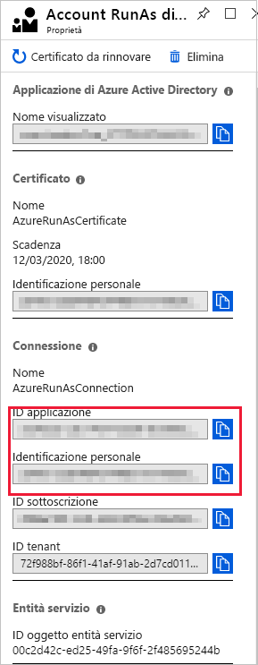
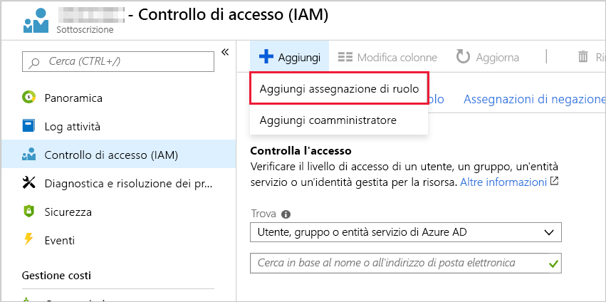
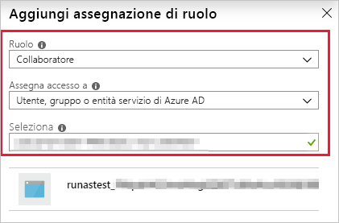

# <a name="troubleshoot-errors-with-runbooks"></a>Risoluzione dei problemi relativi ai runbook

Quando si verificano errori durante l'esecuzione di manuali operativi in automazione di Azure, è possibile seguire questa procedura per diagnosticare il problema.

1. **Assicurarsi che lo script Runbook venga eseguito correttamente nel computer locale:**  Vedere la [documentazione di PowerShell](/powershell/scripting/overview) o i [documenti Python](https://docs.python.org/3/) per informazioni di riferimento sul linguaggio e moduli di formazione.

   Eseguendo lo script in locale è possibile individuare e risolvere gli errori comuni, ad esempio:

   - **Moduli mancanti**
   - **Errori di sintassi**
   - **Errori di logica**

2. **Esaminare Runbook** genera un [errore](https://docs.microsoft.com/azure/automation/automation-runbook-output-and-messages#runbook-output) per i messaggi specifici e li confronta con gli errori indicati di seguito.

3. **Verificare che i nodi e l'area di lavoro di automazione dispongano dei moduli necessari:** Se il Runbook importa i moduli, assicurarsi che siano disponibili nell'account di automazione usando i passaggi elencati in [importare i moduli](../shared-resources/modules.md#import-modules). Aggiornare i moduli alla versione più recente seguendo le istruzioni riportate in [aggiornare i moduli di Azure in automazione di Azure](..//automation-update-azure-modules.md). Per ulteriori informazioni sulla risoluzione dei problemi, vedere [risoluzione dei problemi](shared-resources.md#modules)relativi ai moduli.

Se il Runbook è sospeso o imprevisto:

* [Controllare gli Stati dei processi](https://docs.microsoft.com/azure/automation/automation-runbook-execution#job-statuses) definisce gli Stati Runbook e alcune possibili cause.
* [Aggiungere un output aggiuntivo](https://docs.microsoft.com/azure/automation/automation-runbook-output-and-messages#message-streams) a Runbook per identificare cosa accade prima della sospensione del Runbook.
* [Gestire tutte le eccezioni](https://docs.microsoft.com/azure/automation/automation-runbook-execution#handling-exceptions) generate dal processo.

## <a name="login-azurerm"></a>Scenario: Eseguire login-AzureRMAccount per accedere

### <a name="issue"></a>Problema

Quando si esegue un Runbook, viene visualizzato l'errore seguente:

```error
Run Login-AzureRMAccount to login.
```

### <a name="cause"></a>Causa

Questo errore può verificarsi quando non si usa un account RunAs o quando l'account RunAs è scaduto. Vedere [gestire gli account RunAs di automazione di Azure](https://docs.microsoft.com/azure/automation/manage-runas-account).

Questo errore ha due cause principali:

* Versioni diverse dei moduli AzureRM.
* Si sta provando ad accedere alle risorse in una sottoscrizione separata.

### <a name="resolution"></a>Risoluzione

Se questo errore viene visualizzato dopo l'aggiornamento di un modulo AzureRM, è necessario aggiornare tutti i moduli di AzureRM alla stessa versione.

Se si sta provando ad accedere alle risorse in un'altra sottoscrizione, è possibile seguire questa procedura per configurare le autorizzazioni.

1. Passare all'account RunAs dell'account di automazione e copiare l'ID applicazione e l'identificazione personale.
  
1. Passare al controllo di accesso della sottoscrizione in cui l'account di automazione non è ospitato e aggiungere una nuova assegnazione di ruolo.
  
1. Aggiungere l'ID applicazione raccolto nel passaggio precedente. Selezionare autorizzazioni Collaboratore.
   
1. Copiare il nome della sottoscrizione per il passaggio successivo.
1. È ora possibile usare il codice Runbook seguente per testare le autorizzazioni dall'account di automazione all'altra sottoscrizione.

    Sostituire "\<CertificateThumbprint\>" con il valore copiato nel passaggio #1\>e il valore "\<subscriptionname" copiato nel passaggio #4.

    ```powershell
    $Conn = Get-AutomationConnection -Name AzureRunAsConnection
    Connect-AzureRmAccount -ServicePrincipal -Tenant $Conn.TenantID -ApplicationId $Conn.ApplicationID -CertificateThumbprint "<CertificateThumbprint>"
    #Select the subscription you want to work with
    Select-AzureRmSubscription -SubscriptionName '<YourSubscriptionNameGoesHere>'

    #Test and get outputs of the subscriptions you granted access.
    $subscriptions = Get-AzureRmSubscription
    foreach($subscription in $subscriptions)
    {
        Set-AzureRmContext $subscription
        Write-Output $subscription.Name
    }
    ```

## <a name="unable-to-find-subscription"></a>Scenario: non è possibile trovare la sottoscrizione di Azure

### <a name="issue"></a>Problema

Usando i cmdlet `Select-AzureSubscription` o `Select-AzureRmSubscription` verrà visualizzato l'errore seguente:

```error
The subscription named <subscription name> cannot be found.
```

### <a name="error"></a>Errore

Questo errore può verificarsi se:

* Il nome della sottoscrizione non è valido.

* L'utente di Azure Active Directory che sta tentando di ottenere i dettagli della sottoscrizione non è configurato come amministratore della sottoscrizione.

### <a name="resolution"></a>Risoluzione

Per determinare se l'autenticazione in Azure è stata eseguita e se si ha accesso alla sottoscrizione che si sta tentando di selezionare, seguire questa procedura:

1. Testare lo script all'esterno di Automazione di Azure per assicurarsi che funzioni autonomamente.
2. Assicurarsi di eseguire il cmdlet `Add-AzureAccount` prima di eseguire il cmdlet `Select-AzureSubscription`.
3. Aggiungere `Disable-AzureRmContextAutosave –Scope Process` all'inizio del runbook. Questo cmdlet garantisce che eventuali credenziali vengano applicate solo all'esecuzione del runbook corrente.
4. Se viene ancora visualizzato questo messaggio di errore, modificare il codice aggiungendo il parametro **-AzureRmContext** dopo il cmdlet `Add-AzureAccount`, quindi eseguire il codice.

   ```powershell
   Disable-AzureRmContextAutosave –Scope Process

   $Conn = Get-AutomationConnection -Name AzureRunAsConnection
   Connect-AzureRmAccount -ServicePrincipal -Tenant $Conn.TenantID -ApplicationID $Conn.ApplicationID -CertificateThumbprint $Conn.CertificateThumbprint

   $context = Get-AzureRmContext

   Get-AzureRmVM -ResourceGroupName myResourceGroup -AzureRmContext $context
    ```

## <a name="auth-failed-mfa"></a>Scenario: l'autenticazione in Azure non è riuscita perché è abilitata l'autenticazione a più fattori

### <a name="issue"></a>Problema

Durante l'autenticazione in Azure con il nome utente e la password di Azure viene visualizzato l'errore seguente:

```error
Add-AzureAccount: AADSTS50079: Strong authentication enrollment (proof-up) is required
```

### <a name="cause"></a>Causa

Se nell'account Azure è abilitata l'autenticazione a più fattori, non è possibile usare un utente di Azure Active Directory per l'autenticazione in Azure. È invece necessario usare un certificato o un'entità servizio per l'autenticazione in Azure.

### <a name="resolution"></a>Risoluzione

Per usare un certificato con i cmdlet del modello di distribuzione classica di Azure, vedere il blog relativo alla [creazione e all'aggiunta di un certificato per la gestione dei servizi Azure.](https://blogs.technet.com/b/orchestrator/archive/2014/04/11/managing-azure-services-with-the-microsoft-azure-automation-preview-service.aspx) Per usare un'entità servizio con i cmdlet di Azure Resource Manager, vedere l'argomento relativo alla [creazione di un'entità servizio tramite il portale di Azure](../../active-directory/develop/howto-create-service-principal-portal.md) e quello relativo all'[autenticazione di un'entità servizio con Azure Resource Manager.](../../active-directory/develop/howto-authenticate-service-principal-powershell.md)

## <a name="get-serializationsettings"></a>Scenario: Errore nei flussi del processo sul metodo get_SerializationSettings

### <a name="issue"></a>Problema

Nell'errore nei flussi del processo viene visualizzato un runbook con il messaggio seguente:

```error
Connect-AzureRMAccount : Method 'get_SerializationSettings' in type
'Microsoft.Azure.Management.Internal.Resources.ResourceManagementClient' from assembly
'Microsoft.Azure.Commands.ResourceManager.Common, Version=4.0.0.0, Culture=neutral, PublicKeyToken=31bf3856ad364e35'
does not have an implementation.
At line:16 char:1
+ Connect-AzureRMAccount -ServicePrincipal -Tenant $Conn.TenantID -Appl ...
+ ~~~~~~~~~~~~~~~~~~~~~~~~~~~~~~~~~~~~~~~~~~~~~~~~~~~~~~~~~~~~~~~~~~~~~
    + CategoryInfo          : NotSpecified: (:) [Connect-AzureRmAccount], TypeLoadException
    + FullyQualifiedErrorId : System.TypeLoadException,Microsoft.Azure.Commands.Profile.ConnectAzureRmAccountCommand
```

### <a name="cause"></a>Causa

Questo errore è dovuto all'uso dei cmdlet AzureRM e Az in un solo runbook. Si verifica quando si importa `Az` prima di `AzureRM`.

### <a name="resolution"></a>Risoluzione

I cmdlet AzureRM e Az non possono essere importati e usati nello stesso runbook. Per altre informazioni sul supporto di Az in Automazione di Azure, vedere [Supporto per i moduli Az in Automazione di Azure](../az-modules.md).

## <a name="task-was-cancelled"></a>Scenario: il runbook ha esito negativo e restituisce l'errore seguente: Un'attività è stata annullata

### <a name="issue"></a>Problema

Il runbook ha esito negativo con un errore simile all'esempio seguente:

```error
Exception: A task was canceled.
```

### <a name="cause"></a>Causa

Questo errore può essere causato dall'utilizzo di moduli di Azure non aggiornati.

### <a name="resolution"></a>Risoluzione

Questo errore può essere risolto aggiornando i moduli di Azure alla versione più recente.

Nell'account di Automazione fare clic su **Moduli** e quindi su **Aggiorna moduli di Azure**. L'aggiornamento richiede circa 15 minuti. Al termine, eseguire di nuovo il runbook non riuscito. Per ulteriori informazioni sull'aggiornamento dei moduli, vedere [Aggiornare i moduli di Azure in Automazione di Azure](../automation-update-azure-modules.md).

## <a name="runbook-auth-failure"></a>Scenario: i runbook hanno esito negativo quando si gestiscono più sottoscrizioni

### <a name="issue"></a>Problema

Quando si esegue manuali operativi, Runbook non riesce a gestire le risorse di Azure.

### <a name="cause"></a>Causa

Il runbook non usa il contesto corretto durante l'esecuzione.

### <a name="resolution"></a>Risoluzione

Quando si usano più sottoscrizioni, il contesto della sottoscrizione potrebbe andare perso quando si richiamano runbook. Per garantire che il contesto della sottoscrizione venga passato ai runbook, aggiungere il parametro `AzureRmContext` al cmdlet e passargli il contesto. È anche consigliabile usare il cmdlet `Disable-AzureRmContextAutosave` con l'ambito **Process** per assicurarsi che le credenziali usate siano usate solo per il runbook corrente.

```azurepowershell-interactive
# Ensures that any credentials apply only to the execution of this runbook
Disable-AzureRmContextAutosave –Scope Process

# Connect to Azure with RunAs account
$ServicePrincipalConnection = Get-AutomationConnection -Name 'AzureRunAsConnection'

Add-AzureRmAccount `
    -ServicePrincipal `
    -TenantId $ServicePrincipalConnection.TenantId `
    -ApplicationId $ServicePrincipalConnection.ApplicationId `
    -CertificateThumbprint $ServicePrincipalConnection.CertificateThumbprint

$AzureContext = Select-AzureRmSubscription -SubscriptionId $ServicePrincipalConnection.SubscriptionID

$params = @{"VMName"="MyVM";"RepeatCount"=2;"Restart"=$true}

Start-AzureRmAutomationRunbook `
    –AutomationAccountName 'MyAutomationAccount' `
    –Name 'Test-ChildRunbook' `
    -ResourceGroupName 'LabRG' `
    -AzureRmContext $AzureContext `
    –Parameters $params –wait
```

Per ulteriori informazioni, vedere [utilizzo di più sottoscrizioni](../automation-runbook-execution.md#working-with-multiple-subscriptions).

## <a name="not-recognized-as-cmdlet"></a>Scenario: Termine non riconosciuto come nome di cmdlet, funzione, script

### <a name="issue"></a>Problema

Il runbook ha esito negativo con un errore simile all'esempio seguente:

```error
The term 'Connect-AzureRmAccount' is not recognized as the name of a cmdlet, function, script file, or operable program.  Check the spelling of the name, or if the path was included verify that the path is correct and try again.
```

### <a name="cause"></a>Causa

Questo errore può verificarsi per uno dei motivi seguenti:

* Il modulo che contiene il cmdlet non viene importato nell'account di automazione
* Il modulo che contiene il cmdlet viene importato, ma non è aggiornato

### <a name="resolution"></a>Risoluzione

Questo errore può essere risolto eseguendo una delle attività seguenti:

Se il modulo è un modulo di Azure, vedere [Come aggiornare i moduli di Azure PowerShell in Automazione di Azure](../automation-update-azure-modules.md) per informazioni su come aggiornare i moduli nell'account di automazione.

Se è un modulo separato, assicurarsi che il modulo venga importato nell'account di automazione.

## <a name="job-attempted-3-times"></a>Scenario: l'avvio del processo runbook è stato tentato per tre volte, ma non è riuscito

### <a name="issue"></a>Problema

Il runbook ha esito negativo con errore:

```error
The job was tried three times but it failed
```

### <a name="cause"></a>Causa

Questo errore è causato da uno dei problemi seguenti:

* Limite di memoria. I limiti documentati per la quantità di memoria allocata a una sandbox sono disponibili in [Limiti del servizio Automazione](../../azure-subscription-service-limits.md#automation-limits). Un processo potrebbe non riuscire se usa più di 400 MB di memoria.

* Socket di rete. Le sandbox di Azure sono limitate a 1000 socket di rete simultanei, come descritto in [Limiti del servizio Automazione](../../azure-subscription-service-limits.md#automation-limits).

* Modulo incompatibile. Questo errore può verificarsi se le dipendenze del modulo non sono corrette; se non lo sono il runbook restituisce in genere il messaggio "Comando non trovato" o "Non è possibile associare il parametro".

* Il Runbook ha tentato di chiamare un eseguibile o un sottoprocesso in un Runbook che viene eseguito in una sandbox di Azure. Questo scenario non è supportato nelle sandbox di Azure.

* Il Runbook ha tentato di scrivere una quantità eccessiva di dati di eccezione nel flusso di output.

### <a name="resolution"></a>Risoluzione

una qualsiasi delle soluzioni seguenti consente di correggere il problema:

* Metodi consigliati per operare entro il limite di memoria sono, ad esempio, dividere il carico di lavoro tra diversi runbook, non elaborare tutti i dati in memoria, non scrivere output non necessari dai runbook oppure tenere in considerazione il numero di checkpoint scritti nei runbook del flusso di lavoro PowerShell. È possibile usare il metodo Clear, ad esempio `$myVar.clear()`, per cancellare la variabile e usare `[GC]::Collect()` per eseguire immediatamente Garbage Collection, in modo da ridurre il footprint della memoria durante l'esecuzione dei runbook.

* Aggiornare i moduli di Azure eseguendo i passaggi [Come aggiornare i moduli Azure PowerShell in Automazione di Azure](../automation-update-azure-modules.md).

* Un’altra soluzione consiste nell'eseguire il runbook su un [ruolo di lavoro ibrido per runbook](../automation-hrw-run-runbooks.md). I ruoli di lavoro ibridi non hanno i limiti di memoria e rete che sono invece applicati ai sandbox di Azure.

* Se occorre chiamare un processo (ad esempio .exe o subprocess.call) in un runbook, è necessario eseguire il runbook in un [ruolo di lavoro ibrido per runbook](../automation-hrw-run-runbooks.md).

* È previsto un limite di 1 MB nel flusso di output del processo. Assicurarsi di racchiudere le chiamate a un eseguibile o a un sottoprocesso in un blocco try/catch. Se generano un'eccezione, scrivere il messaggio da tale eccezione in una variabile di automazione. In questo modo verrà impedito la scrittura nel flusso di output del processo.

## <a name="sign-in-failed"></a>Scenario: accesso all'account Azure non riuscito

### <a name="issue"></a>Problema

Quando si utilizzano i `Add-AzureAccount` cmdlet o `Connect-AzureRmAccount` , viene visualizzato uno degli errori seguenti:

```error
Unknown_user_type: Unknown User Type
```

```error
No certificate was found in the certificate store with thumbprint
```

### <a name="cause"></a>Causa

Questo errore si verifica se il nome dell'asset delle credenziali non è valido o se il nome utente e la password usati per impostare l'asset delle credenziali di automazione non sono validi.

### <a name="resolution"></a>Risoluzione

Per determinare la causa del problema, seguire questa procedura:

1. Verificare che non siano presenti caratteri speciali, ad esempio il carattere **\@** nel nome dell'asset delle credenziali di automazione usato per connettersi ad Azure.
2. Verificare che sia possibile usare il nome utente e la password archiviati nelle credenziali di Automazione di Azure nell'editor di PowerShell ISE locale. È possibile verificare se il nome utente e la password sono corretti eseguendo i cmdlet seguenti in PowerShell ISE:

   ```powershell
   $Cred = Get-Credential
   #Using Azure Service Management
   Add-AzureAccount –Credential $Cred
   #Using Azure Resource Manager
   Connect-AzureRmAccount –Credential $Cred
   ```

3. Se l'autenticazione non riesce in locale, significa che le credenziali di Azure Active Directory non sono state configurate correttamente. Per ottenere la configurazione corretta dell'account Azure Active Directory, vedere il post di blog relativo all' [autenticazione in Azure con Azure Active Directory](https://azure.microsoft.com/blog/azure-automation-authenticating-to-azure-using-azure-active-directory/) .

4. In caso di errore temporaneo, provare ad aggiungere la logica di ripetizione alla routine di autenticazione per rendere più affidabile l'autenticazione.

   ```powershell
   # Get the connection "AzureRunAsConnection"
   $connectionName = "AzureRunAsConnection"
   $servicePrincipalConnection = Get-AutomationConnection -Name $connectionName

   $logonAttempt = 0
   $logonResult = $False

   while(!($connectionResult) -And ($logonAttempt -le 10))
   {
       $LogonAttempt++
       #Logging in to Azure...
       $connectionResult = Connect-AzureRmAccount `
                              -ServicePrincipal `
                              -TenantId $servicePrincipalConnection.TenantId `
                              -ApplicationId $servicePrincipalConnection.ApplicationId `
                              -CertificateThumbprint $servicePrincipalConnection.CertificateThumbprint

       Start-Sleep -Seconds 30
   }
   ```

## <a name="child-runbook-object"></a>Riferimento oggetto non impostato su un'istanza dell'oggetto

### <a name="issue"></a>Problema

Viene visualizzato l'errore seguente quando si richiama un Runbook figlio con l' `-Wait` opzione e il flusso di output contiene un oggetto:

```error
Object reference not set to an instance of an object
```

### <a name="cause"></a>Causa

Si tratta di un problema noto in cui [Start-AzureRmAutomationRunbook](/powershell/module/AzureRM.Automation/Start-AzureRmAutomationRunbook) non gestisce correttamente il flusso di output se contiene oggetti.

### <a name="resolution"></a>Risoluzione

Per risolvere il problema, è consigliabile implementare una logica di polling e usare il cmdlet [Get-AzureRmAutomationJobOutput](/powershell/module/azurerm.automation/get-azurermautomationjoboutput) per recuperare l'output. Un esempio di questa logica è definito di seguito.

```powershell
$automationAccountName = "ContosoAutomationAccount"
$runbookName = "ChildRunbookExample"
$resourceGroupName = "ContosoRG"

function IsJobTerminalState([string] $status) {
    return $status -eq "Completed" -or $status -eq "Failed" -or $status -eq "Stopped" -or $status -eq "Suspended"
}

$job = Start-AzureRmAutomationRunbook -AutomationAccountName $automationAccountName -Name $runbookName -ResourceGroupName $resourceGroupName
$pollingSeconds = 5
$maxTimeout = 10800
$waitTime = 0
while((IsJobTerminalState $job.Status) -eq $false -and $waitTime -lt $maxTimeout) {
   Start-Sleep -Seconds $pollingSeconds
   $waitTime += $pollingSeconds
   $job = $job | Get-AzureRmAutomationJob
}

$jobResults | Get-AzureRmAutomationJobOutput | Get-AzureRmAutomationJobOutputRecord | Select-Object -ExpandProperty Value
```

## <a name="fails-deserialized-object"></a>Scenario: il runbook ha esito negativo a causa di un oggetto deserializzato

### <a name="issue"></a>Problema

Il runbook ha esito negativo con errore:

```error
Cannot bind parameter <ParameterName>.

Cannot convert the <ParameterType> value of type Deserialized <ParameterType> to type <ParameterType>.
```

### <a name="cause"></a>Causa

Se il runbook è un flusso di lavoro di PowerShell, archivia gli oggetti complessi in un formato deserializzato per rendere persistente lo stato del runbook quando il flusso di lavoro viene sospeso.

### <a name="resolution"></a>Risoluzione

Una qualsiasi delle tre soluzioni seguenti consente di correggere questo problema:

* Se si inviano tramite pipe oggetti complessi da un cmdlet a un altro, eseguire il wrapping dei cmdlet in un InlineScript.
* Passare il nome o il valore necessario dall'oggetto complesso invece di passare l'intero oggetto.
* Usare un runbook di PowerShell invece di un runbook del flusso di lavoro PowerShell.

## <a name="quota-exceeded"></a>Scenario: processo del Runbook non riuscito per il superamento della quota allocata

### <a name="issue"></a>Problema

Il processo del runbook ha esito negativo con errore:

```error
The quota for the monthly total job run time has been reached for this subscription
```

### <a name="cause"></a>Causa

Questo errore si verifica quando l'esecuzione del processo supera la quota disponibile di 500 minuti per l'account. Questa quota si applica a tutti i tipi di attività di esecuzione di processi, ad esempio il test di un processo, l'avvio di un processo dal portale, l'esecuzione di un processo con webhook e la pianificazione di un processo da eseguire tramite il portale di Azure o nel proprio data center. Per altre informazioni sui prezzi relativi all'automazione, vedere [Prezzi di Automazione](https://azure.microsoft.com/pricing/details/automation/).

### <a name="resolution"></a>Risoluzione

Se si vogliono usare più di 500 minuti di elaborazione al mese, si deve modificare la sottoscrizione dal livello gratuito al livello Basic. È possibile eseguire l'aggiornamento al livello Basic seguendo questa procedura.

1. Accedere alla sottoscrizione di Azure.
2. Selezionare l'account di automazione che si vuole aggiornare.
3. Fare clic su **Impostazioni** > **Prezzi**.
4. Fare clic su **Abilita** nella parte inferiore della pagina per aggiornare l'account al livello **Basic**.

## <a name="cmdlet-not-recognized"></a>Scenario: cmdlet non riconosciuto durante l'esecuzione di un runbook

### <a name="issue"></a>Problema

Il processo del runbook ha esito negativo con errore:

```error
<cmdlet name>: The term <cmdlet name> is not recognized as the name of a cmdlet, function, script file, or operable program.
```

### <a name="cause"></a>Causa

Questo errore si verifica quando il motore di PowerShell non trova il cmdlet utilizzato nel runbook. È possibile che il modulo che contiene il cmdlet non sia incluso nell'account, che esista un conflitto di nome con il nome di un runbook o che il cmdlet sia presente anche in un altro modulo e che Automazione non possa risolvere il nome.

### <a name="resolution"></a>Risoluzione

una qualsiasi delle soluzioni seguenti consente di correggere il problema:

* Verificare di aver immesso correttamente il nome del cmdlet.
* Assicurarsi che il cmdlet esista nell'account di automazione e che non siano presenti conflitti. Per verificare se il cmdlet è presente, aprire un runbook in modalità di modifica e cercare il cmdlet nella libreria o eseguire `Get-Command <CommandName>`. Dopo aver verificato che il cmdlet è disponibile per l'account e che non ci sono conflitti di nomi con altri cmdlet o runbook, aggiungerlo all'area di disegno e assicurarsi di usare un set di parametri valido nel runbook.
* Nel caso di un conflitto di nomi e se il cmdlet è disponibile in due moduli diversi, è possibile risolvere questo problema usando il nome completo del cmdlet. Ad esempio, usare **ModuleName\CmdletName**.
* Se si eseguono i runbook in locale in un gruppo di lavoro ibrido, verificare che il modulo e il cmdlet siano installati nel computer che ospita il ruolo di lavoro ibrido.

## <a name="long-running-runbook"></a>Scenario: un runbook a esecuzione prolungata non viene completato

### <a name="issue"></a>Problema

Il runbook mostra lo stato **Stopped** (Arrestato) dopo 3 ore di esecuzione. Potrebbe essere visualizzato anche l'errore:

```error
The job was evicted and subsequently reached a Stopped state. The job cannot continue running
```

Si tratta di un comportamento previsto nelle sandbox di Azure, causato dalla "condivisione equa" del monitoraggio dei processi in Automazione di Azure, che prevede l'arresto automatico di un runbook se viene eseguito per più di tre ore. Lo stato di un runbook che supera il limite di tempo di condivisione equa è diverso in base al tipo di runbook. I runbook PowerShell e Python sono impostati sullo stato **Stopped** (Arrestato). I runbook PowerShell del flusso di lavoro sono impostati su **Failed** (Non riuscito).

### <a name="cause"></a>Causa

Il runbook ha superato il limite di esecuzione di 3 ore consentito dalla condivisione equa in un sandbox di Azure.

### <a name="resolution"></a>Risoluzione

Una soluzione consigliata consiste nell'eseguire il runbook su un [ruolo di lavoro ibrido per runbook](../automation-hrw-run-runbooks.md).

I ruoli di lavoro ibridi non sono limitati dal massimo di 3 ore del runbook per la [condivisione equa](../automation-runbook-execution.md#fair-share) rispetto a come vengono eseguiti nelle sandbox di Azure. I runbook eseguiti in ruoli di lavoro ibridi per runbook devono essere sviluppati per poter supportare i comportamenti di riavvio in caso di problemi imprevisti dell'infrastruttura locale.

Un'altra opzione consiste nell'ottimizzare il runbook creando [runbook figlio](../automation-child-runbooks.md). Se il runbook esegue in ciclo la stessa funzione in più risorse, ad esempio un'operazione di database su più database, è possibile spostare tale funzione in un runbook figlio. Ognuno di questi runbook figlio viene eseguito in parallelo in processi separati. Questo comportamento riduce la quantità totale di tempo per il completamento del runbook padre.

I cmdlet di PowerShell che consentono lo scenario del runbook figlio sono:

[Start-AzureRMAutomationRunbook](/powershell/module/AzureRM.Automation/Start-AzureRmAutomationRunbook) che consente di avviare un runbook e passargli i parametri

[Get-AzureRmAutomationJob](/powershell/module/azurerm.automation/get-azurermautomationjob) che consente di controllare lo stato del processo per ogni figlio, se ci sono operazioni che devono essere eseguite al termine del runbook figlio.

## <a name="expired webhook"></a>Scenario: Stato: 400 - Richiesta non valida quando si chiama un webhook

### <a name="issue"></a>Problema

Quando si tenta di richiamare un webhook per un runbook di Automazione di Azure, viene visualizzato l'errore seguente:

```error
400 Bad Request : This webhook has expired or is disabled
```

### <a name="cause"></a>Causa

Il webhook che si sta tentando di chiamare è disabilitato o scaduto.

### <a name="resolution"></a>Risoluzione

Se il webhook è disattivato, è possibile riabilitarlo tramite il portale di Azure. Quando il webhook è scaduto, è necessario eliminarlo e ricrearlo. Il [rinnovo di un webhook](../automation-webhooks.md#renew-webhook) è possibile solo se il webhook non è scaduto.

## <a name="429"></a>Scenario: 429: la frequenza delle richieste è troppo elevata. Riprovare

### <a name="issue"></a>Problema

Quando si esegue il cmdlet `Get-AzureRmAutomationJobOutput` viene visualizzato il messaggio di errore seguente:

```error
429: The request rate is currently too large. Please try again
```

### <a name="cause"></a>Causa

Questo errore può verificarsi durante il recupero di output del processo da un runbook con molti [flussi dettagliati](../automation-runbook-output-and-messages.md#verbose-stream).

### <a name="resolution"></a>Risoluzione

È possibile risolvere questo problema in due modi:

* Modificare il runbook riducendo il numero di flussi del processo generati dal runbook stesso.
* Ridurre il numero di flussi da recuperare all'esecuzione del cmdlet. Per seguire questo comportamento, è possibile specificare il parametro `-Stream Output` in modo che il cmdlet `Get-AzureRmAutomationJobOutput` recuperi solo i flussi di output. 

## <a name="cannot-invoke-method"></a>Scenario: Il processo di PowerShell ha esito negativo con errore: Non è possibile richiamare il metodo

### <a name="issue"></a>Problema

Quando si avvia un processo di PowerShell in un Runbook in esecuzione in Azure, viene visualizzato il messaggio di errore seguente:

```error
Exception was thrown - Cannot invoke method. Method invocation is supported only on core types in this language mode.
```

### <a name="cause"></a>Causa

Questo errore può verificarsi quando si avvia un processo di PowerShell in un Runbook eseguito in Azure. Questo comportamento può verificarsi perché manuali operativi eseguito in una sandbox di Azure potrebbe non essere eseguito in [modalità di linguaggio completo](/powershell/module/microsoft.powershell.core/about/about_language_modes)).

### <a name="resolution"></a>Risoluzione

È possibile risolvere questo problema in due modi:

* Invece di `Start-Job`usare `Start-AzureRmAutomationRunbook` , per avviare un Runbook
* Se il Runbook presenta questo messaggio di errore, eseguirlo in un ruolo di lavoro ibrido per Runbook

Per altre informazioni su questo comportamento e altri comportamenti dei manuali operativi di automazione di Azure, vedere [comportamento di Runbook](../automation-runbook-execution.md#runbook-behavior).

## <a name="other"></a>Il problema non è elencato sopra

Le sezioni seguenti elencano altri errori comuni oltre alla documentazione di supporto per facilitare la risoluzione del problema.

## <a name="hybrid-runbook-worker-doesnt-run-jobs-or-isnt-responding"></a>Il ruolo di lavoro per runbook ibrido non esegue i processi o non risponde

Se si eseguono processi usando un ruolo di lavoro ibrido anziché in automazione di Azure, potrebbe essere necessario [risolvere i problemi del ruolo di lavoro ibrido](https://docs.microsoft.com/azure/automation/troubleshoot/hybrid-runbook-worker).

## <a name="runbook-fails-with-no-permission-or-some-variation"></a>Il runbook ha esito negativo e viene segnalata l'assenza di autorizzazioni o la presenza di alcune varianti

Gli account RunAs potrebbero non disporre delle stesse autorizzazioni dell'account corrente per le risorse di Azure. Verificare che l'account RunAs [disponga delle autorizzazioni per accedere alle risorse](https://docs.microsoft.com/azure/role-based-access-control/role-assignments-portal) usate nello script.

## <a name="runbooks-were-working-but-suddenly-stopped"></a>I runbook funzionavano ma sono stati arrestati improvvisamente

* Se manuali operativi è stato eseguito in precedenza ma arrestato, [verificare che l'account RunAs non sia scaduto](https://docs.microsoft.com/azure/automation/manage-runas-account#cert-renewal).
* Se si usano webhook per avviare i runbook, [assicurarsi che il webhook non sia scaduto](https://docs.microsoft.com/azure/automation/automation-webhooks#renew-webhook).

## <a name="issues-passing-parameters-into-webhooks"></a>Problemi durante il passaggio dei parametri ai webhook

Per informazioni sul passaggio di parametri ai webhook, vedere [avviare un Runbook da un webhook](https://docs.microsoft.com/azure/automation/automation-webhooks#parameters).

## <a name="issues-using-az-modules"></a>Problemi con AZ Modules

L'uso di moduli Az e AzureRM nello stesso account di automazione non è supportato. Per altri dettagli, vedere [AZ Modules in manuali operativi](https://docs.microsoft.com/azure/automation/az-modules) .

## <a name="inconsistent-behavior-in-runbooks"></a>Comportamento incoerente nei runbook

Seguire le indicazioni fornite in [Esecuzione di runbook](https://docs.microsoft.com/azure/automation/automation-runbook-execution#runbook-behavior) per evitare problemi con processi simultanei, risorse create più volte o altri problemi di logica temporale nei runbook.

## <a name="runbook-fails-with-the-errors-no-permission-forbidden-403-or-some-variation"></a>Runbook ha esito negativo con errori: Nessuna autorizzazione, accesso negato, 403 o alcune variazioni

Gli account RunAs potrebbero non disporre delle stesse autorizzazioni dell'account corrente per le risorse di Azure. Verificare che l'account RunAs disponga [delle autorizzazioni per accedere alle risorse](https://docs.microsoft.com/azure/role-based-access-control/role-assignments-portal) utilizzate nello script.

## <a name="runbooks-were-working-but-suddenly-stopped"></a>I runbook funzionavano ma sono stati arrestati improvvisamente

* Se manuali operativi è stato eseguito in precedenza ma arrestato, verificare che l'account RunAs [non sia scaduto](https://docs.microsoft.com/azure/automation/manage-runas-account#cert-renewal).
* Se si usano webhook per avviare manuali operativi, assicurarsi che il webhook [non sia scaduto](https://docs.microsoft.com/azure/automation/automation-webhooks#renew-webhook).

## <a name="passing-parameters-into-webhooks"></a>Trasmissione dei parametri nei webhook

Per informazioni sul passaggio di parametri ai webhook, vedere [avviare un Runbook da un webhook](https://docs.microsoft.com/azure/automation/automation-webhooks#parameters).

## <a name="using-az-modules"></a>Uso dei moduli Az

L'uso di moduli Az e AzureRM nello stesso account di automazione non è supportato. Per altri dettagli, vedere [AZ Modules in manuali operativi](https://docs.microsoft.com/azure/automation/az-modules) .

## <a name="using-self-signed-certificates"></a>Uso di certificati autofirmati

Per usare i certificati autofirmati, è necessario seguire la Guida in [creazione di un nuovo certificato](https://docs.microsoft.com/azure/automation/shared-resources/certificates#creating-a-new-certificate).

## <a name="recommended-documents"></a>Documenti consigliati

* [Avvio di un runbook in Automazione di Azure](https://docs.microsoft.com/azure/automation/automation-starting-a-runbook)
* [Esecuzione di runbook in Automazione di Azure](https://docs.microsoft.com/azure/automation/automation-runbook-execution)

## <a name="next-steps"></a>Passaggi successivi

Se il problema riscontrato non è presente in questo elenco o se non si riesce a risolverlo, visitare uno dei canali seguenti per ottenere ulteriore assistenza:

* Ottieni risposte dagli esperti di Azure tramite i [forum di Azure](https://azure.microsoft.com/support/forums/)
* Collegarsi a [@AzureSupport](https://twitter.com/azuresupport), l'account Microsoft Azure ufficiale per il miglioramento dell'esperienza dei clienti che mette in contatto la community di Azure con le risorse corrette: risposte, supporto ed esperti.
* Se è necessaria un'assistenza maggiore, è possibile inviare una richiesta al supporto tecnico di Azure. Accedere al [sito del supporto di Azure](https://azure.microsoft.com/support/options/) e selezionare **Ottenere supporto**.
