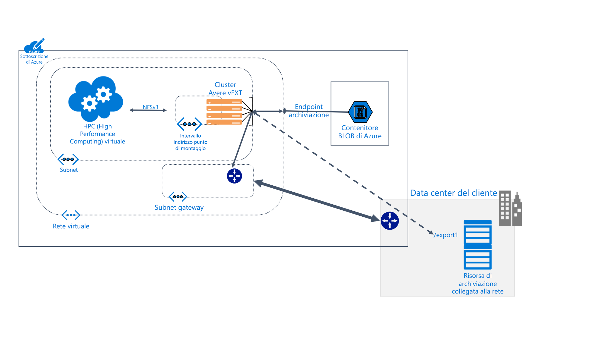

# Informazioni su Avere vFXT per Azure 

Avere vFXT per Azure è una soluzione di memorizzazione nella cache del file system per attività HPC (High Performance Computing) a elevato utilizzo di dati. Consente di sfruttare i vantaggi del cloud computing in termini di scalabilità per rendere i dati accessibili quando e dove è necessario, anche nel caso dei dati archiviati nell'hardware locale.

Avere vFXT supporta gli scenari di elaborazione comuni seguenti: 

* Architettura del cloud ibrido: Avere vFXT per Azure è compatibile con un sistema di archiviazione hardware e offre quindi i vantaggi del cloud computing senza dover spostare i file. 
* Espansione nel cloud: Avere vFXT per Azure consente di spostare i dati nel cloud per un unico progetto oppure di eseguire la migrazione lift-and-shift definitiva dell'intero flusso di lavoro. 

Avere vFXT per Azure è ideale per le situazioni seguenti: 

* Operazioni con intensa attività di lettura per carichi di lavoro HPC
* Applicazioni che usano il protocollo NFS comune
* Farm di calcolo da 1000 a 40.000 core CPU
* Integrazione con dispositivi NAS hardware locali, archivio BLOB di Azure o entrambi

Per altre informazioni, vedere <https://azure.microsoft.com/services/storage/avere-vfxt/>

## Chi usa Avere vFXT per Azure? 

Avere vFXT è utile in tutte le attività di elaborazione che richiedono un numero elevato di operazioni di lettura:

### Rendering di effetti visivi 

Nel settore dei media e dell'intrattenimento il cluster Avere vFXT può velocizzare l'accesso ai dati per i progetti di rendering che richiedono molto tempo. Dal momento che è possibile aggiungere più spazio di cache e più nodi di calcolo in Azure, consente di gestire in modo flessibile ed efficiente progetti di grandi dimensioni. 

### Scienze biologiche 

Avere vFXT consente ai ricercatori di eseguire flussi di lavoro di analisi secondaria in Calcolo di Azure e di accedere ai dati genomici indipendentemente dalla posizione.

Nella ricerca farmaceutica i cluster Avere vFXT consentono di accelerare la scoperta dei farmaci aiutando i ricercatori a prevedere le interazioni farmaco-obiettivo e ad analizzare i dati di ricerca.

### Analisi dei servizi finanziari

Un cluster Avere vFXT può velocizzare i calcoli di analisi quantitativa, in modo da offrire alle società di servizi finanziari le informazioni dettagliate necessarie per prendere decisioni strategiche. 

## Funzionalità e specifiche

Il sistema Avere vFXT è costituito da tre o più nodi filer perimetrali virtuali configurati in cluster. Può essere installato accanto ai computer client, in modo da montare il cluster invece di montare direttamente la risorsa di archiviazione. 

Il cluster Avere vFXT memorizza i file nella cache quando vengono richiesti. In oltre l'80% dei casi le richieste ripetute possono essere gestite dalla cache.

### Compatibilità 

* Compatibile con sistemi NAS hardware di NetApp o Dell EMC Isilon
* Compatibile con BLOB di Azure
* Usa il protocollo NFSv3 o SMB2

Il sistema Avere vFXT usa le risorse di Azure seguenti: 

|Componente di Azure|   |
|----------|-----------|
|Macchine virtuali|3 o più E32_v3|
|Archiviazione SSD Premium|200 GB di spazio del sistema operativo più 1-4 TB di spazio di memorizzazione nella cache per nodo |
|Account di archiviazione (facoltativo) |v2|
|Archiviazione back-end dei dati (facoltativa) | Un contenitore BLOB di archiviazione con ridondanza locale vuoto |

## Passaggi successivi

Ecco alcuni collegamenti per iniziare a creare la distribuzione personalizzata di Avere vFXT. 

* [Pianificazione del sistema](avere-vfxt-deploy-plan.md)
* [Panoramica della distribuzione](avere-vfxt-deploy-overview.md)
* [Creazione del cluster vFXT](avere-vfxt-deploy.md)
