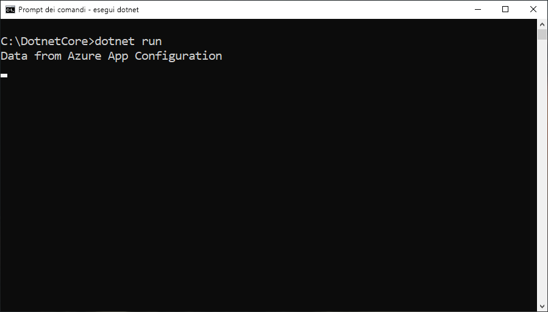

# <a name="tutorial-use-dynamic-configuration-in-a-net-core-app"></a>Esercitazione: Usare la configurazione dinamica in un'app .NET Core

La libreria client .NET Core di Configurazione app supporta l'aggiornamento su richiesta di un set di impostazioni di configurazione senza causare il riavvio di un'applicazione. Questa funzionalità può essere implementata recuperando prima un'istanza di `IConfigurationRefresher` dalle opzioni del provider di configurazione e poi chiamando `Refresh` in tale istanza in un punto qualsiasi del codice.

Per mantenere aggiornate le impostazioni ed evitare un numero eccessivo di chiamate all'archivio di configurazione, per ogni impostazione viene usata una cache. Finché il valore memorizzato nella cache non scade, l'operazione di aggiornamento non aggiorna il valore, neanche se è cambiato nell'archivio di configurazione. Il tempo di scadenza predefinito per ogni richiesta è di 30 secondi, ma è possibile eseguirne l'override se necessario.

Questa esercitazione mostra come è possibile implementare aggiornamenti dinamici della configurazione nel codice. Si basa sull'app presentata negli argomenti di avvio rapido. Prima di continuare, completare le procedure descritte in [Creare un'app .NET Core con Configurazione app](./quickstart-dotnet-core-app.md).

Per completare i passaggi riportati in questa esercitazione, è possibile usare qualsiasi editor di codice. [Visual Studio Code](https://code.visualstudio.com/) è un'ottima opzione ed è disponibile per le piattaforme Windows, macOS e Linux.

In questa esercitazione si apprenderà come:

> [!div class="checklist"]
> * Configurare l'applicazione per aggiornarne la configurazione con un archivio di configurazione app su richiesta.
> * Inserire la configurazione più recente nei controller dell'applicazione.

## <a name="prerequisites"></a>Prerequisiti

Per completare questa esercitazione, installare [.NET Core SDK](https://dotnet.microsoft.com/download).

[!INCLUDE [quickstarts-free-trial-note](../../includes/quickstarts-free-trial-note.md)]

## <a name="reload-data-from-app-configuration"></a>Ricaricare i dati di Configurazione app

Aprire *Program.cs* e aggiornare il file per aggiungere un riferimento allo spazio dei nomi `System.Threading.Tasks`, specificare la configurazione di aggiornamento nel metodo `AddAzureAppConfiguration` e attivare l'aggiornamento manuale usando il metodo `Refresh`.

```csharp
using System;
using System.Threading.Tasks;

namespace TestConsole
{
class Program
{
    private static IConfiguration _configuration = null;
    private static IConfigurationRefresher _refresher = null;

    static void Main(string[] args)
    {
        var builder = new ConfigurationBuilder();
        builder.AddAzureAppConfiguration(options =>
        {
            options.Connect(Environment.GetEnvironmentVariable("ConnectionString"))
                    .ConfigureRefresh(refresh =>
                    {
                        refresh.Register("TestApp:Settings:Message")
                               .SetCacheExpiration(TimeSpan.FromSeconds(10));
                    });
                    
                    _refresher = options.GetRefresher();
        });

        _configuration = builder.Build();
        PrintMessage().Wait();
    }

    private static async Task PrintMessage()
    {
        Console.WriteLine(_configuration["TestApp:Settings:Message"] ?? "Hello world!");

        // Wait for the user to press Enter
        Console.ReadLine();

        await _refresher.Refresh();
        Console.WriteLine(_configuration["TestApp:Settings:Message"] ?? "Hello world!");
    }
}
}
```

Il metodo `ConfigureRefresh` consente di specificare le impostazioni usate per aggiornare i dati di configurazione con l'archivio di configurazione app quando viene attivata un'operazione di aggiornamento. Un'istanza di `IConfigurationRefresher` può essere recuperata chiamando il metodo `GetRefresher` nelle opzioni specificate per il metodo `AddAzureAppConfiguration`, quindi il metodo `Refresh` in questa istanza può essere usato per attivare un'operazione di aggiornamento in qualsiasi punto del codice.
    
> [!NOTE]
> Il tempo di scadenza predefinito della cache per un'impostazione di configurazione è di 30 secondi, ma è possibile eseguirne l'override con una chiamata al metodo `SetCacheExpiration` nelle opzioni che l'inizializzatore ha passato come argomento al metodo `ConfigureRefresh`.

## <a name="build-and-run-the-app-locally"></a>Compilare ed eseguire l'app in locale

1. Impostare una variabile di ambiente denominata **ConnectionString** sulla chiave di accesso all'archivio di configurazione app. Se si usa il prompt dei comandi di Windows, eseguire il comando seguente e riavviare il prompt per rendere effettiva la modifica:

        setx ConnectionString "connection-string-of-your-app-configuration-store"

    Se si usa Windows PowerShell, eseguire il comando seguente:

        $Env:ConnectionString = "connection-string-of-your-app-configuration-store"

    Se si usa macOS o Linux, eseguire il comando seguente:

        export ConnectionString='connection-string-of-your-app-configuration-store'

1. Eseguire il comando seguente per compilare l'app console:

        dotnet build

1. Al termine della compilazione, eseguire questo comando per eseguire l'app Web in locale:

        dotnet run

    

1. Accedere al [portale di Azure](https://portal.azure.com). Selezionare **Tutte le risorse** e quindi l'istanza di archivio di configurazione app creata nella guida di avvio rapido.

1. Selezionare **Configuration Explorer** e aggiornare i valori delle chiavi seguenti:

    | Chiave | Valore |
    |---|---|
    | TestApp:Settings:Message | Dati di Configurazione app di Azure - Aggiornati |

1. Premere INVIO per attivare un aggiornamento e stampare il valore aggiornato nel prompt dei comandi o nella finestra di PowerShell.

    
    
    > [!NOTE]
    > Poiché la scadenza della cache è stata impostata su 10 secondi usando il metodo `SetCacheExpiration` quando è stata specificata la configurazione per l'operazione di aggiornamento, il valore dell'impostazione di configurazione verrà aggiornato solo se sono trascorsi almeno 10 secondo dopo l'ultimo aggiornamento di tale impostazione.

## <a name="clean-up-resources"></a>Pulire le risorse

[!INCLUDE [azure-app-configuration-cleanup](../../includes/azure-app-configuration-cleanup.md)]

## <a name="next-steps"></a>Passaggi successivi

In questa esercitazione è stata aggiunta un'identità del servizio gestita di Azure per facilitare l'accesso a Configurazione app e migliorare la gestione delle credenziali dell'app. Per altre informazioni sull'uso di Configurazione app, passare agli esempi dell'interfaccia della riga di comando di Azure.

> [!div class="nextstepaction"]
> [Esempi dell'interfaccia della riga di comando](./cli-samples.md)
