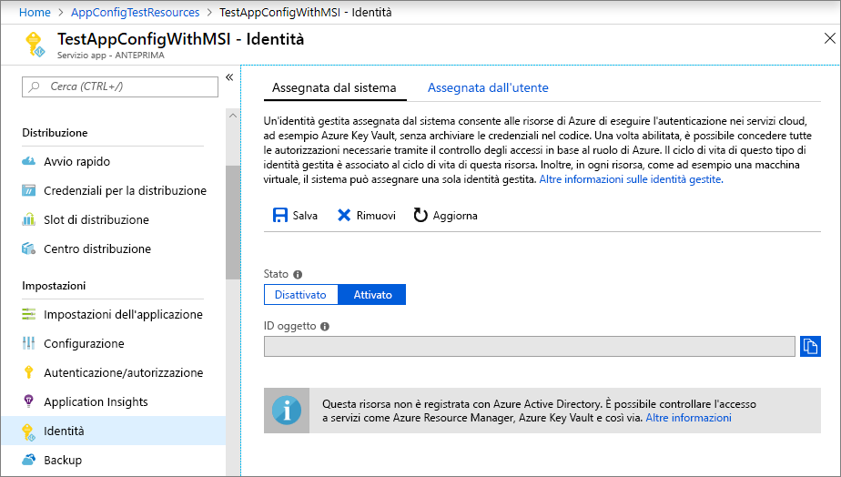
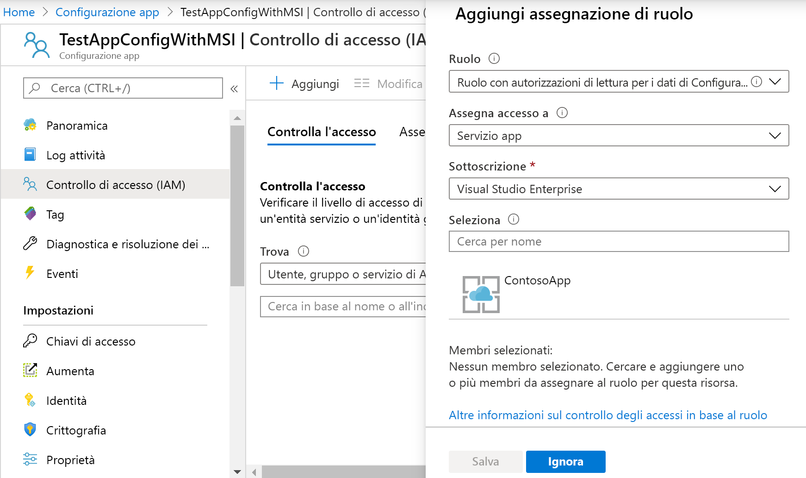

# <a name="tutorial-integrate-with-azure-managed-identities"></a>Esercitazione: Integrazione con identità gestite di Azure

Le [identità gestite](https://docs.microsoft.com/azure/active-directory/managed-identities-azure-resources/overview) di Azure Active Directory semplificano la gestione dei segreti dell'applicazione cloud. Con un'identità gestita, è possibile configurare il codice in modo da usare l'entità servizio creata per il servizio di calcolo di Azure in cui viene eseguita. È possibile usare un'identità gestita invece di usare credenziali distinte archiviate in Azure Key Vault o una stringa di connessione locale. 

Configurazione app di Azure e le relative librerie client .NET Core, .NET e Java Spring offrono il supporto dell'identità del servizio gestita incorporato. Benché il suo utilizzo non sia obbligatorio, l'identità del servizio gestita elimina la necessità di un token di accesso che contiene i segreti. Per potervi accedere, il codice deve semplicemente conoscere l'endpoint di servizio di un archivio di configurazione app. È possibile incorporare questo URL direttamente nel codice senza il rischio di esporre alcun segreto.

Questa esercitazione illustra come sfruttare MSI per accedere a Configurazione app. Si basa sull'app Web presentata nelle guide introduttive. Prima di continuare, completare le procedure descritte in [Creare un'app ASP.NET Core con Configurazione app](./quickstart-aspnet-core-app.md).

Per completare i passaggi riportati in questa esercitazione, è possibile usare qualsiasi editor di codice. [Visual Studio Code](https://code.visualstudio.com/) è un'ottima scelta per le piattaforme Windows, macOS e Linux.

In questa esercitazione si apprenderà come:

> [!div class="checklist"]
> * Concedere a un'identità gestita l'accesso a Configurazione app.
> * Configurare l'app in modo da usare un'identità gestita per connettersi a Configurazione app.

## <a name="prerequisites"></a>Prerequisiti

Per completare l'esercitazione, sono necessari:

* [.NET Core SDK](https://www.microsoft.com/net/download/windows).
* [Azure Cloud Shell configurato](https://docs.microsoft.com/azure/cloud-shell/quickstart).

[!INCLUDE [quickstarts-free-trial-note](../../includes/quickstarts-free-trial-note.md)]

## <a name="add-a-managed-identity"></a>Aggiungere un'identità gestita

Per configurare un'identità gestita nel portale, è prima necessario creare un'applicazione come di consueto e quindi abilitare la funzionalità.

1. Creare un'app nel [portale di Azure](https://aka.ms/azconfig/portal) come di consueto. Passare all'app nel portale.

2. Scorrere verso il basso fino al gruppo **Impostazioni** nel riquadro a sinistra e selezionare **Identità**.

3. Nella scheda **Assegnata dal sistema** impostare **Stato** su **Attivato** e selezionare **Salva**.

    

## <a name="grant-access-to-app-configuration"></a>Concedere l'accesso a Configurazione app

1. Nel [portale di Azure](https://aka.ms/azconfig/portal) selezionare **Tutte le risorse** e quindi selezionare l'archivio di configurazione app creato nella guida di avvio rapido.

2. Selezionare **Controllo di accesso (IAM)**.

3. Nella scheda **Verifica l'accesso** selezionare **Aggiungi** nell'interfaccia utente della scheda **Aggiungi un'assegnazione di ruolo**.

4. In **Ruolo** selezionare **Collaboratore**. In **Assegna accesso a** selezionare **Servizio app** in **Identità gestita assegnata dal sistema**.

5. In **Sottoscrizione** selezionare la sottoscrizione di Azure. Selezionare la risorsa Servizio app per la propria app.

6. Selezionare **Salva**.

    

## <a name="use-a-managed-identity"></a>Usare un'identità gestita

1. Aprire *appsettings.json* e aggiungere lo script seguente. Sostituire  *\<service_endpoint >*, incluse le parentesi, con l'URL per l'archivio di configurazione di app:

    ```json
    "AppConfig": {
        "Endpoint": "<service_endpoint>"
    }
    ```

2. Aprire *Program.cs* e aggiornare il metodo `CreateWebHostBuilder` sostituendo il metodo `config.AddAzureAppConfiguration()`.

    ```csharp
    public static IWebHostBuilder CreateWebHostBuilder(string[] args) =>
        WebHost.CreateDefaultBuilder(args)
            .ConfigureAppConfiguration((hostingContext, config) =>
            {
                var settings = config.Build();
                config.AddAzureAppConfiguration(options =>
                    options.ConnectWithManagedIdentity(settings["AppConfig:Endpoint"]));
            })
            .UseStartup<Startup>();
    ```

[!INCLUDE [Prepare repository](../../includes/app-service-deploy-prepare-repo.md)]

[!INCLUDE [cloud-shell-try-it](../../includes/cloud-shell-try-it.md)]

## <a name="deploy-from-local-git"></a>Eseguire la distribuzione dall'archivio Git locale

Il modo più semplice per abilitare la distribuzione dell'archivio Git locale per l'app con il server di compilazione Kudu è usare Azure Cloud Shell.

### <a name="configure-a-deployment-user"></a>Configurare un utente della distribuzione

[!INCLUDE [Configure a deployment user](../../includes/configure-deployment-user-no-h.md)]

### <a name="enable-local-git-with-kudu"></a>Abilitare l'archivio Git locale con Kudu

Per abilitare la distribuzione dell'archivio Git locale per l'app con il server di compilazione Kudu, eseguire [`az webapp deployment source config-local-git`](/cli/azure/webapp/deployment/source?view=azure-cli-latest#az-webapp-deployment-source-config-local-git) in Cloud Shell.

```azurecli-interactive
az webapp deployment source config-local-git --name <app_name> --resource-group <group_name>
```

Per creare un'app abilitata per Git, eseguire invece [`az webapp create`](/cli/azure/webapp?view=azure-cli-latest#az-webapp-create) in Cloud Shell con il parametro `--deployment-local-git`.

```azurecli-interactive
az webapp create --name <app_name> --resource-group <group_name> --plan <plan_name> --deployment-local-git
```

L'output del comando `az webapp create` sarà simile al seguente:

```json
Local git is configured with url of 'https://<username>@<app_name>.scm.azurewebsites.net/<app_name>.git'
{
  "availabilityState": "Normal",
  "clientAffinityEnabled": true,
  "clientCertEnabled": false,
  "cloningInfo": null,
  "containerSize": 0,
  "dailyMemoryTimeQuota": 0,
  "defaultHostName": "<app_name>.azurewebsites.net",
  "deploymentLocalGitUrl": "https://<username>@<app_name>.scm.azurewebsites.net/<app_name>.git",
  "enabled": true,
  < JSON data removed for brevity. >
}
```

### <a name="deploy-your-project"></a>Distribuire il progetto

Nella _finestra del terminale locale_ aggiungere un'istanza remota di Azure al repository Git locale. Sostituire _\<url>_ con l'URL del repository Git remoto ottenuto al passaggio [Abilitare la distribuzione Git per l'app](#enable-local-git-with-kudu).

```bash
git remote add azure <url>
```

Effettuare il push all'istanza remota di Azure per distribuire l'app con il comando seguente. Quando viene chiesta la password, immettere quella creata in [Configurare un utente della distribuzione](#configure-a-deployment-user). Non usare la stessa password usata per accedere al portale di Azure.

```bash
git push azure master
```

Nell'output potrebbe essere visualizzata l'automazione specifica di runtime, ad esempio MSBuild per ASP.NET, `npm install` per Node.js e `pip install` per Python.

### <a name="browse-to-the-azure-web-app"></a>Passare all'app Web di Azure

Passare all'app Web usando un browser per verificare che il contenuto sia stato distribuito.

```bash
http://<app_name>.azurewebsites.net
```


## <a name="use-managed-identity-in-other-languages"></a>Usare l'identità gestita in altri linguaggi

Anche i provider di Configurazione app per .NET Framework e Java Spring offrono supporto incorporato per l'identità gestita. In questi casi usare l'endpoint dell'URL dell'archivio di configurazione app invece della stringa di connessione completa durante la configurazione di un provider. Ad esempio, per l'app console di .NET Framework creata nella guida di avvio rapido occorre specificare le impostazioni seguenti nel file *App.config*:

```xml
    <configSections>
        <section name="configBuilders" type="System.Configuration.ConfigurationBuildersSection, System.Configuration, Version=4.0.0.0, Culture=neutral, PublicKeyToken=b03f5f7f11d50a3a" restartOnExternalChanges="false" requirePermission="false" />
    </configSections>

    <configBuilders>
        <builders>
            <add name="MyConfigStore" mode="Greedy" endpoint="${Endpoint}" type="Microsoft.Configuration.ConfigurationBuilders.AzureAppConfigurationBuilder, Microsoft.Configuration.ConfigurationBuilders.AzureAppConfiguration" />
            <add name="Environment" mode="Greedy" type="Microsoft.Configuration.ConfigurationBuilders.EnvironmentConfigBuilder, Microsoft.Configuration.ConfigurationBuilders.Environment" />
        </builders>
    </configBuilders>

    <appSettings configBuilders="Environment,MyConfigStore">
        <add key="AppName" value="Console App Demo" />
        <add key="Endpoint" value ="Set via an environment variable - for example, dev, test, staging, or production endpoint." />
    </appSettings>
```

## <a name="clean-up-resources"></a>Pulire le risorse

[!INCLUDE [azure-app-configuration-cleanup](../../includes/azure-app-configuration-cleanup.md)]

## <a name="next-steps"></a>Passaggi successivi

In questa esercitazione è stata aggiunta un'identità del servizio gestita di Azure per facilitare l'accesso a Configurazione app e migliorare la gestione delle credenziali dell'app. Per altre informazioni sull'uso di Configurazione app, passare agli esempi dell'interfaccia della riga di comando di Azure.

> [!div class="nextstepaction"]
> [Esempi dell'interfaccia della riga di comando](./cli-samples.md)
