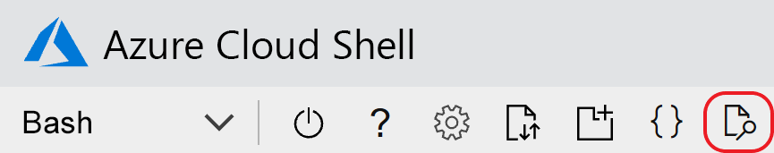

# <a name="quickstart-create-an-aspnet-core-app-with-azure-app-configuration"></a>Avvio rapido: Creare un'app ASP.NET Core con Configurazione app di Azure

In questa guida di avvio rapido si userà Configurazione app di Azure per centralizzare l'archiviazione e la gestione delle impostazioni di un'applicazione ASP.NET Core. ASP.NET Core crea un singolo oggetto configurazione basato su chiave-valore usando le impostazioni di una o più origini dati specificate da un'applicazione. Queste origini dati sono note come *provider di configurazione*. Dato che il client .NET Core di Configurazione app viene implementato come provider di configurazione, il servizio risulta come un'altra origine dati.

## <a name="prerequisites"></a>Prerequisites

- Sottoscrizione di Azure: [creare un account gratuito](https://azure.microsoft.com/free/)
- [ASP.NET Core SDK](https://dotnet.microsoft.com/download)

>[!TIP]
> Azure Cloud Shell è una shell interattiva gratuita che può essere usata per eseguire le istruzioni della riga di comando riportate in questo articolo.  Include strumenti comuni di Azure preinstallati, tra cui .NET Core SDK. Se è stato eseguito l'accesso alla sottoscrizione di Azure, avviare [Azure Cloud Shell](https://shell.azure.com) da shell.azure.com.  Per altre informazioni su Azure Cloud Shell, [leggere la documentazione](../cloud-shell/overview.md)

## <a name="create-an-app-configuration-store"></a>Creare un archivio di Configurazione app

[!INCLUDE [azure-app-configuration-create](../../includes/azure-app-configuration-create.md)]

6. Selezionare **Esplora configurazioni** > **Crea** per aggiungere le coppie chiave-valore seguenti:

    | Chiave | valore |
    |---|---|
    | TestApp:Settings:BackgroundColor | bianco |
    | TestApp:Settings:FontSize | 24 |
    | TestApp:Settings:FontColor | Nero |
    | TestApp:Settings:Message | Dati di Configurazione app di Azure |

    Lasciare vuoti i campi **Etichetta** e **Tipo di contenuto** per il momento.

## <a name="create-an-aspnet-core-web-app"></a>Creare un'app Web ASP.NET Core

Usare l'[interfaccia della riga di comando di .NET Core](https://docs.microsoft.com/dotnet/core/tools/) per creare un nuovo progetto di app Web MVC ASP.NET Core. [Azure Cloud Shell](https://shell.azure.com) offre questi strumenti,  disponibili anche nelle piattaforme Windows, macOS e Linux.

1. Creare una nuova cartella per il progetto. Per questa guida di avvio rapido assegnarle il nome *TestAppConfig*.

1. Nella nuova cartella eseguire il comando seguente per creare un nuovo progetto di app Web ASP.NET Core MVC:

```dotnetcli
dotnet new mvc --no-https
```

## <a name="add-secret-manager"></a>Aggiungere Secret Manager

Per usare Secret Manager, aggiungere un elemento `UserSecretsId` al file con estensione *csproj*.

Aprire il file con estensione *csproj*. Aggiungere un elemento `UserSecretsId` come illustrato di seguito. È possibile usare lo stesso GUID oppure sostituire questo valore con uno proprio. Salvare il file.

> [!IMPORTANT]
> `CreateHostBuilder` sostituisce `CreateWebHostBuilder` in .NET Core 3.0.  Selezionare la sintassi corretta in base all'ambiente.

#### <a name="net-core-2xtabcore2x"></a>[.NET Core 2.x](#tab/core2x)

```xml
<Project Sdk="Microsoft.NET.Sdk.Web">

    <PropertyGroup>
        <TargetFramework>netcoreapp2.1</TargetFramework>
        <UserSecretsId>79a3edd0-2092-40a2-a04d-dcb46d5ca9ed</UserSecretsId>
    </PropertyGroup>

    <ItemGroup>
        <PackageReference Include="Microsoft.AspNetCore.App" />
        <PackageReference Include="Microsoft.AspNetCore.Razor.Design" Version="2.1.2" PrivateAssets="All" />
    </ItemGroup>

</Project>
```

#### <a name="net-core-3xtabcore3x"></a>[.NET Core 3.x](#tab/core3x)

```xml
<Project Sdk="Microsoft.NET.Sdk.Web">
    
    <PropertyGroup>
        <TargetFramework>netcoreapp3.1</TargetFramework>
        <UserSecretsId>79a3edd0-2092-40a2-a04d-dcb46d5ca9ed</UserSecretsId>
    </PropertyGroup>

</Project>
```
---

Lo strumento Secret Manager archivia i dati sensibili per operazioni di sviluppo al di fuori dell'albero del progetto. Questo approccio contribuisce a impedire la condivisione accidentale dei segreti dell'app all'interno del codice sorgente. Per altre informazioni su Secret Manager, vedere [Archiviazione sicura dei segreti delle app in fase di sviluppo in ASP.NET Core](https://docs.microsoft.com/aspnet/core/security/app-secrets).

## <a name="connect-to-an-app-configuration-store"></a>Connettersi a un archivio di Configurazione app

1. Aggiungere un riferimento al pacchetto NuGet `Microsoft.Azure.AppConfiguration.AspNetCore` eseguendo il comando seguente:

    ```dotnetcli
    dotnet add package Microsoft.Azure.AppConfiguration.AspNetCore --version 3.0.0-preview-011100002-1192
    ```

1. Eseguire il comando seguente per ripristinare i pacchetti per il progetto:

    ```dotnetcli
    dotnet restore
    ```

1. Aggiungere un segreto denominato *ConnectionStrings:AppConfig* a Secret Manager.

    Questo segreto contiene la stringa di connessione per accedere all'archivio di Configurazione app. Sostituire il valore nel comando seguente con la stringa di connessione per l'archivio di Configurazione app.

    Questo comando deve essere eseguito nella stessa directory del file con estensione *csproj*.

    ```dotnetcli
    dotnet user-secrets set ConnectionStrings:AppConfig <your_connection_string>
    ```

    > [!IMPORTANT]
    > Alcune shell troncheranno la stringa di connessione se non è racchiusa tra virgolette. Verificare che l'output del comando `dotnet user-secrets` mostri l'intera stringa di connessione. In caso contrario, eseguire di nuovo il comando racchiudendo la stringa di connessione tra virgolette.

    Secret Manager viene usato solo per testare l'app Web in locale. Quando l'app viene distribuita in [Servizio app di Azure](https://azure.microsoft.com/services/app-service/web), ad esempio, per archiviare la stringa di connessione si usa l'impostazione **Stringhe di connessione** dell'applicazione nel servizio app, invece di Secret Manager.

    Accedere al segreto usando l'API di configurazione. Con l'API di configurazione è possibile usare i due punti (:) nel nome di configurazione in tutte le piattaforme supportate. Vedere la [configurazione in base all'ambiente](https://docs.microsoft.com/aspnet/core/fundamentals/configuration/index?tabs=basicconfiguration&view=aspnetcore-2.0).

1. Aprire *Program.cs* e aggiungere un riferimento al provider di Configurazione app .NET Core.

    ```csharp
    using Microsoft.Extensions.Configuration.AzureAppConfiguration;
    ```

1. Aggiornare il metodo `CreateWebHostBuilder` per usare Configurazione app effettuando una chiamata al metodo `config.AddAzureAppConfiguration()`.

    > [!IMPORTANT]
    > `CreateHostBuilder` sostituisce `CreateWebHostBuilder` in .NET Core 3.0.  Selezionare la sintassi corretta in base all'ambiente.

    #### <a name="net-core-2xtabcore2x"></a>[.NET Core 2.x](#tab/core2x)

    ```csharp
    public static IWebHostBuilder CreateWebHostBuilder(string[] args) =>
        WebHost.CreateDefaultBuilder(args)
            .ConfigureAppConfiguration((hostingContext, config) =>
            {
                var settings = config.Build();
                config.AddAzureAppConfiguration(settings["ConnectionStrings:AppConfig"]);
            })
            .UseStartup<Startup>();
    ```

    #### <a name="net-core-3xtabcore3x"></a>[.NET Core 3.x](#tab/core3x)

    ```csharp
    public static IHostBuilder CreateHostBuilder(string[] args) =>
        Host.CreateDefaultBuilder(args)
        .ConfigureWebHostDefaults(webBuilder =>
        webBuilder.ConfigureAppConfiguration((hostingContext, config) =>
        {
            var settings = config.Build();
            config.AddAzureAppConfiguration(settings["ConnectionStrings:AppConfig"]);
        })
        .UseStartup<Startup>());
    ```

    ---

1. Passare a *<app root>/Views/Home* e aprire *Index.cshtml*. Sostituire il contenuto con il codice seguente:

    ```HTML
    @using Microsoft.Extensions.Configuration
    @inject IConfiguration Configuration

    <style>
        body {
            background-color: @Configuration["TestApp:Settings:BackgroundColor"]
        }
        h1 {
            color: @Configuration["TestApp:Settings:FontColor"];
            font-size: @Configuration["TestApp:Settings:FontSize"];
        }
    </style>

    <h1>@Configuration["TestApp:Settings:Message"]</h1>
    ```

1. Passare a *<app root>/Views/Shared* e aprire *_Layout.cshtml*. Sostituire il contenuto con il codice seguente:

    ```HTML
    <!DOCTYPE html>
    <html>
    <head>
        <meta charset="utf-8" />
        <meta name="viewport" content="width=device-width, initial-scale=1.0" />
        <title>@ViewData["Title"] - hello_world</title>

        <link rel="stylesheet" href="~/lib/bootstrap/dist/css/bootstrap.css" />
        <link rel="stylesheet" href="~/css/site.css" />
    </head>
    <body>
        <div class="container body-content">
            @RenderBody()
        </div>

        <script src="~/lib/jquery/dist/jquery.js"></script>
        <script src="~/lib/bootstrap/dist/js/bootstrap.js"></script>
        <script src="~/js/site.js" asp-append-version="true"></script>

        @RenderSection("Scripts", required: false)
    </body>
    </html>
    ```

## <a name="build-and-run-the-app-locally"></a>Compilare ed eseguire l'app in locale

1. Per compilare l'app usando l'interfaccia della riga di comando di .NET Core, passare alla directory radice dell'applicazione ed eseguire questo comando nella shell dei comandi:

    ```dotnetcli
    dotnet build
    ```

1. Al termine della compilazione, eseguire questo comando per eseguire l'app Web in locale:

    ```dotnetcli
    dotnet run
    ```

1. Se si sta lavorando sul computer locale, usare un browser per passare a `http://localhost:5000`, che è l'URL predefinito per l'app Web ospitata in locale.  

Se si sta lavorando in Azure Cloud Shell, selezionare il pulsante *Anteprima Web* e quindi *Configura*.  



Quando viene richiesto di configurare la porta per l'anteprima, immettere "5000" e selezionare *Apri ed esplora*.  Nella pagina verrà visualizzato il messaggio "Dati di Configurazione app di Azure".

## <a name="clean-up-resources"></a>Pulire le risorse

[!INCLUDE [azure-app-configuration-cleanup](../../includes/azure-app-configuration-cleanup.md)]

## <a name="next-steps"></a>Passaggi successivi

In questo argomento di avvio rapido è stato creato un nuovo archivio di Configurazione app, che è stato usato con un'app Web ASP.NET Core con il [provider di Configurazione app](https://go.microsoft.com/fwlink/?linkid=2074664). Per informazioni su come configurare l'app ASP.NET Core per aggiornare in modo dinamico le impostazioni di configurazione, continuare con l'esercitazione successiva.

> [!div class="nextstepaction"]
> [Abilitare la configurazione dinamica](./enable-dynamic-configuration-aspnet-core.md)
