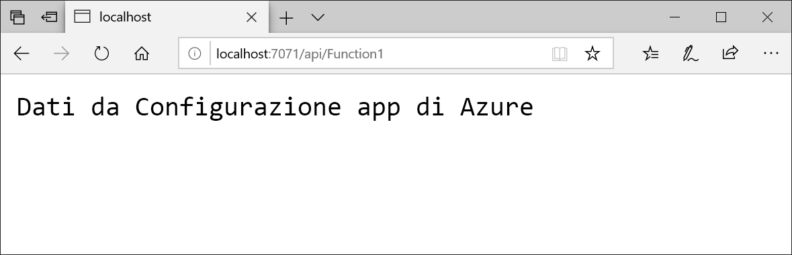

# <a name="quickstart-create-an-azure-function-with-app-configuration"></a>Guida introduttiva: Creare una funzione di Azure con Configurazione app

Configurazione app di Azure è un servizio di configurazione gestito di Azure. Consente di archiviare e gestire con facilità tutte le impostazioni delle applicazioni in un'unica risorsa separata dal codice. Questa guida introduttiva mostra come incorporare il servizio in una funzione di Azure. 

Per completare i passaggi descritti in questa guida di avvio rapido è possibile usare qualsiasi editor di codice. Tuttavia, [Visual Studio Code](https://code.visualstudio.com/) è un'ottima scelta per le piattaforme Windows, macOS e Linux.



## <a name="prerequisites"></a>Prerequisiti

Per completare questa guida introduttiva, installare [Visual Studio 2017](https://visualstudio.microsoft.com/vs) (e assicurarsi che sia installato anche il carico di lavoro **Sviluppo di Azure**) e le [versioni più recenti degli strumenti di Funzioni di Azure](../azure-functions/functions-develop-vs.md#check-your-tools-version).

[!INCLUDE [quickstarts-free-trial-note](../../includes/quickstarts-free-trial-note.md)]

## <a name="create-an-app-configuration-store"></a>Creare un archivio di configurazione app

[!INCLUDE [azure-app-configuration-create](../../includes/azure-app-configuration-create.md)]

## <a name="create-a-function-app"></a>Creare un'app per le funzioni

[!INCLUDE [Create a project using the Azure Functions template](../../includes/functions-vstools-create.md)]

## <a name="connect-to-app-configuration-store"></a>Connettersi all'archivio di configurazione app

1. Aprire *Function1.cs* e aggiungere un riferimento al provider di configurazione .NET Core per Configurazione app.

    ```csharp
    using Microsoft.Extensions.Configuration.AzureAppConfiguration;
    ```

2. Aggiornare il metodo `Run` per usare Configurazione app effettuando una chiamata a `builder.AddAzureAppConfiguration()`.

    ```csharp
    public static async Task<IActionResult> Run(
        [HttpTrigger(AuthorizationLevel.Anonymous, "get", "post", Route = null)] HttpRequest req, ILogger log)
    {
        log.LogInformation("C# HTTP trigger function processed a request.");

        var builder = new ConfigurationBuilder();
        builder.AddAzureAppConfiguration(Environment.GetEnvironmentVariable("ConnectionString"));
        var config = builder.Build();
        string message = config["TestApp:Settings:Message"];
        message = message ?? req.Query["message"];

        string requestBody = await new StreamReader(req.Body).ReadToEndAsync();
        dynamic data = JsonConvert.DeserializeObject(requestBody);
        message = message ?? data?.message;

        return message != null
            ? (ActionResult) new OkObjectResult(message)
            : new BadRequestObjectResult("Please pass a message from a configuration store, on the query string or in the request body");
    }
    ```

## <a name="test-the-function-locally"></a>Testare la funzione in locale

1. Impostare una variabile di ambiente denominata **ConnectionString** sulla chiave di accesso all'archivio di configurazione app. Se si usa il prompt dei comandi di Windows, eseguire il comando seguente e riavviare il prompt per rendere effettiva la modifica:

        setx ConnectionString "connection-string-of-your-app-configuration-store"

    Se si usa Windows PowerShell, eseguire il comando seguente:

        $Env:ConnectionString = "connection-string-of-your-app-configuration-store"

    Se si usa macOS o Linux, eseguire il comando seguente:

        export ConnectionString='connection-string-of-your-app-configuration-store'

2. Per testare la funzione premere **F5**. Se viene visualizzata, accettare la richiesta di Visual Studio di scaricare e installare gli strumenti dell'**interfaccia della riga di comando Azure Functions Core Tools**. Potrebbe essere necessario anche abilitare un'eccezione del firewall per consentire agli strumenti di gestire le richieste HTTP.

3. Copiare l'URL della funzione dall'output di runtime di Funzioni di Azure.

    

4. Incollare l'URL per la richiesta HTTP nella barra degli indirizzi del browser. Di seguito è illustrata la risposta nel browser alla richiesta GET locale restituita dalla funzione:

    

## <a name="clean-up-resources"></a>Pulire le risorse

[!INCLUDE [azure-app-configuration-cleanup](../../includes/azure-app-configuration-cleanup.md)]

## <a name="next-steps"></a>Passaggi successivi

In questa guida introduttiva è stato creato un nuovo archivio di configurazione app, che è stato usato con una funzione di Azure. Per altre informazioni sull'uso di Configurazione app, continuare con l'esercitazione successiva sull'autenticazione.

> [!div class="nextstepaction"]
> [Identità gestite per l'integrazione di risorse di Azure](./integrate-azure-managed-service-identity.md)
