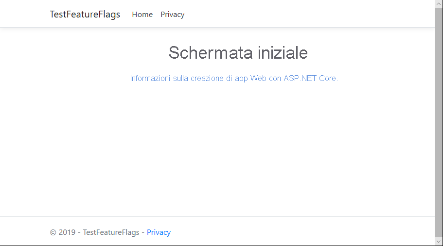
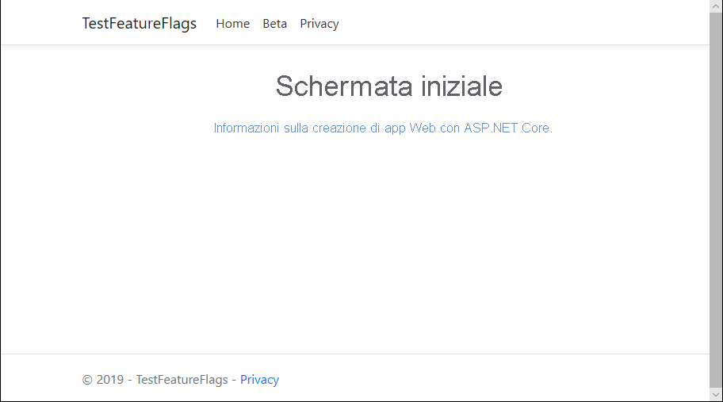

# <a name="quickstart-add-feature-flags-to-an-aspnet-core-app"></a>Guida introduttiva: Aggiungere i flag di funzionalità a un'app ASP.NET Core

La gestione delle funzionalità in ASP.NET Core può essere abilitata connettendo l'applicazione a Configurazione app di Azure. È possibile usare questo servizio gestito per archiviare tutti i flag di funzionalità e controllarne centralmente gli stati. Questo argomento di avvio rapido illustra come incorporare il servizio in un'app Web ASP.NET Core per creare un'implementazione end-to-end della gestione delle funzionalità.

Le librerie di Gestione funzionalità di .NET Core estendono il framework con il supporto completo per i flag di funzionalità. Si basano sul sistema di configurazione di .NET Core. Si integrano facilmente con Configurazione app tramite il provider di configurazione di .NET Core.

Per completare i passaggi riportati in questa guida di avvio rapido, è possibile usare qualsiasi editor di codice. [Visual Studio Code](https://code.visualstudio.com/) è un'ottima scelta per le piattaforme Windows, macOS e Linux.

## <a name="prerequisites"></a>Prerequisiti

Per completare questa guida di avvio rapido, installare [.NET Core SDK](https://dotnet.microsoft.com/download).

[!INCLUDE [quickstarts-free-trial-note](../../includes/quickstarts-free-trial-note.md)]

## <a name="create-an-app-configuration-store"></a>Creare un archivio di configurazione app

[!INCLUDE [azure-app-configuration-create](../../includes/azure-app-configuration-create.md)]

6. Selezionare **Gestione funzionalità** > **+ Crea** per aggiungere i flag di funzionalità seguenti:

    | Chiave | Stato |
    |---|---|
    | Beta | Off |

## <a name="create-an-aspnet-core-web-app"></a>Creare un'app Web ASP.NET Core

È possibile usare l'[interfaccia della riga di comando di .NET Core](https://docs.microsoft.com/dotnet/core/tools/) per creare un nuovo progetto di app Web MVC ASP.NET Core. Il vantaggio di usare l'interfaccia della riga di comando di .NET Core rispetto a Visual Studio è che è disponibile nelle piattaforme Windows, macOS e Linux.

1. Creare una nuova cartella per il progetto. Per questo argomento di avvio rapido assegnarle il nome *TestFeatureFlags*.

2. Nella nuova cartella eseguire il comando seguente per creare un nuovo progetto di app Web ASP.NET Core MVC:

        dotnet new mvc

## <a name="add-secret-manager"></a>Aggiungere Secret Manager

Aggiungere lo [strumento Secret Manager](https://docs.microsoft.com/aspnet/core/security/app-secrets) al progetto. Lo strumento Secret Manager archivia i dati sensibili per operazioni di sviluppo al di fuori dell'albero del progetto. Questo approccio contribuisce a impedire la condivisione accidentale dei segreti dell'app all'interno del codice sorgente.

- Aprire il file con estensione *csproj*. Aggiungere un elemento `UserSecretsId` come illustrato di seguito e sostituire il relativo valore con il proprio, che in genere è un GUID. Salvare il file.

    ```xml
    <Project Sdk="Microsoft.NET.Sdk.Web">

    <PropertyGroup>
        <TargetFramework>netcoreapp2.1</TargetFramework>
        <UserSecretsId>79a3edd0-2092-40a2-a04d-dcb46d5ca9ed</UserSecretsId>
    </PropertyGroup>

    <ItemGroup>
        <PackageReference Include="Microsoft.AspNetCore.App" />
        <PackageReference Include="Microsoft.AspNetCore.Razor.Design" Version="2.1.2" PrivateAssets="All" />
    </ItemGroup>

    </Project>
    ```

## <a name="connect-to-an-app-configuration-store"></a>Connettersi a un archivio di configurazione app

1. Aggiungere i riferimenti ai pacchetti NuGet `Microsoft.Extensions.Configuration.AzureAppConfiguration` e `Microsoft.FeatureManagement` eseguendo i comandi seguenti:

        dotnet add package Microsoft.Extensions.Configuration.AzureAppConfiguration --version 1.0.0-preview-008520001

        dotnet add package Microsoft.FeatureManagement.AspNetCore --version 1.0.0-preview-008560001-910

2. Eseguire il comando seguente per ripristinare i pacchetti per il progetto:

        dotnet restore

3. Aggiungere un segreto denominato *ConnectionStrings:AppConfig* a Secret Manager.

    Questo segreto contiene la stringa di connessione per accedere all'archivio di configurazione app. Sostituire il valore nel comando seguente con la stringa di connessione per l'archivio di configurazione app.

    Questo comando deve essere eseguito nella stessa directory del file con estensione *csproj*.

        dotnet user-secrets set ConnectionStrings:AppConfig <your_connection_string>

    Secret Manager viene usato solo per testare l'app Web in locale. Quando l'app viene distribuita in [Servizio app di Azure](https://azure.microsoft.com/services/app-service/web), ad esempio, viene usata un'impostazione applicazione **Stringhe di connessione** nel servizio app, invece di Secret Manager per archiviare la stringa di connessione.

    È possibile accedere al segreto con l'API di configurazione. Con l'API di configurazione è possibile usare i due punti (:) nel nome di configurazione in tutte le piattaforme supportate. Vedere la [configurazione in base all'ambiente](https://docs.microsoft.com/aspnet/core/fundamentals/configuration/index?tabs=basicconfiguration&view=aspnetcore-2.0).

4. Aprire *Program.cs* e aggiungere un riferimento al provider di Configurazione app .NET Core.

    ```csharp
    using Microsoft.Extensions.Configuration.AzureAppConfiguration;
    ```

5. Aggiornare il metodo `CreateWebHostBuilder` per usare Configurazione app effettuando una chiamata al metodo `config.AddAzureAppConfiguration()`.

    ```csharp
    public static IWebHostBuilder CreateWebHostBuilder(string[] args) =>
        WebHost.CreateDefaultBuilder(args)
            .ConfigureAppConfiguration((hostingContext, config) =>
            {
                var settings = config.Build();
                config.AddAzureAppConfiguration(options => {
                    options.Connect(settings["ConnectionStrings:AppConfig"])
                           .UseFeatureFlags();
                });
            })
            .UseStartup<Startup>();
    ```

6. Aprire *Startup.cs* e aggiungere i riferimenti alla gestione funzionalità di .NET Core.

    ```csharp
    using Microsoft.FeatureManagement.AspNetCore;
    ```

7. Aggiornare il metodo `ConfigureServices` per aggiungere il supporto dei flag di funzionalità chiamando il metodo `services.AddFeatureManagement()` e includere facoltativamente eventuali filtri da usare con i flag di funzionalità chiamando `services.AddFeatureFilter<FilterType>()`:

    ```csharp
    public void ConfigureServices(IServiceCollection services)
    {
        services.AddFeatureManagement();
    }
    ```

8. Aggiungere un file *MyFeatureFlags.cs*.

    ```csharp
    namespace TestFeatureFlags
    {
        public enum MyFeatureFlags
        {
            Beta
        }
    }
    ```

9. Aggiungere *BetaController.cs* alla directory Controllers:

    ```csharp
    using Microsoft.AspNetCore.Mvc;
    using Microsoft.FeatureManagement.AspNetCore;

    namespace TestFeatureFlags.Controllers
    {
        public class BetaController: Controller
        {
            private readonly IFeatureManager _featureManager;

            public BetaController(IFeatureManagerSnapshot featureManager)
            {
                _featureManager = featureManager;
            }

            [Feature(MyFeatureFlags.Beta)]
            public IActionResult Index()
            {
                return View();
            }
        }
    }
    ```

10. Aprire *_ViewImports.cshtml* nella directory Views e aggiungere l'helper per i tag di gestione funzionalità:

    ```html
    @addTagHelper *, Microsoft.FeatureManagement.AspNetCore
    ```

11. Aprire il file *_Layout.cshtml* nella directory Views > Shared e sostituire il contenuto nella barra `<nav>` sotto `<body>` > `<header>` con il codice seguente:

    ```html
    <nav class="navbar navbar-expand-sm navbar-toggleable-sm navbar-light bg-white border-bottom box-shadow mb-3">
        <div class="container">
            <a class="navbar-brand" asp-area="" asp-controller="Home" asp-action="Index">TestFeatureFlags</a>
            <button class="navbar-toggler" type="button" data-toggle="collapse" data-target=".navbar-collapse" aria-controls="navbarSupportedContent"
            aria-expanded="false" aria-label="Toggle navigation">
            <span class="navbar-toggler-icon"></span>
            </button>
            <div class="navbar-collapse collapse d-sm-inline-flex flex-sm-row-reverse">
                <ul class="navbar-nav flex-grow-1">
                    <li class="nav-item">
                        <a class="nav-link text-dark" asp-area="" asp-controller="Home" asp-action="Index">Home</a>
                    </li>
                    <feature name="Beta">
                    <li class="nav-item">
                        <a class="nav-link text-dark" asp-area="" asp-controller="Beta" asp-action="Index">Beta</a>
                    </li>
                    </feature>
                    <li class="nav-item">
                        <a class="nav-link text-dark" asp-area="" asp-controller="Home" asp-action="Privacy">Privacy</a>
                    </li>
                </ul>
            </div>
        </div>
    </nav>
    ```

12. Creare una directory Beta sotto Views e aggiungervi *Index.cshtml*:

    ```html
    @{
        ViewData["Title"] = "Beta Home Page";
    }

    <h1>
        This is the beta website.
    </h1>
    ```

## <a name="build-and-run-the-app-locally"></a>Compilare ed eseguire l'app in locale

1. Per compilare l'app usando l'interfaccia della riga di comando di .NET Core, eseguire questo comando nella shell dei comandi:

        dotnet build

2. Al termine della compilazione, eseguire questo comando per eseguire l'app Web in locale:

        dotnet run

3. Aprire una finestra del browser e passare a `https://localhost:5001`, che è l'URL predefinito per l'app Web ospitata in locale.

    

4. Accedere al [portale di Azure](https://aka.ms/azconfig/portal). Selezionare **Tutte le risorse** e quindi l'istanza di archivio di configurazione app creata nella guida di avvio rapido.

5. Selezionare **Gestione funzionalità** e impostare il valore di *Beta* su *Sì*:

    | Chiave | Stato |
    |---|---|
    | Beta | Attivato |

6. Aggiornare la pagina del browser per visualizzare le nuove impostazioni di configurazione.

    

## <a name="clean-up-resources"></a>Pulire le risorse

[!INCLUDE [azure-app-configuration-cleanup](../../includes/azure-app-configuration-cleanup.md)]

## <a name="next-steps"></a>Passaggi successivi

In questo argomento di avvio rapido è stato creato un nuovo archivio di configurazione app, che è stato usato per gestire le funzionalità in un'app Web ASP.NET Core con le [librerie di gestione delle funzionalità](https://go.microsoft.com/fwlink/?linkid=2074664).

* Altre informazioni sulla [gestione delle funzionalità](./concept-feature-management.md)
* [Gestire i flag di funzionalità](./manage-feature-flags.md)
* [Usare i flag di funzionalità in un'app ASP.NET Core](./use-feature-flags-dotnet-core.md)
