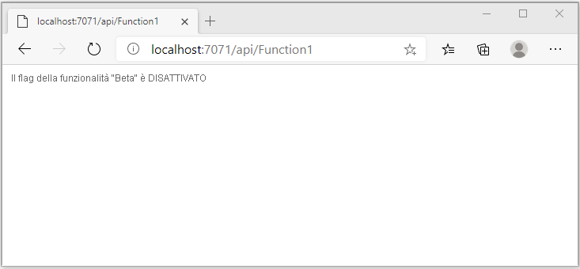
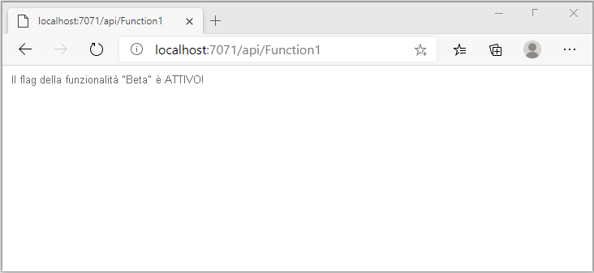

# <a name="quickstart-add-feature-flags-to-an-azure-functions-app"></a>Avvio rapido: Aggiungere flag di funzionalità a un'app di Funzioni di Azure

Questo argomento di avvio rapido illustra come creare un'implementazione di Gestione funzionalità in un'app di Funzioni di Azure tramite Configurazione app di Azure. Verrà usato il servizio Configurazione app per archiviare tutti i flag funzionalità in una posizione centralizzata e controllarne gli stati. 

Le librerie di Gestione funzionalità di .NET estendono il framework con il supporto per i flag di funzionalità. Queste librerie si basano sul sistema di configurazione di .NET. Si integrano con Configurazione app tramite il provider di configurazione di .NET.

## <a name="prerequisites"></a>Prerequisiti

- Sottoscrizione di Azure: [creare un account gratuito](https://azure.microsoft.com/free/)
- [Visual Studio 2019](https://visualstudio.microsoft.com/vs) con il carico di lavoro **Sviluppo di Azure**.
- [Strumenti di Funzioni di Azure](../azure-functions/functions-develop-vs.md#check-your-tools-version)

## <a name="create-an-app-configuration-store"></a>Creare un archivio di Configurazione app

[!INCLUDE [azure-app-configuration-create](../../includes/azure-app-configuration-create.md)]

7. Selezionare **Gestione funzionalità** >  **+Aggiungi** per aggiungere un flag funzionalità denominato `Beta`.

    > [!div class="mx-imgBorder"]
    > 

    Per il momento lasciare `label` e `Description` non definiti.

8. Selezionare **Applica** per salvare il nuovo flag di funzionalità.

## <a name="create-a-functions-app"></a>Creare un'app Funzioni

[!INCLUDE [Create a project using the Azure Functions template](../../includes/functions-vstools-create.md)]

## <a name="connect-to-an-app-configuration-store"></a>Connettersi a un archivio di Configurazione app

1. Fare clic con il pulsante destro del mouse sul progetto e scegliere **Gestisci pacchetti NuGet**. Nella scheda **Sfoglia** cercare e aggiungere i pacchetti NuGet seguenti al progetto. Per `Microsoft.Extensions.DependencyInjection` verificare di usare la compilazione stabile più recente. 

    ```
    Microsoft.Extensions.DependencyInjection
    Microsoft.Extensions.Configuration
    Microsoft.FeatureManagement
    ```


1. Aprire *Function1.cs* e aggiungere gli spazi dei nomi di questi pacchetti.

    ```csharp
    using Microsoft.Extensions.Configuration;
    using Microsoft.FeatureManagement;
    using Microsoft.Extensions.DependencyInjection;
    ```

1. Aggiungere il costruttore statico `Function1` seguente per eseguire il bootstrap del provider di Configurazione app di Azure. Aggiungere quindi due membri `static`, un campo denominato `ServiceProvider` per creare un'istanza singleton di `ServiceProvider` e una proprietà in `Function1` denominata `FeatureManager` per creare un'istanza singleton di `IFeatureManager`. Connettersi quindi a Configurazione app in `Function1` chiamando `AddAzureAppConfiguration()`. Questo processo carica la configurazione all'avvio dell'applicazione. La stessa istanza di configurazione verrà usata per tutte le chiamate di Funzioni eseguite successivamente. 

    ```csharp
        // Implements IDisposable, cached for life time of function
        private static ServiceProvider ServiceProvider; 

        static Function1()
        {
            IConfigurationRoot configuration = new ConfigurationBuilder()
                .AddAzureAppConfiguration(options =>
                {
                    options.Connect(Environment.GetEnvironmentVariable("ConnectionString"))
                           .UseFeatureFlags();
                }).Build();

            var services = new ServiceCollection();                                                                             
            services.AddSingleton<IConfiguration>(configuration).AddFeatureManagement();

            ServiceProvider = services.BuildServiceProvider(); 
        }

        private static IFeatureManager FeatureManager => ServiceProvider.GetRequiredService<IFeatureManager>();
    ```

1. Aggiornare il metodo `Run` in modo da modificare il valore del messaggio visualizzato a seconda dello stato del flag della funzionalità.

    ```csharp
        [FunctionName("Function1")]
        public static async Task<IActionResult> Run(
                [HttpTrigger(AuthorizationLevel.Anonymous, "get", "post", Route = null)] HttpRequest req,
                ILogger log)
            {
                string message = await FeatureManager.IsEnabledAsync("Beta")
                     ? "The Feature Flag 'Beta' is turned ON"
                     : "The Feature Flag 'Beta' is turned OFF";
                
                return (ActionResult)new OkObjectResult(message); 
            }
    ```

## <a name="test-the-function-locally"></a>Testare la funzione in locale

1. Impostare una variabile di ambiente denominata **ConnectionString**, il cui valore è la chiave di accesso recuperata in precedenza nell'archivio di Configurazione app in **Chiavi di accesso**. Se si usa il prompt dei comandi di Windows, eseguire il comando seguente e riavviare il prompt per rendere effettiva la modifica:

    ```cmd
        setx ConnectionString "connection-string-of-your-app-configuration-store"
    ```

    Se si usa Windows PowerShell, eseguire il comando seguente:

    ```azurepowershell
        $Env:ConnectionString = "connection-string-of-your-app-configuration-store"
    ```

    Se si usa macOS o Linux, eseguire il comando seguente:

    ```bash
        export ConnectionString='connection-string-of-your-app-configuration-store'
    ```

1. Premere F5 per testare la funzione. Se viene visualizzata, accettare la richiesta di Visual Studio di scaricare e installare gli strumenti dell'**interfaccia della riga di comando Azure Functions Core Tools**. Potrebbe essere necessario anche abilitare un'eccezione del firewall per consentire agli strumenti di gestire le richieste HTTP.

1. Copiare l'URL della funzione dall'output di runtime di Funzioni di Azure.

    

1. Incollare l'URL per la richiesta HTTP nella barra degli indirizzi del browser. L'immagine seguente mostra la risposta che indica che il flag di funzionalità `Beta` è disabilitato. 

    

1. Accedere al [portale di Azure](https://portal.azure.com). Selezionare **Tutte le risorse** e quindi l'istanza di archivio di Configurazione app creata.

1. Selezionare **Gestione funzionalità** e modificare lo stato della chiave **Beta** impostandolo su **Sì**.

1. Tornare al prompt dei comandi e annullare il processo in esecuzione premendo `Ctrl-C`.  Riavviare l'applicazione premendo F5. 

1. Copiare l'URL della funzione dall'output di runtime di Funzioni di Azure usando la stessa procedura del passaggio 3. Incollare l'URL per la richiesta HTTP nella barra degli indirizzi del browser. La risposta del browser dovrebbe essere cambiata, a indicare che il flag di funzionalità `Beta` è attivato, come illustrato nell'immagine seguente.
 
    

## <a name="clean-up-resources"></a>Pulire le risorse

[!INCLUDE [azure-app-configuration-cleanup](../../includes/azure-app-configuration-cleanup.md)]

## <a name="next-steps"></a>Passaggi successivi

In questo argomento di avvio rapido è stato creato un flag di funzionalità che è stato usato con un'app di Funzioni di Azure tramite il [provider di Configurazione app](/dotnet/api/Microsoft.Extensions.Configuration.AzureAppConfiguration).

- Altre informazioni sulla [gestione delle funzionalità](./concept-feature-management.md).
- [Gestire i flag di funzionalità](./manage-feature-flags.md).
- [Usare la configurazione dinamica in un'app di Funzioni di Azure](./enable-dynamic-configuration-azure-functions-csharp.md)