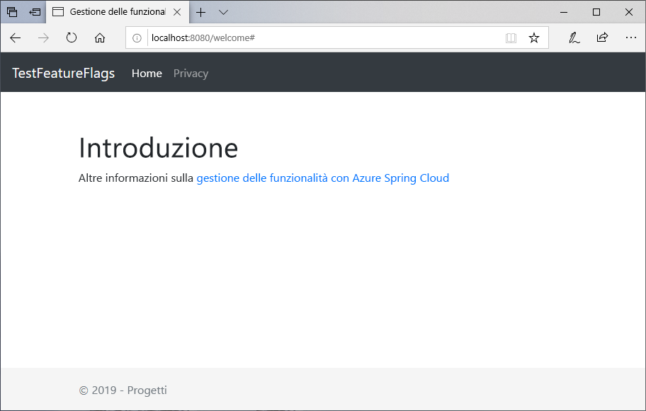
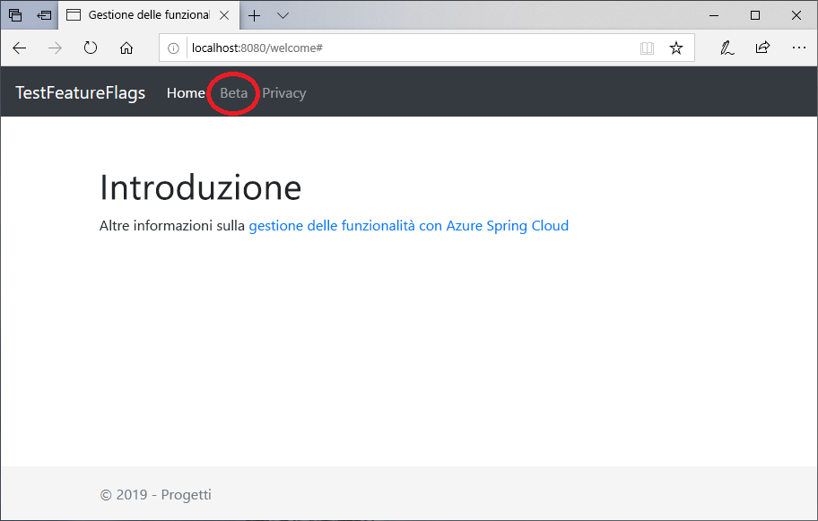

# <a name="quickstart-add-feature-flags-to-a-spring-boot-app"></a>Guida introduttiva: Aggiungere flag di funzionalità a un'app Spring Boot

In questa guida di avvio rapido si incorpora Configurazione app di Azure in un'app Web Spring Boot per creare un'implementazione end-to-end di Gestione funzionalità. È possibile usare il servizio Configurazione app per archiviare tutti i flag di funzionalità in una posizione centralizzata e controllarne gli stati.

Le librerie di Gestione funzionalità di Spring Boot estendono il framework con il supporto completo per i flag di funzionalità. Queste librerie **non** includono dipendenze da alcuna libreria di Azure. Si integrano facilmente con Configurazione app tramite il provider di configurazione di Spring Boot.

## <a name="prerequisites"></a>Prerequisiti

- Sottoscrizione di Azure: [creare un account gratuito](https://azure.microsoft.com/free/)
- [Java Development Kit (JDK)](https://docs.microsoft.com/java/azure/jdk) versione 8 supportato.
- [Apache Maven](https://maven.apache.org/download.cgi) versione 3.0 o successive.

## <a name="create-an-app-configuration-store"></a>Creare un archivio di Configurazione app

[!INCLUDE [azure-app-configuration-create](../../includes/azure-app-configuration-create.md)]

6. Selezionare **Gestione funzionalità** >  **+Crea** per aggiungere i flag di funzionalità seguenti:

    | Chiave | Stato |
    |---|---|
    | Beta | Off |

## <a name="create-a-spring-boot-app"></a>Compilare l'app Spring Boot

Per creare un nuovo progetto Spring Boot, usare [Spring Initializr](https://start.spring.io/).

1. Passare a <https://start.spring.io/>.

2. Specificare le opzioni seguenti:

   - Generare un progetto **Maven** con **Java**.
   - Specificare **Spring Boot** versione 2.0 o successiva.
   - Specificare i nomi di **Group** (Gruppo) e **Artifact** (Artefatto) per l'applicazione.
   - Aggiungere la dipendenza **Web**.

3. Dopo aver specificato le opzioni precedenti, selezionare **Genera progetto**. Quando richiesto, scaricare il progetto in un percorso nel computer locale.

## <a name="add-feature-management"></a>Aggiungere Gestione funzionalità

1. Dopo l'estrazione dei file nel sistema locale, la semplice applicazione Spring Boot è pronta per la modifica. Individuare il file *pom.xml* nella directory radice dell'app.

2. Aprire il file *pom.xml* in un editor di testo e quindi aggiungere l'utilità di avvio Spring Cloud per la configurazione di Azure e Gestione funzionalità all'elenco di `<dependencies>`:

    ```xml
    <dependency>
        <groupId>com.microsoft.azure</groupId>
        <artifactId>spring-cloud-starter-azure-appconfiguration-config</artifactId>
        <version>1.1.0.M4</version>
    </dependency>
    <dependency>
        <groupId>com.microsoft.azure</groupId>
        <artifactId>spring-cloud-azure-feature-management-web</artifactId>
        <version>1.1.0.M4</version>
    </dependency>
    <dependency>
            <groupId>org.springframework.boot</groupId>
            <artifactId>spring-boot-starter-thymeleaf</artifactId>
    </dependency>
    ```

> [!Note]
> È presente una libreria di Gestione funzionalità non Web che non include una dipendenza da spring-web. Per le differenze, vedere la [documentazione](https://github.com/microsoft/spring-cloud-azure/tree/master/spring-cloud-azure-feature-management) aggiuntiva. Inoltre, quando non si usa Configurazione app, vedere la [dichiarazione dei flag di funzionalità](https://github.com/microsoft/spring-cloud-azure/tree/master/spring-cloud-azure-feature-management#feature-flag-declaration).

## <a name="connect-to-an-app-configuration-store"></a>Connettersi a un archivio di Configurazione app

1. Aprire `bootstrap.properties` che si trova nella directory di risorse dell'app e aggiungere le righe seguenti al file. Aggiungere le informazioni di Configurazione app.

    ```properties
    spring.cloud.azure.appconfiguration.stores[0].name= ${APP_CONFIGURATION_CONNECTION_STRING}
    ```

2. Nel portale di Configurazione app per l'archivio di configurazione passare a Chiavi di accesso. Selezionare la scheda Chiavi di sola lettura. In questa scheda copiare il valore di una delle stringhe di connessione e aggiungerlo come nuova variabile di ambiente specificando `APP_CONFIGURATION_CONNECTION_STRING` come nome della variabile.

3. Aprire il file Java dell'applicazione principale e aggiungere `@EnableConfigurationProperties` per abilitare questa funzionalità.

    ```java
    @SpringBootApplication
    @EnableConfigurationProperties(MessageProperties.class)
    public class AzureConfigApplication {
        public static void main(String[] args) {
            SpringApplication.run(AzureConfigApplication.class, args);
        }
    }
    ```

4. Creare un nuovo file Java denominato *HelloController.java* nella directory del pacchetto dell'app. Aggiungere le righe seguenti:

    ```java
    @Controller
    @ConfigurationProperties("controller")
    public class HelloController {

        private FeatureManager featureManager;

        public HelloController(FeatureManager featureManager) {
            this.featureManager = featureManager;
        }

        @GetMapping("/welcome")
        public String mainWithParam(Model model) {
            model.addAttribute("Beta", featureManager.isEnabled("Beta"));
            return "welcome";
        }
    }
    ```

5. Creare un nuovo file HTML denominato *welcome.html* nella directory templates dell'app. Aggiungere le righe seguenti:

    ```html
    <!DOCTYPE html>
    <html lang="en" xmlns:th="http://www.thymeleaf.org">
    <head>
        <meta charset="utf-8">
        <meta name="viewport" content="width=device-width, initial-scale=1, shrink-to-fit=no">
        <title>Feature Management with Spring Cloud Azure</title>

        <link rel="stylesheet" href="/css/main.css">
        <link rel="stylesheet" href="https://stackpath.bootstrapcdn.com/bootstrap/4.3.1/css/bootstrap.min.css" integrity="sha384-ggOyR0iXCbMQv3Xipma34MD+dH/1fQ784/j6cY/iJTQUOhcWr7x9JvoRxT2MZw1T" crossorigin="anonymous">

        <script src="https://code.jquery.com/jquery-3.3.1.slim.min.js" integrity="sha384-q8i/X+965DzO0rT7abK41JStQIAqVgRVzpbzo5smXKp4YfRvH+8abtTE1Pi6jizo" crossorigin="anonymous"></script>
        <script src="https://cdnjs.cloudflare.com/ajax/libs/popper.js/1.14.7/umd/popper.min.js" integrity="sha384-UO2eT0CpHqdSJQ6hJty5KVphtPhzWj9WO1clHTMGa3JDZwrnQq4sF86dIHNDz0W1" crossorigin="anonymous"></script>
        <script src="https://stackpath.bootstrapcdn.com/bootstrap/4.3.1/js/bootstrap.min.js" integrity="sha384-JjSmVgyd0p3pXB1rRibZUAYoIIy6OrQ6VrjIEaFf/nJGzIxFDsf4x0xIM+B07jRM" crossorigin="anonymous"></script>

    </head>
    <body>
        <header>
        <!-- Fixed navbar -->
        <nav class="navbar navbar-expand-md navbar-dark fixed-top bg-dark">
            <a class="navbar-brand" href="#">TestFeatureFlags</a>
            <button class="navbar-toggler" aria-expanded="false" aria-controls="navbarCollapse" aria-label="Toggle navigation" type="button" data-target="#navbarCollapse" data-toggle="collapse">
            <span class="navbar-toggler-icon"></span>
            </button>
            <div class="collapse navbar-collapse" id="navbarCollapse">
            <ul class="navbar-nav mr-auto">
                <li class="nav-item active">
                <a class="nav-link" href="#">Home <span class="sr-only">(current)</span></a>
                </li>
                <li class="nav-item" th:if="${Beta}">
                <a class="nav-link" href="#">Beta</a>
                </li>
                <li class="nav-item">
                <a class="nav-link" href="#">Privacy</a>
                </li>
            </ul>
            </div>
        </nav>
        </header>
        <div class="container body-content">
            <h1 class="mt-5">Welcome</h1>
            <p>Learn more about <a href="https://github.com/microsoft/spring-cloud-azure/blob/master/spring-cloud-azure-feature-management/README.md">Feature Management with Spring Cloud Azure</a></p>

        </div>
        <footer class="footer">
            <div class="container">
            <span class="text-muted">&copy; 2019 - Projects</span>
        </div>

        </footer>
    </body>
    </html>

    ```

6. Creare una nuova cartella denominata CSS in static e al suo interno creare un nuovo file CSS denominato *main.css*. Aggiungere le righe seguenti:

    ```css
    html {
    position: relative;
    min-height: 100%;
    }
    body {
    margin-bottom: 60px;
    }
    .footer {
    position: absolute;
    bottom: 0;
    width: 100%;
    height: 60px;
    line-height: 60px;
    background-color: #f5f5f5;
    }

    body > .container {
    padding: 60px 15px 0;
    }

    .footer > .container {
    padding-right: 15px;
    padding-left: 15px;
    }

    code {
    font-size: 80%;
    }
    ```

## <a name="build-and-run-the-app-locally"></a>Compilare ed eseguire l'app in locale

1. Compilare l'applicazione Spring Boot con Maven ed eseguirla, ad esempio:

    ```shell
    mvn clean package
    mvn spring-boot:run
    ```

2. Aprire una finestra del browser e passare a `https://localhost:8080`, che è l'URL predefinito per l'app Web ospitata in locale.

    

3. Nel portale di Configurazione app selezionare **Gestione funzionalità** e modificare lo stato della chiave **Beta** in **Sì**:

    | Chiave | Stato |
    |---|---|
    | Beta | Attivato |

4. Aggiornare la pagina del browser per visualizzare le nuove impostazioni di configurazione.

    

## <a name="clean-up-resources"></a>Pulire le risorse

[!INCLUDE [azure-app-configuration-cleanup](../../includes/azure-app-configuration-cleanup.md)]

## <a name="next-steps"></a>Passaggi successivi

In questa guida di avvio rapido è stato creato un nuovo archivio di Configurazione app, che è stato usato per gestire le funzionalità in un'app Web Spring Boot con le [librerie di Gestione funzionalità](https://go.microsoft.com/fwlink/?linkid=2074664).

- Altre informazioni sulla [gestione delle funzionalità](./concept-feature-management.md).
- [Gestire i flag di funzionalità](./manage-feature-flags.md).
- [Usare i flag di funzionalità in un'app Spring Boot Core](./use-feature-flags-spring-boot.md).
