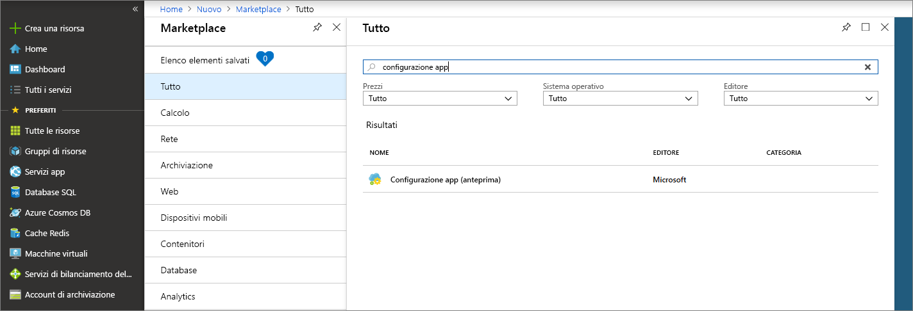
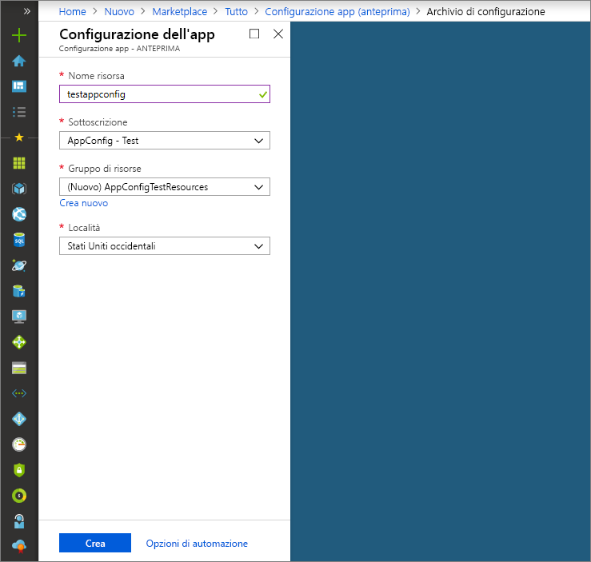

# <a name="quickstart-create-a-java-spring-app-with-app-configuration"></a>Guida introduttiva: Creare un'app Java Spring con Configurazione app

Configurazione app di Azure è un servizio di configurazione gestito di Azure. Consente di archiviare e gestire con facilità tutte le impostazioni delle applicazioni in un'unica risorsa separata dal codice. Questa guida introduttiva mostra come incorporare il servizio in un'app Java Spring.

Per completare i passaggi descritti in questa guida di avvio rapido è possibile usare qualsiasi editor di codice. Tuttavia, [Visual Studio Code](https://code.visualstudio.com/) è un'ottima scelta per le piattaforme Windows, macOS e Linux.

## <a name="prerequisites"></a>Prerequisiti

Per completare la guida introduttiva, installare [Java Development Kit (JDK)](https://aka.ms/azure-jdks) versione 8 e [Apache Maven](http://maven.apache.org/) versione 3.0 o successiva.

[!INCLUDE [quickstarts-free-trial-note](../../includes/quickstarts-free-trial-note.md)]

## <a name="create-an-app-configuration-store"></a>Creare un archivio di configurazione app

1. Per creare un nuovo archivio di configurazione app, accedere prima di tutto al [portale di Azure](https://aka.ms/azconfig/portal). Nell'angolo in alto a sinistra della pagina, fare clic su **Crea una risorsa**. Nella casella di testo **Cerca nel Marketplace** digitare **Configurazione app**, quindi premere **INVIO**.

    

2. Nei risultati della ricerca fare clic su **Configurazione app** e quindi su **Crea**.

3. Nella pagina **Configurazione app** > **Crea** immettere le impostazioni seguenti:

    | Impostazione | Valore consigliato | DESCRIZIONE |
    |---|---|---|
    | **Nome risorsa** | Nome globalmente univoco | Immettere un nome di risorsa univoco da usare per la risorsa archivio di configurazione app. Il nome deve essere una stringa contenente da 1 a 63 caratteri che possono includere solo numeri, lettere e il carattere `-`. Il nome non può iniziare o terminare con il carattere `-` e i caratteri `-` consecutivi non sono validi.  |
    | **Sottoscrizione** | Sottoscrizione in uso | Selezionare la sottoscrizione di Azure da usare per testare Configurazione app. Se l'account ha una sola sottoscrizione, questa viene selezionata automaticamente e l'elenco a discesa **Sottoscrizione** non viene visualizzato. |
    | **Gruppo di risorse** | *AppConfigTestResources* | Selezionare o creare un gruppo di risorse per la risorsa archivio di configurazione app. Questo gruppo è utile per gestire risorse multiple: ad esempio è possibile eliminare più risorse con un'unica operazione, eliminando il gruppo di risorse. Per altre informazioni, vedere [Uso di gruppi di risorse per gestire le risorse di Azure](https://docs.microsoft.com/azure/azure-resource-manager/resource-group-overview). |
    | **Posizione** | *Stati Uniti centrali* | Usare **Posizione** per specificare la posizione geografica in cui viene ospitata la risorsa SignalR. Per ottenere prestazioni ottimali, è consigliabile creare le risorse nella stessa area degli altri componenti dell'applicazione. |

    

4. Fare clic su **Create**(Crea). Per il completamento della distribuzione possono essere necessari alcuni minuti.

5. Dopo aver completato la distribuzione, fare clic su **Impostazioni** > **Chiavi di accesso**. Prendere nota della stringa di connessione della chiave primaria di sola lettura o di quella di sola scrittura. Questa informazione verrà usata in seguito per configurare l'applicazione in modo da comunicare con l'archivio di configurazione app appena creato. La stringa di connessione ha il formato seguente:

        Endpoint=<your_endpoint>;Id=<your_id>;Secret=<your_secret>

    Sarà necessario usare l'intera stringa nell'applicazione.

6. Fare clic su **Esplora chiave-valore** e su **+ Crea** per aggiungere le coppie chiave-valore seguenti:

    | Chiave | Valore |
    |---|---|
    | /application/config.message | Ciao |

    Lasciare vuoti i campi **Etichetta** e **Tipo di contenuto** per il momento.

## <a name="create-a-spring-boot-app"></a>Compilare l'app Spring Boot

Per creare un nuovo progetto Spring Boot, usare [Spring Initializr](https://start.spring.io/).

1. Passare a <https://start.spring.io/>.

2. Specificare le opzioni seguenti:

   * Generare un progetto **Maven** con **Java**.
   * Specificare **Spring Boot** versione 2.0 o successiva.
   * Specificare i nomi di **Group** (Gruppo) e **Artifact** (Artefatto) per l'applicazione.
   * Aggiungere la dipendenza **Web**.

3. Dopo aver specificato le opzioni elencate sopra, fare clic su **Generate Project** (Genera progetto). Quando richiesto, scaricare il progetto in un percorso nel computer locale.

## <a name="connect-to-app-configuration-store"></a>Connettersi all'archivio di configurazione app

1. Dopo l'estrazione dei file nel sistema locale, la semplice applicazione Spring Boot sarà pronta per la modifica. Individuare il file *pom.xml* nella directory radice dell'app.

2. Aprire il file *pom.xml* in un editor di testo e aggiungere l'utilità di avvio Spring Cloud per la configurazione di Azure all'elenco di `<dependencies>`:

    ```xml
    <dependency>
        <groupId>com.microsoft.azure</groupId>
        <artifactId>spring-cloud-starter-azure-appconfiguration-config</artifactId>
        <version>1.1.0.RC2</version>
    </dependency>
    ```

3. Creare un nuovo file Java denominato *MessageProperties.java* nella directory del pacchetto dell'app. Aggiungere le righe seguenti.

    ```java
    @ConfigurationProperties(prefix = "config")
    public class MessageProperties {
        private String message;

        public String getMessage() {
            return message;
        }

        public void setMessage(String message) {
            this.message = message;
        }
    }
    ```

4. Creare un nuovo file Java denominato *HelloController.java* nella directory del pacchetto dell'app. Aggiungere le righe seguenti.

    ```java
    @RestController
    public class HelloController {
        private final MessageProperties properties;

        public HelloController(MessageProperties properties) {
            this.properties = properties;
        }

        @GetMapping
        public String getMessage() {
            return "Message: " + properties.getMessage();
        }
    }
    ```

5. Aprire il file Java dell'applicazione principale e aggiungere `@EnableConfigurationProperties` per abilitare questa funzionalità.

    ```java
    @SpringBootApplication
    @EnableConfigurationProperties(MessageProperties.class)
    public class AzureConfigApplication {
        public static void main(String[] args) {
            SpringApplication.run(AzureConfigApplication.class, args);
        }
    }
    ```

6. Creare un nuovo file denominato `bootstrap.yaml` nella directory di risorse dell'app e aggiungere le righe seguenti, sostituendo i valori di esempio con le proprietà appropriate per l'archivio di configurazione app.

    ```yaml
    spring:
        cloud:
            azure:
                config:
                    stores:
                        - connection-string: [your-connection-string]
    ```

## <a name="build-and-run-the-app-locally"></a>Compilare ed eseguire l'app in locale

1. Compilare l'applicazione Spring Boot con Maven ed eseguirla, ad esempio:

    ```shell
    mvn clean package
    mvn spring-boot:run
    ```
2. Quando l'applicazione è in esecuzione, è possibile testarla usando *curl*, ad esempio:

      ```shell
      curl -X GET http://localhost:8080/
      ```
    Dovrebbe essere visualizzato il messaggio indicante che è stato eseguito l'accesso nell'archivio configurazione app.

## <a name="clean-up-resources"></a>Pulire le risorse

[!INCLUDE [azure-app-configuration-cleanup](../../includes/azure-app-configuration-cleanup.md)]

## <a name="next-steps"></a>Passaggi successivi

In questa guida introduttiva è stato creato un nuovo archivio di configurazione app, che è stato usato con un'app Java Spring. Per altre informazioni, visitare la [home page di Spring in Azure](https://docs.microsoft.com/java/azure/spring-framework/).

Per altre informazioni sull'uso di Configurazione app, continuare con l'esercitazione successiva sull'autenticazione.

> [!div class="nextstepaction"]
> [Identità gestite per l'integrazione di risorse di Azure](./integrate-azure-managed-service-identity.md)