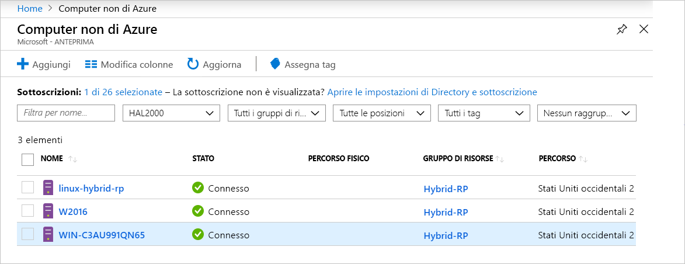

# <a name="what-is-azure-arc-for-servers"></a>Che cos'è Azure Arc per server?

Azure Arc per server consente di gestire i computer che si trovano all'esterno di Azure.
Quando un computer non di Azure viene connesso ad Azure, diventa un **computer connesso** e viene considerato come una risorsa in Azure. Ogni **computer connesso** dispone di un ID risorsa, viene gestito come parte di un gruppo di risorse all'interno di una sottoscrizione e usufruisce dei vantaggi derivanti dai costrutti di Azure standard, ad esempio Criteri di Azure e assegnazione di tag.

È necessario installare un pacchetto agente in ogni computer per connetterlo ad Azure. La parte rimanente di questo documento illustra il processo in modo più dettagliato.

I computer mostreranno lo stato **Connesso** o **Disconnesso** in base a quanto di recente l'agente ha effettuato il controllo. Ogni controllo è chiamato heartbeat. Se un computer non è stato controllato negli ultimi 5 minuti, verrà visualizzato come offline finché non viene ripristinata la connettività.  <!-- For more information on troubleshooting agent connectivity, see [Troubleshooting Azure Arc for servers](troubleshoot/arc-for-servers.md). -->



## <a name="clients"></a>Client

### <a name="supported-operating-systems"></a>Sistemi operativi supportati

Durante l'anteprima pubblica sono supportati:

- Windows Server 2012 R2 e versioni successive
- Ubuntu 16.04 e 18.04

La versione di anteprima pubblica è progettata a scopo di valutazione e non deve essere usata per gestire le risorse di produzione critiche.

## <a name="azure-subscription-and-service-limits"></a>Limiti del servizio e della sottoscrizione di Azure

Assicurarsi di tenere conto dei limiti di Azure Resource Manager e di pianificare il numero di computer da connettere in base alle linee guida elencate per la [sottoscrizione](../../azure-subscription-service-limits.md#subscription-limits---azure-resource-manager) e per i [gruppi di risorse](../../azure-subscription-service-limits.md#resource-group-limits). In particolare, per impostazione predefinita è previsto un limite di 800 server per gruppo di risorse.

## <a name="networking-configuration"></a>Configurazione delle impostazioni di rete

Durante l'installazione e la fase di esecuzione, l'agente richiede la connettività agli **endpoint servizio di Azure Arc**. Se la connettività in uscita è bloccata tramite firewall, verificare che gli URL seguenti non siano bloccati per impostazione predefinita. Tutte le connessioni sono in uscita dall'agente verso Azure e sono protette tramite **SSL**. Tutto il traffico può essere indirizzato tramite un proxy **HTTPS**. Se gli intervalli IP o i nomi di dominio a cui i server possono connettersi sono consentiti, è necessario consentire alla porta 443 l'accesso ai tag del servizio e ai nomi DNS seguenti.

Tag del servizio:

* AzureActiveDirectory
* AzureTrafficManager

Per un elenco degli indirizzi IP per ogni tag del servizio/area, vedere il file JSON [Azure IP Ranges and Service Tags – Public Cloud](https://www.microsoft.com/download/details.aspx?id=56519) (Indirizzi IP di Azure e tag del servizio - Cloud pubblico). Microsoft pubblica aggiornamenti settimanali contenenti ogni servizio di Azure e gli intervalli IP usati dal servizio. Per informazioni dettagliate, vedere [Tag del servizio](https://docs.microsoft.com/azure/virtual-network/security-overview#service-tags).

I nomi DNS sono forniti in aggiunta alle informazioni relative agli intervalli IP dei tag del servizio, perché la maggior parte dei servizi non dispone attualmente di una registrazione dei tag del servizio e, di conseguenza, gli indirizzi IP sono soggetti a modifiche. Se sono necessari gli intervalli IP per la configurazione del firewall, è consigliabile usare il tag del servizio **AzureCloud** per consentire l'accesso a tutti i servizi di Azure. Non disabilitare il monitoraggio della sicurezza o l'ispezione degli URL, ma consentire tali URL come si farebbe con il resto del traffico Internet.

| Ambiente di dominio | Endpoint del servizio di Azure richiesti |
|---------|---------|
|management.azure.com|Azure Resource Manager|
|login.windows.net|Azure Active Directory|
|dc.services.visualstudio.com|Application Insights|
|agentserviceapi.azure-automation.net|Configurazione guest|
|*-agentservice-prod-1.azure-automation.net|Configurazione guest|
|*.his.hybridcompute.azure-automation.net|Servizio ibrido di gestione delle identità|

### <a name="installation-network-requirements"></a>Requisiti di rete per l'installazione

Scaricare il [pacchetto dell'agente Azure Connected Machine](https://aka.ms/AzureConnectedMachineAgent) dai server di distribuzione ufficiali. I siti seguenti devono essere accessibili dall'ambiente corrente. È possibile scegliere di scaricare il pacchetto in una condivisione file e installare l'agente da questa posizione. In questo caso, potrebbe essere necessario modificare lo script di onboarding generato dal portale di Azure.

Windows:

* `aka.ms`
* `download.microsoft.com`

Linux:

* `aka.ms`
* `packages.microsoft.com`

Per informazioni su come configurare l'agente per l'uso del proxy, vedere la sezione [Configurazione del server proxy](quickstart-onboard-powershell.md#proxy-server-configuration).

## <a name="register-the-required-resource-providers"></a>Registrare i provider di risorse necessari

Una volta approvata la registrazione del 'flag funzionalità', occorre registrare i provider di risorse necessari.

* **Microsoft.HybridCompute**
* **Microsoft.GuestConfiguration**

È possibile registrare i provider di risorse con i comandi seguenti:

Azure PowerShell:

```azurepowershell-interactive
Login-AzAccount
Set-AzContext -SubscriptionId [subscription you want to onboard]
Register-AzResourceProvider -ProviderNamespace Microsoft.HybridCompute
Register-AzResourceProvider -ProviderNamespace Microsoft.GuestConfiguration
```

Interfaccia della riga di comando di Azure:

```azurecli-interactive
az account set --subscription "{Your Subscription Name}"
az provider register --namespace 'Microsoft.HybridCompute'
az provider register --namespace 'Microsoft.GuestConfiguration'
```

È anche possibile registrare i provider di risorse usando il portale seguendo la procedura descritta nel [portale di Azure](../../azure-resource-manager/resource-manager-supported-services.md#azure-portal).

## <a name="supported-scenarios"></a>Scenari Supportati

Dopo aver registrato un nodo, è possibile iniziare a gestire i nodi usando altri servizi di Azure.

Durante l'anteprima pubblica per i **computer connessi** sono supportati gli scenari seguenti.

## <a name="guest-configuration"></a>Configurazione guest

Dopo aver connesso il computer ad Azure, è possibile assegnare i criteri di Azure ai **computer connessi** usando la stessa esperienza di assegnazione dei criteri alle macchine virtuali di Azure.

Per altre informazioni, vedere [Comprendere la configurazione guest di Criteri di Azure](../../governance/policy/concepts/guest-configuration.md).

I log dell'agente di configurazione guest per un **computer connesso** si trovano nei percorsi seguenti:

* Windows - `%ProgramFiles%\AzureConnectedMachineAgent\logs\dsc.log`
* Linux: - `/opt/logs/dsc.log`

## <a name="log-analytics"></a>Log Analytics

I dati di log raccolti da [Microsoft Monitoring Agent (MMA)](https://docs.microsoft.com/azure/azure-monitor/log-query/log-query-overview) e archiviati nell'area di lavoro Log Analytics conterranno le proprietà specifiche del computer, ad esempio **ResourceId**, che possono essere usate per l'accesso ai log incentrato sulle risorse.

- Nei computer in cui è già installato l'agente Microsoft Monitoring Agent (MMA), la funzionalità **Azure Arc** verrà abilitata tramite Management Pack aggiornati.
- Per l'integrazione di Azure Arc per server, è necessaria la [versione dell'agente MMA 10.20.18011 o successiva](https://docs.microsoft.com/azure/virtual-machines/extensions/oms-windows#agent-and-vm-extension-version).
- Quando si eseguono query sui dati di log in [Monitoraggio di Azure](https://docs.microsoft.com/azure/azure-monitor/log-query/log-query-overview#log-queries), lo schema di dati restituito conterrà il **ResourceId** ibrido nel formato `/subscriptions/<SubscriptionId/resourceGroups/<ResourceGroup>/providers/Microsoft.HybridCompute/machines/<MachineName>`.

Per altre informazioni, vedere [Introduzione a Log Analytics in Monitoraggio di Azure](https://docs.microsoft.com/azure/azure-monitor/log-query/get-started-portal).

<!-- MMA agent version 10.20.18011 and later -->

## <a name="next-steps"></a>Passaggi successivi

Esistono due metodi per connettere i computer tramite Azure Arc per server.

* **In modo interattivo**: seguire l'esercitazione di [Avvio rapido del portale](quickstart-onboard-portal.md) per generare uno script dal portale ed eseguirlo nel computer. Si tratta dell'opzione migliore per connettere un computer alla volta.
* **Su larga scala**: seguire l'esercitazione di [Avvio rapido di PowerShell](quickstart-onboard-powershell.md) per creare un'entità servizio per connettere i computer in modo non interattivo.
