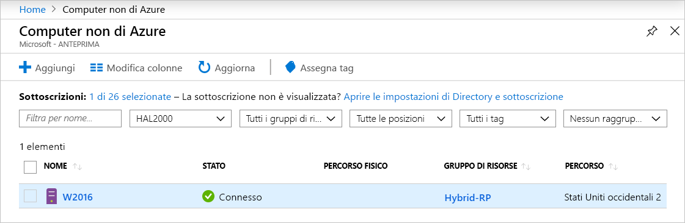
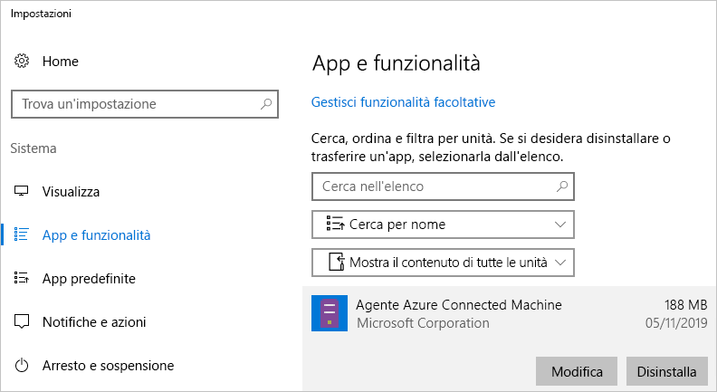

# <a name="quickstart-connect-machines-to-azure-using-azure-arc-for-servers---powershell"></a>Guida introduttiva: Connettere computer ad Azure con Azure Arc per server - PowerShell

Se non si ha una sottoscrizione di Azure, creare un [account gratuito](https://azure.microsoft.com/free/?WT.mc_id=A261C142F) prima di iniziare.

## <a name="prerequisites"></a>Prerequisiti

Esaminare i client supportati e la configurazione di rete necessaria in [Panoramica di Azure Arc per server](overview.md).

## <a name="create-a-service-principal-for-onboarding-at-scale"></a>Creare un'entità servizio per l'onboarding su larga scala

Un'entità servizio è un'identità di gestione limitata speciale a cui viene concessa solo l'autorizzazione minima necessaria per connettere computer ad Azure. Questo approccio è più sicuro rispetto all'uso di un account più potente, ad esempio un Amministratore tenant. L'entità servizio viene usata solo durante l'onboarding. È possibile eliminare senza problemi l'entità servizio dopo aver connesso i server desiderati.

> [!NOTE]
> Questo passaggio non è obbligatorio, ma è consigliato.

### <a name="steps-to-create-the-service-principal"></a>Procedure per la creazione dell'entità servizio

In questo esempio verrà usato [Azure PowerShell](/powershell/azure/install-az-ps) per creare un nome dell'entità servizio (SPN, Service Principal Name). In alternativa, è possibile seguire la procedura descritta in [Creare un'entità servizio usando il portale di Azure](../../active-directory/develop/howto-create-service-principal-portal.md) per questa attività.

Il ruolo `Azure Connected Machine Onboarding` contiene solo le autorizzazioni necessarie per l'onboarding. È possibile definire l'autorizzazione di un nome SPN per consentire all'ambito di coprire un gruppo di risorse o una sottoscrizione.

È necessario archiviare l'output del cmdlet [`New-AzADServicePrincipal`](/powershell/module/az.resources/new-azadserviceprincipal) altrimenti non sarà possibile recuperare la password da usare in un passaggio successivo.

```azurepowershell-interactive
$sp = New-AzADServicePrincipal -DisplayName "Arc-for-servers" -Role "Azure Connected Machine Onboarding"
$sp
```

```output
Secret                : System.Security.SecureString
ServicePrincipalNames : {ad9bcd79-be9c-45ab-abd8-80ca1654a7d1, https://Arc-for-servers}
ApplicationId         : ad9bcd79-be9c-45ab-abd8-80ca1654a7d1
ObjectType            : ServicePrincipal
DisplayName           : Hybrid-RP
Id                    : 5be92c87-01c4-42f5-bade-c1c10af87758
Type                  :
```

> [!NOTE] 
> Il popolamento corretto delle autorizzazioni SPN potrebbe richiedere qualche istante. Esecuzione dell'assegnazione di ruolo seguente per impostare le autorizzazioni molto più velocemente.
> ``` PowerShell
> New-AzRoleAssignment -RoleDefinitionName "Azure Connected Machine Onboarding" -ServicePrincipalName $sp.ApplicationId
> ```

A questo punto, recuperare la password usando PowerShell.

```azurepowershell-interactive
$credential = New-Object pscredential -ArgumentList "temp", $sp.Secret
$credential.GetNetworkCredential().password
```

Dall'output copiare **password** e **ApplicationId** (dal passaggio precedente) e archiviarli in una posizione sicura per un uso successivo. Usare ad esempio l'archivio di segreti per lo strumento di configurazione dei server. Se si dimentica o si perde la password del nome SPN, è possibile reimpostarla usando il cmdlet [`New-AzADSpCredential`](/powershell/module/azurerm.resources/new-azurermadspcredential).

Nello script di onboarding dell'agente di installazione:

* La proprietà **ApplicationId** viene usata per il parametro `--service-principal-id` per la connessione dell'agente
* La proprietà **password** viene usata per il parametro `--service-principal-secret` per la connessione dell'agente.

> [!NOTE]
> Assicurarsi di usare la proprietà **ApplicationId** dell'entità servizio e non la proprietà **Id**. La proprietà **Id** non funzionerà.

## <a name="manually-install-the-agent-and-connect-to-azure"></a>Installare manualmente l'agente e connettersi ad Azure

La guida seguente consente di connettere un computer ad Azure accedendo al computer ed eseguendo la procedura. È anche possibile connettere computer ad Azure [dal portale](quickstart-onboard-portal.md).

### <a name="download-and-install-the-agent"></a>Scaricare e installare l'agente

Per installare il pacchetto dell'agente, è necessario l'accesso di amministratore locale o l'accesso alla radice nel server di destinazione, ma non l'accesso Azure.

#### <a name="linux"></a>Linux

Per i server **Linux**, l'agente viene distribuito tramite il [repository dei pacchetti di Microsoft](https://packages.microsoft.com) usando il formato di pacchetto preferito per la distribuzione (RPM o DEB).

> [!NOTE]
> Durante l'anteprima pubblica è stato rilasciato un solo pacchetto, adatto per Ubuntu 16.04 o 18.04.

L'opzione più semplice consiste nel registrare il repository del pacchetto per poi installare il pacchetto tramite la gestione pacchetti della distribuzione.
Lo script bash disponibile all'indirizzo [https://aka.ms/azcmagent](https://aka.ms/azcmagent) esegue le azioni seguenti:

1. Configura il computer host per il download da `packages.microsoft.com`.
2. Installa il pacchetto del provider di risorse ibride.
3. Facoltativamente, configura l'agente per l'operazione proxy, se si specifica `--proxy`.

Lo script contiene anche le verifiche per le distribuzioni supportate e non supportate, oltre a rilevare le autorizzazioni necessarie per l'installazione.

L'esempio seguente scarica l'agente e lo installa, senza i controlli condizionali.

```bash
# Download the installation package
wget https://aka.ms/azcmagent -O ~/Install_linux_azcmagent.sh

# Install the connected machine agent. Omit the '--proxy "{proxy-url}"' parameters if proxy is not needed
bash ~/Install_linux_azcmagent.sh--proxy "{proxy-url}"
```

> [!NOTE]
> Se si preferisce non fare riferimento al repository dei pacchetti di Microsoft, è possibile copiare il file del pacchetto da tale posizione nel proprio repository interno.

#### <a name="windows"></a>Windows

Per **Windows**, l'agente è incluso in un file Windows Installer (`.MSI`) e può essere scaricato da [https://aka.ms/AzureConnectedMachineAgent](https://aka.ms/AzureConnectedMachineAgent), che è ospitato in [https://download.microsoft.com](https://download.microsoft.com).

```powershell
# Download the package
Invoke-WebRequest -Uri https://aka.ms/AzureConnectedMachineAgent -OutFile AzureConnectedMachineAgent.msi

# Install the package
msiexec /i AzureConnectedMachineAgent.msi /l*v installationlog.txt /qn | Out-String
```

> [!NOTE]
> In Linux la riesecuzione dello script di installazione comporterà l'aggiornamento automatico alla versione più recente. In Windows è necessario disinstallare l'"agente del computer connesso ad Azure" prima di eseguire di nuovo il programma di installazione per l'aggiornamento.

### <a name="connecting-to-azure"></a>Connessione ad Azure

Una volta installato, l'agente può essere gestito e configurato tramite uno strumento da riga di comando denominato `azcmagent.exe`. L'agente si trova in `/opt/azcmagent/bin` per Linux e in `$env:programfiles\AzureConnectedMachineAgent` per Windows.

In Windows aprire PowerShell come amministratore in un nodo di destinazione ed eseguire:

```powershell
& "$env:ProgramFiles\AzureConnectedMachineAgent\azcmagent.exe" connect `
  --service-principal-id "{your-spn-appid}" `
  --service-principal-secret "{your-spn-password}" `
  --resource-group "{your-resource-group-name}" `
  --tenant-id "{your-tenant-id}" `
  --location "{location-of-your-resource-group}" `
  --subscription-id "{your-subscription-id}"
```

In Linux aprire una shell ed eseguire

<!-- Same command for linux?-->
```bash
azcmagent connect \
  --service-principal-id "{your-spn-appid}" \
  --service-principal-secret "{your-spn-password}" \
  --resource-group "{your-resource-group-name}" \
  --tenant-id "{your-tenant-id}" \
  --location "{location-of-your-resource-group}" \
  --subscription-id "{your-subscription-id}"
```

Parametri

* `tenant-id` : GUID del tenant. È possibile trovarlo nel portale di Azure selezionando **Azure Active Directory** -> **Proprietà** -> **ID directory**.
* `subscription-id` : GUID della sottoscrizione di Azure che si intende usare per connettere il computer.
* `resource-group` : gruppo di risorse a cui si intende connettere il computer.
* `location` : vedere [Aree e località di Azure](https://azure.microsoft.com/global-infrastructure/regions/). La località può essere uguale o diversa da quella del gruppo di risorse. Per l'anteprima pubblica, il servizio è supportato negli **Stati Uniti occidentali 2** e in **Europa occidentale**.
* `resource-name` :  (*facoltativo*) usato per la rappresentazione delle risorse di Azure del computer locale. Se non si specifica questo valore, verrà usato il nome host del computer.

Altre informazioni sullo strumento "azcmagent" sono disponibili in [Informazioni di riferimento per Azcmagent](azcmagent-reference.md).
<!-- Isn't this still needed to view machines? -->

Al termine dell'operazione, il computer è connesso ad Azure. È possibile visualizzare il computer nel portale di Azure visitando [https://aka.ms/hybridmachineportal](https://aka.ms/hybridmachineportal).



### <a name="proxy-server-configuration"></a>Configurazione del server proxy

#### <a name="linux"></a>Linux

<!-- New proxy name? -->

Per **Linux**, se il server richiede un server proxy, è possibile effettuare una delle operazioni seguenti:

* Eseguire lo script `install_linux_hybrid_agent.sh` dalla sezione relativa all'[installazione dell'agente](#download-and-install-the-agent) sopra riportata, con `--proxy`.
* Se l'agente è già stato installato, eseguire il comando `/opt/azcmagent/bin/hybridrp_proxy add http://{proxy-url}:{proxy-port}`, che configura il proxy e riavvia l'agente.

#### <a name="windows"></a>Windows

Per **Windows**, se il server richiede il server proxy per l'accesso alle risorse Internet, è necessario eseguire il comando riportato di seguito per impostare la variabile di ambiente del server proxy. In questo modo l'agente può usare il server proxy per l'accesso a Internet.

```powershell
# If a proxy server is needed, execute these commands with actual proxy URL
[Environment]::SetEnvironmentVariable("https_proxy", "http://{proxy-url}:{proxy-port}", "Machine")
$env:https_proxy = [System.Environment]::GetEnvironmentVariable("https_proxy","Machine")
# The agent service needs to be restarted after the proxy environment variable is set in order for the changes to take effect.
Restart-Service -Name himds
```

> [!NOTE]
> I proxy autenticati non sono supportati per l'anteprima pubblica.

## <a name="clean-up"></a>Eseguire la pulizia

Per disconnettere un computer da Azure Arc per server, è necessario eseguire due passaggi.

1. Selezionare il computer alla voce [Portale](https://aka.ms/hybridmachineportal), fare clic sui puntini di sospensione (`...`) e selezionare **Eliminare**.
1. Disinstallare l'agente dal computer.

   In Windows è possibile usare il pannello di controllo "App e funzionalità" per disinstallare l'agente.
  
  

   Per uno script per la disinstallazione, è possibile usare l'esempio seguente, che recupera **PackageId** e disinstalla l'agente con `msiexec /X`.

   Nella chiave del Registro di sistema `HKEY_LOCAL_MACHINE\Software\Microsoft\Windows\CurrentVersion\Uninstall` trovare **PackageId**. È quindi possibile disinstallare l'agente usando `msiexec`.

   L'esempio seguente dimostra come disinstallare l'agente.

   ```powershell
   Get-ChildItem -Path HKLM:\Software\Microsoft\Windows\CurrentVersion\Uninstall | `
   Get-ItemProperty | `
   Where-Object {$_.DisplayName -eq "Azure Connected Machine Agent"} | `
   ForEach-Object {MsiExec.exe /Quiet /X "$($_.PsChildName)"}
   ```

   In Linux eseguire il comando seguente per disinstallare l'agente.

   ```bash
   sudo apt purge hybridagent
   ```

## <a name="next-steps"></a>Passaggi successivi

> [!div class="nextstepaction"]
> [Assegnare un criterio ai computer connessi](../../governance/policy/assign-policy-portal.md)
