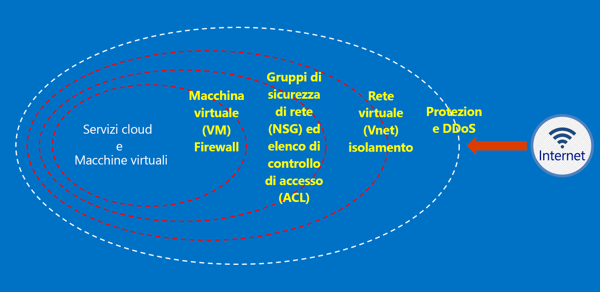

# Cos'è Azure Australia?

Nel 2014, Azure è stato avviato in Australia con due aree, ovvero Australia orientale (Sydney) e Australia sud-orientale (Melbourne). Ad aprile 2018, sono state avviate due nuove aree di Azure situate a Canberra, ossia Australia centrale e Australia centrale 2. Le aree Australia centrale e Australia centrale 2 sono state pensate appositamente per soddisfare le esigenze dell'infrastruttura nazionale critica e governativa, e offrono connettività e flessibilità speciali per poter posizionare i sistemi vicino al cloud, con i livelli di sicurezza e resilienza previsti solo per le reti classificate come segrete. Azure Australia è una piattaforma per la trasformazione digitale dell'infrastruttura nazionale critica e governativa, oltre a essere l'unico cloud cruciale disponibile in Australia progettato specificamente per queste esigenze.

Esistono requisiti specifici del governo australiano per quanto riguarda la connessione, l'utilizzo e la gestione di dati e sistemi governativi all'interno di [Microsoft Azure Australia](https://azure.microsoft.com/global-infrastructure/australia/). Le risorse disponibili in questa pagina forniscono anche indicazioni generali applicabili a tutti i clienti, con una particolare attenzione per la sicurezza a livello di configurazione e operazioni.

Vedere la pagina Australia del [Microsoft Service Trust Portal](https://aka.ms/au-irap) per informazioni aggiornate sulle valutazioni IRAP (Information Security Registered Assessor), la certificazione e l'inclusione di Azure Australia nell'elenco CCSL (Certified Cloud Services). Nella pagina Australia sono inoltre disponibili altri suggerimenti Microsoft specifici per i provider di infrastrutture critiche e governative.

## Principi per la protezione dei dati dei clienti in Azure Australia

Azure Australia offre una gamma di funzionalità e servizi che è possibile usare per creare soluzioni cloud che soddisfino le esigenze di gestione dei dati regolamentati o controllati. Una soluzione dei clienti conforme non è altro che l'efficace implementazione delle funzionalità predefinite di Azure Australia, associate a procedure affidabili di sicurezza dei dati.

Quando si ospita una soluzione in Azure Australia, Microsoft gestisce molti di questi requisiti a livello di infrastruttura cloud.

Il diagramma seguente illustra il modello di difesa avanzata di Azure. Ad esempio, Microsoft offre la protezione di base da attacchi DDoS per l'infrastruttura cloud, unitamente a funzionalità per i clienti, come le appliance di sicurezza o i servizi DDoS Premium, per le esigenze specifiche delle applicazioni dei clienti.

Questi articoli illustrano i principi fondamentali per la protezione dei servizi e delle applicazioni, con indicazioni e procedure consigliate su come applicarli. In altri termini, descrivono come usare in modo intelligente Azure Australia per soddisfare obblighi, responsabilità e requisiti associati a una soluzione che gestisce informazioni sensibili e classificate del governo.

Sono disponibili due categorie di documentazione per gli enti pubblici australiani che eseguono la migrazione ad Azure.

## Sicurezza in Azure Australia

La gestione delle identità, il controllo degli accessi in base al ruolo, la protezione dei dati tramite crittografia e Rights Management, il monitoraggio efficace e il controllo della configurazione sono elementi chiave che è necessario implementare. Questa sezione include una serie di articoli che illustrano le funzionalità predefinite di Azure e le relative correlazioni con ISM e ASD Essential 8.

Questi articoli sono accessibili tramite il menu *Concetti > Sicurezza in Azure Australia*.

## Gateway in Azure Australia

Un altro passaggio chiave per gli enti pubblici è l'implementazione di funzionalità di sicurezza perimetrali. Si tratta delle cosiddette funzionalità SIG (Secure Internet Gateways) e durante l'uso di Azure è responsabilità del cliente assicurarsi che queste misure di protezione vengano applicate. Microsoft non gestisce funzionalità SIG. Tuttavia, combinando i servizi di rete perimetrale che proteggono tutti i clienti con servizi specifici distribuiti nell'ambiente Azure, è possibile accedere a funzionalità equivalenti.

Questi articoli sono accessibili tramite il menu *Concetti > Gateway in Azure Australia*.

## Passaggi successivi

* Se l'obiettivo principale è la protezione dei dati in Azure, iniziare con [Sicurezza dei dati](secure-your-data.md)
* Se l'obiettivo principale è la creazione di un gateway in Azure, iniziare con [Registrazione, controllo e visibilità dei gateway](gateway-log-audit-visibility.md).
