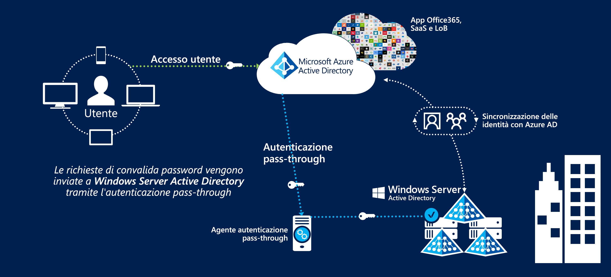
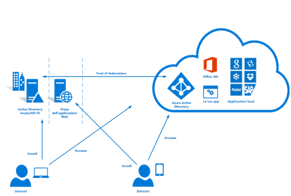

# Federazione delle identità in Azure Australia

La gestione e la federazione delle identità con le offerte di cloud pubblico rappresentano una delle prime fasi più importanti per l'uso del cloud. Il servizio Microsoft Azure Active Directory archivia le informazioni degli utenti per abilitare l'accesso ai servizi cloud ed è un prerequisito per l'uso di altri servizi di Azure.

Questo articolo illustra i principali punti di progettazione per l'implementazione di Azure Active Directory, la sincronizzazione degli utenti da un dominio di Active Directory Domain Services e l'implementazione dell'autenticazione sicura. Una particolare attenzione viene prestata alle raccomandazioni incluse nell'ISM (Information Security Manual) dell'Australian Cyber Security Center e nei report di certificazione di Azure.

La classificazione delle informazioni archiviate in Azure Active Directory dovrebbe informare le decisioni sulla modalità di progettazione. Ecco un estratto del documento [ACSC Certification Report - Microsoft Azure](https://aka.ms/au-irap):

>**ACSC Certification Report - Microsoft Azure** Azure Active Directory (Azure AD) deve essere configurato con Active Directory Federation Services quando le entità del Commonwealth classificano l'uso e il contenuto dei dati di Active Directory come PROTECTED. Anche se i dati di Active Directory con la classificazione UDLM (UNCLASSIFIED Dissemination Limiting Markings) non richiedono la federazione, le entità del Commonwealth possono comunque implementarla per mitigare i rischi associati al servizio fornito dall'esterno dell'Australia.

Di conseguenza, la scelta delle informazioni da sincronizzare e il meccanismo mediante il quale gli utenti vengono autenticati sono i due aspetti principali trattati in questo articolo.

## Principali considerazioni sulla progettazione

### Sincronizzazione degli utenti

Quando si distribuisce Azure AD Connect, è necessario prendere diverse decisioni sui dati che verranno sincronizzati. Azure AD Connect si basa su Microsoft Identity Manager e fornisce un solido set di funzionalità per la [trasformazione](https://docs.microsoft.com/azure/active-directory/hybrid/how-to-connect-sync-best-practices-changing-default-configuration) dei dati tra directory.

È possibile rivolgersi ai Microsoft Consulting Services per eseguire una valutazione ADRAP dell'attuale ambiente Windows Server Active Directory. ADRAP aiuta a identificare eventuali problemi che potrebbero essere necessario risolvere prima della sincronizzazione con Azure Active Directory. I contratti di supporto tecnico Premier Microsoft in genere includono questo servizio.

Lo [strumento IDFix](https://docs.microsoft.com/office365/enterprise/install-and-run-idfix) analizza il dominio di Active Directory locale per individuare eventuali problemi prima della sincronizzazione con Azure AD. L'esecuzione di IDFix rappresenta un primo passaggio importante da completare prima dell'implementazione di Azure AD Connect. Anche se un'analisi di IDFix consente di identificare un numero elevato di problemi, molti di questi possono essere risolti rapidamente con gli script o, come soluzione alternativa, con le trasformazioni dei dati in Azure AD Connect.

Per consentire l'autenticazione in Azure AD, è necessario che gli utenti abbiano un dominio di primo livello instradabile esternamente. Se il dominio ha un suffisso UPN non instradabile esternamente, è necessario impostare l'[ID di accesso alternativo](https://docs.microsoft.com/azure/active-directory/hybrid/plan-connect-userprincipalname) in AD Connect sull'attributo relativo alla posta elettronica dell'utente. Gli utenti possono quindi accedere ai servizi di Azure con il proprio indirizzo di posta elettronica invece che con le credenziali di accesso al dominio.

Il suffisso UPN negli account utente può anche essere modificato usando strumenti come PowerShell. Tuttavia, questa procedura non è più consigliata perché possono verificarsi conseguenze impreviste per altri sistemi connessi.

Per decidere quali attributi sincronizzare con Azure Active Directory, è più sicuro presupporre che tutti gli attributi siano obbligatori. È raro che una directory contenga effettivamente dati classificati come PROTECTED, ma è consigliabile eseguire un controllo. Se vengono trovati dati PROTECTED nella directory, valutare l'impatto dell'omissione o della trasformazione dell'attributo. Come guida utile, è disponibile un elenco di attributi [obbligatori](https://docs.microsoft.com/azure/active-directory/hybrid/reference-connect-sync-attributes-synchronized) peri servizi cloud Microsoft.

### Authentication

È importante identificare le opzioni disponibili e il modo in cui è possibile usarle per proteggere gli utenti finali.
Microsoft offre [tre soluzioni native](https://docs.microsoft.com/azure/active-directory/hybrid/plan-connect-user-signin) per l'autenticazione degli utenti con Azure Active Directory:

* Sincronizzazione dell'hash delle password: le password con hash di Active Directory Domain Services vengono sincronizzate da Azure AD Connect in Azure Active Directory.
* [Autenticazione pass-through](https://docs.microsoft.com/azure/active-directory/hybrid/how-to-connect-pta): le password rimangono all'interno di Active Directory Domain Services. L'autenticazione degli utenti con Active Directory Domain Services viene eseguita tramite un agente. Nessuna password viene archiviata all'interno Azure AD.
* [SSO federato](https://docs.microsoft.com/azure/active-directory/hybrid/how-to-connect-fed-whatis): Azure Active Directory è federato con Active Directory Federation Services e, durante l'accesso, Azure indirizza gli utenti ad Active Directory Federation Services per l'autenticazione. Nessuna password viene archiviata all'interno Azure AD.

La sincronizzazione dell'hash delle password può essere usata negli scenari in cui all'interno della directory vengono archiviati dati con classificazione fino a OFFICIAL:Sensitive. Gli scenari in cui vengono archiviati i dati PROTECTED richiederanno una delle due opzioni rimanenti.

Tutte e tre queste opzioni supportano il [writeback delle password](https://docs.microsoft.com/azure/active-directory/authentication/concept-sspr-writeback), che la [guida per gli utenti di ACSC](https://aka.ms/au-irap) consiglia di disabilitare. Tuttavia, le organizzazioni devono valutare il rischio associato alla disabilitazione del writeback delle password rispetto all'aumento di produttività e alla riduzione degli interventi di supporto che invece assicura la reimpostazione della password self-service.

#### Autenticazione pass-through

L'autenticazione pass-through è stata rilasciata dopo il completamento della valutazione IRAP e, pertanto, deve essere valutata singolarmente per determinare se la soluzione si adatta al profilo di rischio dell'organizzazione. Microsoft preferisce l'autenticazione pass-through rispetto alla federazione grazie a una postura di sicurezza migliorata.

L'autenticazione pass-through presenta diversi fattori di progettazione da considerare:

* L'agente di autenticazione pass-through deve essere in grado di stabilire connessioni in uscita con i servizi cloud Microsoft.
* È opportuno installare più di un agente per garantire la disponibilità elevata del servizio. È consigliabile distribuire almeno tre agenti e fino a un massimo di 12 agenti.
* È consigliabile evitare di installare l'agente direttamente in un controller di dominio di Active Directory. Per impostazione predefinita, quando si distribuisce Azure AD Connect con l'autenticazione pass-through, l'agente viene installato nel server AD Connect.
* L'autenticazione pass-through comporta requisiti di manutenzione minori rispetto ad Active Directory Federation Services perché non richiede un'infrastruttura server dedicata, la gestione dei certificati o le regole del firewall in ingresso.

#### Active Directory Federation Services (ADFS)

Active Directory Federation Services è stato incluso nella valutazione IRAP ed è approvato per l'uso in ambienti PROTECTED.

Active Directory Federation Services presenta diversi fattori di progettazione da considerare:

* I servizi federativi richiedono l'ingresso alla rete per il traffico HTTPS proveniente da Internet o almeno dagli endpoint di servizio Microsoft.
* I servizi federativi usano l'infrastruttura PKI e i certificati, che richiedono una gestione e un rinnovo su base continuativa.
* I servizi federativi devono essere distribuiti in server dedicati e richiedono l'infrastruttura di rete appropriata per un accesso esterno sicuro.

### Multi-Factor Authentication (MFA)

La sezione ISM sull'autenticazione a più fattori consiglia di implementarla negli scenari seguenti in base al profilo di rischio dell'organizzazione:

* Autenticazione degli utenti standard
* Autenticazione degli account con privilegi
* Autenticazione dell'accesso remoto degli utenti
* Utenti che seguono azioni con privilegi

Azure Active Directory include il servizio Multi-Factor Authentication che è possibile abilitare per tutti gli utenti o solo per un sottoinsieme, ad esempio gli account con privilegi. Microsoft fornisce anche la soluzione di accesso condizionale, che consente un controllo più granulare sul modo in cui viene applicato il servizio Multi-Factor Authentication (ad esempio solo quando gli utenti accedono da intervalli di indirizzi IP remoto).

Azure Multi-Factor Authentication supporta le seguenti forme accettabili di convalida ISM:

* Chiamata telefonica
* Messaggio SMS
* Applicazione Microsoft Authenticator
* Token hardware supportati

Privileged Identity Management, un componente di Azure Active Directory, può essere usato per imporre l'utilizzo di Multi-Factor Authentication quando gli utenti elevano le loro autorizzazioni per soddisfare la quarta raccomandazione.

## Passaggi successivi

Leggere l'articolo sul [controllo degli accessi in base al ruolo e Privileged Identity Management](role-privileged.md).
