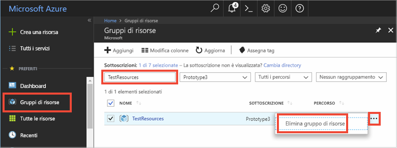

# <a name="quickstart-use-azure-cache-for-redis-with-java"></a>Guida introduttiva: Usare Azure Cache for Redis con Java

In questa guida di avvio rapido si incorpora Azure Cache for Redis in un'app Java usando il client [Jedis](https://github.com/xetorthio/jedis) di Redis per accedere a una cache sicura e dedicata accessibile da qualsiasi applicazione in Azure.

## <a name="prerequisites"></a>Prerequisiti

- Sottoscrizione di Azure: [creare un account gratuito](https://azure.microsoft.com/free/)
- [Apache Maven](https://maven.apache.org/download.cgi)

## <a name="create-an-azure-cache-for-redis"></a>Creare un'istanza di Cache Redis di Azure

[!INCLUDE [redis-cache-create](../../includes/redis-cache-create.md)]

[!INCLUDE [redis-cache-access-keys](../../includes/redis-cache-access-keys.md)]

Aggiungere le variabili di ambiente per il **nome host** e la chiave di accesso **primaria**. Queste variabili verranno usate dal codice invece di includere le informazioni riservate direttamente nel codice.

```CMD 
set REDISCACHEHOSTNAME=contosoCache.redis.cache.windows.net
set REDISCACHEKEY=XXXXXXXXXXXXXXXXXXXXXXXXXXXXXXXXXXXXXXXXXXXX
```

## <a name="create-a-new-java-app"></a>Creare una nuova app Java

Usare Maven e generare una nuova app per la guida introduttiva:

```CMD
mvn archetype:generate -DarchetypeGroupId=org.apache.maven.archetypes -DarchetypeArtifactId=maven-archetype-quickstart -DarchetypeVersion=1.3 -DgroupId=example.demo -DartifactId=redistest -Dversion=1.0
```

Passare alla nuova directory di progetto *redistest*.

Aprire il file *pom.xml* e aggiungere una dipendenza per [Jedis](https://github.com/xetorthio/jedis):

```xml
    <dependency>
        <groupId>redis.clients</groupId>
        <artifactId>jedis</artifactId>
        <version>2.9.0</version>
        <type>jar</type>
        <scope>compile</scope>
    </dependency>
```

Salvare il file *pom.xml* .

Aprire *App.java* e sostituire il codice con il codice seguente:

```java
package example.demo;

import redis.clients.jedis.Jedis;
import redis.clients.jedis.JedisShardInfo;

/**
 * Redis test
 *
 */
public class App 
{
    public static void main( String[] args )
    {

        boolean useSsl = true;
        String cacheHostname = System.getenv("REDISCACHEHOSTNAME");
        String cachekey = System.getenv("REDISCACHEKEY");

        // Connect to the Azure Cache for Redis over the SSL port using the key.
        JedisShardInfo shardInfo = new JedisShardInfo(cacheHostname, 6380, useSsl);
        shardInfo.setPassword(cachekey); /* Use your access key. */
        Jedis jedis = new Jedis(shardInfo);      

        // Perform cache operations using the cache connection object...

        // Simple PING command        
        System.out.println( "\nCache Command  : Ping" );
        System.out.println( "Cache Response : " + jedis.ping());

        // Simple get and put of integral data types into the cache
        System.out.println( "\nCache Command  : GET Message" );
        System.out.println( "Cache Response : " + jedis.get("Message"));

        System.out.println( "\nCache Command  : SET Message" );
        System.out.println( "Cache Response : " + jedis.set("Message", "Hello! The cache is working from Java!"));

        // Demonstrate "SET Message" executed as expected...
        System.out.println( "\nCache Command  : GET Message" );
        System.out.println( "Cache Response : " + jedis.get("Message"));

        // Get the client list, useful to see if connection list is growing...
        System.out.println( "\nCache Command  : CLIENT LIST" );
        System.out.println( "Cache Response : " + jedis.clientList());

        jedis.close();
    }
}
```

Questo codice mostra come connettersi a un'istanza di Cache Redis di Azure usando il nome host della cache e le variabili di ambiente chiave. Il codice, inoltre, archivia e recupera un valore stringa nella cache. Vengono anche eseguiti i comandi `PING` e `CLIENT LIST`. 

Salvare *App.java*.

## <a name="build-and-run-the-app"></a>Compilare ed eseguire l'app

Eseguire il comando Maven seguente per compilare ed eseguire l'app:

```CMD
mvn compile
mvn exec:java -D exec.mainClass=example.demo.App
```

Nell'esempio seguente è possibile notare che la chiave `Message` in precedenza aveva un valore nella cache che era stato impostato usando la Console Redis nel portale di Azure. L'app ha aggiornato questo valore memorizzato nella cache. L'app ha anche eseguito i comandi `PING` e `CLIENT LIST`.


## <a name="clean-up-resources"></a>Pulire le risorse

Se si proseguirà con l'esercitazione successiva, sarà possibile conservare le risorse create in questo avvio rapido e riutilizzarle.

In caso contrario, se si è terminato il lavoro con l'applicazione di esempio di avvio rapido, è possibile eliminare le risorse di Azure create in questo avvio rapido per evitare i costi correlati. 

> [!IMPORTANT]
> L'eliminazione di un gruppo di risorse è irreversibile e comporta l'eliminazione definitiva del gruppo di risorse e di tutte le risorse incluse nel gruppo. Assicurarsi di non eliminare accidentalmente il gruppo di risorse sbagliato o le risorse errate. Se le risorse per questo esempio sono state create all'interno di un gruppo di risorse esistente che contiene anche elementi da mantenere, è possibile eliminare ogni elemento singolarmente dai rispettivi pannelli anziché eliminare il gruppo di risorse.
>

1. Accedere al [portale di Azure](https://portal.azure.com) e selezionare **Gruppi di risorse**.

1. Nella casella di testo **Filtra per nome** digitare il nome del gruppo di risorse. Le istruzioni di questo articolo usano un gruppo di risorse denominato *TestResources*. Nel gruppo di risorse nell'elenco dei risultati selezionare **...** e quindi **Elimina gruppo di risorse**.

   

1. Verrà chiesto di confermare l'eliminazione del gruppo di risorse. Digitare il nome del gruppo di risorse per confermare e selezionare **Elimina**.

Dopo qualche istante il gruppo di risorse e tutte le risorse che contiene vengono eliminati.

## <a name="next-steps"></a>Passaggi successivi

In questa guida introduttiva si è visto come usare Cache Redis di Azure da un'applicazione Java. Continuare con la guida introduttiva successiva per usare Cache Redis di Azure con un'app Web ASP.NET.

> [!div class="nextstepaction"]
> [Creare un'app Web ASP.NET che usa Cache Redis di Azure.](./cache-web-app-howto.md)
