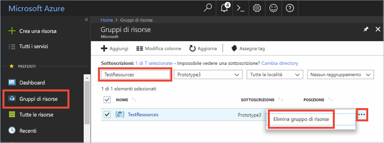

# <a name="quickstart-use-azure-cache-for-redis-with-nodejs"></a>Guida introduttiva: Usare Azure Cache for Redis con Node.js

In questa guida di avvio rapido si incorpora Azure Cache for Redis in un'app Node.js per accedere a una cache sicura e dedicata accessibile da qualsiasi applicazione in Azure.

## <a name="prerequisites"></a>Prerequisiti

- Sottoscrizione di Azure: [creare un account gratuito](https://azure.microsoft.com/free/)
- [node_redis](https://github.com/mranney/node_redis), che è possibile installare con il comando `npm install redis`. 

Per esempi relativi all'uso di altri client Node.js, vedere la documentazione specifica dei client Node.js disponibile in [Node.js Redis clients](https://redis.io/clients#nodejs)(Client Redis Node.js).

## <a name="create-a-cache"></a>Creare una cache
[!INCLUDE [redis-cache-create](../../includes/redis-cache-create.md)]

[!INCLUDE [redis-cache-access-keys](../../includes/redis-cache-access-keys.md)]


Aggiungere le variabili di ambiente per il **nome host** e la chiave di accesso **primaria**. Queste variabili verranno usate dal codice invece di includere le informazioni riservate direttamente nel codice.

```
set REDISCACHEHOSTNAME=contosoCache.redis.cache.windows.net
set REDISCACHEKEY=XXXXXXXXXXXXXXXXXXXXXXXXXXXXXXXXXXXXXXXXXXXX
```

## <a name="connect-to-the-cache"></a>Connettersi alla cache

Le build più recenti di [node_redis](https://github.com/mranney/node_redis) includono il supporto per la connessione a Cache Redis di Azure con SSL. L'esempio seguente mostra come connettersi a Cache Redis di Azure usando l'endpoint SSL 6380. 

```js
var redis = require("redis");

// Add your cache name and access key.
var client = redis.createClient(6380, process.env.REDISCACHEHOSTNAME,
    {auth_pass: process.env.REDISCACHEKEY, tls: {servername: process.env.REDISCACHEHOSTNAME}});
```

Non creare un nuova connessione per ogni operazione nel codice. Riutilizzare invece le connessioni quanto più possibile. 

## <a name="create-a-new-nodejs-app"></a>Creare una nuova app Node.js

Creare un nuovo file script denominato *redistest.js*.

Aggiungere lo script JavaScript di esempio seguente al file. Questo codice mostra come connettersi a un'istanza di Cache Redis di Azure usando il nome host della cache e le variabili di ambiente chiave. Il codice, inoltre, archivia e recupera un valore stringa nella cache. Vengono anche eseguiti i comandi `PING` e `CLIENT LIST`. Per altri esempi relativi all'uso di Redis con il client [node_redis](https://github.com/mranney/node_redis), vedere [https://redis.js.org/](https://redis.js.org/).

```js
var redis = require("redis");
var bluebird = require("bluebird");

bluebird.promisifyAll(redis.RedisClient.prototype);
bluebird.promisifyAll(redis.Multi.prototype);

async function testCache() {

    // Connect to the Azure Cache for Redis over the SSL port using the key.
    var cacheConnection = redis.createClient(6380, process.env.REDISCACHEHOSTNAME, 
        {auth_pass: process.env.REDISCACHEKEY, tls: {servername: process.env.REDISCACHEHOSTNAME}});
        
    // Perform cache operations using the cache connection object...

    // Simple PING command
    console.log("\nCache command: PING");
    console.log("Cache response : " + await cacheConnection.pingAsync());

    // Simple get and put of integral data types into the cache
    console.log("\nCache command: GET Message");
    console.log("Cache response : " + await cacheConnection.getAsync("Message"));    

    console.log("\nCache command: SET Message");
    console.log("Cache response : " + await cacheConnection.setAsync("Message",
        "Hello! The cache is working from Node.js!"));    

    // Demonstrate "SET Message" executed as expected...
    console.log("\nCache command: GET Message");
    console.log("Cache response : " + await cacheConnection.getAsync("Message"));    

    // Get the client list, useful to see if connection list is growing...
    console.log("\nCache command: CLIENT LIST");
    console.log("Cache response : " + await cacheConnection.clientAsync("LIST"));    
}

testCache();
```

Eseguire lo script con Node.js.

```
node redistest.js
```

Nell'esempio seguente è possibile notare che la chiave `Message` in precedenza aveva un valore nella cache che era stato impostato usando la Console Redis nel portale di Azure. L'app ha aggiornato questo valore memorizzato nella cache. L'app ha anche eseguito i comandi `PING` e `CLIENT LIST`.


## <a name="clean-up-resources"></a>Pulire le risorse

Se si proseguirà con l'esercitazione successiva, sarà possibile conservare le risorse create in questo avvio rapido e riutilizzarle.

In caso contrario, se si è terminato il lavoro con l'applicazione di esempio di avvio rapido, è possibile eliminare le risorse di Azure create in questo avvio rapido per evitare i costi correlati. 

> [!IMPORTANT]
> L'eliminazione di un gruppo di risorse è irreversibile e comporta l'eliminazione definitiva del gruppo di risorse e di tutte le risorse incluse nel gruppo. Assicurarsi di non eliminare accidentalmente il gruppo di risorse sbagliato o le risorse errate. Se le risorse per questo esempio sono state create all'interno di un gruppo di risorse esistente che contiene anche elementi da mantenere, è possibile eliminare ogni elemento singolarmente dai rispettivi pannelli anziché eliminare il gruppo di risorse.
>

Accedere al [portale di Azure](https://portal.azure.com) e selezionare **Gruppi di risorse**.

Nella casella di testo **Filtra per nome** immettere il nome del gruppo di risorse. Le istruzioni di questo articolo usano un gruppo di risorse denominato *TestResources*. Nel gruppo di risorse nell'elenco dei risultati selezionare **...** e quindi **Elimina gruppo di risorse**.



Verrà chiesto di confermare l'eliminazione del gruppo di risorse. Immettere il nome del gruppo di risorse per confermare e selezionare **Elimina**.

Dopo qualche istante il gruppo di risorse e tutte le risorse che contiene vengono eliminati.

## <a name="next-steps"></a>Passaggi successivi

In questa guida introduttiva si è visto come usare Cache Redis di Azure da un'applicazione Node.js. Continuare con la guida introduttiva successiva per usare Cache Redis di Azure con un'app Web ASP.NET.

> [!div class="nextstepaction"]
> [Creare un'app Web ASP.NET che usa Cache Redis di Azure.](./cache-web-app-howto.md)
