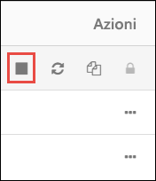

# Esercitazione: Estrarre, trasformare e caricare dati tramite Azure Databricks

In questa esercitazione viene eseguita un'operazione ETL (Extract, Transform, Load) tramite Azure Databricks. I dati vengono estratti da Azure Data Lake Store in Azure Databricks, vengono eseguite trasformazioni sui dati in Azure Databricks e quindi i dati trasformati vengono caricati in Azure SQL Data Warehouse.

I passaggi in questa esercitazione usano il connettore di SQL Data Warehouse per Azure Databricks per trasferire i dati in Azure Databricks. Questo connettore usa a sua volta l'Archiviazione BLOB di Azure come archivio temporaneo per i dati trasferiti tra un cluster di Azure Databricks e Azure SQL Data Warehouse.

L'illustrazione seguente mostra il flusso dell'applicazione:

Questa esercitazione illustra le attività seguenti:

> [!div class="checklist"]
> * Creare un'area di lavoro di Azure Databricks
> * Creare un cluster Spark in Azure Databricks
> * Creare un account di Azure Data Lake Store
> * Caricare dati in Azure Data Lake Store
> * Creare un notebook in Azure Databricks
> * Estrarre dati da Data Lake Store
> * Trasformare dati in Azure Databricks
> * Caricare i dati in Azure SQL Data Warehouse

Se non si ha una sottoscrizione di Azure, [creare un account gratuito](https://azure.microsoft.com/free/) prima di iniziare.

## prerequisiti

Prima di iniziare l'esercitazione, verificare che siano soddisfatti i requisiti seguenti:
- Creare un'istanza di Azure SQL Data Warehouse, creare una regola del firewall a livello di server e connettersi al server come amministratore del server. Seguire le istruzioni in [Avvio rapido: Creare un'istanza di Azure SQL Data Warehouse](../sql-data-warehouse/create-data-warehouse-portal.md)
- Creare una chiave master del database per Azure SQL Data Warehouse. Seguire le istruzioni riportate in [Creare una chiave master di un database](https://docs.microsoft.com/sql/relational-databases/security/encryption/create-a-database-master-key).
- Creare un account di archiviazione BLOB di Azure e un contenitore all'interno di tale account. Recuperare anche la chiave di accesso per accedere all'account di archiviazione. Seguire le istruzioni in [Avvio rapido: Creare un account di archiviazione BLOB di Azure](../storage/blobs/storage-quickstart-blobs-portal.md).

## Accedere al Portale di Azure

Accedere al [Portale di Azure](https://portal.azure.com/).

## Creare un'area di lavoro di Azure Databricks

In questa sezione viene creata un'area di lavoro di Azure Databricks usando il portale di Azure.

1. Nel portale di Azure selezionare **Crea una risorsa** > **Dati e analisi** > **Azure Databricks**.

    

3. Nella pagina **Servizio Azure Databricks** specificare i valori per creare un'area di lavoro di Databricks.

    

    Specificare i valori seguenti:
    
    |Proprietà  |Descrizione  |
    |---------|---------|
    |**Nome area di lavoro**     | Specificare un nome per l'area di lavoro di Databricks        |
    |**Sottoscrizione**     | Selezionare la sottoscrizione di Azure nell'elenco a discesa.        |
    |**Gruppo di risorse**     | Specificare se si vuole creare un nuovo gruppo di risorse o usarne uno esistente. Un gruppo di risorse è un contenitore con risorse correlate per una soluzione Azure. Per altre informazioni, vedere [Panoramica di Gestione risorse di Microsoft Azure](../azure-resource-manager/resource-group-overview.md). |
    |**Posizione**     | Selezionare **Stati Uniti orientali 2**. Per le altre aree disponibili, vedere [Prodotti disponibili in base all'area](https://azure.microsoft.com/regions/services/).        |
    |**Piano tariffario**     |  Scegliere tra **Standard** e **Premium**. Per altre informazioni su questi piani tariffari, vedere la [pagina dei prezzi di Databricks](https://azure.microsoft.com/pricing/details/databricks/).       |

    Selezionare **Aggiungi al dashboard** e quindi **Crea**.

4. La creazione dell'account richiede alcuni minuti, durante i quali il portale visualizza il riquadro **Invio della distribuzione per Azure Databricks** a destra. Potrebbe essere necessario scorrere verso destra nel dashboard per visualizzare il riquadro. È presente anche un indicatore di stato nella parte superiore della schermata. È possibile esaminare lo stato di avanzamento nelle due aree.

    

## Creare un cluster Spark in Databricks

1. Nel portale di Azure passare all'area di lavoro di Databricks creata e quindi selezionare **Avvia area di lavoro**.

2. Si verrà reindirizzati al portale di Azure Databricks. Nel portale selezionare **Cluster**.

    

3. Nella pagina **New cluster** (Nuovo cluster) specificare i valori per creare un cluster.

    

    Accettare tutti gli altri valori predefiniti tranne i seguenti:

    * Immettere un nome per il cluster.
    * Per questo articolo creare un cluster con il runtime **4.0**.
    * Assicurarsi di selezionare la casella di controllo **Terminate after \_\_ minutes of inactivity** (Termina dopo \_\_ minuti di attività). Specificare una durata in minuti per terminare il cluster, se questo non viene usato.
    
    Selezionare **Crea cluster**. Quando il cluster è in esecuzione, è possibile collegare blocchi appunti al cluster ed eseguire processi Spark.

## Creare un account di Azure Data Lake Store

In questa sezione è possibile creare un account Azure Data Lake Store e associare un'entità servizio di Azure Active Directory a tale account. Più avanti nell'esercitazione è possibile usare l'entità servizio in Azure Databricks per accedere ad Azure Data Lake Store.

1. Dal [portale di Azure](https://portal.azure.com) selezionare **Crea una risorsa** > **Archiviazione** > **Data Lake Store**.
3. Nel pannello **Nuovo Data Lake Store** inserire i valori come illustrato nello screenshot seguente:

    

    Specificare i valori seguenti:
    
    |Proprietà  |DESCRIZIONE  |
    |---------|---------|
    |**Nome**     | Immettere un nome univoco per l'account Data Lake Store.        |
    |**Sottoscrizione**     | Selezionare la sottoscrizione di Azure nell'elenco a discesa.        |
    |**Gruppo di risorse**     | Per questa esercitazione selezionare lo stesso gruppo di risorse usato durante la creazione dell'area di lavoro di Azure Databricks.  |
    |**Posizione**     | Selezionare **Stati Uniti orientali 2**.  |
    |**Pacchetto prezzi**     |  Selezionare **Pagamento in base al consumo**. |
    | **Impostazioni crittografia** | Mantenere le impostazioni predefinite. |

    Selezionare **Aggiungi al dashboard** e quindi **Crea**.

È ora possibile creare un'entità servizio di Azure Active Directory e associarla all'account Data Lake Store creato.

### Creare un'entità servizio di Azure Active Directory

1. Dal [portale di Azure](https://portal.azure.com) selezionare **Tutti i servizi** e quindi cercare **Azure Active Directory**.

2. Selezionare **Registrazioni per l'app**.

   

3. Selezionare **Registrazione nuova applicazione**.

   

4. Specificare un nome e un URL per l'applicazione. Selezionare **App Web/API** come tipo di applicazione da creare. Specificare un URL di accesso e quindi selezionare **Crea**.

   

Per accedere all'account Data Lake Store da Azure Databricks, è necessario avere i valori seguenti per l'entità servizio di Azure Active Directory creata:
- ID applicazione
- Chiave di autenticazione
- ID tenant

Nelle sezioni seguenti è possibile recuperare questi valori dall'entità servizio di Azure Active Directory creata in precedenza.

### Ottenere l'ID applicazione e la chiave di autenticazione per l'entità servizio

Quando si esegue l'accesso a livello di codice sono necessari l'ID dell'applicazione e una chiave di autenticazione. Per ottenere questi valori eseguire la procedura seguente:

1. Da **Registrazioni dell'app** in Azure Active Directory selezionare l'applicazione.

   

2. Copiare l'**ID applicazione** e archiviarlo nel codice dell'applicazione. Alcune [applicazioni di esempio](#log-in-as-the-application) definiscono questo valore come ID client.

   

3. Per generare una chiave di autenticazione, selezionare **Impostazioni**.

   

4. Per generare una chiave di autenticazione selezionare **Chiavi**.

   

5. Specificare una descrizione e una durata per la chiave. Al termine scegliere **Salva**.

   

   Dopo aver salvato la chiave viene visualizzato il valore della chiave. Copiare il valore in quanto non sarà possibile recuperare la chiave in seguito. Il valore della chiave sarà fornito insieme all'ID applicazione per eseguire l'accesso come applicazione. Salvare il valore della chiave in una posizione in cui l'applicazione possa recuperarlo.

   

### Ottenere l'ID tenant

Quando si esegue l'accesso a livello di codice è necessario specificare l'ID tenant con la richiesta di autenticazione.

1. Selezionare **Azure Active Directory**.

   

1. Per ottenere l'ID tenant selezionare **Proprietà** per il tenanto di Azure AD.

   

1. Copiare l'**ID directory**. Questo valore è l'ID tenant.

   

## Caricare dati nell’Archivio Data Lake

In questa sezione viene caricato un file di dati di esempio in Data Lake Store. Questo file viene usato in seguito in Azure Databricks per eseguire alcune trasformazioni. I dati di esempio (**small_radio_json.json**) usati in questa esercitazione sono disponibili in questo [repository di GitHub](https://github.com/Azure/usql/blob/master/Examples/Samples/Data/json/radiowebsite/small_radio_json.json).

1. Dal [portale di Azure](https://portal.azure.com) selezionare l'account Data Lake Store creato.

2. Dalla scheda **Panoramica** fare clic su **Esplora dati**.

    

3. In Esplora dati fare clic su **Carica**.

    

4. In **Carica i file** passare al percorso del file di dati di esempio e quindi selezionare **Aggiungi file selezionati**.

    

5. In questa esercitazione il file di dati è stato caricato nella radice di Data Lake Store. Il file è quindi ora disponibile in `adl://<YOUR_DATA_LAKE_STORE_ACCOUNT_NAME>.azuredatalakestore.net/small_radio_json.json`.

## Associare l'entità servizio ad Azure Data Lake Store

In questa sezione è possibile associare i dati nell'account Azure Data Lake Store all'entità servizio di Azure Active Directory creata. In questo modo si assicura che sia possibile accedere all'account Data Lake Store da Azure Databricks. Per lo scenario illustrato in questo articolo, viene eseguita la lettura dei dati in Data Lake Store per popolare una tabella in SQL Data Warehouse. In base all'articolo [Panoramica del controllo di accesso in Data Lake Store](../data-lake-store/data-lake-store-access-control.md#common-scenarios-related-to-permissions), per avere accesso in lettura a un file in Data Lake Store, è necessario disporre di:

- Autorizzazioni di **esecuzione** per tutte le cartelle nella struttura di cartelle che contiene il file.
- Autorizzazioni di **lettura** per il file stesso.

Per concedere queste autorizzazioni, eseguire la procedura seguente.

1. Dal [portale di Azure](https://portal.azure.com) selezionare l'account Data Lake Store creato e quindi selezionare **Esplora dati**.

    

2. In questo scenario, poiché il file di dati di esempio si trova nella radice della struttura di cartelle, è sufficiente assegnare le autorizzazioni di **esecuzione** per la radice della cartella. A tale scopo, dalla radice di Esplora dati selezionare **Accesso**.

    

3. In **Accesso** selezionare **Aggiungi**.

    

4. In **Assegna autorizzazioni** fare clic su **Seleziona utente o gruppo** e cercare l'entità servizio di Azure Active Directory creata in precedenza.

    

    Selezionare l'entità servizio AAD da assegnare e fare clic su **Seleziona**.

5. In **Assegna autorizzazioni** fare clic su **Selezionare le autorizzazioni** > **Esecuzione**. Mantenere gli altri valori predefiniti, quindi selezionare **OK** in **Selezionare le autorizzazioni** e quindi in **Assegna autorizzazioni**.

    

6. Tornare a Esplora dati e fare clic sul file per cui si vuole assegnare l'autorizzazione di lettura. In **Anteprima file** selezionare **Accesso**.

    

7. In **Accesso** selezionare **Aggiungi**. In **Assegna autorizzazioni** fare clic su **Seleziona utente o gruppo** e cercare l'entità servizio di Azure Active Directory creata in precedenza.

    

    Selezionare l'entità servizio AAD da assegnare e fare clic su **Seleziona**.

8. In **Assegna autorizzazioni** fare clic su **Selezionare le autorizzazioni** > **Lettura**. Selezionare **OK** in **Selezionare le autorizzazioni** e quindi in **Assegna autorizzazioni**.

    

    A questo punto, l'entità servizio dispone di autorizzazioni sufficienti per leggere il file di dati di esempio da Azure Data Lake Store.

## Estrarre dati da Data Lake Store

In questa sezione viene creato un notebook nell'area di lavoro di Azure Databricks e quindi vengono eseguiti frammenti di codice per estrarre dati da Data Lake Store in Azure Databricks.

1. Nel [portale di Azure](https://portal.azure.com) passare all'area di lavoro di Azure Databricks creata e quindi selezionare **Launch Workspace** (Avvia l'area di lavoro).

2. Nel riquadro a sinistra selezionare **Workspace** (Area di lavoro). Nell'elenco a discesa **Workspace** (Area di lavoro) selezionare **Create (Crea)** > **Notebook**.

    

2. Nella finestra di dialogo **Create Notebook** (Crea un notebook) immettere un nome per il notebook. Selezionare **Scala** come linguaggio e quindi selezionare il cluster Spark creato in precedenza.

    

    Selezionare **Create**.

3. Aggiungere il frammento di codice seguente in una cella di codice vuota e sostituire i valori segnaposto con i valori salvati in precedenza per l'entità servizio di Azure Active Directory.

        spark.conf.set("dfs.adls.oauth2.access.token.provider.type", "ClientCredential")
        spark.conf.set("dfs.adls.oauth2.client.id", "<APPLICATION-ID>")
        spark.conf.set("dfs.adls.oauth2.credential", "<AUTHENTICATION-KEY>")
        spark.conf.set("dfs.adls.oauth2.refresh.url", "https://login.microsoftonline.com/<TENANT-ID>/oauth2/token")

    Premere **MAIUSC+INVIO** per eseguire la cella di codice.

4. È ora possibile caricare il file JSON di esempio in Data Lake Store come frame di dati in Azure Databricks. Incollare il frammento di codice seguente in una nuova cella di codice, sostituire il valore segnaposto e quindi premere **MAIUSC + INVIO**.

        val df = spark.read.json("adl://<DATA LAKE STORE NAME>.azuredatalakestore.net/small_radio_json.json")

5. Eseguire il frammento di codice seguente per visualizzare i contenuti del frame di dati.

        df.show()

    L'output visualizzato dovrebbe essere simile al frammento di codice seguente:

        +---------------------+---------+---------+------+-------------+----------+---------+-------+--------------------+------+--------+-------------+---------+--------------------+------+-------------+------+
        |               artist|     auth|firstName|gender|itemInSession|  lastName|   length|  level|            location|method|    page| registration|sessionId|                song|status|           ts|userId|
        +---------------------+---------+---------+------+-------------+----------+---------+-------+--------------------+------+--------+-------------+---------+--------------------+------+-------------+------+
        | El Arrebato         |Logged In| Annalyse|     F|            2|Montgomery|234.57914| free  |  Killeen-Temple, TX|   PUT|NextSong|1384448062332|     1879|Quiero Quererte Q...|   200|1409318650332|   309|
        | Creedence Clearwa...|Logged In|   Dylann|     M|            9|    Thomas|340.87138| paid  |       Anchorage, AK|   PUT|NextSong|1400723739332|       10|        Born To Move|   200|1409318653332|    11|
        | Gorillaz            |Logged In|     Liam|     M|           11|     Watts|246.17751| paid  |New York-Newark-J...|   PUT|NextSong|1406279422332|     2047|                DARE|   200|1409318685332|   201|
        ...
        ...

I dati sono stati estratti da Azure Data Lake Store in Azure Databricks.

## Trasformare dati in Azure Databricks

I dati di esempio non elaborati del file **small_radio_json.json** sono relativi agli ascoltatori di una stazione radio e includono diverse colonne. In questa sezione vengono trasformati i dati in modo da recuperare solo colonne specifiche dal set di dati.

1. Recuperare prima di tutto solo le colonne *firstName*, *lastName*, *gender*, *location* e *level* dal frame di dati già creato.

        val specificColumnsDf = df.select("firstname", "lastname", "gender", "location", "level")
        specificColumnsDf.show()

    L'output visualizzato sarà simile al frammento di codice seguente:

        +---------+----------+------+--------------------+-----+
        |firstname|  lastname|gender|            location|level|
        +---------+----------+------+--------------------+-----+
        | Annalyse|Montgomery|     F|  Killeen-Temple, TX| free|
        |   Dylann|    Thomas|     M|       Anchorage, AK| paid|
        |     Liam|     Watts|     M|New York-Newark-J...| paid|
        |     Tess|  Townsend|     F|Nashville-Davidso...| free|
        |  Margaux|     Smith|     F|Atlanta-Sandy Spr...| free|
        |     Alan|     Morse|     M|Chicago-Napervill...| paid|
        |Gabriella|   Shelton|     F|San Jose-Sunnyval...| free|
        |   Elijah|  Williams|     M|Detroit-Warren-De...| paid|
        |  Margaux|     Smith|     F|Atlanta-Sandy Spr...| free|
        |     Tess|  Townsend|     F|Nashville-Davidso...| free|
        |     Alan|     Morse|     M|Chicago-Napervill...| paid|
        |     Liam|     Watts|     M|New York-Newark-J...| paid|
        |     Liam|     Watts|     M|New York-Newark-J...| paid|
        |   Dylann|    Thomas|     M|       Anchorage, AK| paid|
        |     Alan|     Morse|     M|Chicago-Napervill...| paid|
        |   Elijah|  Williams|     M|Detroit-Warren-De...| paid|
        |  Margaux|     Smith|     F|Atlanta-Sandy Spr...| free|
        |     Alan|     Morse|     M|Chicago-Napervill...| paid|
        |   Dylann|    Thomas|     M|       Anchorage, AK| paid|
        |  Margaux|     Smith|     F|Atlanta-Sandy Spr...| free|
        +---------+----------+------+--------------------+-----+

2. È possibile trasformare ulteriormente questi dati per rinominare la colonna **level** in **subscription_type**.

        val renamedColumnsDf = specificColumnsDf.withColumnRenamed("level", "subscription_type")
        renamedColumnsDf.show()

    L'output visualizzato sarà simile al frammento di codice seguente.

        +---------+----------+------+--------------------+-----------------+
        |firstname|  lastname|gender|            location|subscription_type|
        +---------+----------+------+--------------------+-----------------+
        | Annalyse|Montgomery|     F|  Killeen-Temple, TX|             free|
        |   Dylann|    Thomas|     M|       Anchorage, AK|             paid|
        |     Liam|     Watts|     M|New York-Newark-J...|             paid|
        |     Tess|  Townsend|     F|Nashville-Davidso...|             free|
        |  Margaux|     Smith|     F|Atlanta-Sandy Spr...|             free|
        |     Alan|     Morse|     M|Chicago-Napervill...|             paid|
        |Gabriella|   Shelton|     F|San Jose-Sunnyval...|             free|
        |   Elijah|  Williams|     M|Detroit-Warren-De...|             paid|
        |  Margaux|     Smith|     F|Atlanta-Sandy Spr...|             free|
        |     Tess|  Townsend|     F|Nashville-Davidso...|             free|
        |     Alan|     Morse|     M|Chicago-Napervill...|             paid|
        |     Liam|     Watts|     M|New York-Newark-J...|             paid|
        |     Liam|     Watts|     M|New York-Newark-J...|             paid|
        |   Dylann|    Thomas|     M|       Anchorage, AK|             paid|
        |     Alan|     Morse|     M|Chicago-Napervill...|             paid|
        |   Elijah|  Williams|     M|Detroit-Warren-De...|             paid|
        |  Margaux|     Smith|     F|Atlanta-Sandy Spr...|             free|
        |     Alan|     Morse|     M|Chicago-Napervill...|             paid|
        |   Dylann|    Thomas|     M|       Anchorage, AK|             paid|
        |  Margaux|     Smith|     F|Atlanta-Sandy Spr...|             free|
        +---------+----------+------+--------------------+-----------------+

## Caricare i dati in Azure SQL Data Warehouse

In questa sezione i dati trasformati vengono caricati in Azure SQL Data Warehouse. Usando il connettore di Azure SQL Data Warehouse per Azure Databricks, è possibile caricare direttamente un frame di dati come tabella in SQL Data Warehouse.

Come indicato in precedenza, il connettore di SQL Data Warehouse usa l'Archiviazione BLOB di Azure come posizione di archiviazione temporanea per caricare i dati tra Azure Databricks e Azure SQL Data Warehouse. Specificare quindi prima di tutto la configurazione per la connessione all'account di archiviazione. È necessario che l'account sia già stato creato come parte dei prerequisiti per questo articolo.

1. Specificare la configurazione per l'accesso all'account di archiviazione di Azure da Azure Databricks. Se si copia l'URL per l'archivio BLOB dal portale, assicurarsi di rimuovere *https://* dalla parte iniziale.

        val blobStorage = "<STORAGE ACCOUNT NAME>.blob.core.windows.net"
        val blobContainer = "<CONTAINER NAME>"
        val blobAccessKey = "<ACCESS KEY>"

2. Specificare una cartella temporanea che verrà usata durante lo spostamento dei dati tra Azure Databricks e Azure SQL Data Warehouse.

        val tempDir = "wasbs://" + blobContainer + "@" + blobStorage +"/tempDirs"

3. Eseguire il frammento di codice seguente per archiviare le chiavi di accesso dell'Archiviazione BLOB di Azure nella configurazione. In questo modo si assicura che non sia necessario mantenere la chiave di accesso nel notebook in testo normale.

        val acntInfo = "fs.azure.account.key."+ blobStorage
        sc.hadoopConfiguration.set(acntInfo, blobAccessKey)

4. Specificare i valori per la connessione all'istanza di Azure SQL Data Warehouse. È necessario che un'istanza di SQL Data Warehouse sia stata creata come parte dei prerequisiti.

        //SQL Data Warehouse related settings
        val dwDatabase = "<DATABASE NAME>"
        val dwServer = "<DATABASE SERVER NAME>"
        val dwUser = "<USER NAME>"
        val dwPass = "<PASSWORD>"
        val dwJdbcPort = "1433"
        val dwJdbcExtraOptions = "encrypt=true;trustServerCertificate=true;hostNameInCertificate=*.database.windows.net;loginTimeout=30;"
        val sqlDwUrl = "jdbc:sqlserver://" + dwServer + ".database.windows.net:" + dwJdbcPort + ";database=" + dwDatabase + ";user=" + dwUser+";password=" + dwPass + ";$dwJdbcExtraOptions"
        val sqlDwUrlSmall = "jdbc:sqlserver://" + dwServer + ".database.windows.net:" + dwJdbcPort + ";database=" + dwDatabase + ";user=" + dwUser+";password=" + dwPass

5. Eseguire il frammento di codice seguente per caricare il frame di dati trasformato, **renamedColumnsDf**, come tabella in SQL Data Warehouse. Il frammento di codice crea una tabella denominata **SampleTable** nel database SQL. Si noti che Azure SQL Data Warehouse richiede una chiave master. È possibile creare una chiave master eseguendo il comando "CREATE MASTER KEY;" in SQL Server Management Studio.

        spark.conf.set(
          "spark.sql.parquet.writeLegacyFormat",
          "true")
    
        renamedColumnsDf.write
            .format("com.databricks.spark.sqldw")
            .option("url", sqlDwUrlSmall)
            .option("dbtable", "SampleTable")
            .option( "forward_spark_azure_storage_credentials","True")
            .option("tempdir", tempDir)
            .mode("overwrite")
            .save()

6. Connettersi al database SQL e verificare che sia visualizzata una tabella **SampleTable**.

    

7. Eseguire una query selezionata per verificare i contenuti della tabella. Dovrebbe includere gli stessi dati del frame di dati **renamedColumnsDf**.

    

## Pulire le risorse

Dopo aver concluso l'esecuzione per l'esercitazione è possibile terminare il cluster. A questo scopo, nel riquadro sinistro dell'area di lavoro di Azure Databricks fare clic su **Clusters** (Cluster). Per il cluster che si vuole terminare, posizionare il cursore sui puntini di sospensione sotto la colonna **Actions** (Azioni) e fare clic sull'icona **Terminate** (Termina).

Se non viene terminato manualmente, il cluster si arresterà automaticamente se è stata selezionata la casella di controllo **Terminate after \_\_ minutes of inactivity** (Termina dopo \_\_ minuti di attività) durante la creazione del cluster. In tal caso, il cluster viene automaticamente arrestato se è rimasto inattivo per il tempo specificato.

## Passaggi successivi
Questa esercitazione ha illustrato come:

> [!div class="checklist"]
> * Creare un'area di lavoro di Azure Databricks
> * Creare un cluster Spark in Azure Databricks
> * Creare un account di Azure Data Lake Store
> * Caricare dati in Azure Data Lake Store
> * Creare un notebook in Azure Databricks
> * Estrarre dati da Data Lake Store
> * Trasformare dati in Azure Databricks
> * Caricare i dati in Azure SQL Data Warehouse

Passare all'esercitazione successiva per ottenere informazioni sullo streaming di dati in tempo reale in Azure Databricks tramite Hub eventi di Azure.

> [!div class="nextstepaction"]
>[Trasmettere dati in Azure Databricks tramite Hub eventi](databricks-stream-from-eventhubs.md)
