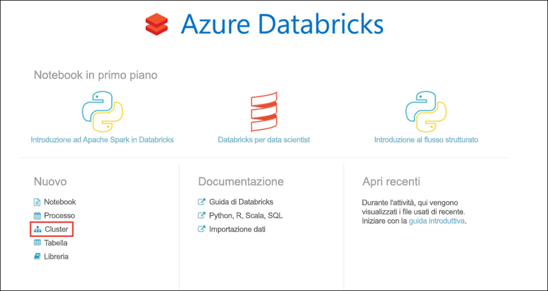
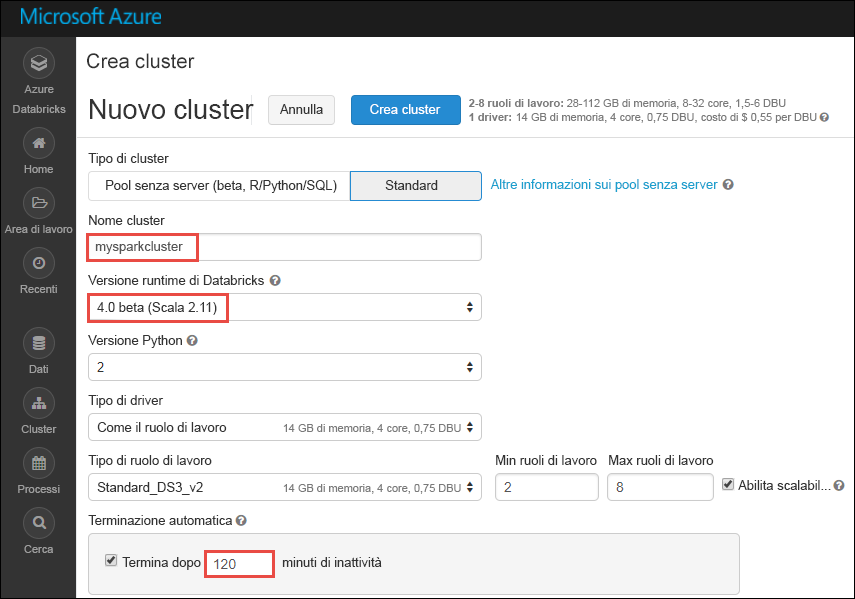

# Esercitazione: Analisi del sentiment su dati in streaming con Azure Databricks

In questa esercitazione si apprenderà come eseguire l'analisi del sentiment su un flusso di dati in tempo reale con Azure Databricks. Il sistema di inserimento dati in tempo reale viene configurato tramite Hub eventi di Azure. I messaggi di Hub eventi verranno usati in Azure Databricks tramite il connettore di Hub eventi per Apache Spark. Si useranno infine le API Servizi cognitivi di Microsoft per eseguire l'analisi del sentiment sui dati trasmessi. 

Al termine di questa esercitazione saranno stati trasmessi tweet di Twitter contenenti il termine "Azure" e sarà stata eseguita l'analisi del sentiment sui tweet.

L'illustrazione seguente mostra il flusso dell'applicazione:

Questa esercitazione illustra le attività seguenti: 

> [!div class="checklist"]
> * Creare un'area di lavoro di Azure Databricks
> * Creare un cluster Spark in Azure Databricks
> * Creare un'app Twitter per accedere ai dati in tempo reale
> * Creare notebook in Azure Databricks
> * Collegare librerie per Hub eventi e API Twitter
> * Creare un account Servizi cognitivi Microsoft e recuperare la chiave di accesso
> * Inviare tweet a Hub eventi
> * Leggere tweet da Hub eventi
> * Eseguire l'analisi del sentiment sui tweet

Se non si ha una sottoscrizione di Azure, [creare un account gratuito](https://azure.microsoft.com/free/) prima di iniziare.

## prerequisiti

Prima di iniziare l'esercitazione, verificare che siano soddisfatti i requisiti seguenti:
- Uno spazio dei nomi di Hub eventi in Azure.
- Un hub eventi nello spazio dei nomi.
- Stringa di connessione per l'accesso allo spazio dei nomi di Hub eventi. La stringa di connessione deve avere un formato simile a `Endpoint=sb://<namespace>.servicebus.windows.net/;SharedAccessKeyName=<key name>;SharedAccessKey=<key value>”`.
- Nome dei criteri di accesso condiviso e chiave dei criteri per Hub eventi.

È possibile soddisfare questi requisiti completando la procedura descritta nell'articolo [Creare uno spazio dei nomi di Hub eventi e un hub eventi](../event-hubs/event-hubs-create.md).

## Accedere al Portale di Azure

Accedere al [Portale di Azure](https://portal.azure.com/).

## Creare un'area di lavoro di Azure Databricks

In questa sezione viene creata un'area di lavoro di Azure Databricks usando il portale di Azure. 

1. Nel portale di Azure selezionare **Crea una risorsa** > **Dati e analisi** > **Azure Databricks (anteprima)**.

    

2. In **Azure Databricks (anteprima)** selezionare **Crea**.

3. Nella pagina **Servizio Azure Databricks** specificare i valori per creare un'area di lavoro di Databricks.

    

    Specificare i valori seguenti: 
     
    |Proprietà  |DESCRIZIONE  |
    |---------|---------|
    |**Nome area di lavoro**     | Specificare un nome per l'area di lavoro di Databricks        |
    |**Sottoscrizione**     | Selezionare la sottoscrizione di Azure nell'elenco a discesa.        |
    |**Gruppo di risorse**     | Specificare se si vuole creare un nuovo gruppo di risorse o usarne uno esistente. Un gruppo di risorse è un contenitore con risorse correlate per una soluzione Azure. Per altre informazioni, vedere [Panoramica di Gestione risorse di Microsoft Azure](../azure-resource-manager/resource-group-overview.md). |
    |**Posizione**     | Selezionare **Stati Uniti orientali 2**. Per le altre aree disponibili, vedere [Prodotti disponibili in base all'area](https://azure.microsoft.com/regions/services/).        |
    |**Piano tariffario**     |  Scegliere tra **Standard** e **Premium**. Per altre informazioni su questi piani tariffari, vedere la [pagina dei prezzi di Databricks](https://azure.microsoft.com/pricing/details/databricks/).       |

    Selezionare **Aggiungi al dashboard** e quindi **Crea**.

4. La creazione dell'account richiede alcuni minuti, durante i quali il portale visualizza il riquadro **Invio della distribuzione per Azure Databricks** a destra. Potrebbe essere necessario scorrere verso destra nel dashboard per visualizzare il riquadro. È presente anche un indicatore di stato nella parte superiore della schermata. È possibile esaminare lo stato di avanzamento nelle due aree.

    

## Creare un cluster Spark in Databricks

1. Nel portale di Azure passare all'area di lavoro di Databricks creata e quindi selezionare **Avvia area di lavoro**.

2. Si verrà reindirizzati al portale di Azure Databricks. Nel portale selezionare **Cluster**.

    

3. Nella pagina **New cluster** (Nuovo cluster) specificare i valori per creare un cluster.

    

    Accettare tutti gli altri valori predefiniti tranne i seguenti:

    * Immettere un nome per il cluster.
    * Per questo articolo è necessario creare un cluster con il runtime **4.0 (beta)**. 
    * Assicurarsi di selezionare la casella di controllo **Terminate after ____ minutes of inactivity** (Termina dopo ___ minuti di attività). Specificare una durata in minuti per terminare il cluster, se questo non viene usato.

    Selezionare **Crea cluster**. Quando il cluster è in esecuzione, è possibile collegare blocchi appunti al cluster ed eseguire processi Spark.

## Creare un'applicazione Twitter

Per ricevere un flusso di tweet in tempo reale, è necessario creare un'applicazione in Twitter. Seguire le istruzioni per creare un'applicazione Twitter e registrare i valori necessari per completare questa esercitazione.

1. In un Web browser passare alla [pagina di gestione delle applicazioni Twitter](http://twitter.com/app) e selezionare **Create New App** (Crea nuova app).

    

2. Nella pagina **Create an application** (Crea applicazione) specificare i dettagli per la nuova app e quindi selezionare **Create your Twitter application** (Crea applicazione Twitter).

    

3. Nella pagina dell'applicazione selezionare **Keys and Access Tokens** (Chiavi e token di accesso) e copiare i valori di **Consume Key** (Chiave utente) e **Consumer Secret** (Segreto utente). Selezionare anche **Create my access token** (Crea il mio token di accesso) per generare i token di accesso. Copiare i valori di **Access Token** (Token di accesso) e **Access Token Secret** (Segreto del token di accesso).

    

Salvare i valori recuperati per l'applicazione Twitter. Sarà necessario usare questi valori più avanti nell'esercitazione.

## Collegare librerie a un cluster Spark

In questa esercitazione verranno usate le API Twitter per inviare tweet a Hub eventi. Verrà anche usato il [connettore di Hub eventi per Apache Spark](https://github.com/Azure/azure-event-hubs-spark) per leggere e scrivere dati in Hub eventi di Azure. Per usare queste API nell'ambito del cluster, aggiungerle come librerie ad Azure Databricks e quindi associarle al cluster Spark. Le istruzioni seguenti illustrano come aggiungere la libreria alla cartella **Shared** (Condivisa) dell'area di lavoro.

1.  Nell'area di lavoro di Azure Databricks selezionare **Workspace** (Area di lavoro) e quindi fare clic con il pulsante destro del mouse su **Shared** (Condivisa). Nel menu di scelta rapida scegliere **Create (Crea)** > **Library (Raccolta)**.

    

2. Nella pagina New Library (Nuova libreria) selezionare **Maven Coordinate** (Coordinata Maven) in **Source** (Origine). Per **Coordinate** (Coordinata) immettere la coordinata del pacchetto da aggiungere. Le coordinate di Maven per le librerie usate in questa esercitazione sono le seguenti:

    * Connettore di Hub eventi per Spark - `com.microsoft.azure:azure-eventhubs-spark_2.11:2.3.0`
    * API Twitter - `org.twitter4j:twitter4j-core:4.0.6`

    

3. Selezionare **Create Library** (Crea libreria).

4. Passare alla cartella in cui è stata aggiunta la libreria e selezionare il nome della libreria.

    

5. Nella pagina della libreria selezionare il cluster in cui si vuole usare la libreria. Dopo aver associato la libreria al cluster, lo stato diventa immediatamente **Attached** (Collegato).

    

6. Ripetere questi passaggi per il pacchetto Twitter, `twitter4j-core:4.0.6`.

## Ottenere una chiave di accesso per Servizi cognitivi

In questa esercitazione si useranno le [API Analisi del testo di Servizi cognitivi Microsoft](../cognitive-services/text-analytics/overview.md) per eseguire l'analisi del sentiment su un flusso di tweet in tempo reale. Prima di usare le API è necessario creare un account Servizi cognitivi Microsoft in Azure e recuperare una chiave di accesso per usare le API Analisi del testo.

1. Accedere al [portale di Azure](https://portal.azure.com/).

2. Selezionare **+ Crea una risorsa**.
 
3. In Azure Marketplace selezionare **Intelligenza artificiale e servizi cognitivi** > **API Analisi del testo**.

    

4. Nella finestra di dialogo **Crea** specificare i valori seguenti:

    

    - Immettere un nome per l'account Servizi cognitivi.
    - Selezionare la sottoscrizione di Azure in cui viene creato l'account.
    - Selezionare una località di Azure.
    - Selezionare un piano tariffario per il servizio. Per altre informazioni sui prezzi di Servizi cognitivi, vedere la [pagina dei prezzi](https://azure.microsoft.com/pricing/details/cognitive-services/).
    - Specificare se si vuole creare un nuovo gruppo di risorse o selezionarne uno esistente.

    Selezionare **Create**.

5. Dopo aver creato l'account, nella scheda **Panoramica** selezionare **Mostra chiavi di accesso**.

    

    Copiare una parte dell'URL endpoint, come illustrato nello screenshot. Questo URL sarà necessario nell'esercitazione.

6. In **Gestisci chiavi** selezionare l'icona di copia per la chiave da usare.

    

7. Salvare i valori per l'URL endpoint e la chiave di accesso recuperati in questo passaggio perché saranno necessari più avanti in questa esercitazione.

## Creare notebook in Databricks

In questa sezione vengono creati due notebook nell'area di lavoro di Databricks con i nomi seguenti:

- **SendTweetsToEventHub**: notebook producer usato per ottenere tweet da Twitter e trasmetterli a Hub eventi.
- **AnalyzeTweetsFromEventHub**: notebook consumer usato per leggere tweet da Hub eventi ed eseguire l'analisi del sentiment.

1. Nel riquadro a sinistra selezionare **Workspace** (Area di lavoro). Nell'elenco a discesa **Workspace** (Area di lavoro) selezionare **Create** (Crea) e quindi **Notebook**.

    

2. Nella finestra di dialogo **Create Notebook** (Crea notebook) immettere **SendTweetsToEventHub**, selezionare **Scala** come linguaggio e selezionare il cluster Spark creato in precedenza.

    

    Selezionare **Create**.

3. Ripetere la procedura per creare il notebook **AnalyzeTweetsFromEventHub**.

## Inviare tweet a Hub eventi

Nel notebook **SendTweetsToEventHub** incollare il codice seguente e sostituire i segnaposto con i valori per lo spazio dei nomi di Hub eventi e l'applicazione Twitter creata in precedenza. Questo notebook trasmette i tweet con la parola chiave "Azure" a Hub eventi in tempo reale.

    import java.util._
    import scala.collection.JavaConverters._
    import com.microsoft.azure.eventhubs._
    import java.util.concurrent._
    
    val namespaceName = "<EVENT HUBS NAMESPACE>"
    val eventHubName = "<EVENT HUB NAME>"
    val sasKeyName = "<POLICY NAME>"
    val sasKey = "<POLICY KEY>"
    val connStr = new ConnectionStringBuilder()
                .setNamespaceName(namespaceName)
                .setEventHubName(eventHubName)
                .setSasKeyName(sasKeyName)
                .setSasKey(sasKey)
    
    val pool = Executors.newFixedThreadPool(1)
    val eventHubClient = EventHubClient.create(connStr.toString(), pool)
    
    def sendEvent(message: String) = {
      val messageData = EventData.create(message.getBytes("UTF-8"))
      eventHubClient.get().send(messageData) 
      System.out.println("Sent event: " + message + "\n")
    }
    
    import twitter4j._
    import twitter4j.TwitterFactory
    import twitter4j.Twitter
    import twitter4j.conf.ConfigurationBuilder
    
    // Twitter configuration!
    // Replace values below with yours
    
    val twitterConsumerKey = "<CONSUMER KEY>"
    val twitterConsumerSecret = "<CONSUMER SECRET>"
    val twitterOauthAccessToken = "<ACCESS TOKEN>"
    val twitterOauthTokenSecret = "<TOKEN SECRET>"
    
    val cb = new ConfigurationBuilder()
      cb.setDebugEnabled(true)
      .setOAuthConsumerKey(twitterConsumerKey)
      .setOAuthConsumerSecret(twitterConsumerSecret)
      .setOAuthAccessToken(twitterOauthAccessToken)
      .setOAuthAccessTokenSecret(twitterOauthTokenSecret)
    
    val twitterFactory = new TwitterFactory(cb.build())
    val twitter = twitterFactory.getInstance()
    
    // Getting tweets with keyword "Azure" and sending them to the Event Hub in realtime!
    
    val query = new Query(" #Azure ")
    query.setCount(100)
    query.lang("en")
    var finished = false
    while (!finished) {
      val result = twitter.search(query) 
      val statuses = result.getTweets()
      var lowestStatusId = Long.MaxValue
      for (status <- statuses.asScala) {
        if(!status.isRetweet()){ 
          sendEvent(status.getText())
        }
        lowestStatusId = Math.min(status.getId(), lowestStatusId)
        Thread.sleep(2000)
      }
      query.setMaxId(lowestStatusId - 1)
    }
    
    // Closing connection to the Event Hub
    eventHubClient.get().close()

Premere **MAIUSC+INVIO** per eseguire il notebook. L'output visualizzato sarà simile al frammento di codice seguente. Ogni evento nell'output è un tweet in tempo reale che viene inserito in Hub eventi. 

    Sent event: @Microsoft and @Esri launch Geospatial AI on Azure https://t.co/VmLUCiPm6q via @geoworldmedia #geoai #azure #gis #ArtificialIntelligence

    Sent event: Public preview of Java on App Service, built-in support for Tomcat and OpenJDK
    https://t.co/7vs7cKtvah 
    #cloudcomputing #Azure
    
    Sent event: 4 Killer #Azure Features for #Data #Performance https://t.co/kpIb7hFO2j by @RedPixie
    
    Sent event: Migrate your databases to a fully managed service with Azure SQL Database Managed Instance | #Azure | #Cloud https://t.co/sJHXN4trDk
    
    Sent event: Top 10 Tricks to #Save Money with #Azure Virtual Machines https://t.co/F2wshBXdoz #Cloud
    
    ...
    ...

## Leggere tweet da Hub eventi

Nel notebook **AnalyzeTweetsFromEventHub** incollare il codice seguente e sostituire il segnaposto con i valori dell'istanza di Hub eventi di Azure creata in precedenza. Questo notebook legge i tweet trasmessi in precedenza a Hub eventi tramite il notebook **SendTweetsToEventHub**.

    import org.apache.spark.eventhubs._

    // Build connection string with the above information 
    val connectionString = ConnectionStringBuilder("<EVENT HUBS CONNECTION STRING>")
      .setEventHubName("<EVENT HUB NAME>")
      .build
    
    val customEventhubParameters = 
      EventHubsConf(connectionString)
      .setMaxEventsPerTrigger(5)
    
    val incomingStream = spark.readStream.format("eventhubs").options(customEventhubParameters.toMap).load()
    
    incomingStream.printSchema
    
    // Sending the incoming stream into the console.
    // Data comes in batches!
    incomingStream.writeStream.outputMode("append").format("console").option("truncate", false).start().awaitTermination()

Si ottiene l'output seguente:

  
    root
     |-- body: binary (nullable = true)
     |-- offset: long (nullable = true)
     |-- seqNumber: long (nullable = true)
     |-- enqueuedTime: long (nullable = true)
     |-- publisher: string (nullable = true)
     |-- partitionKey: string (nullable = true)
   
    -------------------------------------------
    Batch: 0
    -------------------------------------------
    +------+------+--------------+---------------+---------+------------+
    |body  |offset|sequenceNumber|enqueuedTime   |publisher|partitionKey|
    +------+------+--------------+---------------+---------+------------+
    |[50 75 62 6C 69 63 20 70 72 65 76 69 65 77 20 6F 66 20 4A 61 76 61 20 6F 6E 20 41 70 70 20 53 65 72 76 69 63 65 2C 20 62 75 69 6C 74 2D 69 6E 20 73 75 70 70 6F 72 74 20 66 6F 72 20 54 6F 6D 63 61 74 20 61 6E 64 20 4F 70 65 6E 4A 44 4B 0A 68 74 74 70 73 3A 2F 2F 74 2E 63 6F 2F 37 76 73 37 63 4B 74 76 61 68 20 0A 23 63 6C 6F 75 64 63 6F 6D 70 75 74 69 6E 67 20 23 41 7A 75 72 65]                              |0     |0             |2018-03-09 05:49:08.86 |null     |null        |
    |[4D 69 67 72 61 74 65 20 79 6F 75 72 20 64 61 74 61 62 61 73 65 73 20 74 6F 20 61 20 66 75 6C 6C 79 20 6D 61 6E 61 67 65 64 20 73 65 72 76 69 63 65 20 77 69 74 68 20 41 7A 75 72 65 20 53 51 4C 20 44 61 74 61 62 61 73 65 20 4D 61 6E 61 67 65 64 20 49 6E 73 74 61 6E 63 65 20 7C 20 23 41 7A 75 72 65 20 7C 20 23 43 6C 6F 75 64 20 68 74 74 70 73 3A 2F 2F 74 2E 63 6F 2F 73 4A 48 58 4E 34 74 72 44 6B]            |168   |1             |2018-03-09 05:49:24.752|null     |null        | 
    +------+------+--------------+---------------+---------+------------+
    
    -------------------------------------------
    Batch: 1
    -------------------------------------------
    ...
    ...

L'output è in modalità binaria, quindi usare il frammento di codice seguente per convertirlo in stringa.

    import org.apache.spark.sql.types._
    import org.apache.spark.sql.functions._
    
    // Event Hub message format is JSON and contains "body" field
    // Body is binary, so we cast it to string to see the actual content of the message
    val messages = 
      incomingStream
      .withColumn("Offset", $"offset".cast(LongType))
      .withColumn("Time (readable)", $"enqueuedTime".cast(TimestampType))
      .withColumn("Timestamp", $"enqueuedTime".cast(LongType))
      .withColumn("Body", $"body".cast(StringType))
      .select("Offset", "Time (readable)", "Timestamp", "Body")
    
    messages.printSchema
    
    messages.writeStream.outputMode("append").format("console").option("truncate", false).start().awaitTermination()

L'output sarà ora simile al seguente:

    root
     |-- Offset: long (nullable = true)
     |-- Time (readable): timestamp (nullable = true)
     |-- Timestamp: long (nullable = true)
     |-- Body: string (nullable = true)
    
    -------------------------------------------
    Batch: 0
    -------------------------------------------
    +------+-----------------+----------+-------+
    |Offset|Time (readable)  |Timestamp |Body
    +------+-----------------+----------+-------+
    |0     |2018-03-09 05:49:08.86 |1520574548|Public preview of Java on App Service, built-in support for Tomcat and OpenJDK
    https://t.co/7vs7cKtvah 
    #cloudcomputing #Azure          |
    |168   |2018-03-09 05:49:24.752|1520574564|Migrate your databases to a fully managed service with Azure SQL Database Managed Instance | #Azure | #Cloud https://t.co/sJHXN4trDk    |
    |0     |2018-03-09 05:49:02.936|1520574542|@Microsoft and @Esri launch Geospatial AI on Azure https://t.co/VmLUCiPm6q via @geoworldmedia #geoai #azure #gis #ArtificialIntelligence|
    |176   |2018-03-09 05:49:20.801|1520574560|4 Killer #Azure Features for #Data #Performance https://t.co/kpIb7hFO2j by @RedPixie                                                    |
    +------+-----------------+----------+-------+
    -------------------------------------------
    Batch: 1
    -------------------------------------------
    ...
    ...

## Eseguire l'analisi del sentiment sui tweet

In questa sezione si esegue l'analisi del sentiment sui tweet ricevuti usando l'API Twitter. Per questa sezione, aggiungere i frammenti di codice allo stesso notebook **AnalyzeTweetsFromEventHub**.

Iniziare aggiungendo una nuova cella di codice nel notebook e incollare il frammento di codice seguente. Questo frammento di codice definisce i tipi di dati per l'uso dell'API di lingua e analisi del sentiment.

    import java.io._
    import java.net._
    import java.util._    

    class Document(var id: String, var text: String, var language: String = "", var sentiment: Double = 0.0) extends Serializable 

    class Documents(var documents: List[Document] = new ArrayList[Document]()) extends Serializable {
    
        def add(id: String, text: String, language: String = "") {
            documents.add (new Document(id, text, language))
        }
        def add(doc: Document) {
            documents.add (doc)
        }
    }

Aggiungere una nuova cella di codice e incollare il frammento di codice seguente. Questo frammento di codice è necessario per l'analisi delle stringhe JSON.

    class CC[T] extends Serializable { def unapply(a:Any):Option[T] = Some(a.asInstanceOf[T]) }
    object M extends CC[scala.collection.immutable.Map[String, Any]]
    object L extends CC[scala.collection.immutable.List[Any]]
    object S extends CC[String]
    object D extends CC[Double]

Aggiungere una nuova cella di codice e incollare il frammento di codice seguente. Questo frammento definisce un oggetto contenente funzioni che chiamano l'API Analisi del testo per eseguire il rilevamento della lingua e l'analisi del sentiment. Sostituire i segnaposto `<PROVIDE ACCESS KEY HERE>` e `<PROVIDE HOST HERE>` con i valori recuperati per l'account Servizi cognitivi.

    import javax.net.ssl.HttpsURLConnection
    import com.google.gson.Gson
    import com.google.gson.GsonBuilder
    import com.google.gson.JsonObject
    import com.google.gson.JsonParser
    import scala.util.parsing.json._
    
    object SentimentDetector extends Serializable {
      
      // Cognitive Services API connection settings
      val accessKey = "<PROVIDE ACCESS KEY HERE>"
      val host = "<PROVIDE HOST HERE>"
      val languagesPath = "/text/analytics/v2.0/languages"
      val sentimentPath = "/text/analytics/v2.0/sentiment"
      val languagesUrl = new URL(host+languagesPath)
      val sentimenUrl = new URL(host+sentimentPath)
      
      def getConnection(path: URL): HttpsURLConnection = {
        val connection = path.openConnection().asInstanceOf[HttpsURLConnection]
        connection.setRequestMethod("POST")
        connection.setRequestProperty("Content-Type", "text/json")
        connection.setRequestProperty("Ocp-Apim-Subscription-Key", accessKey)
        connection.setDoOutput(true)
        return connection
      }
      
      def prettify (json_text: String): String = {
        val parser = new JsonParser()
        val json = parser.parse(json_text).getAsJsonObject()
        val gson = new GsonBuilder().setPrettyPrinting().create()
        return gson.toJson(json)
      }
      
      // Handles the call to Cognitive Services API.
      // Expects Documents as parameters and the address of the API to call.
      // Returns an instance of Documents in response.
      def processUsingApi(inputDocs: Documents, path: URL): String = {
        val docText = new Gson().toJson(inputDocs)
        val encoded_text = docText.getBytes("UTF-8")
        val connection = getConnection(path)
        val wr = new DataOutputStream(connection.getOutputStream())
        wr.write(encoded_text, 0, encoded_text.length)
        wr.flush()
        wr.close()
    
        val response = new StringBuilder()
        val in = new BufferedReader(new InputStreamReader(connection.getInputStream()))
        var line = in.readLine()
        while (line != null) {
            response.append(line)
            line = in.readLine()
        }
        in.close()
        return response.toString()
      }
      
      // Calls the language API for specified documents.
      // Returns a documents with language field set.
      def getLanguage (inputDocs: Documents): Documents = { 
        try {
          val response = processUsingApi(inputDocs, languagesUrl)
          // In case we need to log the json response somewhere
          val niceResponse = prettify(response)
          val docs = new Documents()
          val result = for {
                // Deserializing the JSON response from the API into Scala types
                Some(M(map)) <- scala.collection.immutable.List(JSON.parseFull(niceResponse))
                L(documents) = map("documents")
                M(document) <- documents
                S(id) = document("id")
                L(detectedLanguages) = document("detectedLanguages")
                M(detectedLanguage) <- detectedLanguages
                S(language) = detectedLanguage("iso6391Name")
          } yield {
                docs.add(new Document(id = id, text = id, language = language))
          }
          return docs
        } catch {
              case e: Exception => return new Documents()
        }
      }
      
      // Calls the sentiment API for specified documents. Needs a language field to be set for each of them.
      // Returns documents with sentiment field set, taking a value in the range from 0 to 1.
      def getSentiment (inputDocs: Documents): Documents = {
        try {
          val response = processUsingApi(inputDocs, sentimenUrl)
          val niceResponse = prettify(response)
          val docs = new Documents()
          val result = for {
                // Deserializing the JSON response from the API into Scala types
                Some(M(map)) <- scala.collection.immutable.List(JSON.parseFull(niceResponse))
                L(documents) = map("documents")
                M(document) <- documents
                S(id) = document("id")
                D(sentiment) = document("score")
          } yield {
                docs.add(new Document(id = id, text = id, sentiment = sentiment))
          }
          return docs
        } catch {
            case e: Exception => return new Documents()
        }
      }
    }
    
    // User Defined Function for processing content of messages to return their sentiment.
    val toSentiment = udf((textContent: String) => {
      val inputDocs = new Documents()
      inputDocs.add (textContent, textContent)
      val docsWithLanguage = SentimentDetector.getLanguage(inputDocs)
      val docsWithSentiment = SentimentDetector.getSentiment(docsWithLanguage)
      if (docsWithLanguage.documents.isEmpty) {
        // Placeholder value to display for no score returned by the sentiment API
        (-1).toDouble
      } else {
        docsWithSentiment.documents.get(0).sentiment.toDouble
      }
    })

Aggiungere una cella di codice finale per preparare un frame di dati con il contenuto del tweet e il sentiment associato al tweet.

    // Prepare a dataframe with Content and Sentiment columns
    val streamingDataFrame = incomingStream.selectExpr("cast (body as string) AS Content").withColumn("Sentiment", toSentiment($"Content"))
    
    // Display the streaming data with the sentiment
    streamingDataFrame.writeStream.outputMode("append").format("console").option("truncate", false).start().awaitTermination()

Dovrebbe venire visualizzato un output simile al frammento di codice seguente:

    -------------------------------------------
    Batch: 0
    -------------------------------------------
    +--------------------------------+------------------+
    |Content                         |Sentiment         |
    +--------------------------------+------------------+
    |Public preview of Java on App Service, built-in support for Tomcat and OpenJDK
    https://t.co/7vs7cKtvah   #cloudcomputing #Azure          |0.7761918306350708|
    |Migrate your databases to a fully managed service with Azure SQL Database Managed Instance | #Azure | #Cloud https://t.co/sJHXN4trDk    |0.8558163642883301|
    |@Microsoft and @Esri launch Geospatial AI on Azure https://t.co/VmLUCiPm6q via @geoworldmedia #geoai #azure #gis #ArtificialIntelligence|0.5               |
    |4 Killer #Azure Features for #Data #Performance https://t.co/kpIb7hFO2j by @RedPixie                                                    |0.5               |
    +--------------------------------+------------------+ 

Un valore più vicino a **1** nella colonna **Sentiment** indica un'ottima esperienza con Azure. Un valore più vicino a **0** indica problemi riscontrati dall'utente durante l'interazione con Microsoft Azure. 

L'operazione è terminata. Usando Azure Databricks sono stati trasmessi dati in tempo reale a Hub eventi di Azure, i dati trasmessi sono stati usati tramite il connettore di Hub eventi ed è stata quindi eseguita l'analisi del sentiment sui dati trasmessi.

## Pulire le risorse

Dopo aver concluso l'esecuzione per l'esercitazione è possibile terminare il cluster. A questo scopo, nel riquadro sinistro dell'area di lavoro di Azure Databricks fare clic su **Clusters** (Cluster). Per il cluster che si vuole terminare, posizionare il cursore sui puntini di sospensione sotto la colonna **Actions** (Azioni) e fare clic sull'icona **Terminate** (Termina).

Se non viene terminato manualmente, il cluster si arresterà automaticamente se è stata selezionata la casella di controllo **Terminate after __ minutes of inactivity** (Termina dopo ___ minuti di attività) durante la creazione del cluster. In tal caso, il cluster verrà automaticamente arrestato se è rimasto inattivo per il tempo specificato.

## Passaggi successivi 
In questa esercitazione si è appreso come usare Azure Databricks per trasmettere dati a Hub eventi di Azure e quindi leggere i dati trasmessi da Hub eventi in tempo reale. Si è appreso come:
> [!div class="checklist"]
> * Creare un'area di lavoro di Azure Databricks
> * Creare un cluster Spark in Azure Databricks
> * Creare un'app Twitter per accedere ai dati in tempo reale
> * Creare notebook in Azure Databricks
> * Aggiungere e collegare librerie per Hub eventi e API Twitter
> * Creare un account Servizi cognitivi Microsoft e recuperare la chiave di accesso
> * Inviare tweet a Hub eventi
> * Leggere tweet da Hub eventi
> * Eseguire l'analisi del sentiment sui tweet

Passare all'esercitazione successiva per apprendere come eseguire attività di Machine Learning con Azure Databricks.

> [!div class="nextstepaction"]
>[Machine Learning con Azure Databricks ](https://docs.azuredatabricks.net/spark/latest/mllib/decision-trees.html)
