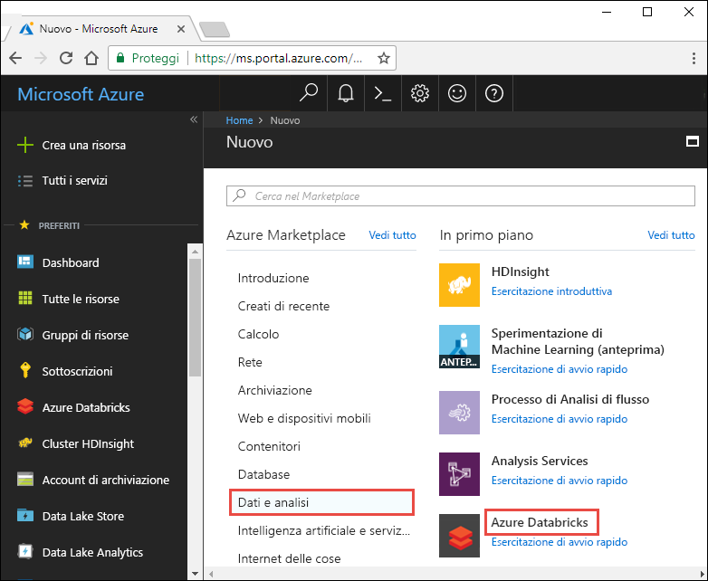
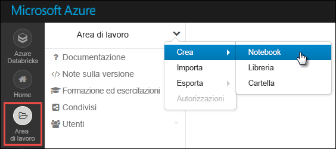
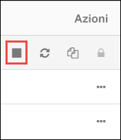

# <a name="tutorial-stream-data-into-azure-databricks-using-event-hubs"></a>Esercitazione: Trasmettere dati in Azure Databricks tramite Hub eventi

> [!IMPORTANT]
> Questa esercitazione funziona con la versione di Azure Databricks Runtime 5.2.

In questa esercitazione si connette un sistema di inserimento dati ad Azure Databricks per trasmettere dati a un cluster Apache Spark quasi in tempo reale. Il sistema di inserimento dati viene configurato con Hub eventi di Azure e quindi connesso ad Azure Databricks per l'elaborazione dei messaggi in arrivo. Per accedere a un flusso di dati si usano API Twitter per inserire i tweet in Hub eventi. Quando i dati sono disponibili in Azure Databricks, è possibile eseguire processi di analisi per esaminarli.

Al termine di questa esercitazione saranno stati trasmessi tweet di Twitter contenenti il termine "Azure" e sarà stata eseguita la lettura dei tweet in Azure Databricks.

L'illustrazione seguente mostra il flusso dell'applicazione:


Questa esercitazione illustra le attività seguenti:

> [!div class="checklist"]
> * Creare un'area di lavoro di Azure Databricks
> * Creare un cluster Spark in Azure Databricks
> * Creare un'app Twitter per accedere a dati in streaming
> * Creare notebook in Azure Databricks
> * Collegare librerie per Hub eventi e API Twitter
> * Inviare tweet a Hub eventi
> * Leggere tweet da Hub eventi

Se non si ha una sottoscrizione di Azure, [creare un account gratuito](https://azure.microsoft.com/free/) prima di iniziare.

> [!Note]
> Questa esercitazione non può essere eseguita usando una **sottoscrizione di valutazione gratuita di Azure**.
> Per usare un account gratuito per creare il cluster Azure Databricks, prima di creare il cluster, passare al profilo personale e impostare la sottoscrizione per il **pagamento in base al consumo**. Per altre informazioni, vedere [Account gratuito di Azure](https://azure.microsoft.com/free/).

## <a name="prerequisites"></a>Prerequisiti

Prima di iniziare l'esercitazione, verificare che siano soddisfatti i requisiti seguenti:
- Uno spazio dei nomi di Hub eventi in Azure.
- Un hub eventi nello spazio dei nomi.
- Stringa di connessione per l'accesso allo spazio dei nomi di Hub eventi. La stringa di connessione deve avere un formato simile a `Endpoint=sb://<namespace>.servicebus.windows.net/;SharedAccessKeyName=<key name>;SharedAccessKey=<key value>`.
- Nome dei criteri di accesso condiviso e chiave dei criteri per Hub eventi.

È possibile soddisfare questi requisiti completando la procedura descritta nell'articolo [Creare uno spazio dei nomi di Hub eventi e un hub eventi](../event-hubs/event-hubs-create.md).

## <a name="sign-in-to-the-azure-portal"></a>Accedere al portale di Azure

Accedere al [portale di Azure](https://portal.azure.com/).

## <a name="create-an-azure-databricks-workspace"></a>Creare un'area di lavoro di Azure Databricks

In questa sezione viene creata un'area di lavoro di Azure Databricks usando il portale di Azure.

1. Nel portale di Azure selezionare **Crea una risorsa** > **Dati e analisi** > **Azure Databricks**.

    

3. Nella pagina **Servizio Azure Databricks** specificare i valori per creare un'area di lavoro di Databricks.

    

    Specificare i valori seguenti:

    |Proprietà  |Descrizione  |
    |---------|---------|
    |**Nome area di lavoro**     | Specificare un nome per l'area di lavoro di Databricks        |
    |**Sottoscrizione**     | Selezionare la sottoscrizione di Azure nell'elenco a discesa.        |
    |**Gruppo di risorse**     | Specificare se si vuole creare un nuovo gruppo di risorse o usarne uno esistente. Un gruppo di risorse è un contenitore con risorse correlate per una soluzione Azure. Per altre informazioni, vedere [Panoramica di Gestione risorse di Microsoft Azure](../azure-resource-manager/resource-group-overview.md). |
    |**Posizione**     | Selezionare **Stati Uniti orientali 2**. Per le altre aree disponibili, vedere [Prodotti disponibili in base all'area](https://azure.microsoft.com/regions/services/).        |
    |**Piano tariffario**     |  Scegliere tra **Standard** e **Premium**. Per altre informazioni su questi piani tariffari, vedere la [pagina dei prezzi di Databricks](https://azure.microsoft.com/pricing/details/databricks/).       |

    Selezionare **Aggiungi al dashboard** e quindi **Crea**.

4. La creazione dell'account richiede alcuni minuti, durante i quali il portale visualizza il riquadro **Invio della distribuzione per Azure Databricks** a destra. Potrebbe essere necessario scorrere verso destra nel dashboard per visualizzare il riquadro. È presente anche un indicatore di stato nella parte superiore della schermata. È possibile esaminare lo stato di avanzamento nelle due aree.

    

## <a name="create-a-spark-cluster-in-databricks"></a>Creare un cluster Spark in Databricks

1. Nel portale di Azure passare all'area di lavoro di Databricks creata e quindi selezionare **Avvia area di lavoro**.

2. Si verrà reindirizzati al portale di Azure Databricks. Nel portale selezionare **Cluster**.

    

3. Nella pagina **New cluster** (Nuovo cluster) specificare i valori per creare un cluster.

    

    Accettare tutti gli altri valori predefiniti tranne i seguenti:

   * Immettere un nome per il cluster.
   * Per questo articolo creare un cluster con il runtime **5.2**.
   * Assicurarsi di selezionare la casella di controllo **Terminate after \_\_ minutes of inactivity** (Termina dopo \_\_ minuti di attività). Specificare una durata in minuti per terminare il cluster, se questo non viene usato.

   Selezionare le dimensioni del nodo di lavoro e di driver del cluster appropriate per i criteri tecnici e il [budget](https://azure.microsoft.com/en-us/pricing/details/databricks/) disponibile.

     Selezionare **Crea cluster**. Quando il cluster è in esecuzione, è possibile collegare blocchi appunti al cluster ed eseguire processi Spark.

## <a name="create-a-twitter-application"></a>Creare un'applicazione Twitter

Per ricevere un flusso di tweet, si crea un'applicazione in Twitter. Seguire le istruzioni per creare un'applicazione Twitter e registrare i valori necessari per completare questa esercitazione.

1. In un Web browser passare a [Twitter per sviluppatori](https://developer.twitter.com/en/apps) e selezionare **Create an app** (Crea un'app). Potrebbe essere visualizzato un messaggio che indica che è necessario richiedere un account per sviluppatori Twitter. Eseguire questa operazione e, dopo l'approvazione della richiesta, si dovrebbe ricevere un messaggio di posta elettronica di conferma. L'approvazione di un account di sviluppatore potrebbe richiedere diversi giorni.

    

2. Nella pagina **Create an application** (Crea applicazione) specificare i dettagli per la nuova app e quindi selezionare **Create your Twitter application** (Crea applicazione Twitter).

    

    

3. Nella pagina dell'applicazione selezionare **Keys and Tokens** (Chiavi e token) e copiare i valori di **Consumer API Key** (Chiave API consumer) e **Consumer API Secret Key** (Chiave privata API consumer). Selezionare inoltre **Create** (Crea) in **Access Token and Access Token Secret** (Token di accesso e Segreto del token di accesso) per generare i token di accesso. Copiare i valori di **Access Token** (Token di accesso) e **Access Token Secret** (Segreto del token di accesso).

    

Salvare i valori recuperati per l'applicazione Twitter. Sarà necessario usare questi valori più avanti nell'esercitazione.

## <a name="attach-libraries-to-spark-cluster"></a>Collegare librerie a un cluster Spark

In questa esercitazione verranno usate le API Twitter per inviare tweet a Hub eventi. Verrà anche usato il [connettore di Hub eventi per Apache Spark](https://github.com/Azure/azure-event-hubs-spark) per leggere e scrivere dati in Hub eventi di Azure. Per usare queste API nell'ambito del cluster, aggiungerle come librerie ad Azure Databricks e associarle al cluster Spark. Le istruzioni seguenti illustrano come aggiungere una libreria.

1. Nell'area di lavoro di Azure Databricks selezionare **Clusters** e scegliere il cluster Spark esistente. Nel menu del cluster scegliere **Libraries** (Librerie), quindi fare clic su **Install New** (Installa nuova).

   

   

2. Nella pagina New Library (Nuova libreria) selezionare **Maven**  in **Source** (Origine). Per **Coordinate** (Coordinata) fare clic su **Search Packages** (Cerca pacchetti) per cercare il pacchetto da aggiungere. Le coordinate di Maven per le librerie usate in questa esercitazione sono le seguenti:

   * Connettore di Hub eventi per Spark - `com.microsoft.azure:azure-eventhubs-spark_2.11:2.3.10`
   * API Twitter - `org.twitter4j:twitter4j-core:4.0.7`

     

     

3. Selezionare **Installa**.

4. Nel menu dei cluster verificare che entrambe le librerie siano installate e collegate correttamente.

    

6. Ripetere questi passaggi per il pacchetto Twitter, `twitter4j-core:4.0.7`.

## <a name="create-notebooks-in-databricks"></a>Creare notebook in Databricks

In questa sezione vengono creati due notebook nell'area di lavoro di Databricks con i nomi seguenti:

- **SendTweetsToEventHub**: notebook producer usato per ottenere tweet da Twitter e trasmetterli a Hub eventi.
- **ReadTweetsFromEventHub**: notebook consumer usato per leggere tweet da Hub eventi.

1. Nel riquadro a sinistra selezionare **Workspace** (Area di lavoro). Nell'elenco a discesa **Workspace** (Area di lavoro) selezionare **Create (Crea)**  > **Notebook**.

    

2. Nella finestra di dialogo **Create Notebook** (Crea notebook) immettere **SendTweetsToEventHub**, selezionare **Scala** come linguaggio e selezionare il cluster Spark creato in precedenza.

    

    Selezionare **Create** (Crea).

3. Ripetere la procedura per creare il notebook **ReadTweetsFromEventHub**.

## <a name="send-tweets-to-event-hubs"></a>Inviare tweet a Hub eventi

Nel notebook **SendTweetsToEventHub** incollare il codice seguente e sostituire i segnaposto con i valori per lo spazio dei nomi di Hub eventi e l'applicazione Twitter creata in precedenza. Questo notebook trasmette i tweet con la parola chiave "Azure" a Hub eventi in tempo reale.

> [!NOTE]
> L'API Twitter presenta determinate restrizioni e [quote](https://developer.twitter.com/en/docs/basics/rate-limiting.html) per le richieste. Se non si è soddisfatti della limitazione della velocità standard nell'API Twitter, è possibile generare contenuto di testo senza usare l'API Twitter in questo esempio. A tale scopo, impostare la variabile **dataSource** su `test` invece che su `twitter` e popolare l'elenco **testSource** con l'input di testo preferito.

```scala
    import scala.collection.JavaConverters._
    import com.microsoft.azure.eventhubs._
    import java.util.concurrent._
    import scala.collection.immutable._
    import scala.concurrent.Future
    import scala.concurrent.ExecutionContext.Implicits.global

    val namespaceName = "<EVENT HUBS NAMESPACE>"
    val eventHubName = "<EVENT HUB NAME>"
    val sasKeyName = "<POLICY NAME>"
    val sasKey = "<POLICY KEY>"
    val connStr = new ConnectionStringBuilder()
                .setNamespaceName(namespaceName)
                .setEventHubName(eventHubName)
                .setSasKeyName(sasKeyName)
                .setSasKey(sasKey)

    val pool = Executors.newScheduledThreadPool(1)
    val eventHubClient = EventHubClient.create(connStr.toString(), pool)

    def sleep(time: Long): Unit = Thread.sleep(time)

    def sendEvent(message: String, delay: Long) = {
      sleep(delay)
      val messageData = EventData.create(message.getBytes("UTF-8"))
      eventHubClient.get().send(messageData)
      System.out.println("Sent event: " + message + "\n")
    }

    // Add your own values to the list
    val testSource = List("Azure is the greatest!", "Azure isn't working :(", "Azure is okay.")

    // Specify 'test' if you prefer to not use Twitter API and loop through a list of values you define in `testSource`
    // Otherwise specify 'twitter'
    val dataSource = "test"

    if (dataSource == "twitter") {

      import twitter4j._
      import twitter4j.TwitterFactory
      import twitter4j.Twitter
      import twitter4j.conf.ConfigurationBuilder

      // Twitter configuration!
      // Replace values below with you

      val twitterConsumerKey = "<CONSUMER API KEY>"
      val twitterConsumerSecret = "<CONSUMER API SECRET>"
      val twitterOauthAccessToken = "<ACCESS TOKEN>"
      val twitterOauthTokenSecret = "<TOKEN SECRET>"

      val cb = new ConfigurationBuilder()
        cb.setDebugEnabled(true)
        .setOAuthConsumerKey(twitterConsumerKey)
        .setOAuthConsumerSecret(twitterConsumerSecret)
        .setOAuthAccessToken(twitterOauthAccessToken)
        .setOAuthAccessTokenSecret(twitterOauthTokenSecret)

      val twitterFactory = new TwitterFactory(cb.build())
      val twitter = twitterFactory.getInstance()

      // Getting tweets with keyword "Azure" and sending them to the Event Hub in realtime!
      val query = new Query(" #Azure ")
      query.setCount(100)
      query.lang("en")
      var finished = false
      while (!finished) {
        val result = twitter.search(query)
        val statuses = result.getTweets()
        var lowestStatusId = Long.MaxValue
        for (status <- statuses.asScala) {
          if(!status.isRetweet()){
            sendEvent(status.getText(), 5000)
          }
          lowestStatusId = Math.min(status.getId(), lowestStatusId)
        }
        query.setMaxId(lowestStatusId - 1)
      }

    } else if (dataSource == "test") {
      // Loop through the list of test input data
      while (true) {
        testSource.foreach {
          sendEvent(_,5000)
        }
      }

    } else {
      System.out.println("Unsupported Data Source. Set 'dataSource' to \"twitter\" or \"test\"")
    }

    // Closing connection to the Event Hub
    eventHubClient.get().close()
```

Premere **MAIUSC+INVIO** per eseguire il notebook. Verrà visualizzato un output simile al frammento di codice seguente. Ogni evento nell'output è un tweet contenente il termine "Azure" che viene inserito in Hub eventi.

    Sent event: @Microsoft and @Esri launch Geospatial AI on Azure https://t.co/VmLUCiPm6q via @geoworldmedia #geoai #azure #gis #ArtificialIntelligence

    Sent event: Public preview of Java on App Service, built-in support for Tomcat and OpenJDK
    https://t.co/7vs7cKtvah
    #cloudcomputing #Azure

    Sent event: 4 Killer #Azure Features for #Data #Performance https://t.co/kpIb7hFO2j by @RedPixie

    Sent event: Migrate your databases to a fully managed service with Azure SQL Database Managed Instance | #Azure | #Cloud https://t.co/sJHXN4trDk

    Sent event: Top 10 Tricks to #Save Money with #Azure Virtual Machines https://t.co/F2wshBXdoz #Cloud

    ...
    ...

## <a name="read-tweets-from-event-hubs"></a>Leggere tweet da Hub eventi

Nel notebook **ReadTweetsFromEventHub** incollare il codice seguente e sostituire il segnaposto con i valori dell'istanza di Hub eventi di Azure creata in precedenza. Questo notebook legge i tweet trasmessi in precedenza a Hub eventi tramite il notebook **SendTweetsToEventHub**.

```scala

    import org.apache.spark.eventhubs._
    import com.microsoft.azure.eventhubs._

    // Build connection string with the above information
    val namespaceName = "<EVENT HUBS NAMESPACE>"
    val eventHubName = "<EVENT HUB NAME>"
    val sasKeyName = "<POLICY NAME>"
    val sasKey = "<POLICY KEY>"
    val connStr = new com.microsoft.azure.eventhubs.ConnectionStringBuilder()
                .setNamespaceName(namespaceName)
                .setEventHubName(eventHubName)
                .setSasKeyName(sasKeyName)
                .setSasKey(sasKey)

    val customEventhubParameters =
      EventHubsConf(connStr.toString())
      .setMaxEventsPerTrigger(5)

    val incomingStream = spark.readStream.format("eventhubs").options(customEventhubParameters.toMap).load()

    incomingStream.printSchema

    // Sending the incoming stream into the console.
    // Data comes in batches!
    incomingStream.writeStream.outputMode("append").format("console").option("truncate", false).start().awaitTermination()
```

Si ottiene l'output seguente:


    root
     |-- body: binary (nullable = true)
     |-- offset: long (nullable = true)
     |-- seqNumber: long (nullable = true)
     |-- enqueuedTime: long (nullable = true)
     |-- publisher: string (nullable = true)
     |-- partitionKey: string (nullable = true)

    -------------------------------------------
    Batch: 0
    -------------------------------------------
    +------+------+--------------+---------------+---------+------------+
    |body  |offset|sequenceNumber|enqueuedTime   |publisher|partitionKey|
    +------+------+--------------+---------------+---------+------------+
    |[50 75 62 6C 69 63 20 70 72 65 76 69 65 77 20 6F 66 20 4A 61 76 61 20 6F 6E 20 41 70 70 20 53 65 72 76 69 63 65 2C 20 62 75 69 6C 74 2D 69 6E 20 73 75 70 70 6F 72 74 20 66 6F 72 20 54 6F 6D 63 61 74 20 61 6E 64 20 4F 70 65 6E 4A 44 4B 0A 68 74 74 70 73 3A 2F 2F 74 2E 63 6F 2F 37 76 73 37 63 4B 74 76 61 68 20 0A 23 63 6C 6F 75 64 63 6F 6D 70 75 74 69 6E 67 20 23 41 7A 75 72 65]                              |0     |0             |2018-03-09 05:49:08.86 |null     |null        |
    |[4D 69 67 72 61 74 65 20 79 6F 75 72 20 64 61 74 61 62 61 73 65 73 20 74 6F 20 61 20 66 75 6C 6C 79 20 6D 61 6E 61 67 65 64 20 73 65 72 76 69 63 65 20 77 69 74 68 20 41 7A 75 72 65 20 53 51 4C 20 44 61 74 61 62 61 73 65 20 4D 61 6E 61 67 65 64 20 49 6E 73 74 61 6E 63 65 20 7C 20 23 41 7A 75 72 65 20 7C 20 23 43 6C 6F 75 64 20 68 74 74 70 73 3A 2F 2F 74 2E 63 6F 2F 73 4A 48 58 4E 34 74 72 44 6B]            |168   |1             |2018-03-09 05:49:24.752|null     |null        |
    +------+------+--------------+---------------+---------+------------+

    -------------------------------------------
    Batch: 1
    -------------------------------------------
    ...
    ...

L'output è in modalità binaria, quindi usare il frammento di codice seguente per convertirlo in stringa.

```scala
    import org.apache.spark.sql.types._
    import org.apache.spark.sql.functions._

    // Event Hub message format is JSON and contains "body" field
    // Body is binary, so we cast it to string to see the actual content of the message
    val messages =
      incomingStream
      .withColumn("Offset", $"offset".cast(LongType))
      .withColumn("Time (readable)", $"enqueuedTime".cast(TimestampType))
      .withColumn("Timestamp", $"enqueuedTime".cast(LongType))
      .withColumn("Body", $"body".cast(StringType))
      .select("Offset", "Time (readable)", "Timestamp", "Body")

    messages.printSchema

    messages.writeStream.outputMode("append").format("console").option("truncate", false).start().awaitTermination()
```

L'output sarà ora simile al seguente:

    root
     |-- Offset: long (nullable = true)
     |-- Time (readable): timestamp (nullable = true)
     |-- Timestamp: long (nullable = true)
     |-- Body: string (nullable = true)

    -------------------------------------------
    Batch: 0
    -------------------------------------------
    +------+-----------------+----------+-------+
    |Offset|Time (readable)  |Timestamp |Body
    +------+-----------------+----------+-------+
    |0     |2018-03-09 05:49:08.86 |1520574548|Public preview of Java on App Service, built-in support for Tomcat and OpenJDK
    https://t.co/7vs7cKtvah
    #cloudcomputing #Azure          |
    |168   |2018-03-09 05:49:24.752|1520574564|Migrate your databases to a fully managed service with Azure SQL Database Managed Instance | #Azure | #Cloud https://t.co/sJHXN4trDk    |
    |0     |2018-03-09 05:49:02.936|1520574542|@Microsoft and @Esri launch Geospatial AI on Azure https://t.co/VmLUCiPm6q via @geoworldmedia #geoai #azure #gis #ArtificialIntelligence|
    |176   |2018-03-09 05:49:20.801|1520574560|4 Killer #Azure Features for #Data #Performance https://t.co/kpIb7hFO2j by @RedPixie                                                    |
    +------+-----------------+----------+-------+
    -------------------------------------------
    Batch: 1
    -------------------------------------------
    ...
    ...

L'operazione è terminata. Usando Azure Databricks sono stati trasmessi dati a Hub eventi di Azure quasi in tempo reale. I dati trasmessi sono stati quindi usati tramite il connettore di Hub eventi per Apache Spark. Per altre informazioni su come usare il connettore di Hub eventi per Spark, vedere la [documentazione del connettore](https://github.com/Azure/azure-event-hubs-spark/tree/master/docs).

## <a name="clean-up-resources"></a>Pulire le risorse

Dopo aver concluso l'esecuzione per l'esercitazione è possibile terminare il cluster. A questo scopo, nel riquadro sinistro dell'area di lavoro di Azure Databricks fare clic su **Clusters** (Cluster). Per il cluster che si vuole terminare, posizionare il cursore sui puntini di sospensione sotto la colonna **Actions** (Azioni) e fare clic sull'icona **Terminate** (Termina).



Se non viene terminato manualmente, il cluster si arresterà automaticamente se è stata selezionata la casella di controllo **Terminate after \_\_ minutes of inactivity** (Termina dopo \_\_ minuti di attività) durante la creazione del cluster. In tal caso, il cluster verrà automaticamente arrestato se è rimasto inattivo per il tempo specificato.

## <a name="next-steps"></a>Passaggi successivi
Questa esercitazione ha illustrato come:

> [!div class="checklist"]
> * Creare un'area di lavoro di Azure Databricks
> * Creare un cluster Spark in Azure Databricks
> * Creare un'app Twitter per generare dati in streaming
> * Creare notebook in Azure Databricks
> * Aggiungere librerie per Hub eventi e API Twitter
> * Inviare tweet a Hub eventi
> * Leggere tweet da Hub eventi

Passare all'esercitazione successiva per informazioni su come eseguire l'analisi del sentiment sui dati trasmessi con Azure Databricks e l'[API Servizi cognitivi](../cognitive-services/text-analytics/overview.md).

> [!div class="nextstepaction"]
>[Analisi della valutazione sui dati in streaming con Azure Databricks](databricks-sentiment-analysis-cognitive-services.md)
