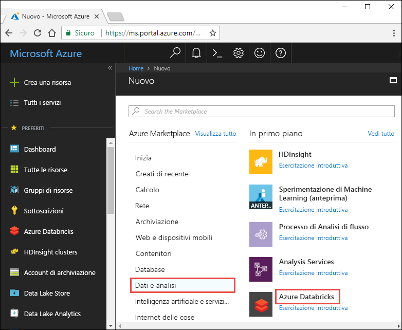
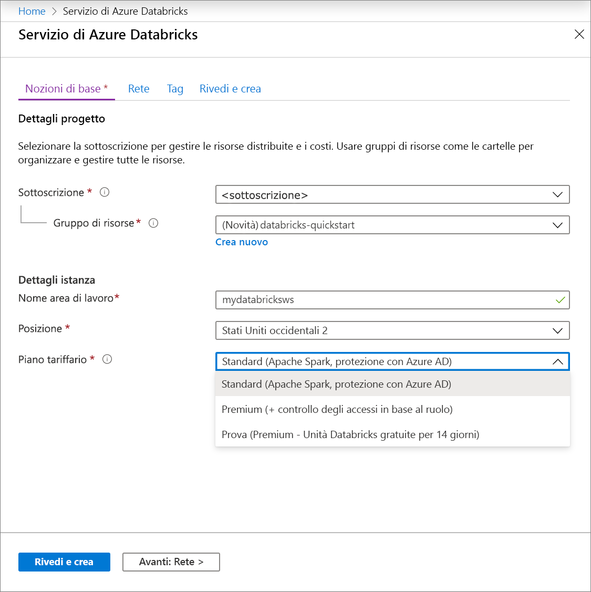
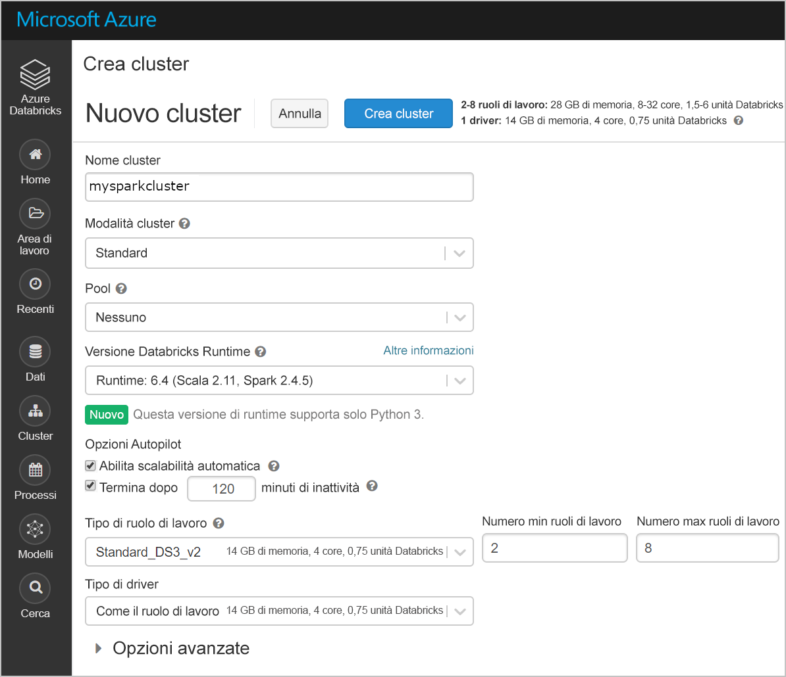
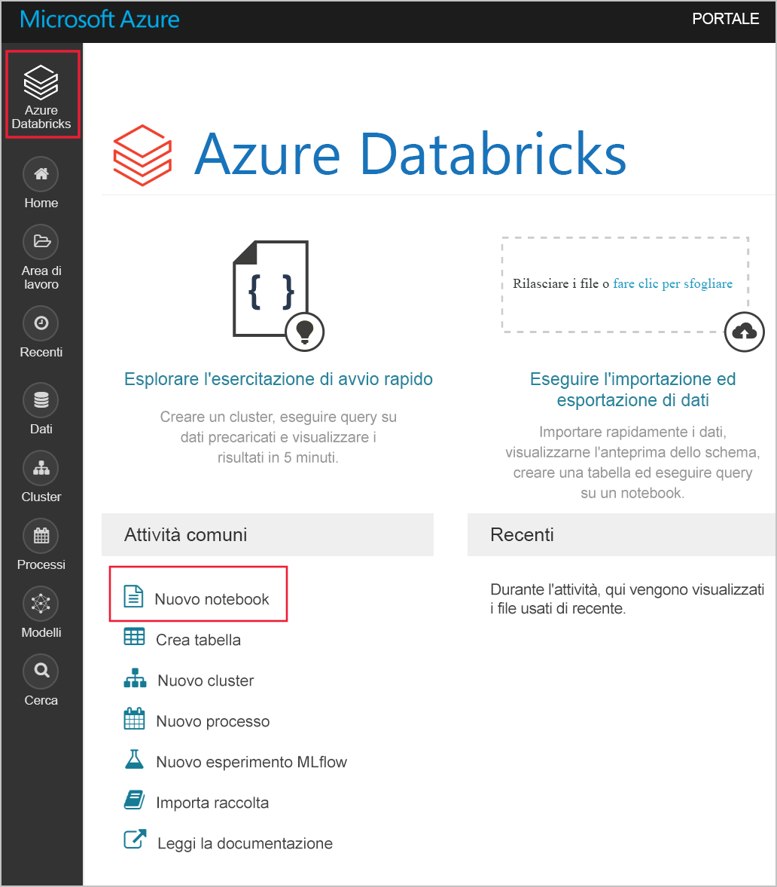
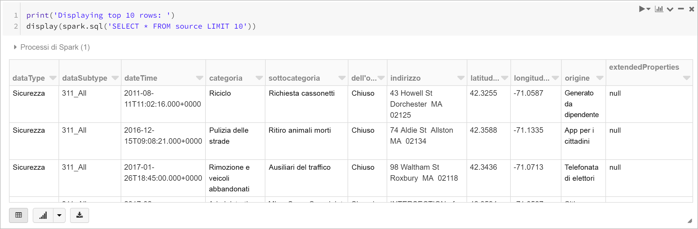
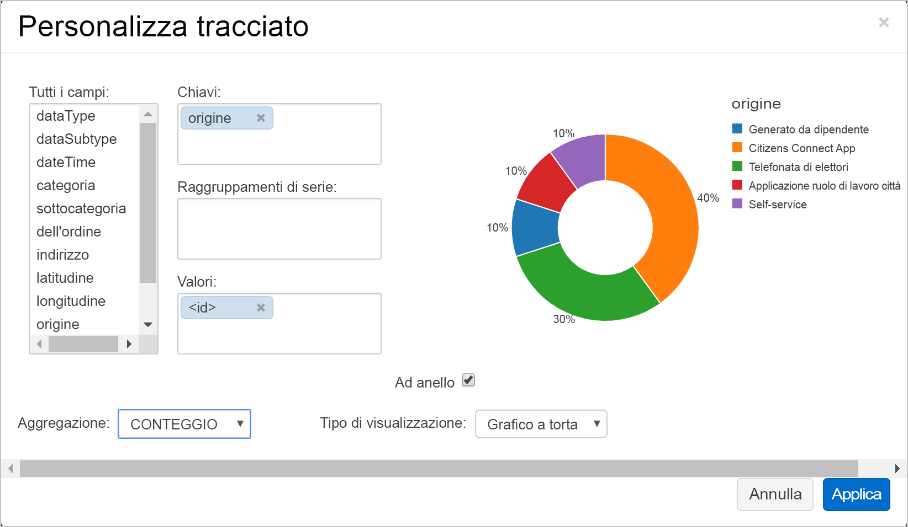
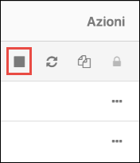

# <a name="quickstart-run-a-spark-job-on-azure-databricks-using-the-azure-portal"></a>Guida introduttiva: Eseguire un processo Spark in Azure Databricks mediante il portale di Azure

Questa guida introduttiva illustra come creare un'area di lavoro di Azure Databricks e un cluster Apache Spark all'interno di tale area di lavoro. Viene infine spiegato come eseguire un processo Spark nel cluster Databricks. Per altre informazioni su Azure Databricks, vedere [Informazioni su Azure Databricks](what-is-azure-databricks.md).

## <a name="log-in-to-the-azure-portal"></a>Accedere al Portale di Azure.

Accedere al [portale di Azure](https://portal.azure.com).

## <a name="create-a-databricks-workspace"></a>Creare un'area di lavoro di Databricks

In questa sezione viene creata un'area di lavoro di Azure Databricks usando il portale di Azure. 

1. Nel portale di Azure fare clic su **+**, **Dati e analisi** e infine su **Azure Databricks (anteprima)**. 

    

2. In **Azure Databricks (anteprima)** fare clic su **Crea**.

    > [!NOTE]
    > Azure Databricks è attualmente disponibile in anteprima limitata. Se si vuole che la propria sottoscrizione di Azure venga presa in considerazione ai fini dell'inserimento nell'elenco degli utenti consentiti per l'anteprima, è necessario compilare il [modulo di iscrizione](https://databricks.azurewebsites.net/).

2. Nella pagina **Azure Databricks Service** (Servizio Azure Databricks) specificare i valori seguenti:

    

    * Per **Nome dell'area di lavoro** specificare un nome per l'area di lavoro di Databricks.
    * Per **Sottoscrizione** selezionare la sottoscrizione di Azure nell'elenco a discesa.
    * Per **Gruppo di risorse**, specificare se si desidera creare un nuovo gruppo di risorse o usarne uno esistente. Un gruppo di risorse è un contenitore con risorse correlate per una soluzione Azure. Per altre informazioni, vedere [Panoramica di Gestione risorse di Microsoft Azure](../azure-resource-manager/resource-group-overview.md).
    * Per **Località** selezionare **Stati Uniti orientali 2**. Per le altre aree disponibili, vedere [Prodotti disponibili in base all'area](https://azure.microsoft.com/regions/services/).

3. Fare clic su **Crea**.

## <a name="create-a-spark-cluster-in-databricks"></a>Creare un cluster Spark in Databricks

1. Nel portale di Azure passare all'area di lavoro di Databricks creata e quindi fare clic su **Initialize Workspace** (Inizializza l'area di lavoro).

2. Si verrà reindirizzati al portale di Azure Databricks. Nel portale fare clic su **Cluster**.

    

3. Nella pagina **New cluster** (Nuovo cluster) specificare i valori per creare un cluster.

    

    * Immettere un nome per il cluster.
    * Assicurarsi di selezionare la casella di controllo **Terminate after ___ minutes of activity** (Termina dopo ___ minuti di attività). Specificare una durata in minuti per terminare il cluster, se questo non viene usato.
    * Accettare tutti gli altri valori predefiniti. 
    * Fare clic su **Create cluster** (Crea cluster). Quando il cluster è in esecuzione, è possibile collegare blocchi appunti al cluster ed eseguire processi Spark.

Per altre informazioni sulla creazione di cluster, vedere [Create a Spark cluster in Azure Databricks](https://docs.azuredatabricks.net/user-guide/clusters/create.html) (Creare un cluster Spark in Azure Databricks).

## <a name="run-a-spark-sql-job"></a>Eseguire un processo Spark SQL

Prima di iniziare con questa sezione, è necessario completare le operazioni seguenti:

* [Creare un account di Archiviazione di Azure](../storage/common/storage-create-storage-account.md#create-a-storage-account). 
* Scaricare un file JSON di esempio [da GitHub](https://github.com/Azure/usql/blob/master/Examples/Samples/Data/json/radiowebsite/small_radio_json.json). 
* Caricare il file JSON di esempio nell'account di archiviazione di Azure creato. Per caricare file, è possibile usare [Microsoft Azure Storage Explorer](../vs-azure-tools-storage-manage-with-storage-explorer.md).

Eseguire le operazioni seguenti per creare un blocco appunti in Databricks, configurare il blocco appunti per la lettura dei dati da un account di archiviazione BLOB di Azure e quindi eseguire un processo Spark SQL sui dati.

1. Nel riquadro sinistro fare clic su **Area di lavoro**. Nell'elenco a discesa **Area di lavoro** fare clic su **Crea** e quindi su **Notebook** (Blocco appunti).

    

2. Nella finestra di dialogo **Create Notebook** (Crea blocco appunti) immettere un nome, selezionare **Scala** come linguaggio e selezionare il cluster Spark creato in precedenza.

    

    Fare clic su **Crea**.

3. Nel frammento di codice seguente sostituire `{YOUR STORAGE ACCOUNT NAME}` con il nome dell'account di archiviazione di Azure creato e `{YOUR STORAGE ACCOUNT ACCESS KEY}` con la chiave di accesso dell'account di archiviazione. Incollare il frammento in una cella vuota del blocco appunti e quindi premere MAIUSC+INVIO per eseguire la cella di codice. Questo frammento di codice consente di configurare il blocco appunti per la lettura dei dati dall'archiviazione BLOB di Azure.

       spark.conf.set("fs.azure.account.key.{YOUR STORAGE ACCOUNT NAME}.blob.core.windows.net", "{YOUR STORAGE ACCOUNT ACCESS KEY}")
    
    Per istruzioni su come recuperare la chiave dell'account di archiviazione, vedere [Gestire le chiavi di accesso alle risorse di archiviazione](../storage/common/storage-create-storage-account.md#manage-your-storage-account).

    > [!NOTE]
    > È anche possibile usare Azure Data Lake Store con un cluster Spark in Azure Databricks. Per istruzioni, vedere [Use Data Lake Store with Azure Databricks](https://go.microsoft.com/fwlink/?linkid=864084) (Usare Data Lake Store con Azure Databricks).

4. Eseguire un'istruzione SQL per creare una tabella temporanea con i dati dal file di dati JSON di esempio **small_radio_json.json**. Nel frammento di codice seguente sostituire i valori dei segnaposto con il nome del contenitore e il nome dell'account di archiviazione. Incollare il frammento in una cella di codice del blocco appunti e quindi premere MAIUSC+INVIO. Nel frammento di codice `path` indica il percorso del file JSON di esempio caricato nell'account di archiviazione di Azure.

    ```sql
    %sql 
    CREATE TEMPORARY TABLE radio_sample_data
    USING json
    OPTIONS (
     path "wasbs://{YOUR CONTAINER NAME}@{YOUR STORAGE ACCOUNT NAME}.blob.core.windows.net/small_radio_json.json"
    )
    ```

    Dopo il completamento del comando, tutti i dati presenti nel file JSON sono visualizzati in una tabella nel cluster Databricks.

    Il comando magic `%sql` del linguaggio consente di eseguire codice SQL dal blocco appunti anche se questo è di un altro tipo. Per altre informazioni, vedere [Mixing languages in a notebook](https://docs.azuredatabricks.net/user-guide/notebooks/index.html#mixing-languages-in-a-notebook) (Combinazione di linguaggi in un blocco appunti).

5. Esaminiamo ora uno snapshot dei dati JSON di esempio per comprendere meglio la query eseguita. Incollare il frammento di codice seguente in una cella di codice e premere **MAIUSC+INVIO**.

    ```sql
    %sql 
    SELECT * from radio_sample_data
    ```

6. I risultati verranno visualizzati in una tabella simile a quella dello screenshot seguente (sono incluse solo alcune colonne):

    

    Tra i vari dettagli, i dati di esempio acquisiscono il sesso del pubblico di un canale radio (nome colonna **gender**) e se l'abbonamento è gratuito o a pagamento (nome colonna **level**).

7. È ora possibile creare una rappresentazione visiva dei dati da visualizzare in base al sesso, con l'indicazione di quanti utenti usano un account gratuito e quanti sono abbonati a pagamento. Nella parte inferiore della tabella dei risultati fare clic sull'icona del **grafico a barre** e quindi su **Plot Options** (Opzioni grafico).

    

8. In **Customize Plot** (Personalizza grafico) trascinare i valori come illustrato nello screenshot.

    

    * Impostare **Keys** (Chiavi) su **gender**.
    * Impostare **Series groupings** (Raggruppamenti di serie) su **level**.
    * Impostare **Values** (Valori) su **level**.
    * Impostare **Aggregation** (Aggregazione) su **COUNT** (CONTEGGIO).

    Fare clic su **Apply**.

9. L'output mostra la rappresentazione visiva illustrata nello screenshot seguente:

     

## <a name="clean-up-resources"></a>Pulire le risorse

Se durante la creazione del cluster Spark è stata selezionata la casella di controllo **Terminate after ___ minutes of activity** (Termina dopo ___ minuti di attività), il cluster viene terminato automaticamente se è rimasto inattivo per il tempo specificato.

Se la casella di controllo non è stata selezionata, è necessario terminare manualmente il cluster. A questo scopo, nel riquadro sinistro dell'area di lavoro di Azure Databricks fare clic su **Clusters** (Cluster). Per il cluster che si vuole terminare, posizionare il cursore sui puntini di sospensione sotto la colonna **Actions** (Azioni) e fare clic sull'icona **Terminate** (Termina).



## <a name="next-steps"></a>Passaggi successivi

In questo articolo è stato creato un cluster Spark in Azure Databricks ed è stato eseguito un processo Spark usando i dati nelle risorse di archiviazione di Azure. Per informazioni su come importare dati da altre origini dati in Azure Databricks, vedere anche [Spark data sources](https://docs.azuredatabricks.net/spark/latest/data-sources/index.html) (Origini dati di Spark). Passare all'articolo successivo per informazioni su come usare Azure Data Lake Store con Azure Databricks.

> [!div class="nextstepaction"]
>[Use Data Lake Store with Azure Databricks](https://go.microsoft.com/fwlink/?linkid=864084) (Usare Data Lake Store con Azure Databricks)