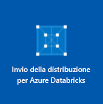

# <a name="quickstart-run-a-spark-job-on-azure-databricks-using-the-azure-portal"></a>Avvio rapido: Eseguire un processo Spark in Azure Databricks mediante il portale di Azure

Questa guida introduttiva illustra come creare un'area di lavoro di Azure Databricks e un cluster Apache Spark all'interno di tale area di lavoro. Viene infine spiegato come eseguire un processo Spark nel cluster Databricks. Per altre informazioni su Azure Databricks, vedere [Informazioni su Azure Databricks](what-is-azure-databricks.md).

In questo argomento di avvio rapido, come parte del processo Spark, vengono analizzati i dati sulla sicurezza relativi a Boston allo scopo di ottenere informazioni dettagliate sui diversi metodi di segnalazione.

Se non si ha una sottoscrizione di Azure, [creare un account gratuito](https://azure.microsoft.com/free/) prima di iniziare.

## <a name="sign-in-to-the-azure-portal"></a>Accedere al portale di Azure

Accedere al [portale di Azure](https://portal.azure.com).

## <a name="create-an-azure-databricks-workspace"></a>Creare un'area di lavoro di Azure Databricks

In questa sezione viene creata un'area di lavoro di Azure Databricks usando il portale di Azure.

1. Nel portale di Azure selezionare **Crea una risorsa** > **Analisi** > **Azure Databricks**.

    

2. Nella pagina **Servizio Azure Databricks** specificare i valori per creare un'area di lavoro di Databricks.

    

    Specificare i valori seguenti:
    
    |Proprietà  |Descrizione  |
    |---------|---------|
    |**Nome area di lavoro**     | Specificare un nome per l'area di lavoro di Databricks        |
    |**Sottoscrizione**     | Selezionare la sottoscrizione di Azure nell'elenco a discesa.        |
    |**Gruppo di risorse**     | Specificare se si vuole creare un nuovo gruppo di risorse o usarne uno esistente. Un gruppo di risorse è un contenitore con risorse correlate per una soluzione Azure. Per altre informazioni, vedere [Panoramica di Gestione risorse di Microsoft Azure](../azure-resource-manager/resource-group-overview.md). |
    |**Posizione**     | Selezionare **Stati Uniti occidentali 2**. Per le altre aree disponibili, vedere [Prodotti disponibili in base all'area](https://azure.microsoft.com/regions/services/).        |
    |**Piano tariffario**     |  Scegliere tra **Standard**, **Premium** e **Versione di valutazione**. Per altre informazioni su questi piani tariffari, vedere la [pagina dei prezzi di Databricks](https://azure.microsoft.com/pricing/details/databricks/).       |

    Selezionare **Aggiungi al dashboard** e quindi fare clic su **Crea**.

4. La creazione dell'area di lavoro richiede alcuni minuti, durante i quali è possibile visualizzare lo stato della distribuzione in **Notifiche**.

    

## <a name="create-a-spark-cluster-in-databricks"></a>Creare un cluster Spark in Databricks

> [!NOTE]
> Per usare un account gratuito per creare il cluster Azure Databricks, prima di creare il cluster, passare al profilo personale e impostare la sottoscrizione per il **pagamento in base al consumo**. Per altre informazioni, vedere [Account gratuito di Azure](https://azure.microsoft.com/free/).

1. Nel portale di Azure passare all'area di lavoro di Databricks creata e quindi fare clic su **Avvia area di lavoro**.

2. Si verrà reindirizzati al portale di Azure Databricks. Nel portale fare clic su **Nuovo cluster**.

    

3. Nella pagina **New cluster** (Nuovo cluster) specificare i valori per creare un cluster.

    

    Accettare tutti gli altri valori predefiniti tranne i seguenti:

   * Immettere un nome per il cluster.
   * Per questo articolo creare un cluster con il runtime **5.2**.
   * Assicurarsi di selezionare la casella di controllo **Terminate after \_\_ minutes of inactivity** (Termina dopo \_\_ minuti di attività). Specificare una durata in minuti per terminare il cluster, se questo non viene usato.
    
     Selezionare **Crea cluster**. Quando il cluster è in esecuzione, è possibile collegare blocchi appunti al cluster ed eseguire processi Spark.

Per altre informazioni sulla creazione di cluster, vedere [Create a Spark cluster in Azure Databricks](https://docs.azuredatabricks.net/user-guide/clusters/create.html) (Creare un cluster Spark in Azure Databricks).

## <a name="run-a-spark-sql-job"></a>Eseguire un processo Spark SQL

Eseguire le attività seguenti per creare un blocco appunti in Databricks, configurare il blocco appunti per la lettura dei dati da set di dati Open di Azure e quindi eseguire un processo Spark SQL sui dati.

1. Nel riquadro sinistro selezionare **Azure Databricks**. In **Attività comuni** fare clic su **Nuovo blocco appunti**.

    

2. Nella finestra di dialogo **Crea blocco appunti** immettere un nome, selezionare **Python** come linguaggio e selezionare il cluster Spark creato in precedenza.

    

    Selezionare **Create**.

3. In questo passaggio creare un dataframe Spark con i dati relativi alla sicurezza di Boston (Boston Safety Data) da [Set di dati Open di Azure](https://azure.microsoft.com/services/open-datasets/catalog/boston-safety-data/#AzureDatabricks) e usare SQL per eseguire query sui dati.

   Il comando seguente consente di impostare le informazioni di accesso alle risorse di archiviazione di Azure. Incollare questo codice PySpark nella prima cella e usare **MAIUSC+INVIO** per eseguire il codice.

   ```python
   blob_account_name = "azureopendatastorage"
   blob_container_name = "citydatacontainer"
   blob_relative_path = "Safety/Release/city=Boston"
   blob_sas_token = r"?st=2019-02-26T02%3A34%3A32Z&se=2119-02-27T02%3A34%3A00Z&sp=rl&sv=2018-03-28&sr=c&sig=XlJVWA7fMXCSxCKqJm8psMOh0W4h7cSYO28coRqF2fs%3D"
   ```

   Il comando seguente consente a Spark di leggere dall'archivio BLOB in remoto. Incollare questo codice PySpark nella cella successiva e usare **MAIUSC+INVIO** per eseguire il codice.

   ```python
   wasbs_path = 'wasbs://%s@%s.blob.core.windows.net/%s' % (blob_container_name, blob_account_name, blob_relative_path)
   spark.conf.set('fs.azure.sas.%s.%s.blob.core.windows.net' % (blob_container_name, blob_account_name), blob_sas_token)
   print('Remote blob path: ' + wasbs_path)
   ```

   Il comando seguente consente di creare un dataframe. Incollare questo codice PySpark nella cella successiva e usare **MAIUSC+INVIO** per eseguire il codice.

   ```python
   df = spark.read.parquet(wasbs_path)
   print('Register the DataFrame as a SQL temporary view: source')
   df.createOrReplaceTempView('source')
   ```

4. Eseguire un'istruzione SQL per restituire le prime 10 righe di dati dalla vista temporanea denominata **source**. Incollare questo codice PySpark nella cella successiva e usare **MAIUSC+INVIO** per eseguire il codice.

   ```python
   print('Displaying top 10 rows: ')
   display(spark.sql('SELECT * FROM source LIMIT 10'))
   ```

5. I risultati verranno visualizzati in una tabella simile a quella dello screenshot seguente (sono incluse solo alcune colonne):

    

6. È ora possibile creare una rappresentazione visiva di questi dati per mostrare quanti eventi correlati alla sicurezza vengono segnalati usando Citizens Connect App e City Worker App invece di altre origini. Nella parte inferiore dell'output in formato tabella fare clic sull'icona del **grafico a barre** e quindi su **Opzioni tracciato**.

    

8. In **Customize Plot** (Personalizza grafico) trascinare i valori come illustrato nello screenshot.

    

   * Impostare **Chiavi** su **source**.
   * Impostare **Valori** su **<\id>** .
   * Impostare **Aggregation** (Aggregazione) su **COUNT** (CONTEGGIO).
   * Impostare il **tipo di visualizzazione** su **Grafico a torta**.

     Fare clic su **Apply**.

## <a name="clean-up-resources"></a>Pulire le risorse

Dopo aver finito l'articolo è possibile terminare il cluster. A questo scopo, nel riquadro sinistro dell'area di lavoro di Azure Databricks fare clic su **Clusters** (Cluster). Per il cluster che si vuole terminare, posizionare il cursore sui puntini di sospensione sotto la colonna **Actions** (Azioni) e fare clic sull'icona **Terminate** (Termina).


Se non viene terminato manualmente, il cluster si arresterà automaticamente se è stata selezionata la casella di controllo **Terminate after \_\_ minutes of inactivity** (Termina dopo \_\_ minuti di attività) durante la creazione del cluster. In tal caso, il cluster viene automaticamente arrestato se è rimasto inattivo per il tempo specificato.

## <a name="next-steps"></a>Passaggi successivi

In questo articolo è stato creato un cluster Spark in Azure Databricks ed è stato eseguito un processo Spark usando dati provenienti da set di dati Open di Azure. Per informazioni su come importare dati da altre origini dati in Azure Databricks, vedere anche [Spark data sources](https://docs.azuredatabricks.net/spark/latest/data-sources/index.html) (Origini dati di Spark). Passare all'articolo successivo per informazioni su come eseguire un'operazione ETL (estrazione, trasformazione e caricamento dati) tramite Azure Databricks.

> [!div class="nextstepaction"]
>[Estrarre, trasformare e caricare dati tramite Azure Databricks](databricks-extract-load-sql-data-warehouse.md)
