# <a name="quickstart-run-a-spark-job-on-azure-databricks-using-the-azure-resource-manager-template"></a>Guida introduttiva: Eseguire un processo Spark in Azure Databricks con il modello di Azure Resource Manager

In questa guida di avvio rapido si usa un modello di Azure Resource Manager per creare un'area di lavoro di Azure Databricks con un cluster Apache Spark. Si esegue un processo nel cluster e si usano grafici personalizzati per produrre report in tempo reale dall'utilizzo gratuito/a pagamento in base ai dati demografici.

## <a name="prerequisites"></a>Prerequisiti

- Sottoscrizione di Azure: [creare un account gratuito](https://azure.microsoft.com/free/)

## <a name="sign-in-to-the-azure-portal"></a>Accedere al portale di Azure

Accedere al [portale di Azure](https://portal.azure.com). 

> [!Note]
> Questa esercitazione non può essere eseguita usando una **sottoscrizione di valutazione gratuita di Azure**.
> Se l'utente ha un account gratuito, andare al proprio profilo e modificare la sottoscrizione a **con pagamento in base al consumo**. Per altre informazioni, vedere [Account gratuito di Azure](https://azure.microsoft.com/free/). Quindi [rimuovere il limite di spesa](https://docs.microsoft.com/azure/billing/billing-spending-limit#why-you-might-want-to-remove-the-spending-limit) e [richiedere un aumento della quota](https://docs.microsoft.com/azure/azure-supportability/resource-manager-core-quotas-request) per le vCPU nell'area dell'utente. Quando si crea l'area di lavoro Azure Databricks, è possibile selezionare il piano tariffario **Versione di valutazione (Premium - Unità Databricks gratuite per 14 giorni)** per concedere l'accesso gratuito Premium per 14 giorni dell'area di lavoro alle Unità Databricks di Azure.

## <a name="create-an-azure-databricks-workspace"></a>Creare un'area di lavoro di Azure Databricks

In questa sezione viene creata un'area di lavoro di Azure Databricks usando il modello di Azure Resource Manager.

1. Fare clic sull'immagine seguente per aprire il modello nel portale di Azure.

   <a href="https://portal.azure.com/#create/Microsoft.Template/uri/https%3A%2F%2Fraw.githubusercontent.com%2FAzure%2Fazure-quickstart-templates%2Fmaster%2F101-databricks-workspace%2Fazuredeploy.json" target="_blank"></a>

2. Specificare i valori richiesti per creare l'area di lavoro di Azure Databricks

   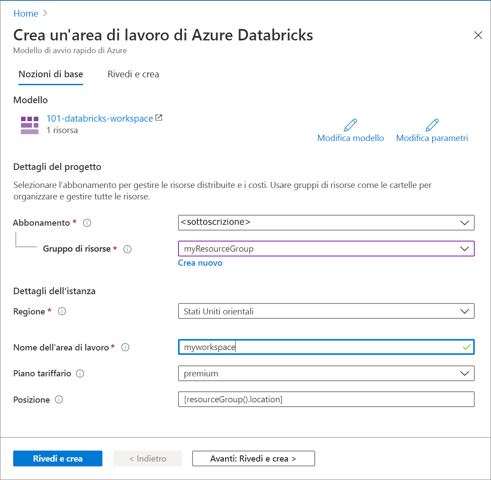

   Specificare i valori seguenti:

   |Proprietà  |DESCRIZIONE  |
   |---------|---------|
   |**Sottoscrizione**     | Selezionare la sottoscrizione di Azure nell'elenco a discesa.        |
   |**Gruppo di risorse**     | Specificare se si vuole creare un nuovo gruppo di risorse o usarne uno esistente. Un gruppo di risorse è un contenitore con risorse correlate per una soluzione Azure. Per altre informazioni, vedere [Panoramica di Gestione risorse di Microsoft Azure](../azure-resource-manager/resource-group-overview.md). |
   |**Posizione**     | Selezionare **Stati Uniti orientali 2**. Per le altre aree disponibili, vedere [Prodotti disponibili in base all'area](https://azure.microsoft.com/regions/services/).        |
   |**Nome area di lavoro**     | Specificare un nome per l'area di lavoro di Databricks        |
   |**Piano tariffario**     |  Scegliere tra **Standard** e **Premium**. Per altre informazioni su questi piani tariffari, vedere la [pagina dei prezzi di Databricks](https://azure.microsoft.com/pricing/details/databricks/).       |

3. Selezionare **Accetto le condizioni riportate sopra**, selezionare **Aggiungi al dashboard** e quindi fare clic su **Acquista**.

4. La creazione dell'area di lavoro richiede alcuni minuti, durante i quali il portale visualizza il riquadro **Invio della distribuzione per Azure Databricks** a destra. Potrebbe essere necessario scorrere verso destra nel dashboard per visualizzare il riquadro. È presente anche un indicatore di stato nella parte superiore della schermata. È possibile esaminare lo stato di avanzamento nelle due aree.

   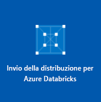

## <a name="create-a-spark-cluster-in-databricks"></a>Creare un cluster Spark in Databricks

1. Nel portale di Azure passare all'area di lavoro di Databricks creata e quindi fare clic su **Avvia area di lavoro**.

2. Si verrà reindirizzati al portale di Azure Databricks. Nel portale fare clic su **Cluster**.

   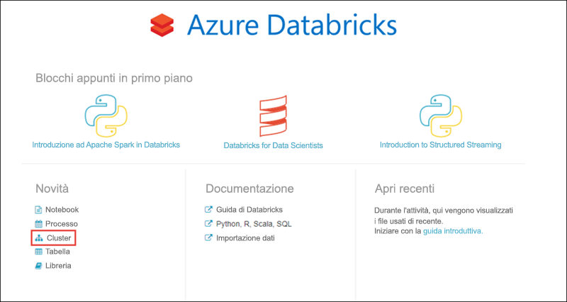

3. Nella pagina **New cluster** (Nuovo cluster) specificare i valori per creare un cluster.

   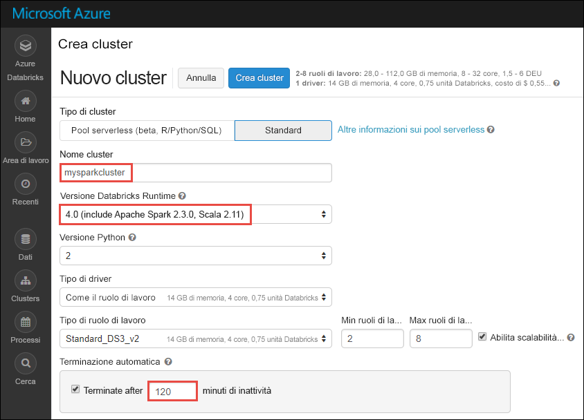

   Accettare tutti gli altri valori predefiniti tranne i seguenti:

   * Immettere un nome per il cluster.
   * Per questo articolo creare un cluster con il runtime **4.0**.
   * Assicurarsi di selezionare la casella di controllo **Terminate after \_\_ minutes of inactivity** (Termina dopo \_\_ minuti di attività). Specificare una durata in minuti per terminare il cluster, se questo non viene usato.

   Selezionare **Crea cluster**. Quando il cluster è in esecuzione, è possibile collegare blocchi appunti al cluster ed eseguire processi Spark.

Per altre informazioni sulla creazione di cluster, vedere [Create a Spark cluster in Azure Databricks](/azure/databricks/user-guide/clusters/create) (Creare un cluster Spark in Azure Databricks).

## <a name="run-a-spark-sql-job"></a>Eseguire un processo Spark SQL

Prima di iniziare con questa sezione, è necessario completare i prerequisiti seguenti:

* [Creare un account di archiviazione BLOB di Azure](../storage/common/storage-quickstart-create-account.md).
* Scaricare un file JSON di esempio [da GitHub](https://github.com/Azure/usql/blob/master/Examples/Samples/Data/json/radiowebsite/small_radio_json.json).
* Caricare il file JSON di esempio nell'account di archiviazione BLOB di Azure creato. Per caricare file, è possibile usare [Microsoft Azure Storage Explorer](../vs-azure-tools-storage-manage-with-storage-explorer.md).

Eseguire le operazioni seguenti per creare un blocco appunti in Databricks, configurare il blocco appunti per la lettura dei dati da un account di archiviazione BLOB di Azure e quindi eseguire un processo Spark SQL sui dati.

1. Nel riquadro sinistro fare clic su **Area di lavoro**. Nell'elenco a discesa **Area di lavoro** fare clic su **Crea** e quindi su **Notebook** (Blocco appunti).

   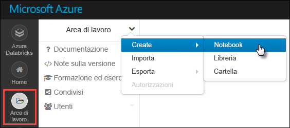

2. Nella finestra di dialogo **Create Notebook** (Crea blocco appunti) immettere un nome, selezionare **Scala** come linguaggio e selezionare il cluster Spark creato in precedenza.

   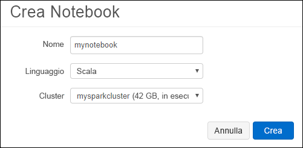

   Fare clic su **Create**(Crea).

3. In questo passaggio associare l'account di archiviazione di Azure con il cluster Databricks Spark. Esistono due modi per eseguire questa associazione. È possibile montare l'account di archiviazione di Azure in Databricks FileSystem (DBFS) oppure accedere direttamente all'account di archiviazione di Azure dall'applicazione creata.

   > [!IMPORTANT]
   >Questo articolo usa l'approccio che prevede il **montaggio della risorsa di archiviazione con DBFS**. Questo approccio assicura che la risorsa di archiviazione montata venga associata a FileSystem del cluster. Qualsiasi applicazione che accede al cluster può quindi usare anche la risorsa di archiviazione associata. L'approccio con accesso diretto è limitato all'applicazione in cui viene configurato l'accesso.
   >
   > Per usare l'approccio con montaggio, è necessario creare un cluster Spark con il runtime di Databricks versione **4.0**, selezionato in questo articolo.

   Nel frammento di codice seguente sostituire `{YOUR CONTAINER NAME}`, `{YOUR STORAGE ACCOUNT NAME}` e `{YOUR STORAGE ACCOUNT ACCESS KEY}` con i valori appropriati per l'account di archiviazione di Azure. Incollare il frammento in una cella vuota del blocco appunti e quindi premere MAIUSC+INVIO per eseguire la cella di codice.

   * **Montare l'account di archiviazione con DBFS (opzione consigliata)** . In questo frammento di codice il percorso dell'account di archiviazione di Azure viene montato in `/mnt/mypath`. In occasione di tutti gli accessi futuri all'account di archiviazione di Azure non sarà quindi necessario fornire il percorso completo. È sufficiente usare `/mnt/mypath`.

          dbutils.fs.mount(
            source = "wasbs://{YOUR CONTAINER NAME}@{YOUR STORAGE ACCOUNT NAME}.blob.core.windows.net/",
            mountPoint = "/mnt/mypath",
            extraConfigs = Map("fs.azure.account.key.{YOUR STORAGE ACCOUNT NAME}.blob.core.windows.net" -> "{YOUR STORAGE ACCOUNT ACCESS KEY}"))

   * **Accedere direttamente all'account di archiviazione**

          spark.conf.set("fs.azure.account.key.{YOUR STORAGE ACCOUNT NAME}.blob.core.windows.net", "{YOUR STORAGE ACCOUNT ACCESS KEY}")

     Per istruzioni su come recuperare la chiave dell'account di archiviazione, vedere [Gestire le chiavi di accesso alle risorse di archiviazione](../storage/common/storage-account-manage.md#access-keys).

   > [!NOTE]
   > È anche possibile usare Azure Data Lake Store con un cluster Spark in Azure Databricks. Per istruzioni, vedere [Use Data Lake Store with Azure Databricks](/azure/databricks/data/data-sources/azure/azure-datalake-gen2.html) (Usare Data Lake Store con Azure Databricks).

4. Eseguire un'istruzione SQL per creare una tabella temporanea con i dati dal file di dati JSON di esempio **small_radio_json.json**. Nel frammento di codice seguente sostituire i valori dei segnaposto con il nome del contenitore e il nome dell'account di archiviazione. Incollare il frammento in una cella di codice del blocco appunti e quindi premere MAIUSC+INVIO. Nel frammento di codice `path` indica il percorso del file JSON di esempio caricato nell'account di archiviazione di Azure.

   ```sql
   %sql
   DROP TABLE IF EXISTS radio_sample_data;
   CREATE TABLE radio_sample_data
   USING json
   OPTIONS (
    path "/mnt/mypath/small_radio_json.json"
   )
   ```

   Dopo il completamento del comando, tutti i dati presenti nel file JSON sono visualizzati in una tabella nel cluster Databricks.

   Il comando magic `%sql` del linguaggio consente di eseguire codice SQL dal blocco appunti anche se questo è di un altro tipo. Per altre informazioni, vedere [Mixing languages in a notebook](/azure/databricks/notebooks/index) (Combinazione di linguaggi in un blocco appunti).

5. Si esaminerà ora uno snapshot dei dati JSON di esempio per comprendere meglio la query eseguita. Incollare il frammento di codice seguente in una cella di codice e premere **MAIUSC+INVIO**.

   ```sql
   %sql
   SELECT * from radio_sample_data
   ```

6. I risultati verranno visualizzati in una tabella simile a quella dello screenshot seguente (sono incluse solo alcune colonne):

   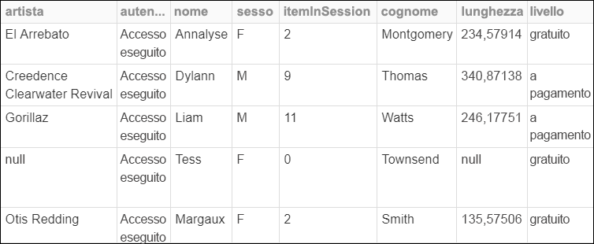

   Tra i vari dettagli, i dati di esempio acquisiscono il sesso del pubblico di un canale radio (nome colonna **gender**) e se l'abbonamento è gratuito o a pagamento (nome colonna **level**).

7. È ora possibile creare una rappresentazione visiva dei dati da visualizzare in base al sesso, con l'indicazione di quanti utenti usano un account gratuito e quanti sono abbonati a pagamento. Nella parte inferiore della tabella dei risultati fare clic sull'icona del **grafico a barre** e quindi su **Plot Options** (Opzioni grafico).

   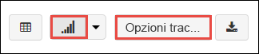

8. In **Customize Plot** (Personalizza grafico) trascinare i valori come illustrato nello screenshot.

   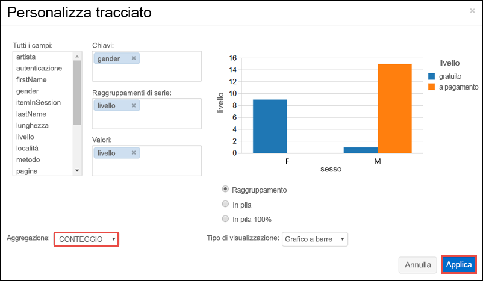

   * Impostare **Keys** (Chiavi) su **gender**.
   * Impostare **Series groupings** (Raggruppamenti di serie) su **level**.
   * Impostare **Values** (Valori) su **level**.
   * Impostare **Aggregation** (Aggregazione) su **COUNT** (CONTEGGIO).

   Fare clic su **Apply**.

9. L'output mostra la rappresentazione visiva illustrata nello screenshot seguente:

   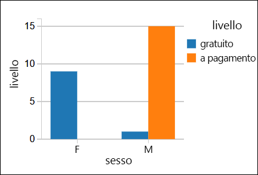

## <a name="clean-up-resources"></a>Pulire le risorse

Dopo aver finito l'articolo è possibile terminare il cluster. A questo scopo, nel riquadro sinistro dell'area di lavoro di Azure Databricks fare clic su **Clusters** (Cluster). Per il cluster che si vuole terminare, posizionare il cursore sui puntini di sospensione sotto la colonna **Actions** (Azioni) e fare clic sull'icona **Terminate** (Termina).

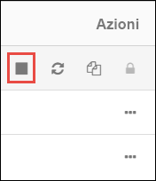

Se non viene terminato manualmente, il cluster si arresterà automaticamente se è stata selezionata la casella di controllo **Terminate after \_\_ minutes of inactivity** (Termina dopo \_\_ minuti di attività) durante la creazione del cluster. In tal caso, il cluster viene automaticamente arrestato se è rimasto inattivo per il tempo specificato.

## <a name="next-steps"></a>Passaggi successivi

In questo articolo è stato creato un cluster Spark in Azure Databricks ed è stato eseguito un processo Spark usando i dati nelle risorse di archiviazione di Azure. Per informazioni su come importare dati da altre origini dati in Azure Databricks, vedere anche [Spark data sources](/azure/databricks/data/data-sources/index.html) (Origini dati di Spark). È possibile considerare il modello di Resource Manager anche per [creare un'area di lavoro di Azure Databricks con un indirizzo di rete virtuale personalizzato](https://github.com/Azure/azure-quickstart-templates/tree/master/101-databricks-workspace-with-custom-vnet-address). Per la sintassi e le proprietà JSON da usare in un modello, vedere le informazioni di riferimento sul modello [Microsoft.Databricks/workspaces](/azure/templates/microsoft.databricks/workspaces).

Passare all'articolo successivo per informazioni su come eseguire un'operazione ETL (estrazione, trasformazione e caricamento dati) tramite Azure Databricks.

> [!div class="nextstepaction"]
> [Estrarre, trasformare e caricare dati tramite Azure Databricks](databricks-extract-load-sql-data-warehouse.md)
