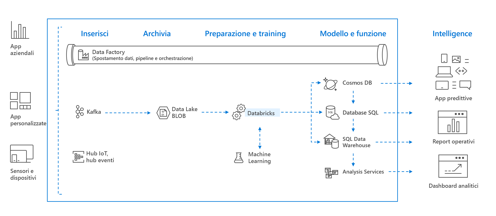

# Informazioni su Azure Databricks

Azure Databricks è una piattaforma di analisi basata su Apache Spark ottimizzata per la piattaforma dei servizi cloud di Microsoft Azure. Progettato con i fondatori di Apache Spark, Databricks è integrato con Azure per offrire l'installazione con un clic, i flussi di lavoro semplificati e un'area di lavoro interattiva che consente la collaborazione tra data scientist, ingegneri dei dati e business analyst.

Azure Databricks è un servizio di analisi veloce, semplice e collaborativo basato su Apache Spark. Nel caso di una pipeline di Big Data, i dati (non elaborati o strutturati) vengono inseriti in Azure tramite Azure Data Factory in batch o trasmessi quasi in tempo reale con l'IoT Hub, Hub eventi o Kafka. I dati vengono inseriti in un data lake per un'archiviazione permanente a lungo termine, in Archiviazione BLOB di Azure o Azure Data Lake Storage. Nel corso del flusso di lavoro dell'analisi, si usa Azure Databricks per leggere i dati da più origini, ad esempio [Archiviazione BLOB di Azure](../storage/blobs/storage-blobs-introduction.md), [Azure Data Lake Storage](../data-lake-store/index.md), [Azure Cosmos DB](../cosmos-db/index.yml) oppure [Azure SQL Data Warehouse](../sql-data-warehouse/index.yml), e trasformarli in informazioni significative con Spark.

## Piattaforma di analisi basata su Apache Spark

Azure Databricks comprende tutte le funzionalità e le tecnologie del cluster Apache Spark open source. Spark in Azure Databricks include i componenti seguenti:

* **Spark SQL e DataFrames**: Spark SQL è il modulo Spark per lavorare con dati strutturati. Un DataFrame è una raccolta distribuita di dati organizzati in colonne denominate. Dal punto di vista concettuale equivale a una tabella in un database relazionale o a un frame di dati in R/Python.

* **Streaming**: elaborazione e analisi dei dati in tempo reale per applicazioni analitiche e interattive. Si integra con HDFS, Flume e Kafka.

* **MLib**: libreria di Machine Learning costituita da utilità e algoritmi di apprendimento comuni, tra cui classificazione, regressione, clustering, filtro collaborativo, riduzione della dimensionalità, nonché primitive di ottimizzazione sottostanti.

* **GraphX**: grafi e calcolo dei grafi per casi d'uso di più ampio respiro, dall'analisi cognitiva all'esplorazione dei dati.

* **API Spark Core**: include il supporto per R, SQL, Python, Scala e Java.

## Apache Spark in Azure Databricks

Basato sulle funzionalità di Spark, Azure Databricks offre una piattaforma cloud a gestione zero che include:

- Cluster Spark completamente gestiti
- Un'area di lavoro interattiva per l'esplorazione e la visualizzazione
- Una piattaforma per eseguire le applicazioni preferite basate su Spark

### Cluster Apache Spark completamente gestiti nel cloud

Azure Databricks include un ambiente di produzione nel cloud sicuro e affidabile, gestito e supportato da esperti Spark. È possibile:

* Creare cluster in pochi secondi.
* Aumentare o ridurre in modo automatico e dinamico il numero di cluster, inclusi quelli senza server, nonché condividerli tra i team. 
* Usare i cluster a livello di programmazione con le API REST. 
* Usare funzionalità sicure di integrazione dei dati basate su Spark che consentono di unificare i dati senza centralizzazione. 
* Ottenere accesso immediato alle funzionalità Apache Spark più recenti con ogni versione.

### Databricks Runtime
Databricks Runtime è basato su Apache Spark e viene creato in modalità nativa per il cloud di Azure. 

Grazie all'opzione **Serverless** (Senza server) di Azure Databricks, l'infrastruttura risulta notevolmente semplificata e non è necessario ricorrere a personale esperto specializzato per installare e configurare l'infrastruttura dati. L'opzione Serverless (Senza server) consente ai data scientist di eseguire rapidamente l'iterazione come team.

Per i data engineer, che si preoccupano delle prestazioni dei processi di produzione, Azure Databricks offre un motore Spark, caratterizzato da una maggiore velocità e da prestazioni elevate nelle varie ottimizzazioni a livello di I/O e di elaborazione (Databricks I/O).

### Area di lavoro per la collaborazione

Grazie a un ambiente integrato che favorisce la collaborazione, Azure Databricks semplifica il processo di esplorazione dei dati, creazione di prototipi ed esecuzione di applicazioni basate sui dati in Spark.

* Stabilire come usare i dati con semplici funzionalità di esplorazione dei dati.
* Documentare lo stato di avanzamento nei blocchi appunti in R, Python, Scala o SQL.
* Visualizzare i dati in pochi clic e usare strumenti familiari come Matplotlib, ggplot o d3.
* Usare dashboard interattivi per creare report dinamici.
* Usare Spark e interagire contemporaneamente con i dati.

## Sicurezza aziendale

Azure Databricks offre funzionalità di sicurezza di Azure di livello aziendale, inclusa l'integrazione di Azure Active Directory, i controlli basati sui ruoli e contratti di servizio di livello aziendale per proteggere i dati e il business.

* L'integrazione con Azure Active Directory consente di eseguire soluzioni complete basate su Azure tramite Azure Databricks.
* Con l'accesso basato sui ruoli di Azure Databricks è possibile definire autorizzazioni utente specifiche per blocchi appunti, cluster, processi e dati.
* Contratti di servizio di livello aziendale. 

## Integrazione con servizi di Azure

Azure Databricks si integra perfettamente con archivi e database di Azure: SQL Data Warehouse, Cosmos DB, Data Lake Store e Archiviazione BLOB. 

## Integrazione con Power BI
Grazie all'integrazione avanzata con Power BI, Azure Databricks consente di individuare e condividere le informazioni dettagliate più importanti in modo semplice e rapido. È anche possibile usare altri strumenti di business intelligence, ad esempio Tableau Software tramite endpoint cluster JDBC/ODBC.

## Passaggi successivi

* [Guida introduttiva: Eseguire un processo Spark in Azure Databricks](quickstart-create-databricks-workspace-portal.md)
* [Work with Spark clusters](/azure/databricks/clusters/index) (Usare i cluster Spark)
* [Usare i blocchi appunti](/azure/databricks/notebooks/index)
* [Create Spark jobs](/azure/databricks/jobs) (Creare processi Spark)

 

