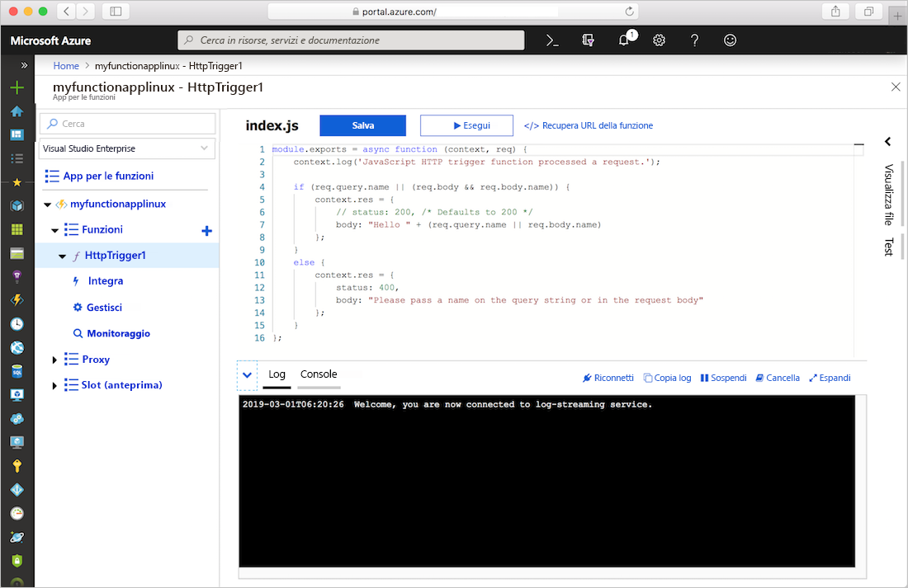
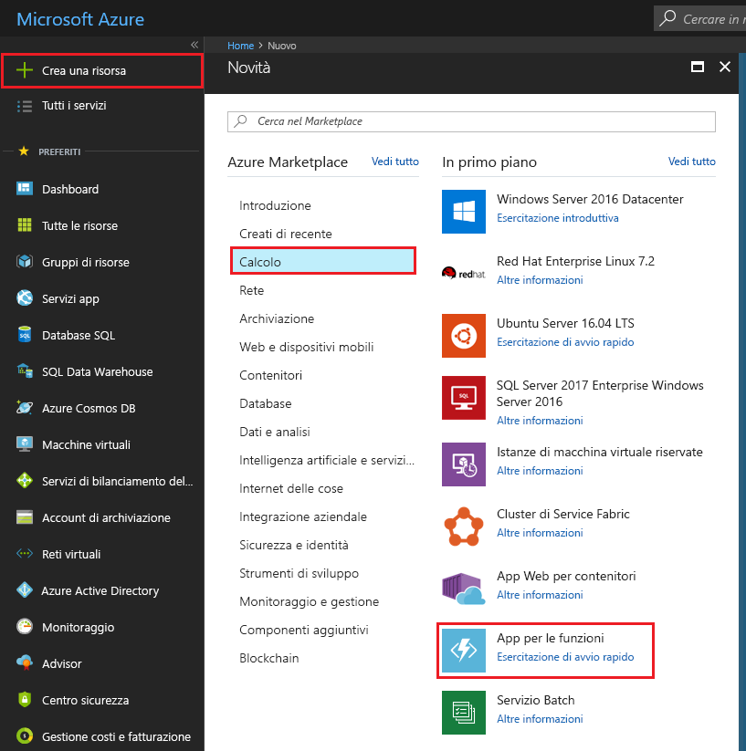
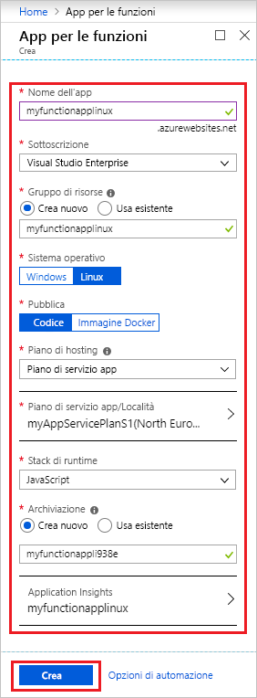
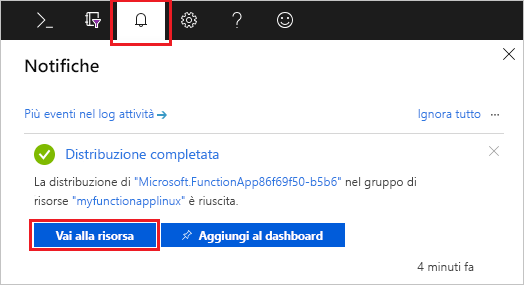
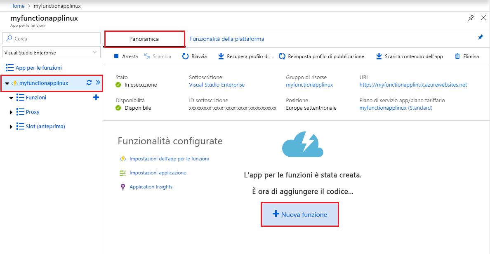
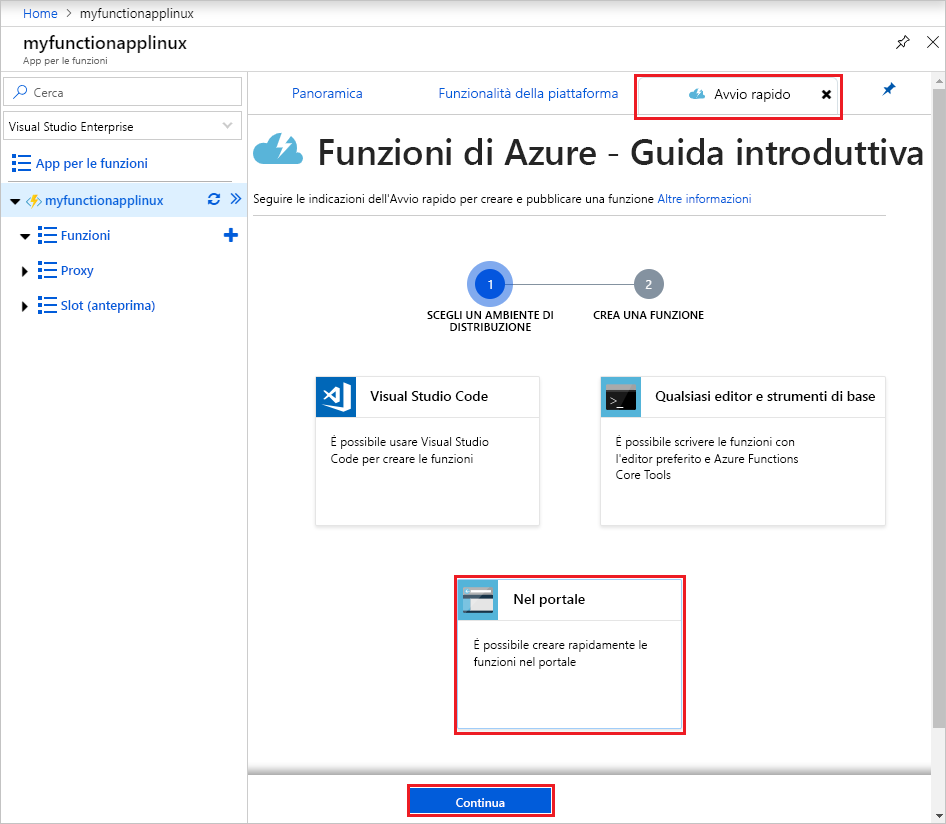
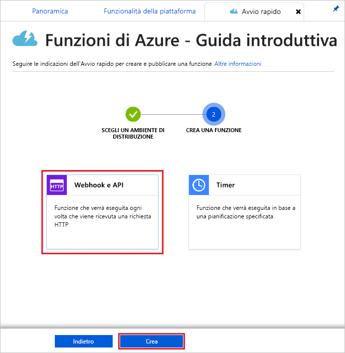
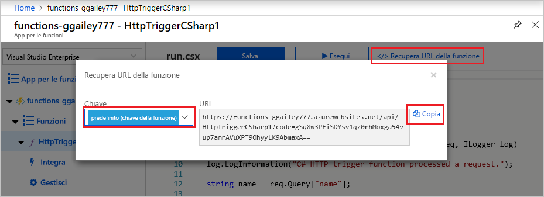
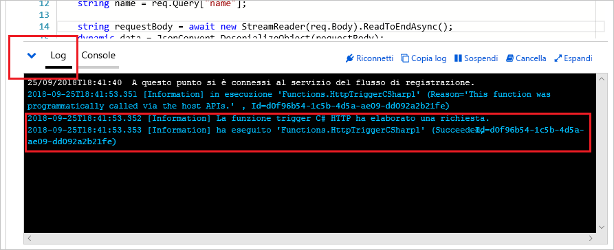

# Creare un'app per le funzioni in Linux in un piano di servizio app di Azure

Funzioni di Azure consente di ospitare le funzioni in Linux in un contenitore di Servizio app di Azure predefinito. Questo articolo illustra come usare il [portale di Azure](https://portal.azure.com) per creare un'app per le funzioni ospitata in Linux che viene eseguita in un [piano di servizio app](functions-scale.md#app-service-plan). È anche possibile [usare un contenitore personalizzato](functions-create-function-linux-custom-image.md).

[!INCLUDE [quickstarts-free-trial-note](../../includes/quickstarts-free-trial-note.md)]

## Accedere ad Azure

Accedere al portale di Azure all'indirizzo <https://portal.azure.com> con il proprio account Azure.

## Creare un'app per le funzioni

Per ospitare l'esecuzione delle funzioni in Linux, è necessaria un'app per le funzioni. L'app per le funzioni offre un ambiente per l'esecuzione del codice delle funzioni. Consente di raggruppare le funzioni come un'unità logica per semplificare la gestione, la distribuzione e la condivisione delle risorse. In questo articolo si crea un piano di servizio app durante la creazione dell'app per le funzioni.

1. Selezionare il pulsante **Crea una risorsa** nell'angolo superiore sinistro del portale di Azure e quindi selezionare **Calcolo** > **App per le funzioni**.

    

2. Usare le impostazioni dell'app per le funzioni come indicato nella tabella sottostante l'immagine.

    

    | Impostazione      | Valore consigliato  | DESCRIZIONE                                        |
    | ------------ |  ------- | -------------------------------------------------- |
    | **Nome app** | Nome globalmente univoco | Nome che identifica la nuova app per le funzioni. I caratteri validi sono `a-z`, `0-9` e `-`.  | 
    | **Sottoscrizione** | Sottoscrizione in uso | Sottoscrizione in cui viene creata questa nuova app per le funzioni. | 
    | **[Gruppo di risorse](../azure-resource-manager/resource-group-overview.md)** |  myResourceGroup | Nome del nuovo gruppo di risorse in cui creare l'app per le funzioni. |
    | **Sistema operativo** | Linux | L'app per le funzioni viene eseguita in Linux. |
    | **Pubblica** | Codice | Viene usato il contenitore Linux predefinito per lo **stack di runtime**. È sufficiente specificare il codice di progetto dell'app per le funzioni. Un'altra opzione consiste nel pubblicare un'[immagine Docker](functions-create-function-linux-custom-image.md) personalizzata. |
    | **[Piano di hosting](functions-scale.md)** | Piano di servizio app | Piano di hosting che definisce come vengono allocate le risorse all'app per le funzioni. In caso di esecuzione in un piano di servizio app, è possibile controllare il [ridimensionamento dell'app per le funzioni](functions-scale.md).  |
    | **Piano di servizio app/Località** | Crea piano | Scegliere **Crea nuovo** e specificare un nome in **Piano di servizio app**. Scegliere una **località** in un'[area](https://azure.microsoft.com/regions/) nelle vicinanze o vicino ad altri servizi a cui accedono le funzioni. Scegliere il **[piano tariffario](https://azure.microsoft.com/pricing/details/app-service/linux/)** preferito.  Non è possibile eseguire app per le funzioni sia Linux che Windows nello stesso piano di servizio app. |
    | **Stack di runtime** | Lingua preferita | Scegliere un runtime che supporti il linguaggio di programmazione della funzione preferito. Scegliere **.NET** per le funzioni C# e F #. |
    | **[Archiviazione](../storage/common/storage-quickstart-create-account.md)** |  Nome globalmente univoco |  Creare un account di archiviazione usato dall'app per le funzioni. I nomi degli account di archiviazione devono avere una lunghezza compresa tra 3 e 24 caratteri e possono contenere solo numeri e lettere minuscole. È anche possibile usare un account esistente, che dovrà soddisfare i [requisiti dell'account di archiviazione](functions-scale.md#storage-account-requirements). |
    | **[Application Insights](functions-monitoring.md)** | Attivato | Application Insights è disabilitato per impostazione predefinita. È consigliabile abilitare l'integrazione di Application Insights ora e scegliere una località vicina a quella del piano di servizio app. Se si vuole farlo successivamente, vedere [Monitorare Funzioni di Azure](functions-monitoring.md).  |

3. Selezionare **Crea** per effettuare il provisioning dell'app per le funzioni e distribuirla.

4. Selezionare l'icona di notifica nell'angolo superiore destro del portale e attendere la visualizzazione del messaggio **La distribuzione è riuscita**.

    

5. Selezionare **Vai alla risorsa** per visualizzare la nuova app per le funzioni.

Si creerà ora una funzione nella nuova app per le funzioni. Anche dopo che l'app per le funzioni è disponibile, l'inizializzazione completa potrebbe richiedere alcuni minuti.

## Creare una funzione attivata tramite HTTP

Questa sezione illustra come creare una funzione nella nuova app per le funzioni nel portale.

> [!NOTE]
> L'esperienza di sviluppo nel portale può essere utile per provare Funzioni di Azure. Per la maggior parte degli scenari è consigliabile sviluppare le funzioni in locale e pubblicare il progetto nell'app per le funzioni usando [Visual Studio Code](functions-create-first-function-vs-code.md#create-an-azure-functions-project) o [Azure Functions Core Tools](functions-run-local.md#create-a-local-functions-project).  

1. Nella nuova app per le funzioni scegliere la scheda **Panoramica** e, al termine del caricamento, scegliere **+ Nuova funzione**.

    

1. Nella scheda **Avvio rapido** scegliere **Nel portale** e selezionare **Continua**.

    

1. Scegliere **WebHook e API** e quindi selezionare **Crea**.

    

Viene creata una funzione usando il modello specifico del linguaggio per una funzione attivata tramite HTTP.

Ora è possibile eseguire la nuova funzione inviando una richiesta HTTP.

## Testare la funzione

1. Nella nuova funzione fare clic su **</> Recupera URL della funzione** nell'angolo in alto a destra, selezionare **default (Function key)** (predefinita - tasto funzione) e quindi fare clic su **Copia**. 

    

2. Incollare l'URL della funzione nella barra degli indirizzi del browser. Aggiungere il valore della stringa di query `&name=<yourname>` alla fine dell'URL e premere il tasto `Enter` per eseguire la richiesta. Nel browser dovrebbe venire visualizzata la risposta restituita dalla funzione.  

    L'esempio seguente mostra la risposta nel browser:

    

    L'URL della richiesta include una chiave necessaria per impostazione predefinita per accedere a una funzione tramite HTTP.

3. Quando viene eseguita la funzione, vengono scritte nei log informazioni di traccia. Per visualizzare l'output di traccia dell'esecuzione precedente, tornare alla funzione nel portale e fare clic sulla freccia nella parte inferiore della schermata per espandere **Log**.

   

## Pulire le risorse

[!INCLUDE [Clean-up resources](../../includes/functions-quickstart-cleanup.md)]

## Passaggi successivi

È stata creata un'app per le funzioni con una semplice funzione attivata tramite HTTP.  

[!INCLUDE [Next steps note](../../includes/functions-quickstart-next-steps.md)]

Per altre informazioni, vedere [Associazioni HTTP e webhook in Funzioni di Azure](functions-bindings-http-webhook.md).
