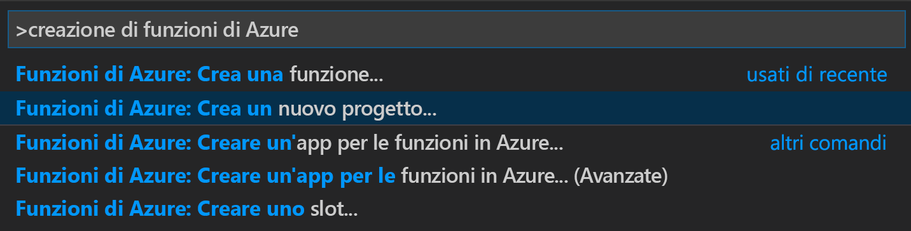
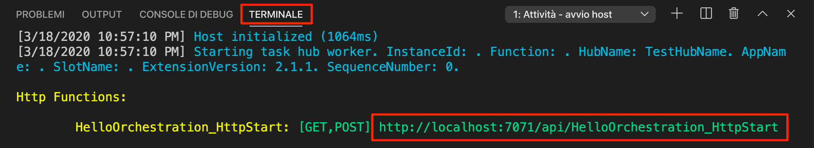
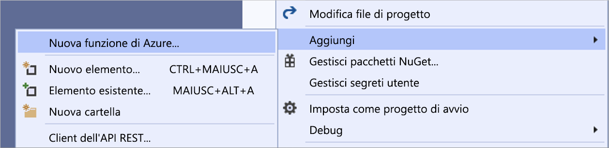

# <a name="create-your-first-durable-function-in-c"></a>Creare la prima funzione durevole in C\#

*Durable Functions* è un'estensione di [Funzioni di Azure](../functions-overview.md) che consente di scrivere funzioni con stato in un ambiente senza server. L'estensione gestisce automaticamente lo stato, i checkpoint e i riavvii.

::: zone pivot="code-editor-vscode"

Questo articolo illustra come usare Visual Studio Code per creare e testare in locale una funzione durevole "hello world".  Questa funzione orchestra e concatena le chiamate ad altre funzioni. Il codice della funzione verrà quindi pubblicato in Azure. Questi strumenti sono disponibili come parte dell'[estensione Funzioni di Azure](https://marketplace.visualstudio.com/items?itemName=ms-azuretools.vscode-azurefunctions) per VS Code.


## <a name="prerequisites"></a>Prerequisiti

Per completare questa esercitazione:

* Installare [Visual Studio Code](https://code.visualstudio.com/download).

* Installare le estensioni di VS Code seguenti:
    - [Funzioni di Azure](https://marketplace.visualstudio.com/items?itemName=ms-azuretools.vscode-azurefunctions)
    - [C#](https://marketplace.visualstudio.com/items?itemName=ms-dotnettools.csharp)

* Assicurarsi di avere la versione più recente di [Azure Functions Core Tools](../functions-run-local.md).

* Durable Functions richiede un account di archiviazione di Azure. È necessaria una sottoscrizione di Azure.

* Verificare che sia installato [.NET Core SDK](https://dotnet.microsoft.com/download) versione 3.1 o successiva.

[!INCLUDE [quickstarts-free-trial-note](../../../includes/quickstarts-free-trial-note.md)]

## <a name="create-your-local-project"></a><a name="create-an-azure-functions-project"></a>Creare il progetto locale 

In questa sezione si userà Visual Studio Code per creare un progetto di Funzioni di Azure locale. 

1. In Visual Studio Code premere F1 o CTRL/CMD+MAIUSC+P per aprire il riquadro comandi. Nel riquadro comandi cercare e selezionare `Azure Functions: Create New Project...`.

    

1. Scegliere una cartella vuota come posizione del progetto e quindi **Seleziona**.

1. Seguire le istruzioni e specificare le informazioni seguenti:

    | Prompt | valore | Descrizione |
    | ------ | ----- | ----------- |
    | Selezionare un linguaggio per il progetto di app per le funzioni | C# | Creare un progetto Funzioni C# in locale. |
    | Selezionare una versione | Azure Functions v3 (Funzioni di Azure v3) | Questa opzione viene visualizzata solo quando gli strumenti Core Tools non sono già installati. In questo caso, gli strumenti Core Tools vengono installati la prima volta che si esegue l'app. |
    | Selezionare un modello per la prima funzione del progetto | Skip for now (Ignora per ora) | |
    | Specificare come aprire il progetto | Open in current window (Apri nella finestra corrente) | Riapre VS Code nella cartella selezionata. |

Se necessario, Visual Studio Code installa Azure Functions Core Tools. Crea inoltre un progetto di app per le funzioni in una cartella. Questo progetto contiene i file di configurazione [host.json](../functions-host-json.md) e [local.settings.json](../functions-run-local.md#local-settings-file).

## <a name="add-functions-to-the-app"></a>Aggiungere funzioni all'app

La procedura seguente usa un modello per creare il codice di funzione durevole nel progetto.

1. Nel riquadro comandi cercare e selezionare `Azure Functions: Create Function...`.

1. Seguire le istruzioni e specificare le informazioni seguenti:

    | Prompt | valore | Descrizione |
    | ------ | ----- | ----------- |
    | Select a template for your function (Selezionare un modello per la funzione) | DurableFunctionsOrchestration | Creare un'orchestrazione Durable Functions |
    | Specificare un nome di funzione | HelloOrchestration | Nome della classe in cui vengono create le funzioni |
    | Specificare uno spazio dei nomi | Company.Function | Spazio dei nomi per la classe generata |

1. Quando VS Code richiede di selezionare un account di archiviazione, scegliere **Select storage account** (Seleziona account di archiviazione). Seguire le istruzioni e specificare le informazioni seguenti per creare un nuovo account di archiviazione in Azure.

    | Prompt | valore | Descrizione |
    | ------ | ----- | ----------- |
    | Seleziona sottoscrizione | *nome della sottoscrizione* | Selezionare la sottoscrizione ad Azure |
    | Select a storage account (Selezionare un account di archiviazione) | Creare un nuovo account di archiviazione. |  |
    | Enter the name of the new storage account (Immettere il nome del nuovo account di archiviazione) | *nome univoco* | Nome dell'account di archiviazione da creare |
    | Selezionare un gruppo di risorse | *nome univoco* | Nome del gruppo di risorse da creare |
    | Selezionare una località | *region* | Selezionare un'area nelle vicinanze |

Al progetto viene aggiunta una classe contenente le nuove funzioni. VS Code aggiunge anche la stringa di connessione dell'account di archiviazione in *local.settings.json* e un riferimento al pacchetto NuGet [`Microsoft.Azure.WebJobs.Extensions.DurableTask`](https://www.nuget.org/packages/Microsoft.Azure.WebJobs.Extensions.DurableTask) nel file di progetto *.csproj*.

Aprire il nuovo file *HelloOrchestration.cs* per visualizzarne il contenuto. Questa funzione durevole è un esempio di concatenamento di funzioni semplici con i metodi seguenti:  

| Metodo | FunctionName | Descrizione |
| -----  | ------------ | ----------- |
| **`RunOrchestrator`** | `HelloOrchestration` | Gestisce l'orchestrazione permanente. In questo caso, l'orchestrazione viene avviata, crea un elenco e aggiunge il risultato di tre chiamate di funzione all'elenco.  Quando le tre chiamate sono completate, la funzione restituisce l'elenco. |
| **`SayHello`** | `HelloOrchestration_Hello` | La funzione restituisce un hello. Si tratta della funzione che contiene la logica di business che viene orchestrata. |
| **`HttpStart`** | `HelloOrchestration_HttpStart` | Un' [funzione attivata da HTTP](../functions-bindings-http-webhook.md) che avvia un'istanza dell'orchestrazione e restituisce una risposta di controllo stato. |

Dopo aver creato il progetto per le funzioni e una funzione durevole, è possibile testare la funzione nel computer locale.

## <a name="test-the-function-locally"></a>Testare la funzione in locale

Azure Functions Core Tools consente di eseguire un progetto Funzioni di Azure nel computer di sviluppo locale. Viene richiesto di installare questi strumenti al primo avvio di una funzione da Visual Studio Code.

1. Per testare la funzione, impostare un punto di interruzione nel codice della funzione dell'attività `SayHello` e premere F5 per avviare il progetto di app per le funzioni. L'output dagli strumenti di base viene visualizzato nel pannello **Terminale**.

    > [!NOTE]
    > Per altre informazioni sul debug, vedere [Diagnostica in Durable Functions](durable-functions-diagnostics.md#debugging).

1. Nel pannello **Terminale** copiare l'endpoint dell'URL della funzione attivata da HTTP.

    

1. Con uno strumento come [Postman](https://www.getpostman.com/) o [cURL](https://curl.haxx.se/), inviare una richiesta HTTP POST all'endpoint URL.

   La risposta è il risultato iniziale restituito dalla funzione HTTP per comunicare che l'orchestrazione durevole è stata avviata correttamente. Non è ancora il risultato finale dell'orchestrazione. La risposta include alcuni URL utili. Per il momento si eseguirà una query relativa allo stato dell'orchestrazione.

1. Copiare il valore dell'URL per `statusQueryGetUri`, incollarlo nella barra degli indirizzi del browser ed eseguire la richiesta. In alternativa è possibile continuare a usare Postman per inviare la richiesta GET.

   La richiesta eseguirà una query per determinare lo stato dell'istanza di orchestrazione. Si otterrà una risposta conclusiva in cui si specifica che l'istanza è stata completata e contenente l'output o i risultati della funzione durevole. L'aspetto sarà simile al seguente: 

    ```json
    {
        "name": "HelloOrchestration",
        "instanceId": "9a528a9e926f4b46b7d3deaa134b7e8a",
        "runtimeStatus": "Completed",
        "input": null,
        "customStatus": null,
        "output": [
            "Hello Tokyo!",
            "Hello Seattle!",
            "Hello London!"
        ],
        "createdTime": "2020-03-18T21:54:49Z",
        "lastUpdatedTime": "2020-03-18T21:54:54Z"
    }
    ```

1. Per interrompere il debug, premere **MAIUSC+F5** in VS Code.

Dopo aver verificato la corretta esecuzione della funzione nel computer locale, è possibile pubblicare il progetto in Azure.

[!INCLUDE [functions-create-function-app-vs-code](../../../includes/functions-sign-in-vs-code.md)]

[!INCLUDE [functions-publish-project-vscode](../../../includes/functions-publish-project-vscode.md)]

## <a name="test-your-function-in-azure"></a>Testare la funzione in Azure

1. Copiare l'URL del trigger HTTP dal pannello **Output**. Il formato dell'URL che chiama la funzione attivata tramite HTTP sarà simile al seguente:

    `https://<functionappname>.azurewebsites.net/api/HelloOrchestration_HttpStart`

1. Incollare questo nuovo URL per la richiesta HTTP nella barra degli indirizzi del browser. Quando si usa l'app pubblicata si dovrebbe ottenere la stessa risposta di stato restituita in precedenza.

## <a name="next-steps"></a>Passaggi successivi

Si è usato Visual Studio Code per creare e pubblicare un'app per le funzioni durevoli in C#.

> [!div class="nextstepaction"]
> [Informazioni sui criteri di funzione permanente comuni](durable-functions-overview.md#application-patterns)

::: zone-end

::: zone pivot="code-editor-visualstudio"

Questo articolo illustra come usare Visual Studio 2019 per creare e testare in locale una funzione durevole "hello world".  Questa funzione orchestra e concatena le chiamate ad altre funzioni. Il codice della funzione verrà quindi pubblicato in Azure. Questi strumenti sono disponibili come parte del carico di lavoro di sviluppo di Azure in Visual Studio 2019.


## <a name="prerequisites"></a>Prerequisiti

Per completare questa esercitazione:

* Installare [Visual Studio 2019](https://visualstudio.microsoft.com/vs/). Assicurarsi che sia installato anche il carico di lavoro **Sviluppo di Azure**. Visual Studio 2017 supporta anche lo sviluppo di Durable Functions, ma l'interfaccia utente e i passaggi sono diversi.

* Verificare che [Emulatore di archiviazione di Azure](../../storage/common/storage-use-emulator.md) sia installato e in esecuzione.

[!INCLUDE [quickstarts-free-trial-note](../../../includes/quickstarts-free-trial-note.md)]

## <a name="create-a-function-app-project"></a>Creare un progetto di app per le funzioni

Il modello di Funzioni di Azure crea un progetto che può essere pubblicato in un'app per le funzioni in Azure. Un'app per le funzioni consente di raggruppare le funzioni come un'unità logica per semplificare la gestione, la distribuzione, il ridimensionamento e la condivisione delle risorse.

1. In Visual Studio selezionare **Nuovo** > **Progetto** dal menu **File**.

1. Nella finestra di dialogo **Crea un nuovo progetto** cercare `functions`, scegliere il modello **Funzioni di Azure** e selezionare **Avanti**. 

    

1. Digitare un **nome** per il progetto e selezionare **OK**. Il nome del progetto deve essere valido come spazio dei nomi C#, quindi non usare caratteri di sottolineatura, trattini o altri caratteri non alfanumerici.

1. In **Crea una nuova applicazione Funzioni di Azure** usare le impostazioni specificate nella tabella che segue l'immagine.

    

    | Impostazione      | Valore consigliato  | Descrizione                      |
    | ------------ |  ------- |----------------------------------------- |
    | **Versione** | Funzioni di Azure 3.0 <br />(.NET Core) | Crea un progetto di funzione che usa la versione 3.0 del runtime di Funzioni di Azure, che supporta .NET Core 3.1. Per altre informazioni, vedere [Come specificare le versioni del runtime per Funzioni di Azure](../functions-versions.md).   |
    | **Modello** | Empty | Crea un'app per le funzioni vuota. |
    | **Account di archiviazione**  | Emulatore di archiviazione | Per gestire lo stato della funzione durevole è necessario un account di archiviazione. |

4. Selezionare **Crea** per creare un progetto di funzione vuoto. Questo progetto contiene i file di configurazione di base necessari per eseguire le funzioni.

## <a name="add-functions-to-the-app"></a>Aggiungere funzioni all'app

La procedura seguente usa un modello per creare il codice di funzione durevole nel progetto.

1. Fare clic con il pulsante destro del mouse sul progetto in Visual Studio e scegliere **Aggiungi** > **Nuova funzione di Azure**.

    

1. Verificare che l'opzione **Funzione di Azure** sia selezionata nel menu Aggiungi e assegnare un nome al file C#, quindi selezionare **Aggiungi**.

1. Selezionare il modello **Orchestrazione Durable Functions** e fare clic su **OK**.

    

All'app verrà aggiunta una nuova funzione durevole.  Aprire il nuovo file con estensione cs per visualizzarne il contenuto. Questa funzione durevole è un esempio di concatenamento di funzioni semplici con i metodi seguenti:  

| Metodo | FunctionName | Descrizione |
| -----  | ------------ | ----------- |
| **`RunOrchestrator`** | `<file-name>` | Gestisce l'orchestrazione permanente. In questo caso, l'orchestrazione viene avviata, crea un elenco e aggiunge il risultato di tre chiamate di funzione all'elenco.  Quando le tre chiamate sono completate, la funzione restituisce l'elenco. |
| **`SayHello`** | `<file-name>_Hello` | La funzione restituisce un hello. Si tratta della funzione che contiene la logica di business che viene orchestrata. |
| **`HttpStart`** | `<file-name>_HttpStart` | Un' [funzione attivata da HTTP](../functions-bindings-http-webhook.md) che avvia un'istanza dell'orchestrazione e restituisce una risposta di controllo stato. |

Dopo aver creato il progetto per le funzioni e una funzione durevole, è possibile testare la funzione nel computer locale.

## <a name="test-the-function-locally"></a>Testare la funzione in locale

Azure Functions Core Tools consente di eseguire un progetto Funzioni di Azure nel computer di sviluppo locale. Verrà richiesto di installare questi strumenti al primo avvio di una funzione da Visual Studio.

1. Per testare la funzione premere F5. Se viene visualizzata, accettare la richiesta di Visual Studio di scaricare e installare gli strumenti dell'interfaccia della riga di comando Azure Functions Core Tools. Potrebbe essere necessario anche abilitare un'eccezione del firewall per consentire agli strumenti di gestire le richieste HTTP.

2. Copiare l'URL della funzione dall'output di runtime di Funzioni di Azure.

    

3. Incollare l'URL per la richiesta HTTP nella barra degli indirizzi del browser ed eseguire la richiesta. Di seguito è illustrata la risposta nel browser alla richiesta GET locale restituita dalla funzione:

    

    La risposta è il risultato iniziale restituito dalla funzione HTTP per comunicare che l'orchestrazione durevole è stata avviata correttamente.  Non è ancora il risultato finale dell'orchestrazione.  La risposta include alcuni URL utili.  Per il momento si eseguirà una query relativa allo stato dell'orchestrazione.

4. Copiare il valore dell'URL per `statusQueryGetUri`, incollarlo nella barra degli indirizzi del browser ed eseguire la richiesta.

    La richiesta eseguirà una query per determinare lo stato dell'istanza di orchestrazione. Si otterrà una risposta finale con un aspetto simile all'esempio seguente.  Questo output indica che l'istanza è stata completata e include gli output o i risultati della funzione durevole.

    ```json
    {
        "instanceId": "d495cb0ac10d4e13b22729c37e335190",
        "runtimeStatus": "Completed",
        "input": null,
        "customStatus": null,
        "output": [
            "Hello Tokyo!",
            "Hello Seattle!",
            "Hello London!"
        ],
        "createdTime": "2019-11-02T07:07:40Z",
        "lastUpdatedTime": "2019-11-02T07:07:52Z"
    }
    ```

5. Per interrompere il debug, premere **MAIUSC+F5**.

Dopo aver verificato la corretta esecuzione della funzione nel computer locale, è possibile pubblicare il progetto in Azure.

## <a name="publish-the-project-to-azure"></a>Pubblicare il progetto in Azure

Per poter pubblicare il progetto, è necessario che la sottoscrizione di Azure includa un'app per le funzioni. È possibile creare un'app per le funzioni direttamente da Visual Studio.

[!INCLUDE [Publish the project to Azure](../../../includes/functions-vstools-publish.md)]

## <a name="test-your-function-in-azure"></a>Testare la funzione in Azure

1. Copiare l'URL di base dell'app per le funzioni dalla pagina del profilo di pubblicazione. Sostituire la parte `localhost:port` dell'URL usato durante il test della funzione in locale con il nuovo URL di base.

    L'URL che chiama il trigger HTTP della funzione durevole dovrebbe avere il formato seguente:

    `https://<APP_NAME>.azurewebsites.net/api/<FUNCTION_NAME>_HttpStart`

2. Incollare questo nuovo URL per la richiesta HTTP nella barra degli indirizzi del browser. Quando si usa l'app pubblicata si dovrebbe ottenere la stessa risposta di stato restituita in precedenza.

## <a name="next-steps"></a>Passaggi successivi

Si è usato Visual Studio per creare e pubblicare un'app per le funzioni durevoli in C#.

> [!div class="nextstepaction"]
> [Informazioni sui criteri di funzione permanente comuni](durable-functions-overview.md#application-patterns)

::: zone-end
