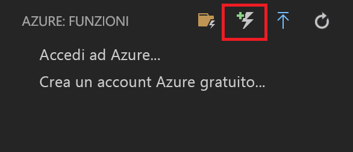
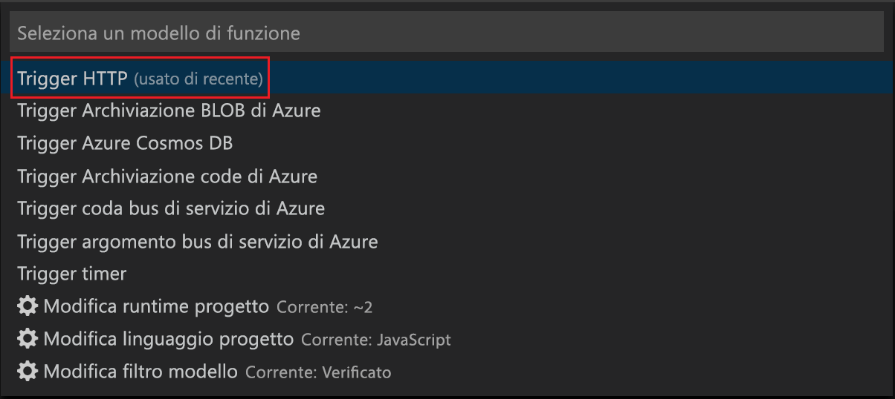
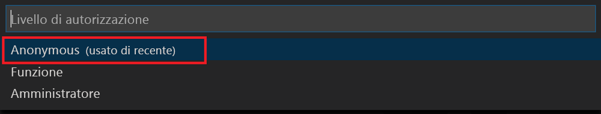

# <a name="create-your-first-durable-function-in-javascript"></a>Creare la prima funzione durevole in JavaScript

*Durable Functions* è un'estensione di [Funzioni di Azure](../functions-overview.md) che consente di scrivere funzioni con stato in un ambiente senza server. L'estensione gestisce automaticamente lo stato, i checkpoint e i riavvii.

Questo articolo spiega come l'estensione di Funzioni di Azure in Visual Studio Code per creare e testare una funzione durevole "hello world" in locale.  Questa funzione orchestrerà e concatenerà le chiamate ad altre funzioni. Il codice della funzione verrà quindi pubblicato in Azure.


## <a name="prerequisites"></a>Prerequisiti

Per completare questa esercitazione:

* Installare [Visual Studio Code](https://code.visualstudio.com/download).

* Assicurarsi di avere la versione più recente di [Azure Functions Core Tools](../functions-run-local.md).

* In un computer Windows verificare che [Emulatore di archiviazione di Azure](../../storage/common/storage-use-emulator.md) sia installato e in esecuzione. In un computer Mac o Linux è necessario usare un account di archiviazione Azure effettivo.

* Verificare che sia installata la versione 8.0 o successiva di [Node.js](https://nodejs.org/).

[!INCLUDE [quickstarts-free-trial-note](../../../includes/quickstarts-free-trial-note.md)]

[!INCLUDE [functions-install-vs-code-extension](../../../includes/functions-install-vs-code-extension.md)]

[!INCLUDE [functions-create-function-app-vs-code](../../../includes/functions-create-function-app-vs-code.md)]

## <a name="install-the-durable-functions-npm-package"></a>Installare il pacchetto npm di Durable Functions

1. Installare il `durable-functions`pacchetto npm eseguendo`npm install durable-functions` nella directory radice dell'app per le funzioni.

## <a name="creating-your-functions"></a>Creazione delle funzioni

Si creeranno ora le tre funzioni necessarie per iniziare a usare Durable Functions: un HTTP Starter, un agente di orchestrazione e una funzione di attività. HTTP Starter avvierà l'intera soluzione, mentre l'agente di orchestrazione distribuirà il lavoro tra le varie funzioni di attività.

### <a name="http-starter"></a>HTTP Starter

Prima di tutto, creare una funzione attivata da HTTP che avvia l'orchestrazione di una funzione durevole.

1. Da *Azure: Funzioni* scegliere l'icona **Crea funzione**.

    

2. Selezionare la cartella contenente il progetto di app per le funzioni e quindi selezionare il modello di funzione **Durable Functions HTTP Starter**.

    

3. Lasciare il nome predefinito `DurableFunctionsHttpStart`, premere ** **INVIO** e quindi selezionare **Anonima** come tipo di autenticazione.

    

A questo punto è stato creato un punto di ingresso nella funzione durevole. Verrà ora aggiunto un agente di orchestrazione.

### <a name="orchestrator"></a>Orchestrator

Si creerà ora un agente di orchestrazione per coordinare le funzioni dell'attività.

1. Da *Azure: Funzioni* scegliere l'icona **Crea funzione**.

    

2. Selezionare la cartella contenente il progetto di app per le funzioni e quindi selezionare il modello di funzione **Durable Functions Orchestrator**. Lasciare il nome predefinito "DurableFunctionsOrchestrator"

    

È stato aggiunto un agente di orchestrazione per coordinare le funzioni dell'attività. Verrà ora aggiunta la funzione dell'attività di riferimento.

### <a name="activity"></a>Attività

Si creerà ora una funzione di attività per eseguire effettivamente il lavoro della soluzione.

1. Da *Azure: Funzioni* scegliere l'icona **Crea funzione**.

    

2. Selezionare la cartella contenente il progetto di app per le funzioni e quindi selezionare il modello di funzione **Durable Functions Activity**. Lasciare il nome predefinito "Hello".

    

A questo punto, sono stati aggiunti tutti i componenti necessari per avviare un'orchestrazione e concatenare le funzioni dell'attività.

## <a name="test-the-function-locally"></a>Testare la funzione in locale

Azure Functions Core Tools consente di eseguire un progetto Funzioni di Azure nel computer di sviluppo locale. Viene richiesto di installare questi strumenti al primo avvio di una funzione da Visual Studio Code.

1. In un computer Windows avviare l'emulatore di Archiviazione di Azure e verificare che la proprietà **AzureWebJobsStorage** di *local.settings.json* sia impostata su `UseDevelopmentStorage=true`.

    Per l'emulatore di archiviazione 5.8 verificare che la proprietà **AzureWebJobsStorage** di local.settings.json sia impostata su `files`. In un computer Mac o Linux è necessario impostare la proprietà **AzureWebJobsStorage** sulla stringa di connessione di un account di archiviazione di Azure esistente. Sarà possibile creare un account di archiviazione più avanti in questo articolo.

2. Per testare la funzione, impostare un punto di interruzione nel codice della funzione e premere F5 per avviare il progetto di app per le funzioni. L'output dagli strumenti di base viene visualizzato nel pannello **Terminale**. Se è la prima volta che si usa Durable Functions, l'estensione Durable Functions viene installata e la compilazione potrebbe richiedere alcuni secondi.

    > [!NOTE]
    > Durable Functions di JavaScript richiedono una versione **1.7.0** o superiore delle estensioni **Microsoft.Azure.WebJobs.Extensions.DurableTask**. Eseguire il comando seguente dalla cartella radice dell'app Funzioni di Azure per installare l'estensione Durable Functions `func extensions install -p Microsoft.Azure.WebJobs.Extensions.DurableTask -v 1.7.0`

3. Nel pannello **Terminale** copiare l'endpoint dell'URL della funzione attivata da HTTP.

    

4. Sostituire `{functionName}` con `DurableFunctionsOrchestrator`.

5. Con uno strumento come [Postman](https://www.getpostman.com/) o [cURL](https://curl.haxx.se/), inviare una richiesta HTTP POST all'endpoint URL.

   La risposta è il risultato iniziale restituito dalla funzione HTTP per comunicare che l'orchestrazione durevole è stata avviata correttamente. Non è ancora il risultato finale dell'orchestrazione. La risposta include alcuni URL utili. Per il momento si eseguirà una query relativa allo stato dell'orchestrazione.

6. Copiare il valore dell'URL per `statusQueryGetUri`, incollarlo nella barra degli indirizzi del browser ed eseguire la richiesta. In alternativa è possibile continuare a usare Postman per inviare la richiesta GET.

   La richiesta eseguirà una query per determinare lo stato dell'istanza di orchestrazione. Si otterrà una risposta conclusiva in cui si specifica che l'istanza è stata completata e contenente l'output o i risultati della funzione durevole. L'aspetto sarà simile al seguente: 

    ```json
    {
        "instanceId": "d495cb0ac10d4e13b22729c37e335190",
        "runtimeStatus": "Completed",
        "input": null,
        "customStatus": null,
        "output": [
            "Hello Tokyo!",
            "Hello Seattle!",
            "Hello London!"
        ],
        "createdTime": "2018-11-08T07:07:40Z",
        "lastUpdatedTime": "2018-11-08T07:07:52Z"
    }
    ```

7. Per interrompere il debug, premere **MAIUSC+F5** in VS Code.

Dopo aver verificato la corretta esecuzione della funzione nel computer locale, è possibile pubblicare il progetto in Azure.

[!INCLUDE [functions-create-function-app-vs-code](../../../includes/functions-sign-in-vs-code.md)]

[!INCLUDE [functions-publish-project-vscode](../../../includes/functions-publish-project-vscode.md)]

## <a name="test-your-function-in-azure"></a>Testare la funzione in Azure

1. Copiare l'URL del trigger HTTP dal pannello **Output**. Il formato dell'URL che chiama la funzione attivata tramite HTTP sarà simile al seguente:

        http://<functionappname>.azurewebsites.net/orchestrators/<functionname>

2. Incollare questo nuovo URL per la richiesta HTTP nella barra degli indirizzi del browser. Quando si usa l'app pubblicata si dovrebbe ottenere la stessa risposta di stato restituita in precedenza.

## <a name="next-steps"></a>Passaggi successivi

Si è usato Visual Studio Code per creare e pubblicare un'app per le funzioni durevoli in JavaScript.

> [!div class="nextstepaction"]
> [Informazioni sui criteri di funzione permanente comuni](durable-functions-concepts.md)
