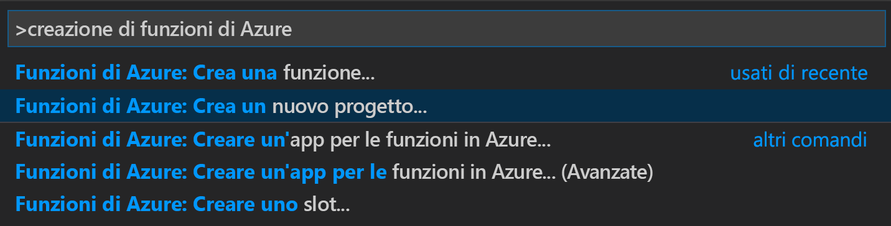
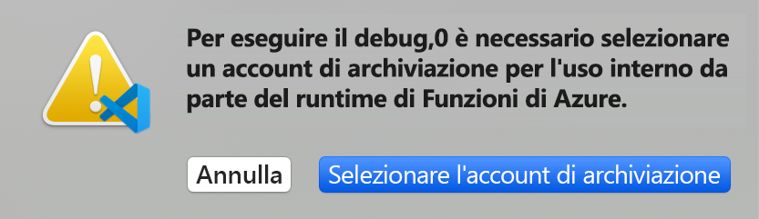
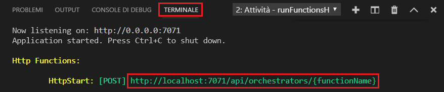

# <a name="create-your-first-durable-function-in-javascript"></a>Creare la prima funzione durevole in JavaScript

*Durable Functions* è un'estensione di [Funzioni di Azure](../functions-overview.md) che consente di scrivere funzioni con stato in un ambiente senza server. L'estensione gestisce automaticamente lo stato, i checkpoint e i riavvii.

Questo articolo spiega come l'estensione di Funzioni di Azure in Visual Studio Code per creare e testare una funzione durevole "hello world" in locale.  Questa funzione orchestrerà e concatenerà le chiamate ad altre funzioni. Il codice della funzione verrà quindi pubblicato in Azure.


## <a name="prerequisites"></a>Prerequisiti

Per completare questa esercitazione:

* Installare [Visual Studio Code](https://code.visualstudio.com/download).

* Installare l'[estensione Funzioni di Azure](https://marketplace.visualstudio.com/items?itemName=ms-azuretools.vscode-azurefunctions) per VS Code.

* Assicurarsi di avere la versione più recente di [Azure Functions Core Tools](../functions-run-local.md).

* Durable Functions richiede un account di archiviazione di Azure. È necessaria una sottoscrizione di Azure.

* Verificare che sia installato [Node.js](https://nodejs.org/) versione 10.x o 12.x.

[!INCLUDE [quickstarts-free-trial-note](../../../includes/quickstarts-free-trial-note.md)]

## <a name="create-your-local-project"></a><a name="create-an-azure-functions-project"></a>Creare il progetto locale 

In questa sezione si userà Visual Studio Code per creare un progetto di Funzioni di Azure locale. 

1. In Visual Studio Code premere F1 o CTRL/CMD+MAIUSC+P per aprire il riquadro comandi. Nel riquadro comandi cercare e selezionare `Azure Functions: Create New Project...`.

    

1. Scegliere una cartella vuota come posizione del progetto e quindi **Seleziona**.

1. Seguire le istruzioni e specificare le informazioni seguenti:

    | Prompt | valore | Descrizione |
    | ------ | ----- | ----------- |
    | Selezionare un linguaggio per il progetto di app per le funzioni | JavaScript | Creare un progetto Funzioni Node.js locale. |
    | Selezionare una versione | Azure Functions v3 (Funzioni di Azure v3) | Questa opzione viene visualizzata solo quando gli strumenti Core Tools non sono già installati. In questo caso, gli strumenti Core Tools vengono installati la prima volta che si esegue l'app. |
    | Selezionare un modello per la prima funzione del progetto | Skip for now (Ignora per ora) | |
    | Specificare come aprire il progetto | Open in current window (Apri nella finestra corrente) | Riapre VS Code nella cartella selezionata. |

Se necessario, Visual Studio Code installa Azure Functions Core Tools. Crea inoltre un progetto di app per le funzioni in una cartella. Questo progetto contiene i file di configurazione [host.json](../functions-host-json.md) e [local.settings.json](../functions-run-local.md#local-settings-file).

Viene inoltre creato un file package.json nella cartella radice.

### <a name="enable-compatibility-mode"></a>Abilitare la modalità di compatibilità

Attualmente, per Durable Functions in JavaScript è necessario che sia abilitata la modalità di compatibilità per Funzioni di Azure V2.

1. Aprire *local.settings.json* per modificare le impostazioni usate durante l'esecuzione dell'app in locale.

1. Aggiungere un'impostazione denominata `FUNCTIONS_V2_COMPATIBILITY_MODE` con valore `true`.

    ```json
    {
        "IsEncrypted": false,
        "Values": {
            "AzureWebJobsStorage": "",
            "FUNCTIONS_WORKER_RUNTIME": "node",
            "FUNCTIONS_V2_COMPATIBILITY_MODE": "true"
        }
    }
    ```

## <a name="install-the-durable-functions-npm-package"></a>Installare il pacchetto npm di Durable Functions

Per utilizzare Durable Functions in un'app per le funzioni Node.js, si usa una libreria denominata `durable-functions`.

1. Usare il menu *Visualizza* oppure CTRL+MAIUSC+' per aprire un nuovo terminale in VS Code.

1. Installare il `durable-functions`pacchetto npm eseguendo`npm install durable-functions` nella directory radice dell'app per le funzioni.

## <a name="creating-your-functions"></a>Creazione delle funzioni

L'app Durable Functions più semplice contiene le tre funzioni seguenti.

* *Funzione dell'agente di orchestrazione*: descrive un flusso di lavoro che orchestra le altre funzioni.
* *Funzione dell'attività*: chiamata dalla funzione dell'agente di orchestrazione, esegue le operazioni e restituisce facoltativamente un valore.
* *Funzione client*: normale funzione di Azure che avvia una funzione dell'agente di orchestrazione. Questo esempio usa una funzione attivata tramite HTTP.

### <a name="orchestrator-function"></a>Funzione dell'agente di orchestrazione

Per creare il codice della funzione durevole nel progetto si usa un modello.

1. Nel riquadro comandi cercare e selezionare `Azure Functions: Create Function...`.

1. Seguire le istruzioni e specificare le informazioni seguenti:

    | Prompt | valore | Descrizione |
    | ------ | ----- | ----------- |
    | Select a template for your function (Selezionare un modello per la funzione) | Durable Functions Orchestrator | Creare un'orchestrazione Durable Functions |
    | Specificare un nome di funzione | HelloOrchestrator | Nome della funzione durevole |

È stato aggiunto un agente di orchestrazione per coordinare le funzioni dell'attività. Aprire *HelloOrchestrator/index.js* per visualizzare la funzione dell'agente di orchestrazione. Ogni chiamata a `context.df.callActivity` richiama una funzione dell'attività denominata `Hello`.

Si aggiungerà ora la funzione dell'attività `Hello` cui viene fatto riferimento.

### <a name="activity-function"></a>Funzione dell'attività

1. Nel riquadro comandi cercare e selezionare `Azure Functions: Create Function...`.

1. Seguire le istruzioni e specificare le informazioni seguenti:

    | Prompt | valore | Descrizione |
    | ------ | ----- | ----------- |
    | Select a template for your function (Selezionare un modello per la funzione) | Durable Functions Activity | Creare una funzione dell'attività |
    | Specificare un nome di funzione | Ciao | Nome della funzione dell'attività |

È stata aggiunta la funzione dell'attività `Hello` richiamata dall'agente di orchestrazione. Aprire *Hello/index.js* per verificare che accetti un nome come input e restituisca un messaggio di saluto. In una funzione dell'attività si eseguiranno azioni come una chiamata al database o un calcolo.

Si aggiungerà infine una funzione attivata tramite HTTP che avvia l'orchestrazione.

### <a name="client-function-http-starter"></a>Funzione client (Http Starter)

1. Nel riquadro comandi cercare e selezionare `Azure Functions: Create Function...`.

1. Seguire le istruzioni e specificare le informazioni seguenti:

    | Prompt | valore | Descrizione |
    | ------ | ----- | ----------- |
    | Select a template for your function (Selezionare un modello per la funzione) | Durable Functions Http Starter | Creare una funzione Http Starter |
    | Specificare un nome di funzione | DurableFunctionsHttpStart | Nome della funzione dell'attività |
    | Livello di autorizzazione | Anonima | A scopo dimostrativo, consentire la chiamata della funzione senza autenticazione |

È stata aggiunta una funzione attivata tramite HTTP che avvia un'orchestrazione. Aprire *DurableFunctionsHttpStart/index.js* per verificare che usi `client.startNew` per avviare una nuova orchestrazione. Userà quindi `client.createCheckStatusResponse` per restituire una risposta HTTP contenente gli URL che possono essere usati per monitorare e gestire la nuova orchestrazione.

È ora disponibile un'app Durable Functions eseguibile in locale e distribuibile in Azure.

## <a name="test-the-function-locally"></a>Testare la funzione in locale

Azure Functions Core Tools consente di eseguire un progetto Funzioni di Azure nel computer di sviluppo locale. Viene richiesto di installare questi strumenti al primo avvio di una funzione da Visual Studio Code.

1. Per testare la funzione, impostare un punto di interruzione nel codice della funzione dell'attività `Hello` (*Hello/index.js*). Premere F5 o selezionare `Debug: Start Debugging` nel riquadro comandi per avviare il progetto di app per le funzioni. L'output dagli strumenti di base viene visualizzato nel pannello **Terminale**.

    > [!NOTE]
    > Per altre informazioni sul debug, vedere [Diagnostica in Durable Functions](durable-functions-diagnostics.md#debugging).

1. Per l'esecuzione di Durable Functions è necessario un account di archiviazione di Azure. Quando VS Code richiede di selezionare un account di archiviazione, scegliere **Select storage account** (Seleziona account di archiviazione).

    

1. Seguire le istruzioni e specificare le informazioni seguenti per creare un nuovo account di archiviazione in Azure.

    | Prompt | valore | Descrizione |
    | ------ | ----- | ----------- |
    | Seleziona sottoscrizione | *nome della sottoscrizione* | Selezionare la sottoscrizione ad Azure |
    | Select a storage account (Selezionare un account di archiviazione) | Creare un nuovo account di archiviazione. |  |
    | Enter the name of the new storage account (Immettere il nome del nuovo account di archiviazione) | *nome univoco* | Nome dell'account di archiviazione da creare |
    | Selezionare un gruppo di risorse | *nome univoco* | Nome del gruppo di risorse da creare |
    | Selezionare una località | *region* | Selezionare un'area nelle vicinanze |

1. Nel pannello **Terminale** copiare l'endpoint dell'URL della funzione attivata da HTTP.

    

1. Con uno strumento come [Postman](https://www.getpostman.com/) o [cURL](https://curl.haxx.se/), inviare una richiesta HTTP POST all'endpoint URL. Sostituire l'ultimo segmento con il nome della funzione dell'agente di orchestrazione (`HelloOrchestrator`). L'URL sarà simile a `http://localhost:7071/api/orchestrators/HelloOrchestrator`.

   La risposta è il risultato iniziale della funzione HTTP che informa che l'orchestrazione durevole è stata avviata correttamente. Non è ancora il risultato finale dell'orchestrazione. La risposta include alcuni URL utili. Per il momento si eseguirà una query relativa allo stato dell'orchestrazione.

1. Copiare il valore dell'URL per `statusQueryGetUri`, incollarlo nella barra degli indirizzi del browser ed eseguire la richiesta. In alternativa è possibile continuare a usare Postman per inviare la richiesta GET.

   La richiesta eseguirà una query per determinare lo stato dell'istanza di orchestrazione. Si otterrà una risposta conclusiva in cui si specifica che l'istanza è stata completata e contenente l'output o i risultati della funzione durevole. L'aspetto sarà simile al seguente: 

    ```json
    {
        "name": "HelloOrchestrator",
        "instanceId": "9a528a9e926f4b46b7d3deaa134b7e8a",
        "runtimeStatus": "Completed",
        "input": null,
        "customStatus": null,
        "output": [
            "Hello Tokyo!",
            "Hello Seattle!",
            "Hello London!"
        ],
        "createdTime": "2020-03-18T21:54:49Z",
        "lastUpdatedTime": "2020-03-18T21:54:54Z"
    }
    ```

1. Per interrompere il debug, premere **MAIUSC+F5** in VS Code.

Dopo aver verificato la corretta esecuzione della funzione nel computer locale, è possibile pubblicare il progetto in Azure.

[!INCLUDE [functions-create-function-app-vs-code](../../../includes/functions-sign-in-vs-code.md)]

[!INCLUDE [functions-publish-project-vscode](../../../includes/functions-publish-project-vscode.md)]

### <a name="enable-compatibility-mode"></a>Abilitare la modalità di compatibilità

La stessa compatibilità con Funzioni di Azure v2 che è stata abilitata localmente deve essere abilitata nell'app in Azure.

1. Usando il riquadro comandi cercare e selezionare `Azure Functions: Edit Setting...`.

1. Seguire le istruzioni per individuare l'app per le funzioni nella sottoscrizione di Azure.

1. Selezionare `Create new App Setting...`.

1. Immettere una nuova chiave di impostazione `FUNCTIONS_V2_COMPATIBILITY_MODE`.

1. Immettere il valore di impostazione `true`.

## <a name="test-your-function-in-azure"></a>Testare la funzione in Azure

1. Copiare l'URL del trigger HTTP dal pannello **Output**. L'URL che chiama la funzione attivata tramite HTTP deve essere nel formato `http://<functionappname>.azurewebsites.net/orchestrators/HelloOrchestrator`

2. Incollare questo nuovo URL per la richiesta HTTP nella barra degli indirizzi del browser. Quando si usa l'app pubblicata si dovrebbe ottenere la stessa risposta di stato restituita in precedenza.

## <a name="next-steps"></a>Passaggi successivi

Si è usato Visual Studio Code per creare e pubblicare un'app per le funzioni durevoli in JavaScript.

> [!div class="nextstepaction"]
> [Informazioni sui criteri di funzione permanente comuni](durable-functions-overview.md#application-patterns)