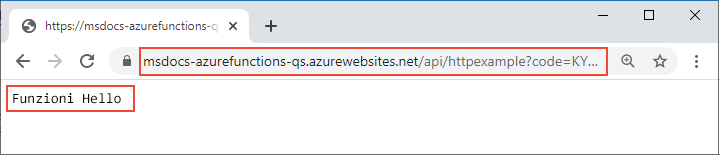

# <a name="connect-azure-functions-to-azure-storage-using-command-line-tools"></a>Connettere Funzioni di Azure ad Archiviazione di Azure con gli strumenti da riga di comando

In questo articolo si integra una coda di Archiviazione di Azure con la funzione e l'account di archiviazione creati nell'[argomento di avvio rapido precedente](functions-create-first-azure-function-azure-cli.md). È possibile ottenere questa integrazione usando un *binding di output* che scrive i dati di una richiesta HTTP in un messaggio della coda. Il completamento di questo articolo non comporta costi aggiuntivi oltre ai pochi centesimi di dollaro USA dell'argomento di avvio rapido precedente. Per altre informazioni sui binding, vedere [Concetti su trigger e binding di Funzioni di Azure](functions-triggers-bindings.md).

## <a name="configure-your-local-environment"></a>Configurare l'ambiente locale

Prima di iniziare, è necessario completare l'articolo [Avvio rapido: Creare un progetto di Funzioni di Azure dalla riga di comando](functions-create-first-azure-function-azure-cli.md). Se è già stata eseguita la pulizia delle risorse alla fine di tale articolo, eseguire di nuovo i passaggi per ricreare l'app per le funzioni e le risorse correlate in Azure.

## <a name="retrieve-the-azure-storage-connection-string"></a>Recuperare la stringa di connessione di Archiviazione di Azure

Quando è stata creata un'app per le funzioni in Azure nell'argomento di avvio rapido precedente, è stato creato anche un account di archiviazione. La stringa di connessione per questo account è archiviata in modo sicuro nelle impostazioni dell'app in Azure. Scaricando l'impostazione nel file *local.settings.json*, è possibile usare tale connessione per scrivere in una coda di archiviazione nello stesso account quando si esegue la funzione localmente. 

1. Dalla radice del progetto eseguire il comando seguente, sostituendo `<APP_NAME>` con il nome dell'app per le funzioni dall'argomento di avvio rapido precedente. Questo comando sovrascriverà tutti i valori esistenti nel file.

    ```
    func azure functionapp fetch-app-settings <APP_NAME>
    ```
    
1. Aprire *local.settings.json* e copiare il valore denominato `AzureWebJobsStorage`, che corrisponde alla stringa di connessione dell'account di archiviazione. Il nome `AzureWebJobsStorage` e la stringa di connessione si usano in altre sezioni di questo articolo.

> [!IMPORTANT]
> Poiché *local.settings.json* contiene i segreti scaricati da Azure, escludere sempre questo file dal controllo del codice sorgente. Il file con estensione *gitignore* creato con un progetto di funzioni locale esclude il file per impostazione predefinita.

[!INCLUDE [functions-register-storage-binding-extension-csharp](../../includes/functions-register-storage-binding-extension-csharp.md)]

## <a name="add-an-output-binding-definition-to-the-function"></a>Aggiungere una definizione di binding di output alla funzione

Anche se una funzione può avere un solo trigger, può avere più binding di input e di output, che consentono di connettersi ad altri servizi e risorse di Azure senza scrivere codice di integrazione personalizzato. 

::: zone pivot="programming-language-python,programming-language-javascript,programming-language-powershell,programming-language-typescript"  
Questi binding vengono dichiarati nel file *function.json* nella cartella della funzione. Dall'argomento di avvio rapido precedente il file *function.json* nella cartella *HttpExample* contiene due binding nella raccolta `bindings`:  
::: zone-end

::: zone pivot="programming-language-javascript,programming-language-typescript"  
:::code language="json" source="~/functions-quickstart-templates/Functions.Templates/Templates/HttpTrigger-JavaScript/function.json" range="2-18":::  
::: zone-end

::: zone pivot="programming-language-python"  
:::code language="json" source="~/functions-quickstart-templates/Functions.Templates/Templates/HttpTrigger-Python/function.json" range="2-18":::  
::: zone-end

::: zone pivot="programming-language-powershell"  
:::code language="json" source="~/functions-quickstart-templates/Functions.Templates/Templates/HttpTrigger-PowerShell/function.json" range="2-18":::
::: zone-end  

::: zone pivot="programming-language-python,programming-language-javascript, programming-language-powershell, programming-language-typescript"  
Ogni binding ha almeno un tipo, una direzione e un nome. Nell'esempio precedente, il primo binding è di tipo `httpTrigger` con la direzione `in`. Per la direzione `in`, `name` specifica il nome di un parametro di input inviato alla funzione quando viene richiamato dal trigger.  
::: zone-end

::: zone pivot="programming-language-javascript,programming-language-typescript"  
Il secondo binding nella raccolta è denominato `res`. Questo binding `http` è un binding di output (`out`) usato per scrivere la risposta HTTP. 

Per scrivere in una coda di Archiviazione di Azure da questa funzione, aggiungere un binding `out` di tipo `queue` con il nome `msg`, come illustrato nel codice seguente:

:::code language="json" source="~/functions-docs-javascript/functions-add-output-binding-storage-queue-cli/HttpExample/function.json" range="3-26":::
::: zone-end  

::: zone pivot="programming-language-python"  
Il secondo binding della raccolta è di tipo `http` con la direzione `out`, nel qual caso il valore speciale `name` di `$return` indica che questo binding usa il valore restituito della funzione invece di fornire un parametro di input.

Per scrivere in una coda di Archiviazione di Azure da questa funzione, aggiungere un binding `out` di tipo `queue` con il nome `msg`, come illustrato nel codice seguente:

:::code language="json" source="~/functions-docs-python/functions-add-output-binding-storage-queue-cli/HttpExample/function.json" range="3-26":::
::: zone-end  

::: zone pivot="programming-language-powershell"  
Il secondo binding nella raccolta è denominato `res`. Questo binding `http` è un binding di output (`out`) usato per scrivere la risposta HTTP. 

Per scrivere in una coda di Archiviazione di Azure da questa funzione, aggiungere un binding `out` di tipo `queue` con il nome `msg`, come illustrato nel codice seguente:

:::code language="json" source="~/functions-docs-powershell/functions-add-output-binding-storage-queue-cli/HttpExample/function.json" range="3-26":::
::: zone-end  

::: zone pivot="programming-language-python,programming-language-javascript,programming-language-powershell,programming-language-typescript"  
In questo caso, `msg` viene assegnato alla funzione come argomento di output. Per un tipo `queue`, è necessario specificare anche il nome della coda in `queueName` e fornire il *nome* della connessione di Archiviazione di Azure (da *local.settings.json*) in `connection`. 
::: zone-end  

::: zone pivot="programming-language-csharp"  
[!INCLUDE [functions-add-storage-binding-csharp-library](../../includes/functions-add-storage-binding-csharp-library.md)]  
::: zone-end  

Per altre informazioni sui dettagli dei binding, vedere [Concetti su trigger e binding di Funzioni di Azure](functions-triggers-bindings.md) e la [configurazione dell'output della coda](functions-bindings-storage-queue-output.md#configuration).

## <a name="add-code-to-use-the-output-binding"></a>Aggiungere il codice per usare il binding di output

Con il binding della coda specificato nel file *function.json*, è ora possibile aggiornare la funzione per ricevere il parametro di output `msg` e scrivere i messaggi nella coda.

::: zone pivot="programming-language-python"     
[!INCLUDE [functions-add-output-binding-python](../../includes/functions-add-output-binding-python.md)]
::: zone-end  

::: zone pivot="programming-language-javascript"  
[!INCLUDE [functions-add-output-binding-js](../../includes/functions-add-output-binding-js.md)]
::: zone-end  

::: zone pivot="programming-language-typescript"  
[!INCLUDE [functions-add-output-binding-ts](../../includes/functions-add-output-binding-ts.md)]
::: zone-end  

::: zone pivot="programming-language-powershell"  
[!INCLUDE [functions-add-output-binding-powershell](../../includes/functions-add-output-binding-powershell.md)]  
::: zone-end

::: zone pivot="programming-language-csharp"  
[!INCLUDE [functions-add-storage-binding-csharp-library-code](../../includes/functions-add-storage-binding-csharp-library-code.md)]
::: zone-end 

Si noti che *non* è necessario scrivere codice per l'autenticazione, ottenendo un riferimento alla coda o scrivendo dati. Tutte queste attività di integrazione vengono gestite facilmente nel runtime di Funzioni di Azure e nel binding di output della coda.

[!INCLUDE [functions-run-function-test-local-cli](../../includes/functions-run-function-test-local-cli.md)]

[!INCLUDE [functions-extension-bundles-info](../../includes/functions-extension-bundles-info.md)]

## <a name="view-the-message-in-the-azure-storage-queue"></a>Visualizzare il messaggio nella coda di Archiviazione di Azure

È possibile visualizzare la coda nel [portale di Azure](../storage/queues/storage-quickstart-queues-portal.md) o in [Microsoft Azure Storage Explorer](https://storageexplorer.com/). È anche possibile visualizzare la coda nell'interfaccia della riga di comando di Azure, come descritto nei passaggi seguenti:

1. Aprire il file *local.setting.json* del progetto di funzione e copiare il valore della stringa di connessione. In un terminale o una finestra di comando eseguire il comando seguente per creare una variabile di ambiente denominata `AZURE_STORAGE_CONNECTION_STRING`, incollando la stringa di connessione specifica al posto di `<MY_CONNECTION_STRING>`. Questa variabile di ambiente implica che non è necessario fornire la stringa di connessione a ogni comando successivo usando l'argomento `--connection-string`.

    # <a name="bash"></a>[Bash](#tab/bash)
    
    ```bash
    AZURE_STORAGE_CONNECTION_STRING="<MY_CONNECTION_STRING>"
    ```
    
    # <a name="powershell"></a>[PowerShell](#tab/powershell)
    
    ```powershell
    $env:AZURE_STORAGE_CONNECTION_STRING = "<MY_CONNECTION_STRING>"
    ```
    
    # <a name="cmd"></a>[Cmd](#tab/cmd)
    
    ```cmd
    set AZURE_STORAGE_CONNECTION_STRING="<MY_CONNECTION_STRING>"
    ```
    
    ---
    
1. (Facoltativo) Usare il comando [`az storage queue list`](/cli/azure/storage/queue#az-storage-queue-list) per visualizzare le code di archiviazione dell'account. L'output di questo comando dovrebbe includere una coda denominata `outqueue`, che è stata creata quando la funzione ha scritto il primo messaggio in tale coda.
    
    ```azure-cli
    az storage queue list --output tsv
    ```

1. Usare il comando [`az storage message get`](/cli/azure/storage/message#az-storage-message-get) per leggere il messaggio di questa coda, che dovrebbe essere il primo nome usato per il test della funzione eseguito in precedenza. Il comando legge e rimuove il primo messaggio dalla coda. 

    # <a name="bash"></a>[Bash](#tab/bash)
    
    ```bash
    echo `echo $(az storage message get --queue-name outqueue -o tsv --query '[].{Message:content}') | base64 --decode`
    ```
    
    # <a name="powershell"></a>[PowerShell](#tab/powershell)
    
    ```powershell
    [System.Text.Encoding]::UTF8.GetString([System.Convert]::FromBase64String($(az storage message get --queue-name outqueue -o tsv --query '[].{Message:content}')))
    ```
    
    # <a name="cmd"></a>[Cmd](#tab/cmd)
    
    ```cmd
    az storage message get --queue-name outqueue -o tsv --query [].{Message:content} > %TEMP%out.b64 && certutil -decode -f %TEMP%out.b64 %TEMP%out.txt > NUL && type %TEMP%out.txt && del %TEMP%out.b64 %TEMP%out.txt /q
    ```

    Questo script usa certutil per decodificare la raccolta di messaggi con codifica base64 da un file temporaneo locale. Se non è presente alcun output, provare a rimuovere `> NUL` dallo script per interrompere l'eliminazione dell'output di certutil, nel caso in cui si verifichi un errore. 
    
    ---
    
    Poiché il corpo del messaggio viene archiviato [con codifica base64](functions-bindings-storage-queue-trigger.md#encoding), il messaggio deve essere decodificato prima di essere visualizzato. Dopo l'esecuzione di `az storage message get`, il messaggio viene rimosso dalla coda. Se è presente un solo messaggio in `outqueue`, quando si esegue questo comando una seconda volta non viene recuperato alcun messaggio e si riceve invece un errore.

## <a name="redeploy-the-project-to-azure"></a>Ridistribuire il progetto in Azure

Dopo aver verificato in locale che la funzione ha scritto un messaggio nella coda di Archiviazione di Azure, è possibile ridistribuire il progetto per aggiornare l'endpoint in esecuzione in Azure.

1. Nella cartella *LocalFunctionsProj* usare il comando [`func azure functionapp publish`](functions-run-local.md#project-file-deployment) per ridistribuire il progetto, sostituendo `<APP_NAME>` con il nome dell'app.

    ```
    func azure functionapp publish <APP_NAME>
    ```
    
1. Come nell'argomento di avvio rapido precedente, usare un browser o un CURL per testare la funzione ridistribuita.

    # <a name="browser"></a>[Browser](#tab/browser)
    
    Copiare l'**URL di richiamo** completo visualizzato nell'output del comando publish nella barra degli indirizzi di un browser, aggiungendo il parametro di query `&name=Functions`. Nel browser dovrebbe essere visualizzato un output simile a quello visualizzato quando è stata eseguita la funzione in locale.

    

    # <a name="curl"></a>[curl](#tab/curl)
    
    Eseguire [`curl`](https://curl.haxx.se/) con l'**URL di richiamo**, aggiungendo il parametro `&name=Functions`. L'output del comando dovrebbe essere il testo "Hello Functions".
    
    

    --- 

1. Esaminare di nuovo la coda di archiviazione, come descritto nella sezione precedente, per verificare che contenga il nuovo messaggio scritto nella coda.

## <a name="clean-up-resources"></a>Pulire le risorse

Al termine, usare il comando seguente per eliminare il gruppo di risorse e tutte le risorse contenute per evitare in incorrere in ulteriori costi.

```azurecli
az group delete --name AzureFunctionsQuickstart-rg
```

## <a name="next-steps"></a>Passaggi successivi

La funzione di trigger HTTP è stata aggiornata per scrivere dati in una coda di archiviazione. Ora è possibile ottenere altre informazioni sullo sviluppo di Funzioni dalla riga di comando usando Core Tools e l'interfaccia della riga di comando di Azure:

+ [Usare Azure Functions Core Tools](functions-run-local.md)  

::: zone pivot="programming-language-csharp"  
+ [Esempi di progetti di Funzioni completi in C#](/samples/browse/?products=azure-functions&languages=csharp).

+ [Guida di riferimento per gli sviluppatori C# di Funzioni di Azure](functions-dotnet-class-library.md)  
::: zone-end 
::: zone pivot="programming-language-javascript"  
+ [Esempi di progetti di Funzioni completi in JavaScript](/samples/browse/?products=azure-functions&languages=javascript).

+ [Guida per gli sviluppatori JavaScript di Funzioni di Azure](functions-reference-node.md)  
::: zone-end  
::: zone pivot="programming-language-typescript"  
+ [Esempi di progetti di Funzioni completi in TypeScript](/samples/browse/?products=azure-functions&languages=typescript).

+ [Guida per sviluppatori TypeScript di Funzioni di Azure](functions-reference-node.md#typescript)  
::: zone-end  
::: zone pivot="programming-language-python"  
+ [Esempi di progetti di Funzioni completi in Python](/samples/browse/?products=azure-functions&languages=python)

+ [Guida per sviluppatori Python per Funzioni di Azure](functions-reference-python.md)  
::: zone-end  
::: zone pivot="programming-language-powershell"  
+ [Esempi di progetti di Funzioni completi in PowerShell](/samples/browse/?products=azure-functions&languages=azurepowershell).

+ [Guida per sviluppatori PowerShell per Funzioni di Azure](functions-reference-powershell.md) 
::: zone-end
+ [Trigger e associazioni di Funzioni di Azure](functions-triggers-bindings.md)

+ [Pagina dei prezzi di Funzioni](https://azure.microsoft.com/pricing/details/functions/)

+ [Stima dei costi del piano a consumo](functions-consumption-costs.md) 
