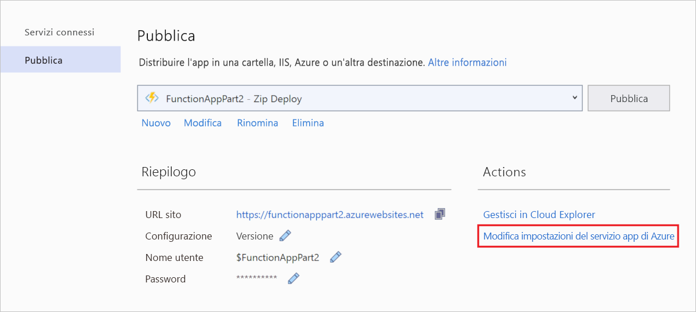
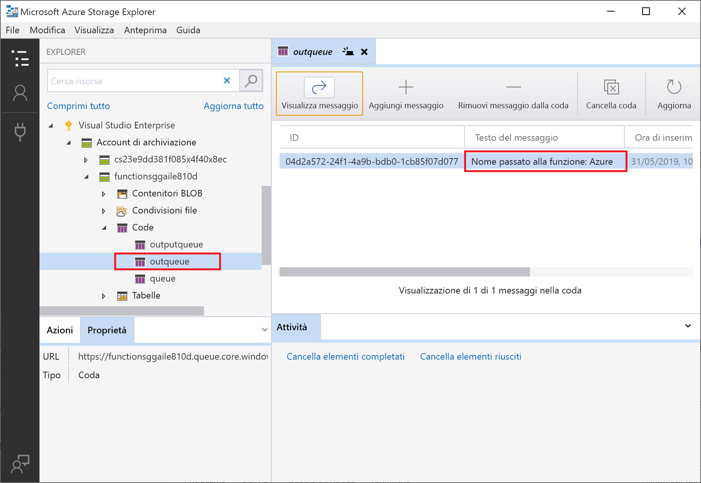

# <a name="connect-functions-to-azure-storage-using-visual-studio"></a>Connettere funzioni ad Archiviazione di Azure con Visual Studio

La soluzione Funzioni di Azure consente di connettere le funzioni ai servizi di Azure e ad altre risorse senza la necessità di scrivere codice di integrazione personalizzato. Queste connessioni predefinite sono denominate *binding*. I binding consentono di usare i servizi di Azure e altre risorse come input e output per una funzione.

L'esecuzione della funzione viene avviata da un singolo *trigger*. Un trigger è un tipo speciale di binding di input. Anche se una funzione include un solo trigger, può avere più binding di input e output. Per altre informazioni, vedere [Concetti su trigger e binding di Funzioni di Azure](functions-triggers-bindings.md).

Questo articolo illustra come usare Visual Studio per connettere la funzione creata nel [precedente argomento di avvio rapido] ad Archiviazione di Azure. Il binding di output che si aggiunge a questa funzione scrive i dati della richiesta HTTP in un messaggio della coda di Archiviazione code di Azure. 

La maggior parte dei binding richiede una stringa di connessione archiviata che verrà usata da Funzioni per accedere al servizio associato. Per semplicità, usare l'account di archiviazione creato con l'app per le funzioni. La connessione a questo account è già archiviata in un'impostazione dell'app denominata `AzureWebJobsStorage`.  

## <a name="prerequisites"></a>Prerequisiti

Prima di iniziare questo articolo, è necessario: 

 - Completare la [parte 1 dell'argomento di avvio rapido su Visual Studio][./functions-create-first-function-vs-code.md]. 

- Accedere alla sottoscrizione di Azure da Visual Studio

## <a name="download-the-function-app-settings"></a>Scaricare le impostazioni dell'app per le funzioni

Nel [precedente argomento di avvio rapido](functions-create-first-function-vs-code.md) è stata creata un'app per le funzioni in Azure insieme all'account di archiviazione necessario. La stringa di connessione per questo account è archiviata in modo sicuro nelle impostazioni dell'app in Azure. In questo articolo verranno scritti messaggi in una coda di archiviazione dello stesso account. Per connettersi all'account di archiviazione durante l'esecuzione della funzione in locale, è necessario scaricare le impostazioni dell'app nel file *local.settings.json*. 

1. In **Esplora soluzioni** fare clic con il pulsante destro del mouse sul progetto e scegliere **Pubblica**. 

1. In **Azioni** selezionare **Modifica impostazioni di Servizio app di Azure**. 

    

1. In **AzureWebJobsStorage** copiare il valore della stringa **Remote** in **Local** e quindi selezionare **OK**. 

Il binding di archiviazione, che usa l'impostazione `AzureWebJobsStorage` per la connessione, è ora in grado di connettersi a d Archiviazione code durante l'esecuzione in locale.

## <a name="register-binding-extensions"></a>Registrare le estensioni delle associazioni

Dato che si usa un binding di output di Archiviazione code, è necessario che l'estensione dei binding di archiviazione sia installata prima di eseguire il progetto. Ad eccezione dei trigger HTTP e timer, i binding vengono implementati come pacchetti di estensione. 

1. Nel menu **Strumenti** selezionare **Gestione pacchetti NuGet** > **Console di Gestione pacchetti**. 

1. Nella console eseguire il comando [Install-Package](/nuget/tools/ps-ref-install-package) seguente per installare le estensioni di archiviazione:

    ```Command
    Install-Package Microsoft.Azure.WebJobs.Extensions.Storage -Version 3.0.6
    ````

Ora è possibile aggiungere il binding di output di archiviazione nel progetto.

## <a name="add-an-output-binding"></a>Aggiungere un binding di output

[!INCLUDE [functions-add-storage-binding-csharp-library](../../includes/functions-add-storage-binding-csharp-library.md)]

## <a name="add-code-that-uses-the-output-binding"></a>Aggiungere il codice che usa l'associazione di output

Una volta definito il binding, è possibile usare il relativo valore `name` per accedervi come attributo nella firma della funzione. Usando un binding di output, non è necessario usare il codice di Azure Storage SDK per l'autenticazione, per recuperare un riferimento alla coda o per scrivere dati. Queste attività vengono eseguite automaticamente dal runtime di Funzioni e dal binding di output.

[!INCLUDE [functions-add-storage-binding-csharp-library-code](../../includes/functions-add-storage-binding-csharp-library-code.md)]

## <a name="run-the-function-locally"></a>Eseguire la funzione in locale

[!INCLUDE [functions-run-function-test-local-vs](../../includes/functions-run-function-test-local-vs.md)]

Quando il binding di output viene usato per la prima volta, nell'account di archiviazione viene creata dal runtime Funzioni una nuova coda denominata `outqueue`. Usare Cloud Explorer per verificare che siano stati creati la coda e il nuovo messaggio.

## <a name="examine-the-output-queue"></a>Esaminare la coda di output

1. Nel menu **Visualizza** di Visual Studio selezionare **Cloud Explorer**.

1. In **Cloud Explorer** espandere la sottoscrizione di Azure e **Account di archiviazione**, quindi espandere l'account di archiviazione usato dalla funzione. Se non si ricorda il nome dell'account di archiviazione, controllare l'impostazione della stringa di connessione `AzureWebJobsStorage` nel file *local.settings.json*.  

1. Espandere il nodo **Code**, quindi fare doppio clic sulla coda denominata **outqueue** per visualizzarne il contenuto in Visual Studio. 

   La coda contiene il messaggio creato dall'associazione di output della coda quando è stata eseguita la funzione attivata da HTTP. Se la funzione è stata richiamata con il valore predefinito di `name` *Azure*, il messaggio della coda è *Name passed to the function: Azure*.

    

1. Eseguire di nuovo la funzione e inviare un'altra richiesta. Nella coda verrà visualizzato un nuovo messaggio.  

Ora è il momento di ripubblicare l'app per le funzioni aggiornata in Azure.

## <a name="redeploy-and-verify-the-updated-app"></a>Ridistribuire e verificare l'app aggiornata

1. In **Esplora soluzioni** fare clic con il pulsante destro del mouse sul progetto e scegliere **Pubblica**, quindi scegliere **Pubblica** per ripubblicare il progetto in Azure.

1. Al termine della distribuzione, è possibile usare di nuovo il browser per testare la funzione ridistribuita. Come prima, aggiungere la stringa di query `&name=<yourname>` all'URL.

1. [Visualizzare di nuovo il messaggio nella coda di archiviazione](#examine-the-output-queue) per verificare che il binding di output genera anche in questo caso un nuovo messaggio nella coda.

## <a name="clean-up-resources"></a>Pulire le risorse

[!INCLUDE [Clean-up resources](../../includes/functions-quickstart-cleanup.md)]

## <a name="next-steps"></a>Passaggi successivi

La funzione di trigger HTTP è stata aggiornata per scrivere dati in una coda di archiviazione. Per altre informazioni sullo sviluppo di funzioni, vedere [Sviluppare Funzioni di Azure con Visual Studio](functions-develop-vs.md).

Quindi, è consigliabile abilitare il monitoraggio di Application Insights per l'app per le funzioni:

> [!div class="nextstepaction"]
> [Abilitare l'integrazione di Application Insights](functions-monitoring.md#manually-connect-an-app-insights-resource)

[Azure Storage Explorer]: https://storageexplorer.com/
[precedente argomento di avvio rapido]: functions-create-your-first-function-visual-studio.md
