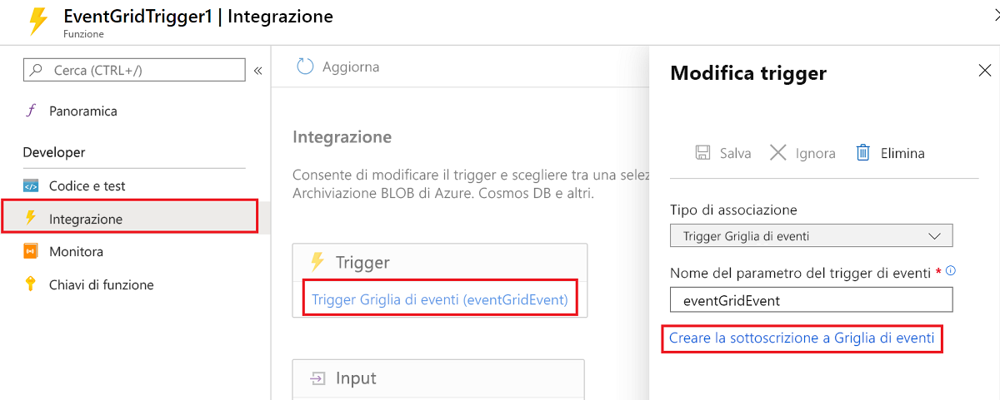
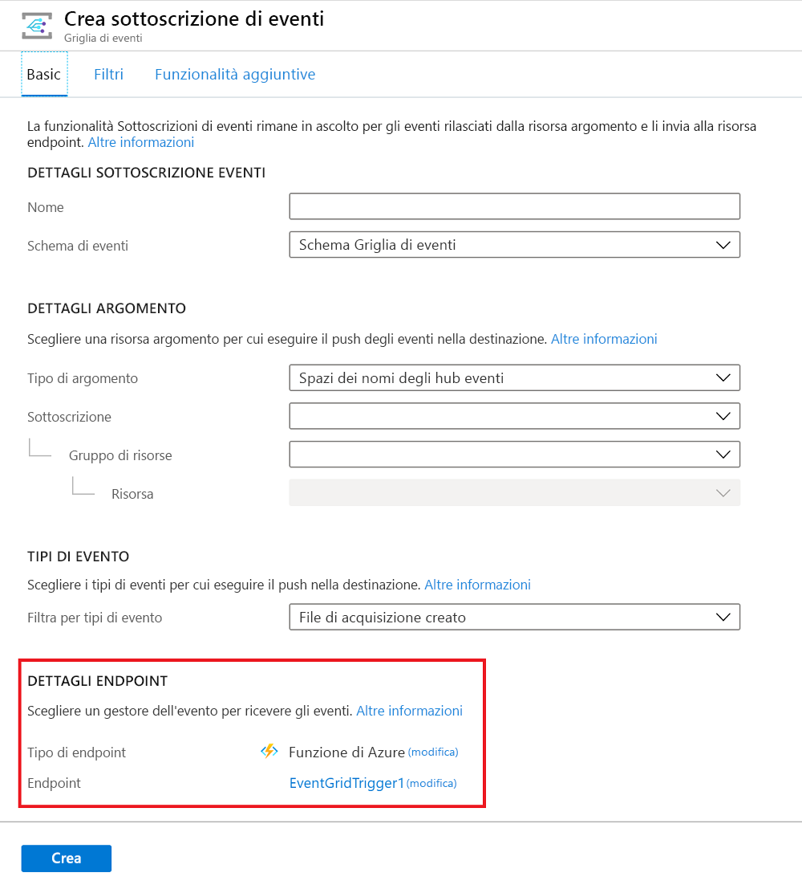

# <a name="event-grid-trigger-for-azure-functions"></a>Trigger Griglia di eventi per Funzioni di Azure

Questo articolo illustra come gestire gli eventi di [Griglia di eventi](../event-grid/overview.md) in Funzioni di Azure.

Griglia di eventi è un servizio di Azure che consente di inviare richieste HTTP per la notifica degli eventi che si verificano negli *editori*. Un editore è il servizio o la risorsa da cui ha origine l'evento. Ad esempio, un account di archiviazione BLOB di Azure è un editore, mentre un'eliminazione o un caricamento di BLOB è un evento. Alcuni [servizi di Azure includono il supporto incorporato per la pubblicazione di eventi in Griglia di eventi](../event-grid/overview.md#event-publishers). 

I *gestori* di eventi ricevono ed elaborano gli eventi. Funzioni di Azure è uno dei vari [servizi di Azure con supporto incorporato per la gestione degli eventi di Griglia di eventi](../event-grid/overview.md#event-handlers). In questo articolo viene spiegato come usare un trigger Griglia di eventi per richiamare una funzione quando Griglia di eventi riceve un evento.

Se si preferisce, è possibile usare un trigger HTTP per gestire gli eventi di Griglia di eventi. Per informazioni, vedere [Usare un trigger HTTP come un trigger Griglia di eventi](#use-an-http-trigger-as-an-event-grid-trigger) più avanti in questo articolo.

[!INCLUDE [intro](../../includes/functions-bindings-intro.md)]

## <a name="example"></a>Esempio

Fare riferimento all'esempio di trigger Griglia di eventi specifico per ogni linguaggio:

* [C#](#c-example)
* [Script C# (file con estensione csx)](#c-script-example)
* [JavaScript](#javascript-example)

Per un esempio di trigger HTTP, vedere [Come usare un trigger HTTP](#use-an-http-trigger-as-an-event-grid-trigger) più avanti in questo articolo.

### <a name="c-example"></a>Esempio in C#

L'esempio seguente illustra una [funzione C#](functions-dotnet-class-library.md) che registra alcuni dei campi comuni a tutti gli eventi e tutti i dati specifici degli eventi.

```cs
[FunctionName("EventGridTest")]
public static void EventGridTest([EventGridTrigger] EventGridEvent eventGridEvent, TraceWriter log)
{
    log.Info("C# Event Grid function processed a request.");
    log.Info($"Subject: {eventGridEvent.Subject}");
    log.Info($"Time: {eventGridEvent.EventTime}");
    log.Info($"Data: {eventGridEvent.Data.ToString()}");
}
```

L'attributo `EventGridTrigger` è definito nel pacchetto NuGet [Microsoft.Azure.WebJobs.Extensions.EventGrid](https://www.nuget.org/packages/Microsoft.Azure.WebJobs.Extensions.EventGrid).

### <a name="c-script-example"></a>Esempio di script C#

L'esempio seguente mostra un'associazione di trigger in un file *function.json* e una [funzione script C#](functions-reference-csharp.md) che usa l'associazione. La funzione registra alcuni dei campi comuni a tutti gli eventi e tutti i dati specifici degli eventi.

Ecco i dati di associazione nel file *function.json*:

```json
{
  "bindings": [
    {
      "type": "eventGridTrigger",
      "name": "eventGridEvent",
      "direction": "in"
    }
  ],
  "disabled": false
}
```

Ecco il codice script C#:

```csharp
#r "Newtonsoft.Json"
#r "Microsoft.Azure.WebJobs.Extensions.EventGrid"
using Microsoft.Azure.WebJobs.Extensions.EventGrid;

public static void Run(EventGridEvent eventGridEvent, TraceWriter log)
{
    log.Info("C# Event Grid function processed a request.");
    log.Info($"Subject: {eventGridEvent.Subject}");
    log.Info($"Time: {eventGridEvent.EventTime}");
    log.Info($"Data: {eventGridEvent.Data.ToString()}");
}
```

### <a name="javascript-example"></a>Esempio JavaScript

L'esempio seguente illustra un'associazione di trigger in un file *function.json* e una [funzione JavaScript](functions-reference-node.md) che usa l'associazione. La funzione registra alcuni dei campi comuni a tutti gli eventi e tutti i dati specifici degli eventi.

Ecco i dati di associazione nel file *function.json*:

```json
{
  "bindings": [
    {
      "type": "eventGridTrigger",
      "name": "eventGridEvent",
      "direction": "in"
    }
  ],
  "disabled": false
}
```

Ecco il codice JavaScript:

```javascript
module.exports = function (context, eventGridEvent) {
    context.log("JavaScript Event Grid function processed a request.");
    context.log("Subject: " + eventGridEvent.subject);
    context.log("Time: " + eventGridEvent.eventTime);
    context.log("Data: " + JSON.stringify(eventGridEvent.data));
    context.done();
};
```
     
## <a name="attributes"></a>Attributi

Nelle [librerie di classi C#](functions-dotnet-class-library.md) usare l'attributo [EventGridTrigger](https://github.com/Azure/azure-functions-eventgrid-extension/blob/master/src/EventGridExtension/EventGridTriggerAttribute.cs), definito nel pacchetto NuGet [Microsoft.Azure.WebJobs.Extensions.EventGrid](https://www.nuget.org/packages/Microsoft.Azure.WebJobs.Extensions.EventGrid).

Di seguito è mostrato un attributo `EventGridTrigger` in una firma del metodo:

```csharp
[FunctionName("EventGridTest")]
public static void EventGridTest([EventGridTrigger] EventGridEvent eventGridEvent, TraceWriter log)
{
    ...
}
 ```

Per un esempio completo, vedere l'[esempio in C#](#c-example).

## <a name="configuration"></a>Configurazione

Nella tabella seguente sono illustrate le proprietà di configurazione dell'associazione impostate nel file *function.json*. Non sono presenti parametri o proprietà di costruttori da impostare nell'attributo `EventGridTrigger`.

|Proprietà di function.json |DESCRIZIONE|
|---------|---------|----------------------|
| **type** | Obbligatoria. Deve essere impostata su `eventGridTrigger`. |
| **direction** | Obbligatoria. Deve essere impostata su `in`. |
| **nome** | Obbligatoria: nome della variabile usato nel codice della funzione per il parametro che riceve i dati dell'evento. |

## <a name="usage"></a>Uso

Per le funzioni C# e F# è necessario dichiarare `EventGridEvent` o un tipo personalizzato come tipo dell'input del trigger. Per un tipo personalizzato, il runtime di Funzioni prova ad analizzare il file JSON dell'evento per impostare le proprietà dell'oggetto.

Per le funzioni JavaScript, il parametro denominato in base alla proprietà `name` di *function.json* contiene un riferimento all'oggetto evento.

## <a name="event-schema"></a>Schema di eventi

I dati di un evento di Griglia di eventi vengono trasmessi come oggetto JSON nel corpo di una richiesta HTTP. L'oggetto JSON sarà simile all'esempio seguente:

```json
[{
  "topic": "/subscriptions/{subscriptionid}/resourceGroups/eg0122/providers/Microsoft.Storage/storageAccounts/egblobstore",
  "subject": "/blobServices/default/containers/{containername}/blobs/blobname.jpg",
  "eventType": "Microsoft.Storage.BlobCreated",
  "eventTime": "2018-01-23T17:02:19.6069787Z",
  "id": "{guid}",
  "data": {
    "api": "PutBlockList",
    "clientRequestId": "{guid}",
    "requestId": "{guid}",
    "eTag": "0x8D562831044DDD0",
    "contentType": "application/octet-stream",
    "contentLength": 2248,
    "blobType": "BlockBlob",
    "url": "https://egblobstore.blob.core.windows.net/{containername}/blobname.jpg",
    "sequencer": "000000000000272D000000000003D60F",
    "storageDiagnostics": {
      "batchId": "{guid}"
    }
  },
  "dataVersion": "",
  "metadataVersion": "1"
}]
```

L'esempio illustrato rappresenta una matrice di un elemento. Griglia di eventi invia sempre una matrice e può inviare più eventi nella matrice. Il runtime richiama la funzione una volta per ogni elemento della matrice.

Le proprietà di livello superiore nei dati JSON dell'evento sono uguali per tutti i tipi di evento, mentre il contenuto della proprietà `data` è specifico per ogni tipo di evento. L'esempio illustrato si riferisce a un evento di archiviazione BLOB.

Per altre informazioni sulle proprietà comuni e specifiche degli eventi, vedere [Proprietà degli eventi](../event-grid/event-schema.md#event-properties) nella documentazione relativa a Griglia di eventi.

Il tipo `EventGridEvent` definisce solo le proprietà di livello superiore, mentre la proprietà `Data` è un elemento `JObject`. 

## <a name="create-a-subscription"></a>Creare una sottoscrizione

Per iniziare a ricevere richieste HTTP di Griglia di eventi, è necessario creare una sottoscrizione di Griglia di eventi in cui sia specificato l'URL dell'endpoint che richiama la funzione.

### <a name="azure-portal"></a>Portale di Azure

Per le funzioni sviluppate nel portale di Azure con il trigger Griglia di eventi, selezionare **Aggiungi sottoscrizione di Griglia di eventi**.



Quando si seleziona questo collegamento, nel portale si apre la pagina **Crea sottoscrizione di eventi** con l'URL dell'endpoint precompilato.



Per altre informazioni su come creare sottoscrizioni tramite il portale di Azure, vedere [Creare eventi personalizzati con il portale di Azure](../event-grid/custom-event-quickstart-portal.md) nella documentazione relativa a Griglia di eventi.

### <a name="azure-cli"></a>Interfaccia della riga di comando di Azure

Per creare una sottoscrizione tramite l'[interfaccia della riga di comando di Azure](https://docs.microsoft.com/cli/azure/get-started-with-azure-cli?view=azure-cli-latest), usare il comando [az eventgrid event-subscription create](https://docs.microsoft.com/cli/azure/eventgrid/event-subscription?view=azure-cli-latest#az_eventgrid_event_subscription_create).

Il comando richiede l'URL dell'endpoint che richiama la funzione. L'esempio seguente illustra il modello di URL:

```
https://{functionappname}.azurewebsites.net/admin/extensions/EventGridExtensionConfig?functionName={functionname}&code={systemkey}
```

La chiave di sistema è una chiave di autorizzazione che deve essere inclusa nell'URL dell'endpoint di un trigger Griglia di eventi. La sezione seguente spiega come ottenere la chiave di sistema.

Di seguito è riportato un esempio di sottoscrizione a un account di archiviazione BLOB (con un segnaposto per la chiave di sistema):

```azurecli
az eventgrid resource event-subscription create -g myResourceGroup \
--provider-namespace Microsoft.Storage --resource-type storageAccounts \
--resource-name glengablobstorage --name myFuncSub  \
--included-event-types Microsoft.Storage.BlobCreated \
--subject-begins-with /blobServices/default/containers/images/blobs/ \
--endpoint https://glengastorageevents.azurewebsites.net/admin/extensions/EventGridExtensionConfig?functionName=imageresizefunc&code=LUwlnhIsNtSiUjv/sNtSiUjvsNtSiUjvsNtSiUjvYb7XDonDUr/RUg==
```

Per altre informazioni su come creare una sottoscrizione, vedere la [guida introduttiva all'archiviazione BLOB](../storage/blobs/storage-blob-event-quickstart.md#subscribe-to-your-storage-account) o le altre guide introduttive a Griglia di eventi.

### <a name="get-the-system-key"></a>Ottenere la chiave di sistema

È possibile ottenere la chiave di sistema tramite l'API seguente (HTTP GET):

```
http://{functionappname}.azurewebsites.net/admin/host/systemkeys/eventgridextensionconfig_extension?code={adminkey}
```

Poiché si tratta di un'API di amministrazione, è necessaria la [chiave amministratore](functions-bindings-http-webhook.md#authorization-keys). Non confondere la chiave di sistema (per richiamare una funzione trigger Griglia di eventi) con la chiave amministratore (per l'esecuzione di attività amministrative nell'app per le funzioni). Quando si sottoscrive un argomento di Griglia di eventi, usare la chiave di sistema.

Di seguito è riportato un esempio di risposta fornita dalla chiave di sistema:

```
{
  "name": "eventgridextensionconfig_extension",
  "value": "{the system key for the function}",
  "links": [
    {
      "rel": "self",
      "href": "{the URL for the function, without the system key}"
    }
  ]
}
```

Per altre informazioni, vedere [Chiavi di autorizzazione](functions-bindings-http-webhook.md#authorization-keys) nell'articolo di riferimento relativo al trigger HTTP. 

In alternativa, è possibile inviare una richiesta HTTP PUT per specificare il valore della chiave autonomamente.

## <a name="local-testing-with-requestbin"></a>Test locale con RequestBin

Per testare un trigger Griglia di eventi in locale, è necessario ottenere le richieste HTTP di Griglia di eventi inviate dalla rispettiva origine nel cloud al computer locale. A tale scopo, è possibile acquisire le richieste online e rinviarle manualmente al computer locale:

2. [Creare un endpoint RequestBin](#create-a-RequestBin-endpoint).
3. [Creare una sottoscrizione di Griglia di eventi](#create-an-event-grid-subscription) per inviare gli eventi all'endpoint RequestBin.
4. [Generare una richiesta](#generate-a-request) e copiare il corpo della richiesta dal sito RequestBin.
5. [Inviare manualmente la richiesta](#manually-post-the-request) all'URL localhost della funzione trigger Griglia di eventi.

Al termine del test, è possibile usare la stessa sottoscrizione per scopi di produzione aggiornando l'endpoint. Usare il comando dell'interfaccia della riga di comando di Azure [az eventgrid event-subscription update](https://docs.microsoft.com/cli/azure/eventgrid/event-subscription?view=azure-cli-latest#az_eventgrid_event_subscription_update).

### <a name="create-a-requestbin-endpoint"></a>Creare un endpoint RequestBin

RequestBin è uno strumento open source che accetta le richieste HTTP e visualizza il corpo di tali richieste. Griglia di eventi di Azure riserva all'URL http://requestb.in un trattamento speciale. Per facilitare il test, Griglia di eventi invia gli eventi all'URL RequestBin senza richiedere una risposta corretta alle richieste di convalida della sottoscrizione. Lo stesso trattamento è riservato ad altri due strumenti di test: http://webhookinbox.com e http://hookbin.com.

RequestBin non è destinato all'utilizzo con velocità effettiva elevata. Se si esegue il push di più di un evento alla volta, è possibile che non vengano visualizzati tutti gli eventi nello strumento.

Creare un endpoint.


Copiare l'URL dell'endpoint.


### <a name="create-an-event-grid-subscription"></a>Creare una sottoscrizione di Griglia di eventi

Creare una sottoscrizione di Griglia di eventi del tipo che si vuole testare e assegnare a tale sottoscrizione l'endpoint RequestBin. Per informazioni su come creare una sottoscrizione, vedere [Creare una sottoscrizione](#create-a-subscription) più indietro in questo articolo.

### <a name="generate-a-request"></a>Generare una richiesta

Attivare un evento che genera traffico HTTP nell'endpoint RequestBin.  Ad esempio, se è stata creata una sottoscrizione di archiviazione BLOB, caricare o eliminare un BLOB. Quando nella pagina RequestBin viene visualizzata una richiesta, copiare il corpo della richiesta.

Si riceverà prima la richiesta di convalida della sottoscrizione. Ignorare tutte le richieste di convalida e copiare la richiesta di evento.


### <a name="manually-post-the-request"></a>Inviare manualmente la richiesta

Eseguire la funzione di Griglia di eventi in locale.

Usare uno strumento, ad esempio [Postman](https://www.getpostman.com/) o [curl](https://curl.haxx.se/docs/httpscripting.html), per creare una richiesta HTTP POST:

* Impostare un'intestazione `Content-Type: application/json`.
* Impostare un'intestazione `aeg-event-type: Notification`.
* Incollare i dati di RequestBin nel corpo della richiesta. 
* Inviare all'URL della funzione trigger Griglia di eventi usando il modello seguente:

```
http://localhost:7071/admin/extensions/EventGridExtensionConfig?functionName={methodname}
``` 

Il parametro `functionName` deve corrispondere al nome specificato nell'attributo `FunctionName`.

Le schermate seguenti illustrano le intestazioni e il corpo della richiesta in Postman:


La funzione trigger Griglia di eventi viene eseguita e vengono visualizzati log simili all'esempio seguente:


## <a name="local-testing-with-ngrok"></a>Test locale con ngrok

Un altro modo per eseguire il test di un trigger Griglia di eventi in locale è quello di automatizzare la connessione HTTP tra Internet e il computer di sviluppo. A tale scopo, è possibile usare uno strumento open source denominato [ngrok](https://ngrok.com/):

3. [Creare un endpoint ngrok](#create-an-ngrok-endpoint).
4. [Eseguire la funzione trigger Griglia di eventi](#run-the-event-grid-trigger-function).
5. [Creare una sottoscrizione di Griglia di eventi](#create-a-subscription) per inviare gli eventi all'endpoint ngrok.
6. [Attivare un evento](#trigger-an-event).

Al termine del test, è possibile usare la stessa sottoscrizione per scopi di produzione aggiornando l'endpoint. Usare il comando dell'interfaccia della riga di comando di Azure [az eventgrid event-subscription update](https://docs.microsoft.com/cli/azure/eventgrid/event-subscription?view=azure-cli-latest#az_eventgrid_event_subscription_update).

### <a name="create-an-ngrok-endpoint"></a>Creare un endpoint ngrok

Scaricare *ngrok.exe* da [ngrok](https://ngrok.com/) ed eseguire il file con il comando seguente:

```
ngrok http -host-header=localhost 7071
```

Il parametro -host-header è necessario perché il runtime delle funzioni prevede di ricevere richieste da localhost quando viene eseguito in localhost. 7071 è il numero di porta predefinito quando il runtime viene eseguito in locale.

Il comando crea un output simile al seguente:

```
Session Status                online
Version                       2.2.8
Region                        United States (us)
Web Interface                 http://127.0.0.1:4040
Forwarding                    http://263db807.ngrok.io -> localhost:7071
Forwarding                    https://263db807.ngrok.io -> localhost:7071

Connections                   ttl     opn     rt1     rt5     p50     p90
                              0       0       0.00    0.00    0.00    0.00
```

Per la sottoscrizione di Griglia di eventi verrà usato l'URL https://{subdomain}.ngrok.io.

### <a name="run-the-event-grid-trigger-function"></a>Eseguire la funzione trigger Griglia di eventi

L'URL di ngrok non riceve un trattamento speciale da parte di Griglia di eventi. Di conseguenza, la funzione deve essere in esecuzione in locale quando si crea la sottoscrizione. In caso contrario, la risposta di convalida non viene inviata e la sottoscrizione non viene creata.

### <a name="create-a-subscription"></a>Creare una sottoscrizione

Creare una sottoscrizione di Griglia di eventi del tipo che si vuole testare e assegnare a tale sottoscrizione l'endpoint ngrok usando il modello seguente:

```
https://{subdomain}.ngrok.io/admin/extensions/EventGridExtensionConfig?functionName={methodname}
``` 

Il parametro `functionName` deve corrispondere al nome specificato nell'attributo `FunctionName`.

Di seguito è riportato un esempio basato sull'uso dell'interfaccia della riga di comando di Azure:

```
az eventgrid event-subscription create --resource-id /subscriptions/aeb4b7cb-b7cb-b7cb-b7cb-b7cbb6607f30/resourceGroups/eg0122/providers/Microsoft.Storage/storageAccounts/egblobstor0122 --name egblobsub0126 --endpoint https://263db807.ngrok.io/admin/extensions/EventGridExtensionConfig?functionName=EventGridTrigger
```

Per informazioni su come creare una sottoscrizione, vedere [Creare una sottoscrizione](#create-a-subscription) più indietro in questo articolo.

### <a name="trigger-an-event"></a>Attivare un evento

Attivare un evento che genera traffico HTTP nell'endpoint ngrok.  Ad esempio, se è stata creata una sottoscrizione di archiviazione BLOB, caricare o eliminare un BLOB.

La funzione trigger Griglia di eventi viene eseguita e vengono visualizzati log simili all'esempio seguente:


## <a name="use-an-http-trigger-as-an-event-grid-trigger"></a>Usare un trigger HTTP come trigger Griglia di eventi

Poiché gli eventi di Griglia di eventi vengono ricevuti come richieste HTTP, è possibile gestire tali eventi usando un trigger HTTP anziché un trigger Griglia di eventi. Un possibile vantaggio offerto da questa scelta è un maggiore controllo sull'URL dell'endpoint che richiama la funzione. 

Se si usa un trigger HTTP, è necessario scrivere il codice per le operazioni che il trigger Griglia di eventi esegue automaticamente:

* Invia una risposta di convalida a una [richiesta di convalida della sottoscrizione](../event-grid/security-authentication.md#webhook-event-delivery).
* Richiama la funzione per ogni elemento della matrice di eventi contenuta nel corpo della richiesta.

Il codice C# di esempio seguente relativo a un trigger HTTP simula il comportamento del trigger Griglia di eventi:

```csharp
[FunctionName("HttpTrigger")]
public static async Task<HttpResponseMessage> Run(
    [HttpTrigger(AuthorizationLevel.Anonymous, "post")]HttpRequestMessage req,
    TraceWriter log)
{
    log.Info("C# HTTP trigger function processed a request.");

    var messages = await req.Content.ReadAsAsync<JArray>();

    // If the request is for subscription validation, send back the validation code.
    if (messages.Count > 0 && string.Equals((string)messages[0]["eventType"], 
        "Microsoft.EventGrid.SubscriptionValidationEvent", 
        System.StringComparison.OrdinalIgnoreCase))
    {
        log.Info("Validate request received");
        return req.CreateResponse<object>(new
        {
            validationResponse = messages[0]["data"]["validationCode"]
        });
    }

    // The request is not for subscription validation, so it's for one or more events.
    foreach (JObject message in messages)
    {
        // Handle one event.
        EventGridEvent eventGridEvent = message.ToObject<EventGridEvent>();
        log.Info($"Subject: {eventGridEvent.Subject}");
        log.Info($"Time: {eventGridEvent.EventTime}");
        log.Info($"Event data: {eventGridEvent.Data.ToString()}");
    }

    return req.CreateResponse(HttpStatusCode.OK);
}
```

Il codice JavaScript di esempio seguente relativo a un trigger HTTP simula il comportamento del trigger Griglia di eventi:

```javascript
module.exports = function (context, req) {
    context.log('JavaScript HTTP trigger function processed a request.');

    var messages = req.body;
    // If the request is for subscription validation, send back the validation code.
    if (messages.length > 0 && messages[0].eventType == "Microsoft.EventGrid.SubscriptionValidationEvent") {
        context.log('Validate request received');
        context.res = { status: 200, body: messages[0].data.validationCode }
    }
    else {
        // The request is not for subscription validation, so it's for one or more events.
        for (var i = 0; i < messages.length; i++) {
            // Handle one event.
            var message = messages[i];
            context.log('Subject: ' + message.subject);
            context.log('Time: ' + message.eventTime);
            context.log('Data: ' + JSON.stringify(message.data));
        }
    }
    context.done();
};
```

Il codice di gestione degli eventi si inserisce all'interno di un ciclo attraverso la matrice `messages`.

Per informazioni sull'URL da usare per richiamare la funzione in locale o quando è in esecuzione in Azure, vedere la [documentazione di riferimento relativa alle associazioni del trigger HTTP](functions-bindings-http-webhook.md). 

## <a name="next-steps"></a>Passaggi successivi

> [!div class="nextstepaction"]
> [Altre informazioni su trigger e associazioni di Funzioni di Azure](functions-triggers-bindings.md)

> [!div class="nextstepaction"]
> [Altre informazioni su Griglia di eventi](../event-grid/overview.md)
