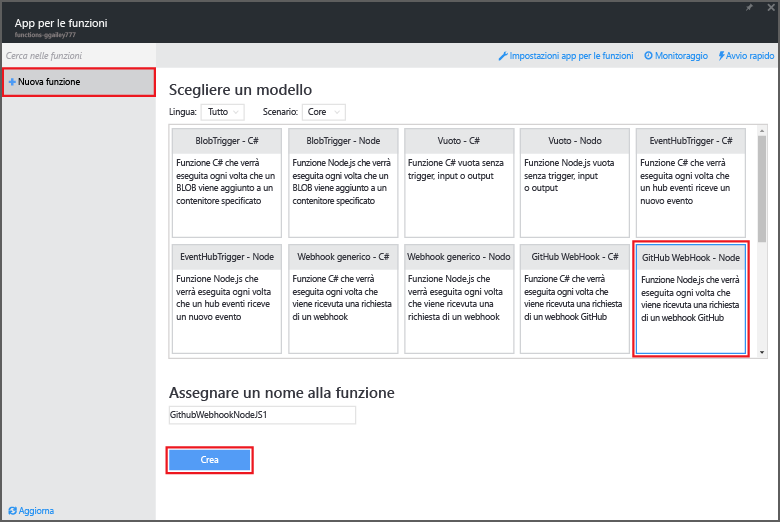
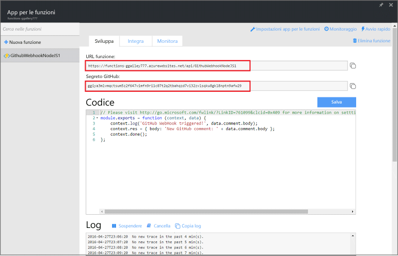
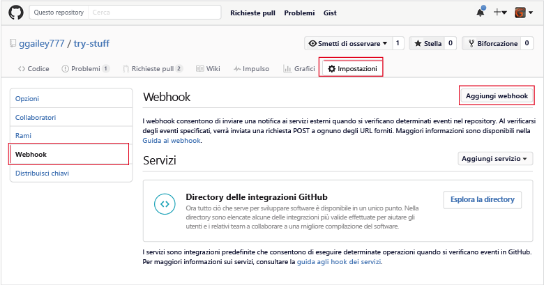
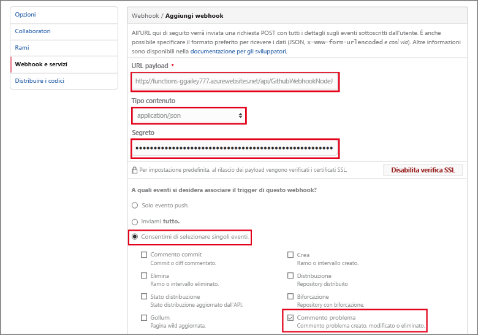

# Creare un webhook o una funzione API di Azure
Funzioni di Azure è un'esperienza di calcolo su richiesta basata su eventi che consente di creare unità pianificate o attivate del codice implementate in un'ampia gamma di linguaggi di programmazione. Per altre informazioni su Funzioni di Azure, vedere [Panoramica di Funzioni di Azure](functions-overview.md).

Questo argomento illustra come creare una nuova funzione Node.js richiamata da un webhook GitHub. La nuova funzione viene creata in base a un modello predefinito nel portale di Funzioni di Azure. È anche possibile guardare un breve video per scoprire come eseguire questi passaggi nel portale.

## Video
Il video seguente mostra come eseguire i passaggi di base di questa esercitazione 

>[!VIDEO https://channel9.msdn.com/Series/Windows-Azure-Web-Sites-Tutorials/Create-a-Web-Hook-or-API-Azure-Function/player]
>
>

## Creare una funzione attivata tramite webhook a partire dal modello
Un'app per le funzioni ospita l'esecuzione delle funzioni in Azure. Prima di creare una funzione, è necessario avere un account Azure attivo. Se non si possiede un account di Azure, [sono disponibili account gratuiti](https://azure.microsoft.com/free/). 

1. Passare al [portale di Funzioni di Azure](https://functions.azure.com/signin) e accedere con l'account Azure.
2. Se si dispone di un'app per le funzioni esistente da poter usare, selezionarla da **App per le funzioni** e fare clic su **Apri**. Per creare una nuova app per le funzioni, digitare un **Nome** univoco da assegnare o accettare quello generato automaticamente, selezionare l'**Area** preferita, quindi fare clic su **Creazione e introduzione**. 
3. Nell'app per le funzioni fare clic su **+ Nuova funzione** > **Webhook GitHub - Node** > **Crea**. Verrà creata una funzione con un nome predefinito basato sul modello specificato. 
   
     
4. In **Sviluppo** prendere nota della funzione di esempio express.js nella finestra **Codice**. Questa funzione riceve una richiesta di GitHub da un webhook di commento al problema, registra il testo relativo al problema e invia una risposta al webhook come `New GitHub comment: <Your issue comment text>`.

     

1. Copiare i valori **URL funzione** e **Segreto GitHub**. Saranno necessari al momento della creazione del webhook in GitHub. 
2. Scorrere verso il basso fino a **Esegui**, prendere nota del corpo JSON predefinito del commento a un problema nel corpo della richiesta, quindi fare clic su **Esegui**. 
   
    È sempre possibile testare una nuova funzione basata sul modello direttamente nella scheda **Sviluppo** specificando tutti i dati del corpo JSON previsti e facendo clic sul pulsante **Esegui**. In questo caso, il modello dispone di un corpo predefinito per un commento al problema. 

Verrà successivamente creato il webhook effettivo nel repository GitHub.

## Configurare il webhook
1. In GitHub, accedere a un repository di proprietà, incluso qualsiasi repository biforcato.
2. Fare clic su **Settings** (Impostazioni) > **Webhooks & services** (Webhook e servizi) > **Add webhook (Aggiungi webhook)**.
   
       
3. Incollare l'URL della funzione e il segreto in **Payload URL** (URL del payload) e **Secret** (Segreto), quindi fare clic su **Let me select individual events** (Consenti di selezionare eventi singoli), selezionare **Issue comment** (Commento problema) e fare clic su **Add webhook** (Aggiungi webhook).
   
     

A questo punto, il webhook di GitHub è configurato per attivare la funzione quando un nuovo commento al problema viene aggiunto.  
È giunto il momento di testarlo.

## Testare la funzione
1. Nel repository GitHub aprire la scheda **Issues** (Problemi) in una nuova finestra del browser, fare clic su **New Issue** (Nuovo problema), digitare un titolo, quindi fare clic su **Submit new issue** (Invia nuovo problema). È possibile anche aprire un problema esistente.
2. Nel problema, digitare un commento e fare clic su **Comment (Commento)**. A questo punto, è possibile tornare indietro al nuovo webhook in GitHub per vedere in **Recent Deliveries** (Consegne recenti) che è stata inviata una richiesta di webhook e che il corpo della risposta è `New GitHub comment: <Your issue comment text>`.
3. Tornare al portale di Funzioni, scorrere verso il basso fino ai log per riscontrare che la funzione è stata attivata e che il valore `New GitHub comment: <Your issue comment text>` è stato scritto nei log di streaming.

## Passaggi successivi
Vedere gli argomenti seguenti per altre informazioni su Funzioni di Azure.

* [Guida di riferimento per gli sviluppatori di Funzioni di Azure](functions-reference.md)  
   Informazioni di riferimento per programmatori in merito alla codifica delle funzioni.
* [Test di Funzioni di Azure](functions-test-a-function.md)  
   Descrive diversi strumenti e tecniche per il test delle funzioni.
* [Come aumentare le prestazioni di Funzioni di Azure](functions-scale.md)  
   Presenta i piani di servizio disponibili con Funzioni di Azure, tra cui il piano di servizio dinamico, e come scegliere quello più appropriato.  

[!INCLUDE [Getting Started Note](../../includes/functions-get-help.md)]

<!--HONumber=Nov16_HO2-->

