# <a name="use-azure-functions-to-create-a-function-that-connects-to-other-azure-services"></a>Usare Funzioni di Azure per creare una funzione che connette ad altri servizi di Azure

Questo argomento illustra come creare una funzione in Funzioni di Azure che ascolta i messaggi in una coda di Azure e li copia nelle righe di una tabella di Archiviazione di Azure. Per caricare i messaggi nella coda viene usata una funzione attivata da un timer. Una seconda funzione legge i messaggi dalla coda e li scrive nella tabella. Sia la coda che la tabella vengono create da funzioni di Azure sulla base delle definizioni di associazione. 

Per rendere le cose più interessanti, una funzione è scritta in JavaScript e l'altra in C#. Questo dimostra che un'app per le funzioni può avere funzioni scritte in linguaggi diversi. 

È possibile vedere la dimostrazione di questo scenario in un [video di Channel 9](https://channel9.msdn.com/Series/Windows-Azure-Web-Sites-Tutorials/Create-an-Azure-Function-which-binds-to-an-Azure-service/player).

## <a name="create-a-function-that-writes-to-the-queue"></a>Creare una funzione che scrive nella coda

Prima di connettersi a una coda di archiviazione, è necessario creare una funzione che carica la coda di messaggi. La funzione JavaScript usa un trigger basato su timer che scrive un messaggio nella coda ogni 10 secondi. Se non si dispone già di un account Azure, vedere [Prova Funzioni di Azure](https://functions.azure.com/try) oppure [creare un account Azure gratuito](https://azure.microsoft.com/free/).

1. Passare al portale di Azure e trovare l'app per le funzioni.

2. Fare clic su **Nuova funzione** > **TimerTrigger-JavaScript**. 

3. Assegnare alla funzione il nome **FunctionsBindingsDemo1**, immettere un valore di espressione cron `0/10 * * * * *` per **Pianificazione** e quindi fare clic su **Crea**.
   
    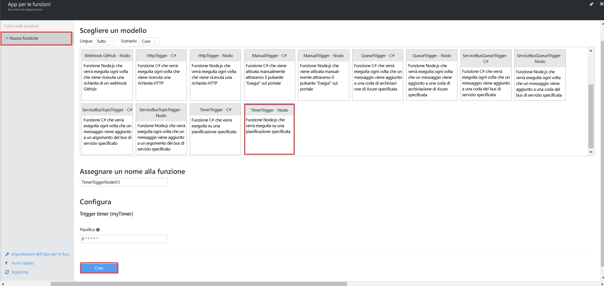

    A questo punto è stata creata una funzione attivata da un timer che viene eseguita ogni 10 secondi.

5. Nella scheda **Sviluppo** fare clic su **Log** e visualizzare l'attività nel log. Si noti che viene scritta una voce di log ogni 10 secondi.
   
    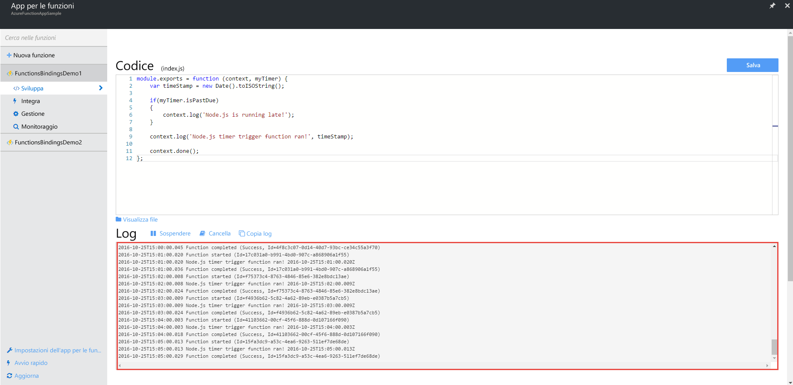

## <a name="add-a-message-queue-output-binding"></a>Aggiungere un'associazione di output della coda dei messaggi

1. Nella scheda **Integrazione** scegliere **Nuovo output** > **Archiviazione code di Azure** > **Seleziona**.

    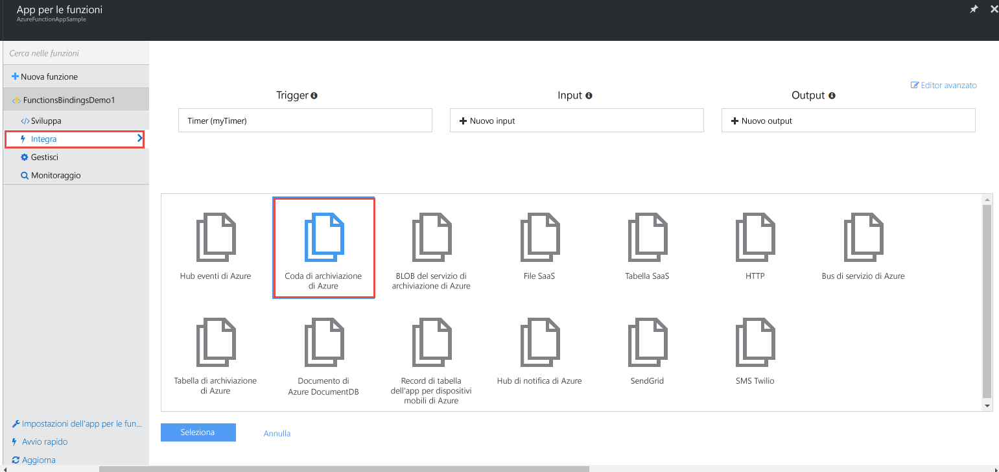

2. Immettere `myQueueItem` per **Nome del parametro del messaggio** e `functions-bindings` per **Nome coda**, selezionare una **Connessione dell'account di archiviazione** esistente o fare clic su **nuova** per creare una connessione dell'account di archiviazione, quindi fare clic su **Salva**.  

    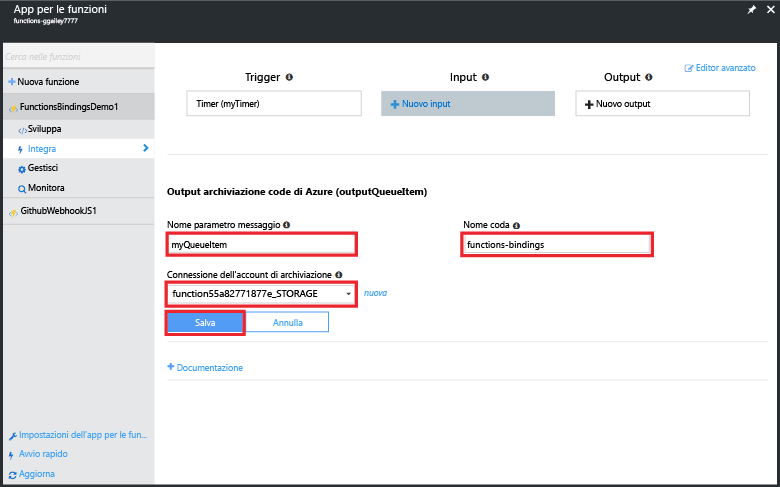

1. Tornare alla scheda **Sviluppo** e aggiungere alla funzione il codice seguente:
   
    ```javascript
   
    function myQueueItem() 
    {
        return {
            msg: "some message goes here",
            time: "time goes here"
        }
    }
   
    ```
2. Individuare l'istruzione *if* più o meno in corrispondenza della riga 9 della funzione e inserire dopo di essa il codice seguente.
   
    ```javascript
   
    var toBeQed = myQueueItem();
    toBeQed.time = timeStamp;
    context.bindings.myQueueItem = toBeQed;
   
    ```  
   
    Questo codice crea un oggetto **myQueueItem** e ne imposta la proprietà **time** sul valore corrente di timeStamp. Aggiunge quindi il nuovo elemento della coda all'associazione **myQueueItem** del contesto.

3. Fare clic su **Salva ed esegui**.

## <a name="view-storage-updates-by-using-storage-explorer"></a>Visualizzare gli aggiornamenti di archiviazione usando Storage Explorer
È possibile verificare il funzionamento della funzione visualizzando i messaggi nella coda creata.  È possibile connettersi alla coda di archiviazione usando Visual Studio Cloud Explorer. Usando il portale e Microsoft Azure Storage Explorer, tuttavia, la connessione all'account di archiviazione risulta più semplice.

1. Nella scheda **Integrazione** selezionare l'associazione di output della coda > **Documentazione**, visualizzare la stringa di connessione per l'account di archiviazione e quindi copiare il valore. Usare questo valore per la connessione all'account di archiviazione.

    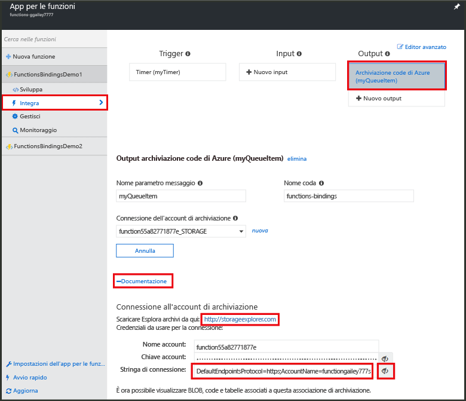


2. Se non è già stato fatto, scaricare e installare [Microsoft Azure Storage Explorer](http://storageexplorer.com). 
 
3. In Storage Explorer fare clic sull'icona Connetti ad Archiviazione di Azure, incollare la stringa di connessione nel campo e completare la procedura guidata.

    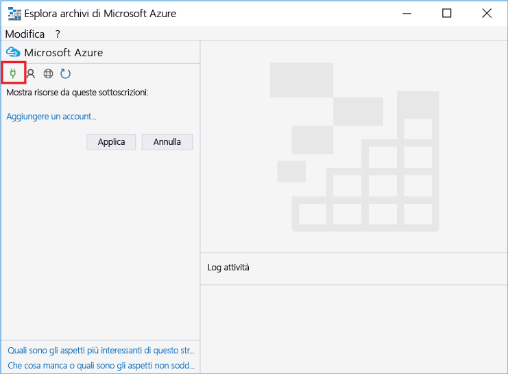

4. In **Local and attached** (Locale e collegato) espandere **Account di archiviazione** > account di archiviazione > **Code** > **functions-bindings** e verificare che i messaggi vengano scritti nella coda.

    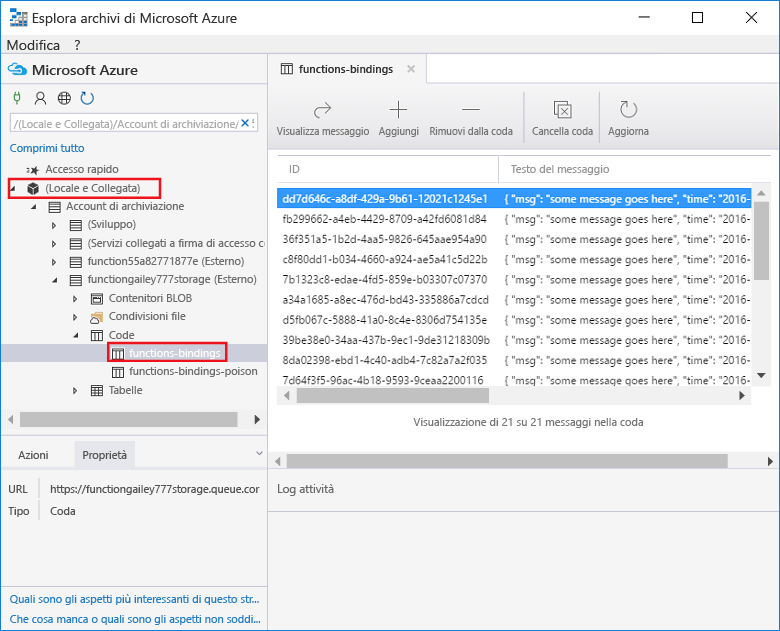

    Se la coda non esiste o è vuota, è probabile che si tratti di un problema relativo al codice o all'associazione della funzione.

## <a name="create-a-function-that-reads-from-the-queue"></a>Creare una funzione che legge dalla coda

Dopo aver aggiunto i messaggi alla coda, è possibile creare un'altra funzione che legge dalla coda e scrive i messaggi in modo permanente in una tabella di Archiviazione di Azure.

1. Fare clic su **Nuova funzione** > **QueueTrigger-CSharp**. 
 
2. Assegnare alla funzione il nome `FunctionsBindingsDemo2`, immettere **functions-bindings** nel campo **Nome coda**, selezionare un account di archiviazione esistente o crearne uno e quindi fare clic su **Crea**.

    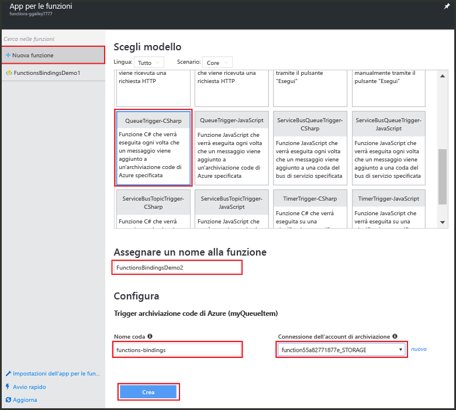 

3. (Facoltativo) È possibile verificare il funzionamento della nuova funzione visualizzando la nuova coda in Storage Explorer, come descritto in precedenza. È anche possibile usare Visual Studio Cloud Explorer.  

4. (Facoltativo) Aggiornare la coda **functions-bindings**: notare che sono state rimossi alcuni elementi. La rimozione si verifica perché la funzione è associata alla coda **functions-bindings** come trigger di input e legge tale coda. 
 
## <a name="add-a-table-output-binding"></a>Aggiungere un'associazione di output della tabella

1. In FunctionsBindingsDemo2 fare clic su **Integrazione** > **Nuovo output** > **Archiviazione tabelle di Azure** > **Seleziona**.

    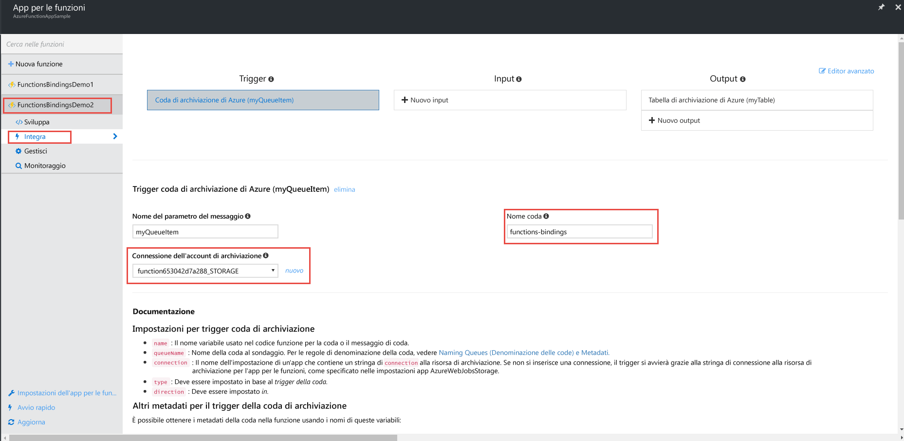 

2. Immettere `functionbindings` per **Nome tabella** e `myTable` per **Nome del parametro della tabella**, scegliere una **Connessione dell'account di archiviazione** o crearne una nuova e quindi fare clic su **Salva**.

    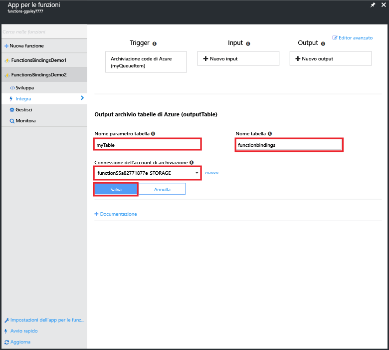
   
3. Nella scheda **Sviluppo** sostituire il codice della funzione esistente con il seguente:
   
    ```cs
    
    using System;
    
    public static void Run(QItem myQueueItem, ICollector<TableItem> myTable, TraceWriter log)
    {    
        TableItem myItem = new TableItem
        {
            PartitionKey = "key",
            RowKey = Guid.NewGuid().ToString(),
            Time = DateTime.Now.ToString("hh.mm.ss.ffffff"),
            Msg = myQueueItem.Msg,
            OriginalTime = myQueueItem.Time    
        };
        
        // Add the item to the table binding collection.
        myTable.Add(myItem);
    
        log.Verbose($"C# Queue trigger function processed: {myItem.RowKey} | {myItem.Msg} | {myItem.Time}");
    }
    
    public class TableItem
    {
        public string PartitionKey {get; set;}
        public string RowKey {get; set;}
        public string Time {get; set;}
        public string Msg {get; set;}
        public string OriginalTime {get; set;}
    }
    
    public class QItem
    {
        public string Msg { get; set;}
        public string Time { get; set;}
    }
    ```
    La classe **TableItem** rappresenta una riga della tabella di archiviazione. Aggiungere l'elemento alla raccolta `myTable` di oggetti **TableItem**. Per inserire voci nella tabella, è necessario impostare le proprietà **PartitionKey** e **RowKey**.

4. Fare clic su **Salva**  Al termine, è possibile verificare il funzionamento della funzione visualizzando la tabella in Storage Explorer o Visual Studio Cloud Explorer.

5. (Facoltativo) Nell'account di archiviazione di Storage Explorer espandere **Tabelle** > **functionsbindings** e verificare che alla tabella vengano aggiunte delle righe. È possibile eseguire la stessa operazione in Visual Studio Cloud Explorer.

    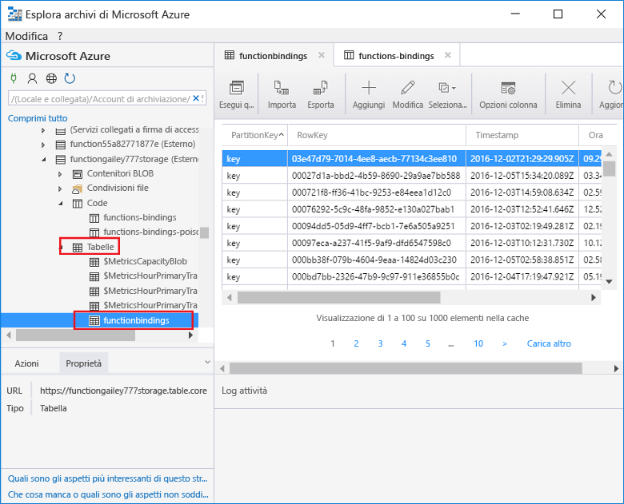

    Se la tabella non esiste o è vuota, è probabile che si tratti di un problema relativo al codice o all'associazione della funzione. 
 
[!INCLUDE [More binding information](../../includes/functions-bindings-next-steps.md)]

## <a name="next-steps"></a>Passaggi successivi
Per altre informazioni su Funzioni di Azure, vedere gli argomenti seguenti:

* [Guida di riferimento per gli sviluppatori di Funzioni di Azure](functions-reference.md)  
  Informazioni di riferimento per programmatori in merito alla codifica delle funzioni e alla definizione di trigger e associazioni.
* [Test di Funzioni di Azure](functions-test-a-function.md)  
  Descrive diversi strumenti e tecniche per il test delle funzioni.
* [Come aumentare le prestazioni di Funzioni di Azure](functions-scale.md)  
  Presenta i piani di servizio disponibili con Funzioni di Azure, tra cui il piano di hosting A consumo, e spiega come scegliere quello più appropriato. 

[!INCLUDE [Getting help note](../../includes/functions-get-help.md)]


