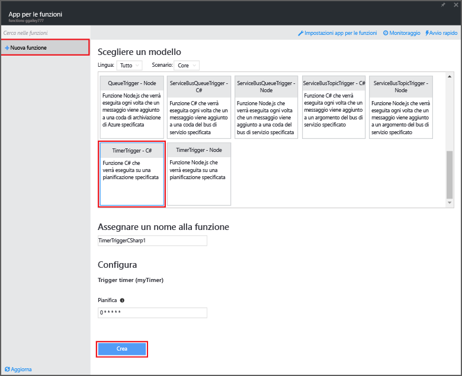
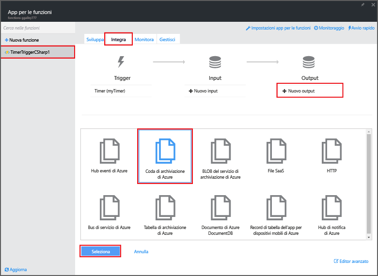
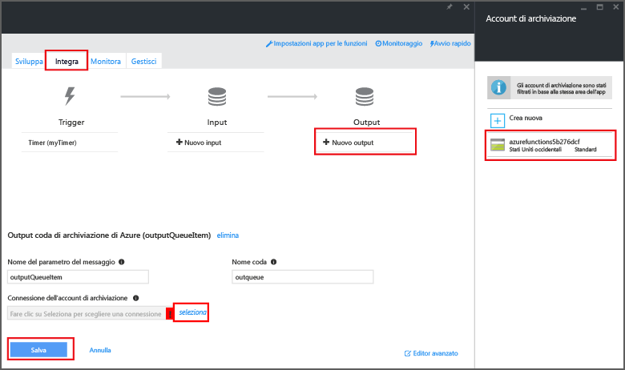

<properties
   pageTitle="Creare una funzione di elaborazione di eventi | Microsoft Azure"
   description="Usare Funzioni di Azure per creare una funzione C# che viene eseguita in base a un timer di eventi."
   services="azure-functions"
   documentationCenter="na"
   authors="ggailey777"
   manager="erikre"
   editor=""
   tags=""
   />

<tags
   ms.service="functions"
   ms.devlang="multiple"
   ms.topic="get-started-article"
   ms.tgt_pltfrm="multiple"
   ms.workload="na"
   ms.date="06/05/2016"
   ms.author="glenga"/>
   
# Creare una funzione di Azure di elaborazione di eventi

Funzioni di Azure è un'esperienza di calcolo su richiesta basata su eventi che consente di creare unità pianificate o attivate del codice implementate in un'ampia gamma di linguaggi di programmazione. Per altre informazioni su Funzioni di Azure, vedere [Panoramica di Funzioni di Azure](functions-overview.md).

Questo argomento illustra come creare una nuova funzione in C#, che viene eseguita in base a un timer di eventi per aggiungere messaggi a una coda di archiviazione.

È anche possibile guardare un breve video per scoprire come eseguire questi passaggi nel portale.

## Video

Il video seguente mostra come eseguire i passaggi di base di questa esercitazione

[AZURE.VIDEO create-an-event-processing-azure-function]

## Prerequisiti 

Prima di creare una funzione, è necessario avere un account Azure attivo. Se non si possiede già un account Azure, [sono disponibili account gratuiti](https://azure.microsoft.com/free/).

## Creare una funzione attivata tramite timer a partire dal modello

Un'app per le funzioni ospita l'esecuzione delle funzioni in Azure. Prima di creare una funzione, è necessario avere un account Azure attivo. Se non si possiede già un account Azure, [sono disponibili account gratuiti](https://azure.microsoft.com/free/).

1. Passare al [portale di Funzioni di Azure](https://functions.azure.com/signin) e accedere con l'account Azure.

2. Se esiste già un'app per le funzioni da usare, selezionarla da **Your function apps** (App per le funzioni personali) e fare clic su **Apri**. Per creare una nuova app per le funzioni, digitare un **Nome** univoco per la nuova app per le funzioni oppure accettare il nome generato, selezionare l'**Area** preferita, quindi fare clic su **Crea + attività iniziali**.

3. Nell'app per le funzioni fare clic su **+ Nuova funzione** > **TimerTrigger - Nodo** > **Crea**. Verrà creata una funzione con un nome predefinito, che viene eseguita in base alla pianificazione predefinita, ovvero una volta al minuto.

	

4. Nella nuova funzione fare clic sulla scheda **Integra** > **Nuovo output** > **Azure Storage Queue** (Coda di archiviazione di Azure) > **Seleziona**.

	

5. In **Azure Storage Queue output** (Output della coda di archiviazione di Azure) fare clic su **seleziona** accanto a **Storage account connection** (Connessione all'account di archiviazione), selezionare l'account di archiviazione esistente o crearne uno nuovo, quindi fare clic su **Salva**.

	

6. Nella scheda **Sviluppo** sostituire lo script C# esistente nella finestra **Codice** con il codice seguente:

		using System;
		
		public static void Run(TimerInfo myTimer, out string outputQueueItem, TraceWriter log)
		{
		    // Add a new scheduled message to the queue.
		    outputQueueItem = $"Ping message added to the queue at: {DateTime.Now}.";
		    
		    // Also write the message to the logs.
		    log.Info(outputQueueItem);
		}

	Questo codice aggiunge un nuovo messaggio alla coda con la data e l'ora correnti al momento dell'esecuzione della funzione.

7. Fare clic su **Salva** e verificare la finestra **Log** per la successiva esecuzione della funzione.

8. (Facoltativo) Passare all'account di archiviazione e verificare che i messaggi vengano aggiunti alla coda.

9. Tornare alla scheda **Integra** e modificare il campo della pianificazione in `0 0 * * * *`. La funzione viene ora eseguita una volta all'ora.

Ecco un esempio estremamente semplificato di associazione tra trigger timer e output della coda di archiviazione. Per altre informazioni, vedere gli argomenti [Trigger timer in Funzioni di Azure](functions-bindings-timer.md) e [Trigger e associazioni di Archiviazione di Azure in Funzioni di Azure](functions-bindings-storage.md).

##Passaggi successivi

Vedere gli argomenti seguenti per altre informazioni su Funzioni di Azure.

+ [Guida di riferimento per gli sviluppatori di Funzioni di Azure](functions-reference.md) Informazioni di riferimento per programmatori in merito alla codifica delle funzioni e alla definizione di trigger e associazioni.
+ [Test di Funzioni di Azure](functions-test-a-function.md) Descrive diversi strumenti e tecniche per il test delle funzioni.
+ [Scalabilità di Funzioni di Azure](functions-scale.md) Descrive i piani di servizio disponibili con Funzioni di Azure, tra cui il piano di servizio dinamico, e come scegliere quello più appropriato.  

[AZURE.INCLUDE [Nota introduttiva](../../includes/functions-get-help.md)]

<!---HONumber=AcomDC_0615_2016-->