# Creare una funzione attivata da Azure Cosmos DB

Informazioni su come creare una funzione attivata quando i dati vengono aggiunti o modificati in Azure Cosmos DB. Per altre informazioni su Azure Cosmos DB, vedere [Azure Cosmos DB: elaborazione di database senza server con Funzioni di Azure](..\cosmos-db\serverless-computing-database.md).

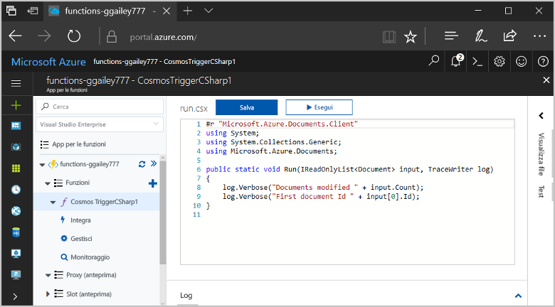

## prerequisiti

Per completare questa esercitazione:

+ Se non si ha una sottoscrizione di Azure, creare un [account gratuito](https://azure.microsoft.com/free/?WT.mc_id=A261C142F) prima di iniziare.

[!INCLUDE [functions-portal-favorite-function-apps](../../includes/functions-portal-favorite-function-apps.md)]

## Creare un'app per le funzioni di Azure

[!INCLUDE [Create function app Azure portal](../../includes/functions-create-function-app-portal.md)]

Si creerà ora una funzione nella nuova app per le funzioni.

## Creare i trigger di Azure Cosmos DB

1. Espandere l'app per le funzioni e fare clic sul pulsante **+** accanto a **Funzioni**. Se questa è la prima funzione nell'app per le funzioni, selezionare **Funzione personalizzata**. Verrà visualizzato il set completo di modelli di funzione.

    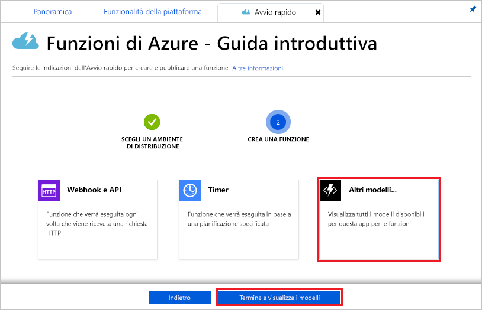

2. Nel campo di ricerca digitare `cosmos` e quindi scegliere la lingua da usare per il modello di attivazione di Azure Cosmos DB.

    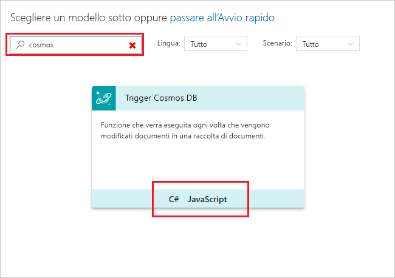

3. Configurare il nuovo trigger con le impostazioni come indicato nella tabella sotto l'immagine.

    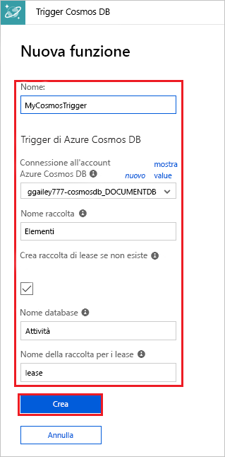
    
    | Impostazione      | Valore consigliato  | Descrizione                                |
    | ------------ | ---------------- | ------------------------------------------ |
    | **Nome** | Predefinito | Usare il nome della funzione predefinito suggerito dal modello. |
    | **Nome raccolta** | Items | Nome della raccolta da monitorare. |
    | **Creare la raccolta di lease se non esiste** | Selezionato | La raccolta non esiste ancora, quindi crearla. |
    | **Database name** (Nome database) | Attività | Nome del database con la raccolta da monitorare. |

4. Selezionare **Nuovo** accanto all'etichetta **della connessione dell'account Cosmos DB di Azure** e selezionare un account Cosmos DB esistente o fare clic su **+ Crea nuovo**. 
 
    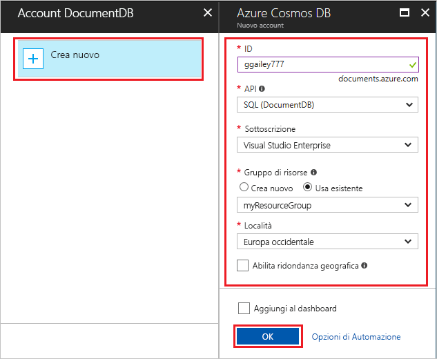

6. Quando si crea un nuovo account Cosmos DB, usare le impostazioni del **nuovo account** come indicato nella tabella.

    | Impostazione      | Valore consigliato  | DESCRIZIONE                                |
    | ------------ | ---------------- | ------------------------------------------ |
    | **ID** | Nome del database | ID univoco per il database di Azure Cosmos DB  |
    | **API** | SQL (DocumentDB) | Questo argomento usa l'API del database di documenti.  |
    | **Sottoscrizione** | Sottoscrizione di Azure | Sottoscrizione in cui viene creato questo nuovo account Cosmos DB.  |
    | **Gruppo di risorse** | myResourceGroup |  Usare il gruppo di risorse esistente che contiene l'app per le funzioni. |
    | **Posizione**  | Europa occidentale | Selezionare una località nei pressi dell'app per le funzioni o di altre app che usano i documenti archiviati.  |

6. Fare clic su **OK** per creare il database. La creazione del database può richiedere alcuni minuti. Dopo avere creato il database, la stringa di connessione del database viene archiviata come impostazione dell'app per le funzioni. Il nome di questa impostazione dell'app viene inserito nella **connessione dell'account di Azure Cosmos DB**. 

7. Fare clic su **Crea** per creare la funzione attivata da Azure Cosmos DB. Dopo aver creato la funzione, viene visualizzato il codice della funzione basato sul modello.  

    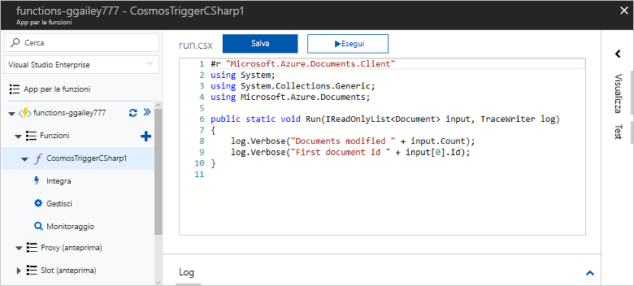

    Questo modello di funzione scrive il numero di documenti e l'ID del primo documento nei log. 

Successivamente, connettersi al proprio account di Azure Cosmos DB e creare la raccolta **Attività** nel database. 

## Creare la raccolta di elementi

1. Aprire una seconda istanza del [portale di Azure](https://portal.azure.com) in una nuova scheda del browser. 

2. Sul lato sinistro del portale espandere la barra delle icone, digitare `cosmos` nel campo di ricerca e selezionare **Azure Cosmos DB**.

    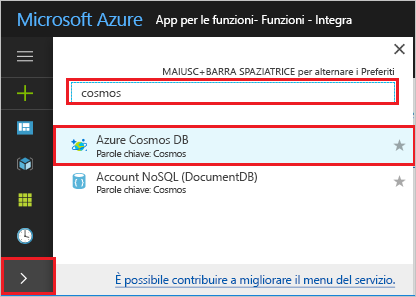

2. Scegliere l'account di Azure Cosmos DB, quindi selezionare **Esplora dati**. 
 
3. In **Raccolte** scegliere **taskDatabase** e selezionare **Nuova raccolta**.

    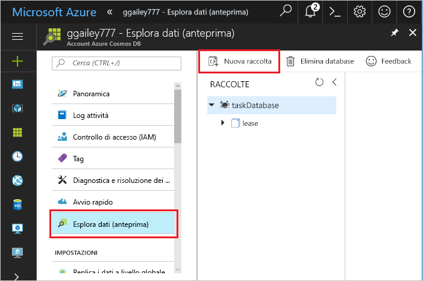

4. In **Aggiungi raccolta** usare le impostazioni visualizzate nella tabella riportata sotto l'immagine. 
 
    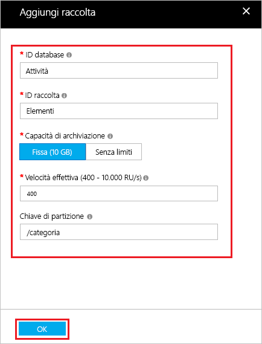
 
    | Impostazione|Valore consigliato|DESCRIZIONE |
    | ---|---|--- |
    | **ID database** | Attività |Nome del nuovo database. Deve corrispondere al nome definito nell'associazione della funzione. |
    | **ID raccolta** | Items | Nome della nuova raccolta. Deve corrispondere al nome definito nell'associazione della funzione.  |
    | **Capacità di archiviazione** | Fissa (10 GB)|Usare il valore predefinito. Questo valore indica la capacità di archiviazione del database. |
    | **Velocità effettiva** |400 UR| Usare il valore predefinito. Se si vuole ridurre la latenza, è possibile aumentare la velocità effettiva in un secondo momento. |
    | **[Chiave di partizione](../cosmos-db/partition-data.md#design-for-partitioning)** | /category|Chiave di partizione che distribuisce i dati in modo uniforme a ogni partizione. Quando si crea una raccolta ad alte prestazioni è importante selezionare la chiave di partizione corretta. | 

1. Fare clic su **OK** per creare la raccolta **Attività**. La creazione della raccolta potrebbe richiedere del tempo.

Dopo aver creato la raccolta specificata nell'associazione della funzione, è possibile testare la funzione aggiungendo i documenti a questa nuova raccolta.

## Testare la funzione

1. Espandere la nuova raccolta **taskCollection** in Esplora dati, scegliere **Documenti**, quindi selezionare **Nuovo documento**.

    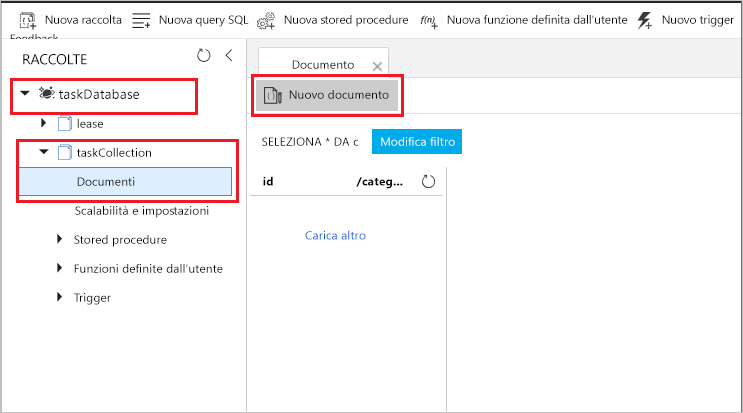

2. Sostituire il contenuto del nuovo documento con il contenuto seguente, quindi scegliere **Salva**.

        {
            "id": "task1",
            "category": "general",
            "description": "some task"
        }

1. Passare alla prima scheda del browser che contiene la funzione nel portale. Espandere i log della funzione e verificare che il nuovo documento abbia attivato la funzione. Verificare che il valore dell'ID del documento `task1` sia scritto nel log. 

    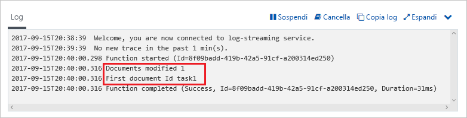

4. (Facoltativo) Tornare al documento, apportare una modifica e fare clic su **Aggiorna**. Quindi, tornare ai log della funzione e verificare che l'aggiornamento abbia attivato anche la funzione.

## Pulire le risorse

[!INCLUDE [Next steps note](../../includes/functions-quickstart-cleanup.md)]

## Passaggi successivi

È stata creata una funzione che viene eseguita quando un documento viene aggiunto o modificato nel database di Azure Cosmos DB.

[!INCLUDE [Next steps note](../../includes/functions-quickstart-next-steps.md)]

Per altre informazioni sui trigger di Azure Cosmos DB, vedere [Binding di Azure Cosmos DB per Funzioni di Azure](functions-bindings-cosmosdb.md).
