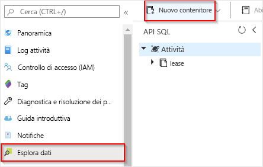
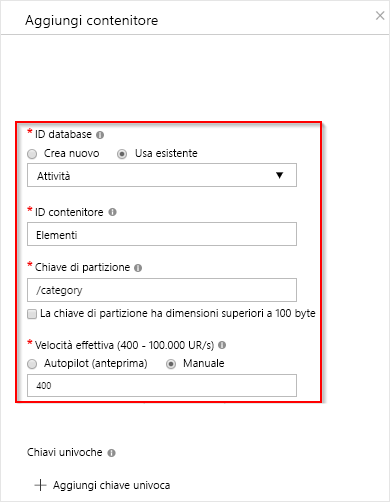

# <a name="create-a-function-triggered-by-azure-cosmos-db"></a>Creare una funzione attivata da Azure Cosmos DB

Informazioni su come creare una funzione attivata quando i dati vengono aggiunti o modificati in Azure Cosmos DB. Per altre informazioni su Azure Cosmos DB, vedere [Azure Cosmos DB: elaborazione di database senza server con Funzioni di Azure](../cosmos-db/serverless-computing-database.md).

:::image type="content" source="./media/functions-create-cosmos-db-triggered-function/quickstart-completed.png" alt-text="Codice di Azure Cosmos DB":::

## <a name="prerequisites"></a>Prerequisiti

Per completare questa esercitazione:

+ Se non si ha una sottoscrizione di Azure, creare un [account gratuito](https://azure.microsoft.com/free/?WT.mc_id=A261C142F) prima di iniziare.

> [!NOTE]
> [!INCLUDE [SQL API support only](../../includes/functions-cosmosdb-sqlapi-note.md)]

## <a name="sign-in-to-azure"></a>Accedere ad Azure
Accedere al [portale di Azure](https://portal.azure.com/) con il proprio account Azure.

## <a name="create-an-azure-cosmos-db-account"></a>Creare un account Azure Cosmos DB

Prima di creare il trigger è necessario un account Azure Cosmos DB che usa l'API SQL.

[!INCLUDE [cosmos-db-create-dbaccount](../../includes/cosmos-db-create-dbaccount.md)]

## <a name="create-an-azure-function-app"></a>Creare un'app per le funzioni di Azure

[!INCLUDE [Create function app Azure portal](../../includes/functions-create-function-app-portal.md)]

Si creerà ora una funzione nella nuova app per le funzioni.

<a name="create-function"></a>

## <a name="create-azure-cosmos-db-trigger"></a>Creare i trigger di Azure Cosmos DB

1. Nell'app per le funzioni selezionare **Funzioni** nel menu a sinistra e quindi **Aggiungi** nel menu in alto. 

1. Nella pagina **Nuova funzione** immettere `cosmos` nel campo di ricerca e quindi scegliere il modello del **trigger Azure Cosmos DB**.

   :::image type="content" source="./media/functions-create-cosmos-db-triggered-function/function-choose-cosmos.png" alt-text="Codice di Azure Cosmos DB":::


1. Configurare il nuovo trigger con le impostazioni specificate nella tabella seguente:

    | Impostazione      | Valore consigliato  | Descrizione                                |
    | ------------ | ---------------- | ------------------------------------------ |
    | **Nuova funzione** | Accettare il nome predefinito | Nome della funzione. |
    | **Connessione all'account Cosmos DB** | Accettare il nuovo nome predefinito | Selezionare **Nuovo**, quindi l'**account di database** creato in precedenza e infine **OK**. Verrà creata un'impostazione applicazione per la connessione all'account. Questa impostazione viene usata dal binding per la connessione al database. |
    | **Nome database** | Attività | Nome del database che include la raccolta da monitorare. |
    | **Nome raccolta** | Items | Nome della raccolta da monitorare. |
    | **Nome della raccolta per i lease** | Lease | Nome della raccolta per l'archiviazione dei lease. |
    | **Crea raccolta di lease se non esiste** | Sì | Verifica l'esistenza della raccolta di lease e la crea automaticamente. |

    :::image type="content" source="./media/functions-create-cosmos-db-triggered-function/functions-cosmosdb-trigger-settings.png" alt-text="Codice di Azure Cosmos DB":::

1. Selezionare **Crea funzione**. 

    Azure crea la funzione di trigger Cosmos DB.

1. Per visualizzare il codice della funzione basato sul modello, selezionare **Codice e test**.

    :::image type="content" source="./media/functions-create-cosmos-db-triggered-function/function-cosmosdb-template.png" alt-text="Codice di Azure Cosmos DB":::

    Questo modello di funzione scrive il numero di documenti e l'ID del primo documento nei log.

Successivamente, connettersi al proprio account Azure Cosmos DB e creare il contenitore `Items` nel database `Tasks`.

## <a name="create-the-items-container"></a>Creare il contenitore Items

1. Aprire una seconda istanza del [portale di Azure](https://portal.azure.com) in una nuova scheda del browser.

1. Sul lato sinistro del portale espandere la barra delle icone, digitare `cosmos` nel campo di ricerca e selezionare **Azure Cosmos DB**.

    

1. Scegliere l'account di Azure Cosmos DB, quindi selezionare **Esplora dati**. 

1. In **API SQL** scegliere il database **Tasks** e selezionare **Nuovo contenitore**.

    

1. In **Aggiungi contenitore** usare le impostazioni visualizzate nella tabella riportata sotto l'immagine. 

    

    | Impostazione|Valore consigliato|Descrizione |
    | ---|---|--- |
    | **ID database** | Attività |Nome del nuovo database. Deve corrispondere al nome definito nell'associazione della funzione. |
    | **ID contenitore** | Items | Il nome del nuovo contenitore. Deve corrispondere al nome definito nell'associazione della funzione.  |
    | **[Chiave di partizione](../cosmos-db/partition-data.md)** | /category|Chiave di partizione che distribuisce i dati in modo uniforme a ogni partizione. Quando si crea un contenitore a elevate prestazioni, è importante selezionare la chiave di partizione corretta. | 
    | **Velocità effettiva** |400 UR| Usare il valore predefinito. Se si vuole ridurre la latenza, è possibile aumentare la velocità effettiva in un secondo momento. |    

1. Fare clic su **OK** per creare il contenitore Items. La creazione del contenitore potrebbe richiedere del tempo.

Dopo aver creato il contenitore specificato nel binding della funzione, è possibile testare la funzione aggiungendo elementi a questo nuovo contenitore.

## <a name="test-the-function"></a>Testare la funzione

1. In Esplora dati espandere il nuovo contenitore **Items**, scegliere **Items**, quindi selezionare **Nuovo elemento**.

    :::image type="content" source="./media/functions-create-cosmos-db-triggered-function/create-item-in-container.png" alt-text="Codice di Azure Cosmos DB"
    }
    ```

1. Passare alla prima scheda del browser che contiene la funzione nel portale. Espandere i log della funzione e verificare che il nuovo documento abbia attivato la funzione. Verificare che il valore dell'ID del documento `task1` sia scritto nel log. 

    

1. (Facoltativo) Tornare al documento, apportare una modifica e fare clic su **Aggiorna**. Quindi, tornare ai log della funzione e verificare che l'aggiornamento abbia attivato anche la funzione.

## <a name="clean-up-resources"></a>Pulire le risorse

[!INCLUDE [Next steps note](../../includes/functions-quickstart-cleanup.md)]

## <a name="next-steps"></a>Passaggi successivi

È stata creata una funzione che viene eseguita quando un documento viene aggiunto o modificato nel database di Azure Cosmos DB. Per altre informazioni sui trigger di Azure Cosmos DB, vedere [Binding di Azure Cosmos DB per Funzioni di Azure](functions-bindings-cosmosdb.md).

[!INCLUDE [Next steps note](../../includes/functions-quickstart-next-steps.md)]
