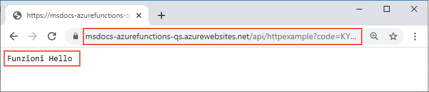

# <a name="quickstart-create-a-function-in-azure-that-responds-to-http-requests"></a>Guida introduttiva: Creare una funzione in Azure che risponde a richieste HTTP

In questo articolo vengono usati gli strumenti da riga di comando per creare una funzione che risponde alle richieste HTTP. Dopo aver testato il codice in locale, verrà distribuito nell'ambiente serverless di Funzioni di Azure. Le procedure illustrate in questa guida di avvio rapido comportano l'addebito di qualche centesimo (USD) o meno nell'account Azure.

::: zone pivot="programming-language-csharp,programming-language-javascript,programming-language-typescript,programming-language-powershell,programming-language-python"  
È inoltre disponibile una [versione basata su Visual Studio Code](functions-create-first-function-vs-code.md) di questo articolo.
::: zone-end  

::: zone pivot="programming-language-java"  
> [!NOTE]
> Se si preferisce non usare Maven come strumento di sviluppo, vedere le esercitazioni simili per sviluppatori Java che usano [Gradle](/azure/azure-functions/functions-create-first-java-gradle), [IntelliJ IDEA](/azure/developer/java/toolkit-for-intellij/quickstart-functions) e [VS Code](/azure/azure-functions/functions-create-first-function-vs-code?pivots=programming-language-java).
::: zone-end  

[!INCLUDE [functions-requirements-cli](../../includes/functions-requirements-cli.md)]

[!INCLUDE [functions-cli-verify-prereqs](../../includes/functions-cli-verify-prereqs.md)]

[!INCLUDE [functions-cli-create-venv](../../includes/functions-cli-create-venv.md)]

## <a name="create-a-local-function-project"></a>Creare un progetto di funzione locale

In Funzioni di Azure un progetto di funzione è un contenitore per una o più funzioni singole che rispondono ognuna a un trigger specifico. Tutte le funzioni di un progetto condividono le stesse configurazioni locali e di hosting. In questa sezione viene creato un progetto di funzione che contiene una singola funzione.

::: zone pivot="programming-language-csharp,programming-language-javascript,programming-language-typescript,programming-language-powershell,programming-language-python"  
Eseguire il comando `func init` come indicato di seguito per creare un progetto di Funzioni in una cartella denominata *LocalFunctionProj* con il runtime specificato:  
::: zone-end  
::: zone pivot="programming-language-python"  
```
func init LocalFunctionProj --python
```
::: zone-end  
::: zone pivot="programming-language-csharp"  
```
func init LocalFunctionProj --dotnet
```
::: zone-end  
::: zone pivot="programming-language-javascript"  
```
func init LocalFunctionProj --javascript
```
::: zone-end  
::: zone pivot="programming-language-typescript"  
```
func init LocalFunctionProj --typescript
```
::: zone-end  
::: zone pivot="programming-language-powershell"  
```
func init LocalFunctionProj --powershell
```
::: zone-end    
::: zone pivot="programming-language-java"  
In una cartella vuota eseguire il comando seguente per generare il progetto di Funzioni da un [archetipo Maven](https://maven.apache.org/guides/introduction/introduction-to-archetypes.html).

# <a name="bash"></a>[Bash](#tab/bash)
```bash
mvn archetype:generate -DarchetypeGroupId=com.microsoft.azure -DarchetypeArtifactId=azure-functions-archetype 
```
# <a name="powershell"></a>[PowerShell](#tab/powershell)
```powershell
mvn archetype:generate "-DarchetypeGroupId=com.microsoft.azure" "-DarchetypeArtifactId=azure-functions-archetype" 
```
# <a name="cmd"></a>[Cmd](#tab/cmd)
```cmd
mvn archetype:generate "-DarchetypeGroupId=com.microsoft.azure" "-DarchetypeArtifactId=azure-functions-archetype" 
```
---

Maven chiede i valori necessari per completare la generazione del progetto nella distribuzione.   
Quando richiesto, specificare i valori seguenti:

| Prompt | valore | Descrizione |
| ------ | ----- | ----------- |
| **groupId** | `com.fabrikam` | Un valore che identifica in modo univoco il progetto tra tutti gli altri, seguendo le [regole di denominazione dei pacchetti](https://docs.oracle.com/javase/specs/jls/se6/html/packages.html#7.7) per Java. |
| **artifactId** | `fabrikam-functions` | Un valore che corrisponde al nome del jar, senza un numero di versione. |
| **version** | `1.0-SNAPSHOT` | Scegliere il valore predefinito. |
| **package** | `com.fabrikam.functions` | Un valore che corrisponde al pacchetto Java per il codice della funzione generato. Usare il valore predefinito. |

Digitare `Y` o premere INVIO per confermare.

Maven crea i file di progetto in una nuova cartella denominata _artifactId_, che in questo esempio è `fabrikam-functions`. 
::: zone-end  
Passare alla cartella del progetto:

::: zone pivot="programming-language-csharp,programming-language-javascript,programming-language-typescript,programming-language-powershell,programming-language-python"  
```
cd LocalFunctionProj
```
::: zone-end  
::: zone pivot="programming-language-java"  
```
cd fabrikam-functions
```
::: zone-end  
Questa cartella contiene vari file per il progetto, inclusi i file di configurazione denominati [local.settings.json](functions-run-local.md#local-settings-file) e [host.json](functions-host-json.md). Poiché *local.settings.json* può contenere segreti scaricati da Azure, per impostazione predefinita il file viene escluso dal controllo del codice sorgente nel file con estensione *gitignore*.

[!INCLUDE [functions-cli-add-function](../../includes/functions-cli-add-function.md)]

### <a name="optional-examine-the-file-contents"></a>(Facoltativo) Esaminare il contenuto del file

Se si vuole, è possibile passare a [Eseguire la funzione localmente](#run-the-function-locally) ed esaminare il contenuto del file in un secondo momento.

::: zone pivot="programming-language-csharp"
#### <a name="httpexamplecs"></a>HttpExample.cs

*HttpExample.cs* contiene un metodo `Run` che riceve i dati della richiesta nella variabile `req` come oggetto [HttpRequest](/dotnet/api/microsoft.aspnetcore.http.httprequest) decorato con **HttpTriggerAttribute**, che definisce il comportamento del trigger. 

:::code language="csharp" source="~/functions-docs-csharp/http-trigger-template/HttpExample.cs":::

L'oggetto restituito è [ActionResult](/dotnet/api/microsoft.aspnetcore.mvc.actionresult), che restituisce un messaggio di risposta come [OkObjectResult](/dotnet/api/microsoft.aspnetcore.mvc.okobjectresult) (200) o [BadRequestObjectResult](/dotnet/api/microsoft.aspnetcore.mvc.badrequestobjectresult) (400). Per altre informazioni, vedere [Trigger e associazioni HTTP di Funzioni di Azure](/azure/azure-functions/functions-bindings-http-webhook?tabs=csharp).
::: zone-end

::: zone pivot="programming-language-java"
#### <a name="functionjava"></a>Function.java
*Function.java* contiene un metodo `run` che riceve i dati della richiesta nella variabile `request` come oggetto [HttpRequestMessage](/java/api/com.microsoft.azure.functions.httprequestmessage) decorato con l'annotazione [HttpTrigger](/java/api/com.microsoft.azure.functions.annotation.httptrigger), che definisce il comportamento del trigger. 

:::code language="java" source="~/functions-quickstart-java/functions-add-output-binding-storage-queue/src/main/java/com/function/Function.java":::

Il messaggio di risposta viene generato dall'API [HttpResponseMessage.Builder](/java/api/com.microsoft.azure.functions.httpresponsemessage.builder).

#### <a name="pomxml"></a>pom.xml

Le impostazioni per le risorse di Azure create per ospitare l'app sono definite nell'elemento **configuration** del plug-in con un elemento **groupId** di `com.microsoft.azure` nel file pom.xml generato. Ad esempio, l'elemento configuration seguente indica a una distribuzione basata su Maven di creare un'app per le funzioni nel gruppo di risorse `java-functions-group` nell'area `westus`. L'app per le funzioni viene eseguita in Windows ospitata nel piano `java-functions-app-service-plan`, che per impostazione predefinita è un piano a consumo serverless.    

:::code language="java" source="~/functions-quickstart-java/functions-add-output-binding-storage-queue/pom.xml" range="116-155":::

È possibile modificare queste impostazioni per controllare la modalità di creazione delle risorse in Azure, ad esempio cambiando `runtime.os` da `windows` a `linux` prima della distribuzione iniziale. Per un elenco completo delle impostazioni supportate dal plug-in Maven, vedere i [dettagli di configurazione](https://github.com/microsoft/azure-maven-plugins/wiki/Azure-Functions:-Configuration-Details).

#### <a name="functiontestjava"></a>FunctionTest.java

L'archetipo genera anche uno unit test per la funzione. Quando si modifica la funzione per aggiungere i binding o si aggiungono nuove funzioni al progetto, sarà necessario modificare anche i test nel file *FunctionTest.java*.
::: zone-end  
::: zone pivot="programming-language-python"
#### <a name="__init__py"></a>\_\_init\_\_.py

*\_\_init\_\_.py* contiene una funzione Python `main()` attivata in base alla configurazione presente in *function.json*.

:::code language="python" source="~/functions-quickstart-templates/Functions.Templates/Templates/HttpTrigger-Python/__init__.py":::

Per un trigger HTTP, la funzione riceve i dati della richiesta nella variabile `req` come definito in *function.json*. `req` è un'istanza della [classe azure.functions.HttpRequest](/python/api/azure-functions/azure.functions.httprequest). L'oggetto restituito, definito come `$return` in *function.json*, è un'istanza della [classe azure.functions.HttpResponse](/python/api/azure-functions/azure.functions.httpresponse). Per altre informazioni, vedere [Trigger e associazioni HTTP di Funzioni di Azure](/azure/azure-functions/functions-bindings-http-webhook?tabs=python).
::: zone-end

::: zone pivot="programming-language-javascript"
#### <a name="indexjs"></a>index.js

*index.js* esporta una funzione attivata in base alla configurazione di *function.json*.

:::code language="javascript" source="~/functions-quickstart-templates/Functions.Templates/Templates/HttpTrigger-JavaScript/index.js":::

Per un trigger HTTP, la funzione riceve i dati della richiesta nella variabile `req` come definito in *function.json*. L'oggetto restituito, definito come `$return` in *function.json*, è la risposta. Per altre informazioni, vedere [Trigger e associazioni HTTP di Funzioni di Azure](/azure/azure-functions/functions-bindings-http-webhook?tabs=javascript).
::: zone-end

::: zone pivot="programming-language-typescript"
#### <a name="indexts"></a>index.ts

*index.ts* esporta una funzione attivata in base alla configurazione di *function.json*.

:::code language="typescript" source="~/functions-quickstart-templates/Functions.Templates/Templates/HttpTrigger-TypeScript/index.ts":::

Per un trigger HTTP, la funzione riceve i dati della richiesta nella variabile `req` di tipo **HttpRequest**, come definito in *function.json*. L'oggetto restituito, definito come `$return` in *function.json*, è la risposta. 
::: zone-end

::: zone pivot="programming-language-powershell"
#### <a name="runps1"></a>run.ps1

*run.ps1* esporta uno script di funzione attivato in base alla configurazione di *function.json*.

:::code language="powershell" source="~/functions-quickstart-templates/Functions.Templates/Templates/HttpTrigger-PowerShell/run.ps1":::

Per un trigger HTTP, la funzione riceve i dati della richiesta passati al parametro `$Request` definito in *function.json*. L'oggetto restituito, definito come `Response` in *function.json*, viene passato al cmdlet `Push-OutputBinding` come risposta. 
::: zone-end

::: zone pivot="programming-language-javascript,programming-language-typescript,programming-language-python,programming-language-powershell"
#### <a name="functionjson"></a>function.json

*function.json* è un file di configurazione che definisce gli oggetti `bindings` di input e output per la funzione, incluso il tipo di trigger. 
::: zone-end

::: zone pivot="programming-language-python"
Se si vuole, è possibile modificare `scriptFile` per richiamare un file Python diverso.

:::code language="json" source="~/functions-quickstart-templates/Functions.Templates/Templates/HttpTrigger-Python/function.json":::
::: zone-end

::: zone pivot="programming-language-javascript,programming-language-typescript"
:::code language="json" source="~/functions-quickstart-templates/Functions.Templates/Templates/HttpTrigger-JavaScript/function.json":::
::: zone-end

::: zone pivot="programming-language-powershell"
:::code language="json" source="~/functions-quickstart-templates/Functions.Templates/Templates/HttpTrigger-PowerShell/function.json":::
::: zone-end

::: zone pivot="programming-language-javascript,programming-language-typescript,programming-language-python,programming-language-powershell"  
Ogni binding richiede una direzione, un tipo e un nome univoco. Il trigger HTTP dispone di un'associazione di input di tipo [`httpTrigger`](functions-bindings-http-webhook-trigger.md) e di un'associazione di output di tipo [`http`](functions-bindings-http-webhook-output.md).
::: zone-end  

[!INCLUDE [functions-run-function-test-local-cli](../../includes/functions-run-function-test-local-cli.md)]

::: zone pivot="programming-language-javascript,programming-language-typescript,programming-language-python,programming-language-powershell,programming-language-csharp"    
## <a name="create-supporting-azure-resources-for-your-function"></a>Creare le risorse di Azure di supporto per la funzione

Prima di distribuire il codice della funzione in Azure, è necessario creare tre risorse:

- Un gruppo di risorse, ovvero un contenitore logico di risorse correlate.
- Un account di archiviazione, che mantiene lo stato e altre informazioni sui progetti.
- Un'app per le funzioni, che fornisce l'ambiente per l'esecuzione del codice della funzione. Un'app per le funzioni si collega al progetto di funzione locale e consente di raggruppare le funzioni come un'unità logica per semplificare la gestione, la distribuzione e la condivisione di risorse.

Per creare queste tre risorse, usare i comandi dell'interfaccia della riga di comando di Azure. Ogni comando fornisce output JSON al completamento.

Se non è già stato fatto, accedere ad Azure con il comando [az login](/cli/azure/reference-index#az-login):

```azurecli
az login
```
    
Creare un gruppo di risorse con il comando [az group create](/cli/azure/group#az-group-create). L'esempio seguente crea un gruppo di risorse denominato `AzureFunctionsQuickstart-rg` nell'area `westeurope`. In genere, il gruppo di risorse e le risorse vengono creati in un'area vicina alla propria, usando un'area disponibile ricavata dal comando `az account list-locations`.

```azurecli
az group create --name AzureFunctionsQuickstart-rg --location westeurope
```

> [!NOTE]
> Non è possibile ospitare app Windows e Linux nello stesso gruppo di risorse. Se si dispone d un gruppo di risorse esistente denominato `AzureFunctionsQuickstart-rg` con un'app per le funzioni Windows o un'app Web, sarà necessario usare un gruppo di risorse diverso.
 
    
Creare un account di archiviazione per uso generico nel gruppo di risorse e nell'area con il comando [az storage account create](/cli/azure/storage/account#az-storage-account-create). Nell'esempio seguente sostituire `<STORAGE_NAME>` con un nome di app univoco a livello globale appropriato. I nomi devono contenere da tre a 24 caratteri costituiti esclusivamente da numeri e lettere in minuscolo. `Standard_LRS` specifica un account per utilizzo generico, che è [supportato da Funzioni](storage-considerations.md#storage-account-requirements).

```azurecli
az storage account create --name <STORAGE_NAME> --location westeurope --resource-group AzureFunctionsQuickstart-rg --sku Standard_LRS
```

Per questo argomento di avvio rapido, il costo dell'account di archiviazione è solo di pochi centesimi di dollaro USA.
    
Creare l'app per le funzioni usando il comando [az functionapp create](/cli/azure/functionapp#az-functionapp-create). Nell'esempio seguente, sostituire `<STORAGE_NAME>` con il nome dell'account usato nel passaggio precedente e sostituire `<APP_NAME>` con un nome univoco a livello globale appropriato. `<APP_NAME>` è anche il dominio DNS predefinito per l'app per le funzioni. 
::: zone-end  

::: zone pivot="programming-language-python"  
Se si usa Python 3.8, sostituire `--runtime-version` con `3.8` e `--functions_version` con `3`.

Se si usa Python 3.6, sostituire `--runtime-version` con `3.6`.

```azurecli
az functionapp create --resource-group AzureFunctionsQuickstart-rg --os-type Linux --consumption-plan-location westeurope --runtime python --runtime-version 3.7 --functions-version 2 --name <APP_NAME> --storage-account <STORAGE_NAME>
```
::: zone-end  

::: zone pivot="programming-language-javascript,programming-language-typescript"  
Se si usa Node.js 8, cambiare anche `--runtime-version` in `8`.


```azurecli
az functionapp create --resource-group AzureFunctionsQuickstart-rg --consumption-plan-location westeurope --runtime node --runtime-version 10 --functions-version 2 --name <APP_NAME> --storage-account <STORAGE_NAME>
```
::: zone-end  

::: zone pivot="programming-language-csharp"  
```azurecli
az functionapp create --resource-group AzureFunctionsQuickstart-rg --consumption-plan-location westeurope --runtime dotnet --functions-version 2 --name <APP_NAME> --storage-account <STORAGE_NAME>
```
::: zone-end  

::: zone pivot="programming-language-powershell"  
```azurecli
az functionapp create --resource-group AzureFunctionsQuickstart-rg --consumption-plan-location westeurope --runtime powershell --functions-version 2 --name <APP_NAME> --storage-account <STORAGE_NAME>
```
::: zone-end  

::: zone pivot="programming-language-javascript,programming-language-typescript,programming-language-python,programming-language-powershell,programming-language-csharp"  
Questo comando crea un'app per le funzioni che esegue il runtime del linguaggio specificato nel [Piano a consumo di Funzioni di Azure](functions-scale.md#consumption-plan), che è gratuito per la quantità di utilizzo prevista in questo argomento. Il comando effettua anche il provisioning di un'istanza di Azure Application Insights associata nello stesso gruppo di risorse, con cui è possibile monitorare l'app per le funzioni e visualizzare i log. Per altre informazioni, vedere [Monitorare Funzioni di Azure](functions-monitoring.md). L'istanza non comporta costi finché non viene attivata.
    
## <a name="deploy-the-function-project-to-azure"></a>Distribuire il progetto di funzione in Azure
::: zone-end  

::: zone pivot="programming-language-typescript"  
Prima di usare Core Tools per distribuire il progetto in Azure, creare una compilazione pronta per la produzione di file JavaScript dai file TypeScript di origine.

Il comando seguente prepara il progetto TypeScript per la distribuzione:

```
npm run build:production 
```
::: zone-end  

::: zone pivot="programming-language-javascript,programming-language-typescript,programming-language-python,programming-language-powershell,programming-language-csharp"  
Con le risorse necessarie, è ora possibile distribuire il progetto di funzione locale nell'app per le funzioni in Azure usando il comando [func azure functionapp publish](functions-run-local.md#project-file-deployment). Nell'esempio seguente sostituire `<APP_NAME>` con il nome dell'app.

```
func azure functionapp publish <APP_NAME>
```

Se viene visualizzato l'errore "Non è possibile trovare l'app con nome...", attendere alcuni secondi e riprovare, perché Azure potrebbe non avere inizializzato completamente l'app dopo il comando `az functionapp create` precedente.

Il comando publish mostra risultati simili a quelli riportati nell'output seguente (troncato per semplicità):

<pre>
...

Getting site publishing info...
Creating archive for current directory...
Performing remote build for functions project.

...

Deployment successful.
Remote build succeeded!
Syncing triggers...
Functions in msdocs-azurefunctions-qs:
    HttpExample - [httpTrigger]
        Invoke url: https://msdocs-azurefunctions-qs.azurewebsites.net/api/httpexample?code=KYHrydo4GFe9y0000000qRgRJ8NdLFKpkakGJQfC3izYVidzzDN4gQ==
</pre>

::: zone-end  
::: zone pivot="programming-language-java"  
## <a name="deploy-the-function-project-to-azure"></a>Distribuire il progetto di funzione in Azure

La prima volta che si distribuisce il progetto di Funzioni, in Azure vengono create un'app per le funzioni e le risorse correlate. Le impostazioni per le risorse di Azure create per ospitare l'app sono definite nel [file pom.xml](#pomxml). In questo articolo verranno accettate le impostazioni predefinite.

> [!TIP]
> Per creare un'app per le funzioni in esecuzione in Linux anziché in Windows, modificare l'elemento `runtime.os` nel file pom.xml da `windows` a `linux`. L'esecuzione di Linux in un piano a consumo è supportata in [queste aree](https://github.com/Azure/azure-functions-host/wiki/Linux-Consumption-Regions). Non è possibile avere nello stesso gruppo di risorse app eseguite in Linux e app eseguite in Windows.

Prima di procedere alla distribuzione, è necessario usare il comando [az login](/cli/azure/authenticate-azure-cli) dell'interfaccia della riga di comando di Azure per accedere alla sottoscrizione di Azure. 

```azurecli
az login
```

Usare il comando seguente per distribuire il progetto in una nuova app per le funzioni. 

```
mvn azure-functions:deploy
```

In Azure verranno create le risorse seguenti:

+ Gruppo di risorse. Il nome è _java-functions-group_.
+ Account di archiviazione. Richiesto da Funzioni. Il nome viene generato in modo casuale in base ai requisiti di denominazione degli account di archiviazione.
+ Piano di hosting. Hosting serverless per l'app per le funzioni nell'area _westus_. Il nome è _java-functions-app-service-plan_.
+ App per le funzioni. Un'app per le funzioni è l'unità di distribuzione ed esecuzione per le funzioni. Il nome viene generato in modo casuale in base al valore di _artifactId_, a cui viene aggiunto un numero generato in modo casuale. 

La distribuzione inserisce i file di progetto in un pacchetto e li distribuisce nella nuova app per le funzioni tramite [ZipDeploy](functions-deployment-technologies.md#zip-deploy). Il codice viene eseguito dal pacchetto di distribuzione in Azure.
::: zone-end

## <a name="invoke-the-function-on-azure"></a>Richiamare la funzione in Azure

Poiché la funzione usa un trigger HTTP, è possibile richiamarla eseguendo una richiesta HTTP al relativo URL nel browser o con uno strumento come curl. In entrambi i casi, il parametro URL `code` è la [chiave di funzione](functions-bindings-http-webhook-trigger.md#authorization-keys) univoca che autorizza la chiamata all'endpoint della funzione.

# <a name="browser"></a>[Browser](#tab/browser)

Copiare l'**URL di richiamo** completo visualizzato nell'output del comando publish nella barra degli indirizzi di un browser, aggiungendo il parametro di query `&name=Functions`. Nel browser dovrebbe essere visualizzato un output simile a quello visualizzato quando è stata eseguita la funzione in locale.




# <a name="curl"></a>[curl](#tab/curl)

Eseguire [`curl`](https://curl.haxx.se/) con l'**URL di richiamo**, aggiungendo il parametro `&name=Functions`. L'output del comando dovrebbe essere il testo "Hello Functions".


---

> [!TIP]
> Per visualizzare i log quasi in tempo reale per un'app per le funzioni pubblicata, usare la funzionalità [Live Metrics Stream di Application Insights](functions-monitoring.md#streaming-logs).

## <a name="clean-up-resources"></a>Pulire le risorse

Se si continua con il passaggio successivo, [Aggiungere un binding di output della coda di Archiviazione di Azure](functions-add-output-binding-storage-queue-cli.md), mantenere tutte le risorse esistenti per poterle riutilizzare.

In caso contrario, usare il comando seguente per eliminare il gruppo di risorse e tutte le relative risorse contenute per evitare di incorrere in costi aggiuntivi.

```azurecli
az group delete --name AzureFunctionsQuickstart-rg
```

## <a name="next-steps"></a>Passaggi successivi

> [!div class="nextstepaction"]
> [Connettersi a una coda di Archiviazione di Azure](functions-add-output-binding-storage-queue-cli.md)
