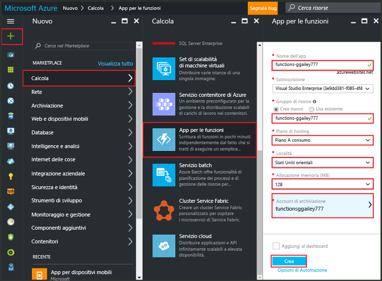
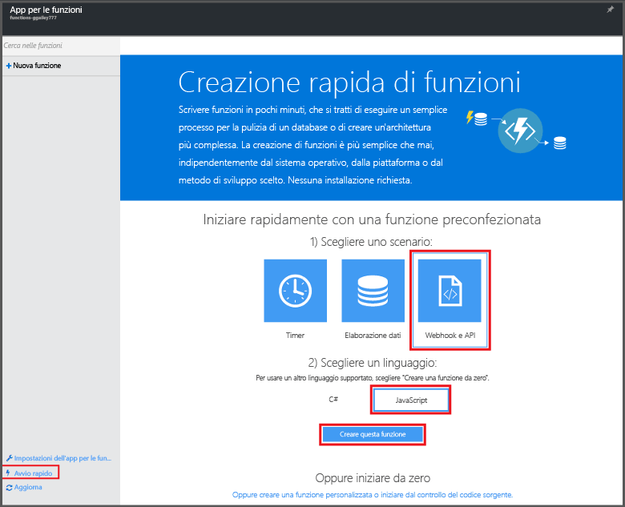

<properties
   pageTitle="Creare una funzione dal portale di Azure | Microsoft Azure"
   description="Illustra come creare la prima funzione di Azure, un'applicazione senza server, in meno di due minuti."
   services="functions"
   documentationCenter="na"
   authors="ggailey777"
   manager="erikre"
   editor=""
   tags=""
/>



<tags
   ms.service="functions"
   ms.devlang="multiple"
   ms.topic="article"
   ms.tgt_pltfrm="multiple"
   ms.workload="na"
   ms.date="09/08/2016"
   ms.author="glenga"/>

#Creare una funzione dal portale di Azure

##Panoramica
Funzioni di Azure offre un'esperienza di calcolo on demand guidata dagli eventi che estende la piattaforma applicativa di Azure con funzionalità per l'implementazione di codice attivato da eventi generati in altri servizi di Azure, prodotti SaaS e sistemi locali. Con Funzioni di Azure le applicazioni possono essere ridimensionate on demand e usano un modello di pagamento in base al consumo delle risorse. Funzioni di Azure permette di creare unità di codice pianificate o attivate implementate in vari linguaggi di programmazione. Per altre informazioni su Funzioni di Azure, vedere [Panoramica di Funzioni di Azure](functions-overview.md).

Questo argomento mostra come usare il portale di Azure per creare una semplice funzione Node.js "hello world" di Azure richiamata da un trigger HTTP. Per poter creare una funzione nel portale di Azure, è prima necessario creare in modo esplicito un'app per le funzioni nel servizio app di Azure. Per fare in modo che l'app per le funzioni venga creata automaticamente, vedere l'[altra esercitazione introduttiva su Funzioni di Azure](functions-create-first-azure-function.md), che offre un'esperienza introduttiva più semplice e include un video.

##Creare un'app per le funzioni

Un'app per le funzioni ospita l'esecuzione delle funzioni in Azure. Seguire questa procedura per creare un'app per le funzioni nel portale di Azure.

Per poter creare la prima funzione, è necessario avere un account Azure attivo. Se non si ha già un account Azure, [sono disponibili account gratuiti](https://azure.microsoft.com/free/).

1. Passare al [portale di Azure](https://portal.azure.com) e accedere con il proprio account Azure.

2. Fare clic su **+Nuovo** > **Web e dispositivi mobili** > **App per le funzioni**, selezionare la **Sottoscrizione**, immettere un **Nome dell'app** che identifica l'app per le funzioni in modo univoco e quindi specificare le impostazioni seguenti:

	+ **[Gruppo di risorse](../azure-portal/resource-group-portal.md/)**: selezionare **Crea nuovo** e immettere un nome per il nuovo gruppo di risorse. È anche possibile scegliere un gruppo di risorse esistente. In tal caso, tuttavia, potrebbe non essere possibile creare un piano di servizio app dinamico per l'app per le funzioni.
	+ **[Piano di servizio app](../app-service/azure-web-sites-web-hosting-plans-in-depth-overview.md)**: scegliere tra *dinamico* o *classico*.
		+ **Dinamico**: tipo di piano predefinito per Funzioni di Azure. Quando si sceglie un piano dinamico, occorre anche scegliere la **Località** e impostare l'**Allocazione memoria (MB)**. Per informazioni su come l'allocazione di memoria influisce sui costi, vedere i [prezzi di Funzioni di Azure](https://azure.microsoft.com/pricing/details/functions/).
		+ **Classico**: se si sceglie un piano di servizio app classico è necessario creare un **Piano di servizio app/Località** o selezionarne uno esistente. Queste impostazioni determinano [la località, le funzionalità, i costi e le risorse di calcolo](https://azure.microsoft.com/pricing/details/app-service/) associati all'app.
	+ **Account di archiviazione**: ogni app per le funzioni richiede un account di archiviazione. È possibile scegliere un account di archiviazione esistente o crearne uno nuovo.

	

3. Fare clic su **Crea** per effettuare il provisioning della nuova app per le funzioni e distribuirla.

Dopo aver effettuato il provisioning dell'app per le funzioni è possibile creare la prima funzione.

## Creare una funzione

Seguire questa procedura per creare una funzione dall'avvio rapido di Funzioni di Azure.

1. Nella scheda **Avvio rapido** fare clic su **WebHook e API** e **JavaScript** e quindi scegliere **Crea questa funzione**. Verrà creata una nuova funzione Node.js predefinita.

	

2. (Facoltativo) A questo punto dell'avvio rapido è possibile scegliere di seguire una demo introduttiva sulle funzionalità di Funzioni di Azure nel portale. Dopo aver completato o ignorato la demo introduttiva, è possibile testare la nuova funzione usando il trigger HTTP.

##Testare la funzione

Grazie al codice funzionale contenuto negli avvii rapidi di Funzioni di Azure, è possibile testare immediatamente la nuova funzione.

1. Nella scheda **Sviluppo** esaminare la finestra **Codice** e osservare che questo codice Node.js prevede una richiesta HTTP con un valore *name* passato nel corpo del messaggio o in una stringa di query. Durante l'esecuzione della funzione, questo valore viene restituito nel messaggio di risposta.

	

2. Scorrere verso il basso fino alla casella di testo **Corpo della richiesta**, modificare il valore della proprietà *name* specificando un nome personalizzato e quindi fare clic su **Esegui**. L'esecuzione viene attivata da una richiesta HTTP di test, le informazioni vengono scritte nei log in streaming e in **Output** viene visualizzata la risposta "hello".

3. Per attivare l'esecuzione della stessa funzione da un'altra finestra o scheda del browser, copiare il valore di **URL funzione** dalla scheda **Sviluppo** e incollarlo nella barra degli indirizzi di un browser, quindi aggiungere il valore della stringa di query `&name=yourname` e premere INVIO. Nei log vengono scritte le stesse informazioni e il browser visualizza la risposta "hello" come prima.

##Passaggi successivi

L'avvio rapido mostra un'esecuzione molto semplice di una funzione di base attivata da HTTP. Per altre informazioni sull'uso delle potenzialità di Funzioni di Azure nelle app, vedere gli argomenti seguenti.

+ [Guida di riferimento per gli sviluppatori di Funzioni di Azure](functions-reference.md) Contiene informazioni di riferimento per programmatori sulla codifica delle funzioni e la definizione di trigger e associazioni.
+ [Test di Funzioni di Azure](functions-test-a-function.md) Descrive diversi strumenti e tecniche per il test delle funzioni.
+ [Scalabilità di Funzioni di Azure](functions-scale.md) Descrive i piani di servizio disponibili con Funzioni di Azure, tra cui il piano di servizio dinamico, e come scegliere quello più appropriato.
+ [Informazioni sul servizio app di Azure](../app-service/app-service-value-prop-what-is.md) Funzioni di Azure sfrutta la piattaforma del servizio app di Azure per le funzionalità di base, ad esempio distribuzioni, variabili di ambiente e diagnostica.

[AZURE.INCLUDE [Nota introduttiva](../../includes/functions-get-help.md)]

<!---HONumber=AcomDC_0914_2016-->