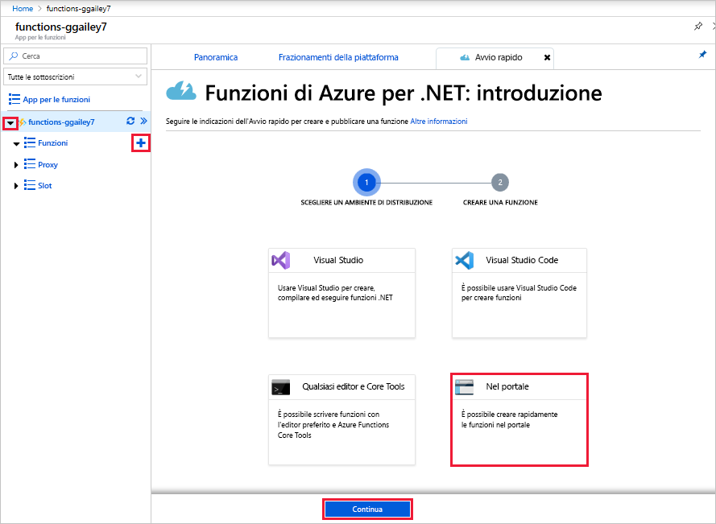

# Creare la prima funzione nel portale di Azure

Funzioni di Azure consente di eseguire il codice in un ambiente [senza server](https://azure.microsoft.com/solutions/serverless/), senza dover prima creare una macchina virtuale o pubblicare un'applicazione Web. Questo articolo fornisce informazioni su come usare Funzioni per creare una funzione "hello world" nel portale di Azure.

[!INCLUDE [quickstarts-free-trial-note](../../includes/quickstarts-free-trial-note.md)]

> [!NOTE]
> Gli sviluppatori in C# devono fare riferimento alle informazioni relative alla [creazione della prima funzione in Visual Studio 2019](functions-create-your-first-function-visual-studio.md) anziché nel portale. 

## Accedere ad Azure

Accedere al portale di Azure all'indirizzo <https://portal.azure.com> con il proprio account Azure.

## Creare un'app per le funzioni

Per ospitare l'esecuzione delle funzioni è necessaria un'app per le funzioni. Un'app per le funzioni consente di raggruppare le funzioni come un'unità logica per semplificare la gestione, la distribuzione e la condivisione delle risorse. 

[!INCLUDE [Create function app Azure portal](../../includes/functions-create-function-app-portal.md)]

Si creerà ora una funzione nella nuova app per le funzioni.

## Creare una funzione attivata tramite HTTP

1. Espandere la nuova app per le funzioni, selezionare il pulsante **+** accanto a to **Funzioni**, scegliere **Nel portale** e quindi selezionare **Continua**.

    

1. Scegliere **WebHook e API** e quindi selezionare **Crea**.

    

Viene creata una funzione usando il modello specifico del linguaggio per una funzione attivata tramite HTTP.

Ora è possibile eseguire la nuova funzione inviando una richiesta HTTP.

## Testare la funzione

1. Nella nuova funzione fare clic su **</> Recupera URL della funzione** nell'angolo in alto a destra, selezionare **default (Function key)** (predefinita - tasto funzione) e quindi fare clic su **Copia**. 

    

2. Incollare l'URL della funzione nella barra degli indirizzi del browser. Aggiungere il valore della stringa di query `&name=<yourname>` alla fine dell'URL e premere il tasto `Enter` per eseguire la richiesta. Nel browser dovrebbe venire visualizzata la risposta restituita dalla funzione.  

    L'esempio seguente mostra la risposta nel browser:

    

    L'URL della richiesta include una chiave necessaria per impostazione predefinita per accedere a una funzione tramite HTTP.

3. Quando viene eseguita la funzione, vengono scritte nei log informazioni di traccia. Per visualizzare l'output di traccia dell'esecuzione precedente, tornare alla funzione nel portale e fare clic sulla freccia nella parte inferiore della schermata per espandere **Log**.

   

## Pulire le risorse

[!INCLUDE [Clean-up resources](../../includes/functions-quickstart-cleanup.md)]

## Passaggi successivi

È stata creata un'app per le funzioni con una semplice funzione attivata tramite HTTP.  

[!INCLUDE [Next steps note](../../includes/functions-quickstart-next-steps.md)]

Per altre informazioni, vedere [Associazioni HTTP e webhook in Funzioni di Azure](functions-bindings-http-webhook.md).
