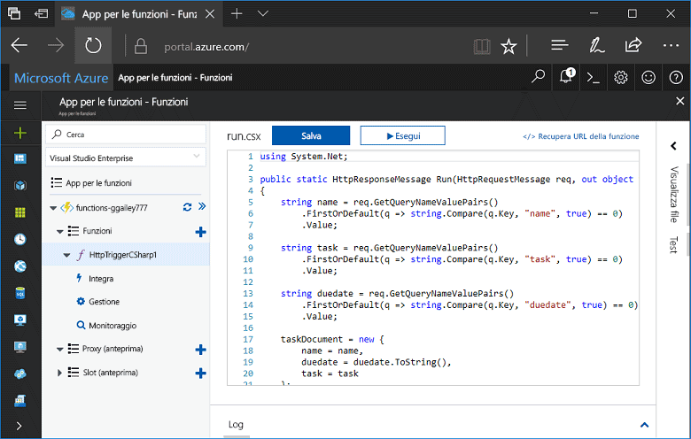
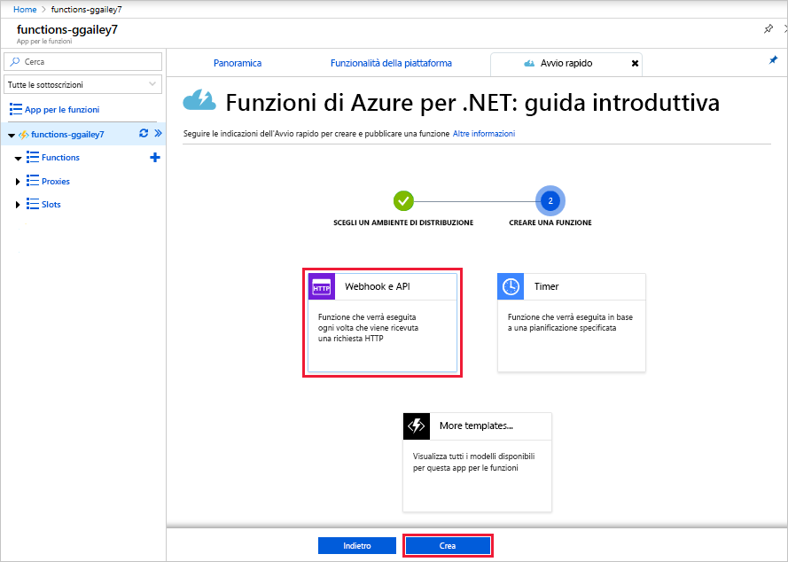
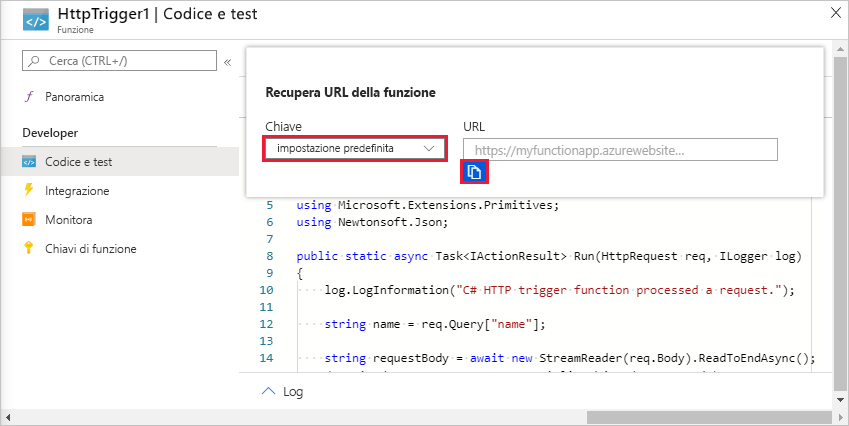
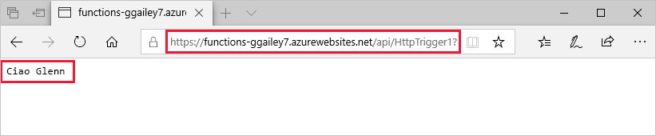
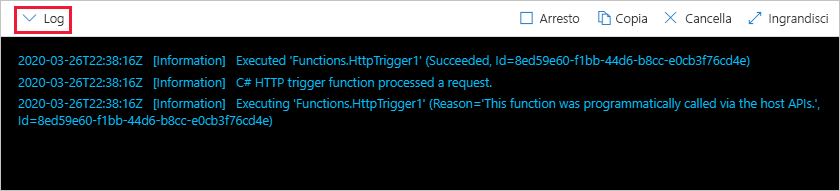

# Creare la prima funzione nel portale di Azure

Funzioni di Azure consente di eseguire il codice in un ambiente senza server senza dover prima creare una macchina virtuale o pubblicare un'applicazione Web. Questo argomento fornisce informazioni su come usare Funzioni per creare una funzione di benvenuto nel portale di Azure.

[!INCLUDE [quickstarts-free-trial-note](../../includes/quickstarts-free-trial-note.md)]

## Accedere ad Azure

Accedere al [Portale di Azure](https://portal.azure.com/).

## Creare un'app per le funzioni

Per ospitare l'esecuzione delle funzioni è necessaria un'app per le funzioni. Un'app per le funzioni consente di raggruppare le funzioni come un'unità logica per semplificare la gestione, la distribuzione e la condivisione delle risorse. 

[!INCLUDE [Create function app Azure portal](../../includes/functions-create-function-app-portal.md)]

[!INCLUDE [functions-portal-favorite-function-apps](../../includes/functions-portal-favorite-function-apps.md)]

Si creerà ora una funzione nella nuova app per le funzioni.

## Creare una funzione attivata tramite HTTP

1. Espandere la nuova app per le funzioni e quindi fare clic sul pulsante **+** accanto a **Funzioni**.

2.  Nella pagina **Iniziare rapidamente con una funzione preconfezionata** selezionare **Webhook e API**, **scegliere un linguaggio** per la funzione e fare clic su **Creare questa funzione**. 
   
    

Viene creata una funzione nel linguaggio prescelto usando il modello per una funzione attivata tramite HTTP. È possibile eseguire la nuova funzione inviando una richiesta HTTP.

## Testare la funzione

1. Nella nuova funzione fare clic su **</> Recupera URL della funzione**, selezionare **predefinito (tasto funzione)** e quindi fare clic su **Copia**. 

    

2. Incollare l'URL della funzione nella barra degli indirizzi del browser. Aggiungere la stringa di query `&name=<yourname>` all'URL e premere il tasto `Enter` per eseguire la richiesta. L'esempio seguente riporta la risposta restituita dalla funzione nel browser Edge:

    

    L'URL della richiesta include una chiave necessaria per impostazione predefinita per accedere a una funzione tramite HTTP.   

3. Quando viene eseguita la funzione, vengono scritte nei log informazioni di traccia. Per visualizzare l'output di traccia dell'esecuzione precedente, tornare alla funzione nel portale e fare clic sulla freccia verso l'alto nella parte inferiore della schermata per espandere **Log**. 

   

## Pulire le risorse

[!INCLUDE [Clean up resources](../../includes/functions-quickstart-cleanup.md)]

## Passaggi successivi

È stata creata un'app per le funzioni con una semplice funzione attivata tramite HTTP.  

[!INCLUDE [Next steps note](../../includes/functions-quickstart-next-steps.md)]

Per altre informazioni rivedere [Binding HTTP e webhook in Funzioni di Azure](functions-bindings-http-webhook.md).

