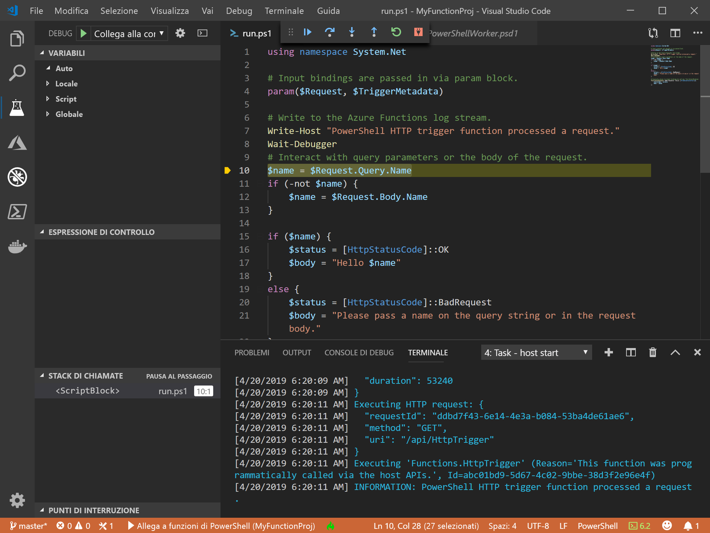
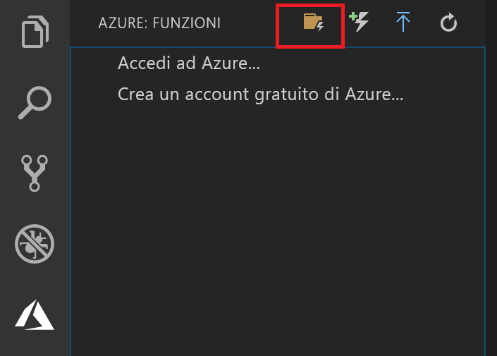

# <a name="create-your-first-powershell-function-in-azure"></a>Creare la prima funzione di PowerShell in Azure

Questo articolo di avvio rapido illustra creare la prima funzione di PowerShell [serverless](https://azure.com/serverless) usando Visual Studio Code.



Usare l'[estensione Funzioni di Azure per Visual Studio Code] per creare una funzione di PowerShell in locale e quindi distribuirla in una nuova app per le funzioni in Azure. L'estensione è attualmente disponibile anteprima. Per altre informazioni, vedere la pagina relativa all'[estensione Funzioni di Azure per Visual Studio Code].

I passaggi seguenti sono supportati nei sistemi operativi basati su macOS, Windows e Linux.

## <a name="prerequisites"></a>Prerequisites

Per completare questa guida introduttiva:

* Installare [PowerShell Core](/powershell/scripting/install/installing-powershell-core-on-windows)

* Installare [Visual Studio Code](https://code.visualstudio.com/) in una delle [piattaforme supportate](https://code.visualstudio.com/docs/supporting/requirements#_platforms). 

* Installare l'[estensione PowerShell per Visual Studio Code](https://marketplace.visualstudio.com/items?itemName=ms-vscode.PowerShell).

* Installare [.NET Core SDK 2.2+](https://www.microsoft.com/net/download) (richiesto da Azure Functions Core Tools e disponibile in tutte le piattaforme supportate).

* Installare la versione 2.x di [Azure Functions Core Tools](functions-run-local.md#v2).

* È anche necessaria una sottoscrizione di Azure attiva.

[!INCLUDE [quickstarts-free-trial-note](../../includes/quickstarts-free-trial-note.md)]

[!INCLUDE [functions-install-vs-code-extension](../../includes/functions-install-vs-code-extension.md)] 

## <a name="create-a-function-app-project"></a>Creare un progetto di app per le funzioni

Il modello di progetto Funzioni di Azure in Visual Studio Code crea un progetto che può essere pubblicato in un'app per le funzioni in Azure. Un'app per le funzioni consente di raggruppare le funzioni come un'unità logica per semplificare la gestione, la distribuzione, il ridimensionamento e la condivisione delle risorse.

1. In Visual Studio Code selezionare il logo di Azure per visualizzare l'area **Azure: Funzioni** e quindi selezionare l'icona Crea nuovo progetto.

    

1. Scegliere una posizione per l'area di lavoro del progetto Funzioni e quindi scegliere **Seleziona**.

    > [!NOTE]
    > Questo articolo è stato progettato per il completamento all'esterno di un'area di lavoro. In questo caso, non selezionare una cartella di progetto inclusa in un'area di lavoro.

1. Selezionare **PowerShell** come linguaggio per il progetto di app per le funzioni e quindi **Funzioni di Azure v2**.

1. Scegliere **Trigger HTTP** come modello per la prima funzione, usare `HTTPTrigger` come nome della funzione e scegliere il livello di autorizzazione **Funzione**.

    > [!NOTE]
    > Il livello di autorizzazione **Funzione** richiede un valore di [chiave di funzione](functions-bindings-http-webhook-trigger.md#authorization-keys) quando si chiama l'endpoint della funzione in Azure. Questo rende più difficile per chiunque chiamare la funzione.

1. Quando richiesto, scegliere **Aggiungi a area di lavoro**.

Visual Studio Code crea il progetto di app per le funzioni di PowerShell in una nuova area di lavoro. Questo progetto contiene i file di configurazione [host.json](functions-host-json.md) e [local.settings.json](functions-run-local.md#local-settings-file), che si applicano a tutte le funzioni nel progetto. Questo [progetto di PowerShell](functions-reference-powershell.md#folder-structure) è uguale a un'app per le funzioni in esecuzione in Azure.

[!INCLUDE [functions-run-function-test-local-vs-code-ps](../../includes/functions-run-function-test-local-vs-code-ps.md)]

[!INCLUDE [functions-publish-project-vscode](../../includes/functions-publish-project-vscode.md)]

## <a name="test"></a>Eseguire la funzione in Azure

Per verificare che la funzione pubblicata venga eseguita in Azure, eseguire il comando di PowerShell seguente, sostituendo il parametro `Uri` con l'URL della funzione HTTPTrigger del passaggio precedente. Come prima, aggiungere la stringa di query `&name=<yourname>` all'URL, come nell'esempio seguente:

```powershell
PS > Invoke-WebRequest -Method Get -Uri "https://glengatest-vscode-powershell.azurewebsites.net/api/HttpTrigger?code=nrY05eZutfPqLo0som...&name=PowerShell"

StatusCode        : 200
StatusDescription : OK
Content           : Hello PowerShell
RawContent        : HTTP/1.1 200 OK
                    Content-Length: 16
                    Content-Type: text/plain; charset=utf-8
                    Date: Thu, 25 Apr 2019 16:01:22 GMT

                    Hello PowerShell
Forms             : {}
Headers           : {[Content-Length, 16], [Content-Type, text/plain; charset=utf-8], [Date, Thu, 25 Apr 2019 16:01:22 GMT]}
Images            : {}
InputFields       : {}
Links             : {}
ParsedHtml        : mshtml.HTMLDocumentClass
RawContentLength  : 16
```

## <a name="next-steps"></a>Passaggi successivi

È stato usato Visual Studio Code per creare un'app per le funzioni di PowerShell con una semplice funzione attivata tramite HTTP. Per altre informazioni sul [debug di una funzione di PowerShell in locale](functions-debug-powershell-local.md) con Azure Functions Core Tools, vedere la [guida per sviluppatori di PowerShell per Funzioni di Azure](functions-reference-powershell.md).

> [!div class="nextstepaction"]
> [Abilitare l'integrazione di Application Insights](functions-monitoring.md#manually-connect-an-app-insights-resource)

[Azure portal]: https://portal.azure.com
[Azure Functions Core Tools]: functions-run-local.md
[Estensione Funzioni di Azure per Visual Studio Code]: https://marketplace.visualstudio.com/items?itemName=ms-azuretools.vscode-azurefunctions
[`Wait-Debugger`]: /powershell/module/microsoft.powershell.utility/wait-debugger?view=powershell-6
