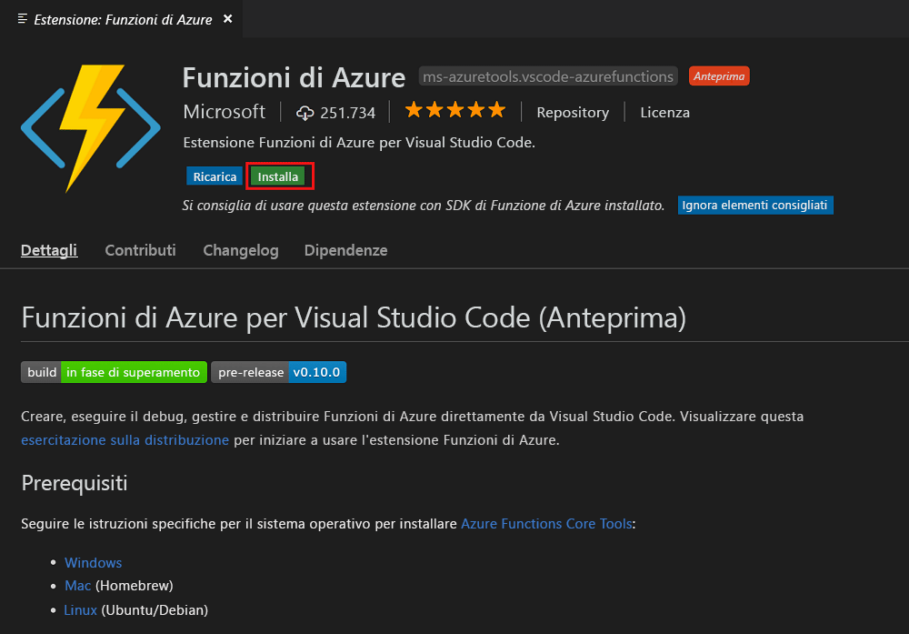
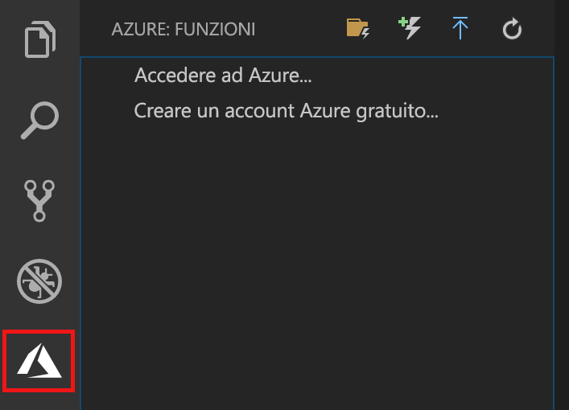
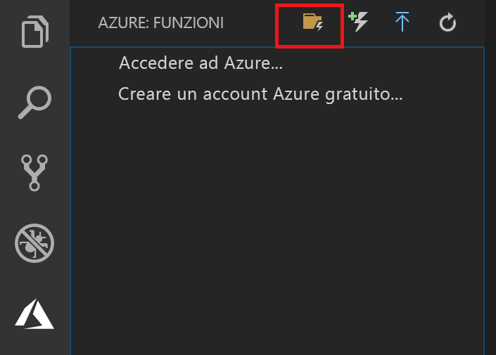
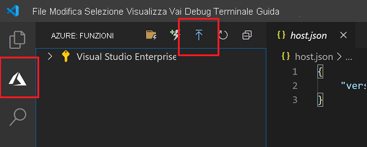
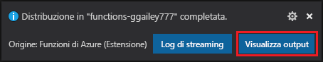
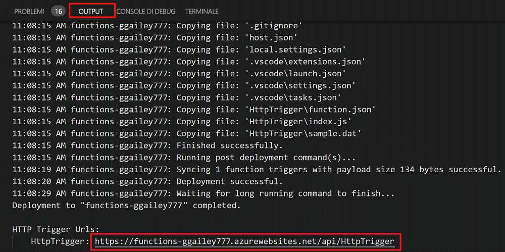

# Creare la prima funzione con Visual Studio Code

Funzioni di Azure consente di eseguire il codice in un ambiente [senza server](https://azure.microsoft.com/overview/serverless-computing/), senza dover prima creare una macchina virtuale o pubblicare un'applicazione Web.

In questo articolo verrà illustrato come usare l'[estensione Funzioni di Azure per Visual Studio Code] per creare e testare una funzione "hello world" nel computer locale mediante Microsoft Visual Studio Code. Il codice della funzione verrà quindi pubblicato in Azure da Visual Studio Code.

L'estensione supporta attualmente funzioni C#, JavaScript e Java. La procedura illustrata in questo articolo potrebbe variare in base al linguaggio scelto per il progetto di Funzioni di Azure. L'estensione è attualmente disponibile anteprima. Per altre informazioni, vedere la pagina relativa all'[estensione Funzioni di Azure per Visual Studio Code].

## Prerequisiti

Per completare questa guida introduttiva:

* Installare [Visual Studio Code](https://code.visualstudio.com/) in una delle [piattaforme supportate](https://code.visualstudio.com/docs/supporting/requirements#_platforms). Questo articolo è stato sviluppato e testato in un dispositivo che esegue macOS (High Sierra).

* Installare la versione 2.x degli [strumenti di base di Funzioni di Azure](functions-run-local.md#v2), ancora in anteprima.

* Installare i requisiti specifici per il linguaggio scelto:

    | Linguaggio | Estensione |
    | -------- | --------- |
    | **C#** | [C# per Visual Studio Code](https://marketplace.visualstudio.com/items?itemName=ms-vscode.csharp) [Strumenti dell'interfaccia della riga di comando di .NET Core](https://docs.microsoft.com/dotnet/core/tools/?tabs=netcore2x)*   |
    | **Java** | [Debugger per Java](https://marketplace.visualstudio.com/items?itemName=vscjava.vscode-java-debug) [JDK 1.8](http://www.oracle.com/technetwork/java/javase/downloads/index.html) [Maven 3+](https://maven.apache.org/) |
    | **JavaScript** | [Node 8.0+](https://nodejs.org/)  |

    \* Richiesto anche dagli strumenti di base.

[!INCLUDE [quickstarts-free-trial-note](../../includes/quickstarts-free-trial-note.md)]

## Installare l'estensione Funzioni di Azure

L'estensione Funzioni di Azure viene usata per creare, testare e distribuire funzioni in Azure.

1. In Visual Studio Code aprire **Estensioni** e cercare `azure functions` oppure [aprire questo collegamento in Visual Studio Code](vscode:extension/ms-azuretools.vscode-azurefunctions).

1. Selezionare **Installa** per installare l'estensione in Visual Studio Code. 

    

1. Riavviare Visual Studio Code e selezionare l'icona di Azure sulla barra delle attività. Dovrebbe essere visualizzata un'area Funzioni di Azure sulla barra laterale.

    

## Creare un progetto di Funzioni di Azure

Il modello di progetto Funzioni di Azure in Visual Studio Code crea un progetto che può essere pubblicato in un'app per le funzioni in Azure. Un'app per le funzioni consente di raggruppare le funzioni come un'unità logica per la gestione, la distribuzione e la condivisione delle risorse.

1. In Visual Studio Code selezionare il logo di Azure per visualizzare l'area **Azure: Funzioni** e quindi selezionare l'icona Crea nuovo progetto.

    

1. Scegliere una posizione per l'area di lavoro del progetto e quindi scegliere **Seleziona**.

    > [!NOTE]
    > Questo articolo è stato progettato per il completamento all'esterno di un'area di lavoro. In questo caso, non selezionare una cartella di progetto inclusa in un'area di lavoro.

1. Selezionare il linguaggio per il progetto di app per le funzioni. In questo articolo viene usato JavaScript.
    

1. Quando richiesto, scegliere **Aggiungi a area di lavoro**.

Visual Studio Code crea il progetto di app per le funzioni in una nuova area di lavoro. Questo progetto contiene i file di configurazione [host.json](functions-host-json.md) e [local.settings.json](functions-run-local.md#local-settings-file), oltre ad altri file di progetto specifici per il linguaggio. La cartella del progetto include anche un nuovo repository Git.

## Creare una funzione attivata tramite HTTP

1. Da **Azure: Funzioni** scegliere l'icona Crea funzione.

    

1. Selezionare la cartella contenente il progetto di app per le funzioni e quindi selezionare il modello di funzione **Trigger HTTP**.

    

1. Digitare `HTTPTrigger` come nome della funzione, premere INVIO e quindi selezionare **Anonima** come tipo di autenticazione.

    

    Viene creata una funzione nel linguaggio prescelto usando il modello per una funzione attivata tramite HTTP.

    

È possibile aggiungere associazioni di input e output alla funzione modificando il file function.json. Per altre informazioni, vedere [Concetti relativi a trigger e associazioni in Funzioni di Azure](functions-triggers-bindings.md).

Ora che è stato creato il progetto di funzione con una funzione attivata tramite HTTP, è possibile testare la funzione nel computer locale.

## Testare la funzione in locale

Azure Functions Core Tools consente di eseguire un progetto Funzioni di Azure nel computer di sviluppo locale. Viene richiesto di installare questi strumenti al primo avvio di una funzione da Visual Studio Code.  

1. Per testare la funzione, impostare un punto di interruzione nel codice della funzione e premere F5 per avviare il progetto di app per le funzioni. L'output dagli strumenti di base viene visualizzato nel pannello **Terminale**.

1. Nel pannello **Terminale** copiare l'endpoint dell'URL della funzione attivata da HTTP.

    

1. Incollare l'URL per la richiesta HTTP nella barra degli indirizzi del browser. Aggiungere la stringa di query `?name=<yourname>` all'URL ed eseguire la richiesta. L'esecuzione viene sospesa quando viene raggiunto il punto di interruzione.

    

1. Quando si continua l'esecuzione, viene mostrata la risposta seguente nel browser per la richiesta GET:

    

1. Per interrompere il debug, premere MAIUSC+F1.

Dopo aver verificato la corretta esecuzione della funzione nel computer locale, è possibile pubblicare il progetto in Azure.

## Accedere ad Azure

Prima di potere pubblicare l'app, è necessario accedere ad Azure.

1. Nell'area **Azure: Funzioni** scegliere **Accedi ad Azure**. Se non si ha già un account, è possibile **creare un account Azure gratuito**.

    

1. Quando richiesto, selezionare **Copia e apri** oppure copiare il codice visualizzato e aprire <https://aka.ms/devicelogin> nel browser.

1. Incollare il codice copiato nella pagina **Accesso dispositivo**, verificare l'accesso per Visual Studio Code, quindi selezionare **Continua**.  

1. Completare l'accesso usando le credenziali dell'account Azure. Dopo avere completato correttamente l'accesso, è possibile chiudere il browser.

## Pubblicare il progetto in Azure

Visual Studio Code consente di pubblicare il progetto di Funzioni direttamente in Azure. Durante il processo vengono create un'app per le funzioni e le risorse correlate nella sottoscrizione di Azure. L'app per le funzioni fornisce un contesto di esecuzione per le funzioni. Il progetto viene inserito in un pacchetto e distribuito nella nuova app per le funzioni nella sottoscrizione di Azure. 

In questo articolo si presuppone che venga creata una nuova app per le funzioni. La pubblicazione in un'app per le funzioni esistente sovrascrive il contenuto di tale app in Azure.

1. Nell'area **Azure: Funzioni** selezionare l'icona per la distribuzione nell'app per le funzioni.

    

1. Scegliere la cartella di progetto, che corrisponde all'area di lavoro corrente.

1. Se sono presenti più sottoscrizioni, scegliere quella in cui si vuole che venga ospitata l'app per le funzioni e quindi scegliere **+ Crea nuova App per le funzioni**.

1. Digitare un nome univoco globale che identifichi l'app per le funzioni, quindi premere INVIO. I caratteri validi per un nome di app per le funzioni sono `a-z`, `0-9` e `-`.

1. Scegliere **+ Crea nuovo gruppo di risorse**, digitare un nome di gruppo di risorse, ad esempio `myResourceGroup`, quindi premere INVIO. È anche possibile usare un gruppo di risorse esistente.

1. Scegliere **+Crea un nuovo account di archiviazione**, digitare un nome univoco globale per il nuovo account di archiviazione usato dall'app per le funzioni e quindi premere INVIO. I nomi degli account di archiviazione devono avere una lunghezza compresa tra 3 e 24 caratteri e possono contenere solo numeri e lettere minuscole. È possibile anche usare un account esistente.

1. Scegliere una località in un'[area](https://azure.microsoft.com/regions/) nelle vicinanze o vicino ad altri servizi a cui accedono le funzioni.

    La creazione dell'app per le funzioni inizia dopo la selezione della località. Dopo la creazione dell'app per le funzioni e dopo l'applicazione del pacchetto di distribuzione viene visualizzata una notifica.

1. Selezionare **Visualizza output** nelle notifiche per visualizzare i risultati della creazione e della distribuzione, incluse le risorse di Azure create.

    

1. Annotare l'URL della nuova app per le funzioni in Azure. L'URL verrà usato per testare la funzione dopo la pubblicazione del progetto in Azure.

    

1. Nell'area **Azure: Funzioni** viene visualizzata la nuova app per le funzioni nella sottoscrizione. Quando si espande questo nodo, vengono visualizzate le funzioni disponibili nell'app per le funzioni, oltre alle impostazioni dell'applicazione e ai proxy di funzioni.

    

    Dal nodo dell'app per le funzioni digitare CTRL e fare clic (clic con il pulsante destro del mouse) per scegliere le diverse attività di gestione e configurazione da eseguire per l'app per le funzioni in Azure. È anche possibile scegliere di visualizzare l'app per le funzioni nel portale di Azure.

## Testare la funzione in Azure

1. Copiare l'URL del trigger HTTP dal pannello **Output**. Come prima, assicurarsi di aggiungere la stringa di query `?name=<yourname>` alla fine dell'URL ed eseguire la richiesta.

    Il formato dell'URL che chiama la funzione attivata tramite HTTP sarà simile al seguente:

        http://<functionappname>.azurewebsites.net/api/<functionname>?name=<yourname> 

1. Incollare questo nuovo URL per la richiesta HTTP nella barra degli indirizzi del browser. Di seguito è illustrata la risposta nel browser alla richiesta GET remota restituita dalla funzione: 

    

## Passaggi successivi

È stato usato Visual Studio Code per creare un'app per le funzioni con una semplice funzione attivata tramite HTTP. Per altre informazioni sullo sviluppo di funzioni in un linguaggio specifico, vedere le guide di riferimento ai linguaggi per [JavaScript](functions-reference-node.md), [.NET](functions-dotnet-class-library.md) o [Java](functions-reference-java.md).

Sono quindi disponibili altre informazioni sul test locale e sul debug dal terminale o dal prompt dei comandi mediante gli strumenti di base di Funzioni di Azure.

> [!div class="nextstepaction"]
> [Scrivere codice ed eseguire test in locale](functions-run-local.md)

[Azure Functions Core Tools]: functions-run-local.md
[Estensione Funzioni di Azure per Visual Studio Code]: https://marketplace.visualstudio.com/items?itemName=ms-azuretools.vscode-azurefunctions
